# Content Authoring Guide

This guide covers how to create and manage markdown content for planets and moons in The Horizon universe explorer.

## Redesigned Admin Interface (v0.1.3+)

The admin interface has been redesigned to provide a blog-style authoring experience with clear navigation, immediate feedback, and intuitive workflows.

### Key Features

**Modal-Based Editing**
- Content editors now open in modal dialogs
- Editors automatically close after successful save operations
- Clear visual separation between browsing and editing modes

**Real-Time Feedback**
- Toast-style notifications for all operations
- Success messages confirm completed actions
- Error messages provide context and guidance
- Network failures display retry options
- Auth failures redirect to login automatically

**Inline Action Status (v0.1.4+)**
- Save and commit status messages appear directly below action buttons
- No scrolling needed to see operation results
- Pending states show loading indicators adjacent to controls
- Success and error messages remain visible near their triggering buttons
- Accessible to keyboard users via aria-live regions
- Long error messages wrap gracefully without hiding buttons

**Breadcrumb Navigation**
- Clear navigation hierarchy: Galaxies → Systems → Planets → Moons
- Click breadcrumbs to navigate back through levels
- Current location always visible

**Content Cards**
- Visual cards display content with hover effects
- Quick actions (Edit/Delete) on each item
- Shows metadata (e.g., planet count, moon count)
- Empty state messages guide first-time authors

**Improved Validation**
- Inline validation feedback
- Required fields marked with asterisks
- Disabled submit buttons prevent invalid submissions
- Character counters for markdown content

### Authoring Workflow

```mermaid
graph TB
    A[Dashboard] --> B[Select Galaxy]
    B --> C{Edit Galaxy Info}
    C --> D[Add/Edit Solar System]
    D --> E[Add/Edit Planet]
    E --> F[Add/Edit Moon]
    F --> G[Save Changes]
    G --> H{Success?}
    H -->|Yes| I[Modal Auto-Closes]
    H -->|No| J[Show Error & Retry]
    I --> K[💾 Save to Disk]
    K --> L[🔀 Commit to GitHub]
```



### Creating Content

1. **Navigate to Dashboard**: Log in to the admin interface at `/admin`
2. **Browse Galaxies**: View all galaxies in card format with metadata
3. **Edit or Create**: Click "Edit Galaxy" or "+ Add New Galaxy"
4. **Modal Opens**: Editor appears in a modal dialog with breadcrumb navigation
5. **Make Changes**: Edit in organized tabs (Info, Systems, Content, etc.)
6. **Save**: Click "Save Changes" - modal auto-closes on success
7. **Repeat**: Continue editing other content as needed
8. **Persist**: Click "💾 Save to Disk" to persist all changes locally
9. **Publish**: Click "🔀 Commit to GitHub" to make changes live

### Navigation Tips

- **Breadcrumbs**: Click any level to navigate back (e.g., "All Galaxies" > "Andromeda")
- **Tabs**: Use tabs within editors to organize related fields
- **Close Button**: X in top-right corner or click backdrop to close modal
- **ESC Key**: Press Escape to close any modal
- **Auto-Close**: Successful saves automatically close the editor

### Error Handling

**Network Failures**
- Modal stays open preserving your edits
- Error message displays with retry guidance
- Your work is never lost due to network issues

**Validation Errors**
- Red borders highlight invalid fields
- Error messages appear below fields
- Submit buttons disabled until errors resolved

**Authentication Errors**
- Automatic redirect to login page
- 2-second grace period to read error message
- Return to work after re-authentication

**Conflict Detection**
- Optimistic locking prevents data loss
- Clear message if another admin made changes
- Guidance to refresh and reapply edits

## Admin Workflow: Save vs Commit

The admin interface uses a two-step workflow to ensure content changes are safe and reviewable. This separation provides better control and reliability for managing universe content.

> **Note**: The admin modal save workflow was stabilized in v0.1.3+ to fix an issue where modal edits were lost due to premature data refetching. The system now properly maintains local edits until they are explicitly saved to disk. See the troubleshooting section below for details on how the fix works.

> **Important**: As of v0.1.4+, the GitHub persistence flow has been stabilized to prevent "file has changed" errors. The system now fetches fresh SHA from GitHub multiple times during the commit process to ensure the most recent file state is used. See the SHA Refresh section below for details.

### SHA Refresh and Conflict Prevention (v0.1.4+)

The admin GitHub persistence flow has been enhanced to prevent "file has changed" errors that previously occurred when saving to disk followed by committing to GitHub. Here's how the stabilized flow works:

**Problem (Fixed in v0.1.4+)**:
Previously, if you saved changes to disk and then committed to GitHub, you might see "file has changed" errors. This happened because:
1. Admin saves to disk → local file updated
2. GitHub still has old version
3. Commit operation would use stale SHA from the start
4. GitHub API would reject the commit (SHA mismatch)

**Solution: Multiple SHA Refresh Points**:
The system now fetches fresh SHA from GitHub at multiple strategic points:

1. **At start of commit operation**: Fetches current GitHub SHA
   ```
   [pushUniverseChanges] Fetching current SHA from GitHub...
   [pushUniverseChanges] Current GitHub SHA: abc12345...
   ```

2. **For PR workflow**: Re-fetches SHA after branch creation
   ```
   [pushUniverseChanges] Branch created successfully
   [pushUniverseChanges] Re-fetching SHA after branch creation...
   [pushUniverseChanges] Fresh SHA after branch creation: abc12345...
   ```

3. **For direct commit**: Re-fetches SHA immediately before commit
   ```
   [pushUniverseChanges] Direct commit to main branch...
   [pushUniverseChanges] Re-fetching SHA immediately before commit...
   [pushUniverseChanges] Final SHA before commit: abc12345...
   ```

**Benefits**:
- ✅ Prevents "file has changed" errors during save→commit workflow
- ✅ Multiple refresh points ensure SHA is never stale
- ✅ Comprehensive logging helps debug any issues
- ✅ Optimistic locking still works to detect concurrent edits
- ✅ File content from disk is always the authoritative source

**Telemetry and Debugging**:
The system includes comprehensive logging for debugging the save→commit workflow:
- **Verbose logging** can be enabled for detailed step-by-step logs
- Set `ADMIN_VERBOSE_LOGGING=true` or `GITHUB_VERBOSE_LOGGING=true` in environment
- Verbose logging is automatically enabled in `NODE_ENV=development`
- In production, only critical operations are logged to reduce noise
- Monitor server logs to verify workflow:
  ```bash
  npm run dev
  # Watch for log messages starting with:
  # [PATCH /api/admin/universe] - Disk save operations
  # [POST /api/admin/universe] - GitHub commit operations
  # [pushUniverseChanges] - GitHub API interactions (if verbose enabled)
  # [persistUniverseToFile] - File system operations
  ```

**Empty Commit Prevention (v0.1.4+)**:
The system now detects when content is identical to GitHub HEAD and prevents empty commits:
- Before committing, content hashes are compared
- If content matches GitHub, commit is skipped with success message
- Returns existing SHA instead of creating unnecessary commit
- Reduces GitHub API usage and commit clutter

### Admin Editor Layout

The admin markdown editor has been designed to provide a spacious editing experience:

- **Full-Width Layout**: The editor expands to fill the full width of its container
- **Flexible Height**: The editor adjusts its height dynamically (minimum 600px, maximum based on viewport)
- **Side-by-Side Panels**: On desktop, the markdown editor and preview pane are displayed side by side for easy comparison
- **Responsive Design**: On mobile devices (< 768px width), the panels stack vertically for optimal viewing
- **Scrollable Content**: Long markdown documents scroll within the editor and preview panes, keeping controls accessible

The editor provides a comfortable workspace for creating and editing content while maintaining a clear preview of how the markdown will render.

### Two-Step Workflow Overview


### Step 1: Edit and Save to Disk

The redesigned admin interface makes it easy to edit content with a clear, modal-based workflow:

**Editing Content:**
1. **Navigate**: From the dashboard, click "Edit Galaxy" on any galaxy card
2. **Modal Opens**: The galaxy editor appears in a full-screen modal
3. **Edit Fields**: Fill in or update galaxy information in the "Basic Info" tab
4. **Add Systems**: Switch to "Solar Systems" tab, click "+ Add Solar System"
5. **Nested Editing**: Each system/planet opens in its own modal with breadcrumb navigation
6. **Save Individual Items**: Click "Save Changes" in any editor
   - ✅ Success: Modal closes automatically with confirmation notification
   - ❌ Error: Modal stays open with inline validation feedback
7. **Repeat**: Continue editing other galaxies, systems, or planets as needed

**Persisting Changes:**
After making all your edits, scroll to the "💾 Save Changes" section:

1. **Click "💾 Save to Disk"** button
2. **Inline status appears**: A status message displays directly below the button
   - 🔄 **Pending**: "Saving changes to disk..." (with loading spinner)
   - ✅ **Success**: "Changes saved successfully! Your edits are now persisted locally."
   - ❌ **Error**: Detailed error message with guidance (e.g., conflict, network, auth)
3. **Status stays visible**: Message remains adjacent to the button for easy reference
4. **No scrolling needed**: Feedback appears right where you took action

**What happens during save**:
- All edited content is validated to prevent corrupted data
- Data is written to `public/universe/universe.json` on the server
- A new hash is generated for optimistic locking (prevents concurrent edit conflicts)
- Changes are now persisted locally but **not yet committed to version control**
- Inline status updates keep you informed without losing context

**Important**: The GET endpoint now reads from the local file by default, preventing GitHub fetches from overwriting your unsaved edits. This ensures your work is not lost if another admin commits changes while you're editing.

**API Endpoint**: `PATCH /api/admin/universe`

**Server Logs**:
```
[PATCH /api/admin/universe] Request received - saving to disk
[PATCH /api/admin/universe] Payload parsed - galaxies: 2
[PATCH /api/admin/universe] Validating universe data...
[PATCH /api/admin/universe] Validation passed
[persistUniverseToFile] Persisting to: public/universe/universe.json
[persistUniverseToFile] Success - file persisted
[PATCH /api/admin/universe] Success - new hash: a1b2c3d4...
```

**Manual Verification**:
```bash
# Check that the file was updated
cat public/universe/universe.json | grep "your-change-text"

# Check file modification time
ls -lh public/universe/universe.json
```

### Step 2: Commit to GitHub

After saving your changes locally and verifying they work correctly:

**Committing Process:**
1. **Scroll to "🔀 Commit to GitHub"** section on the dashboard
2. **Enter commit message**: Describe your changes (required field)
   - Example: "Add Andromeda galaxy with 3 solar systems"
   - Field highlights in red if empty when attempting to commit
3. **Choose commit type**:
   - ✅ **Create Pull Request** (recommended): Creates a branch and PR for team review
   - ⬜ **Direct Commit**: Commits directly to main branch (use with caution)
4. **Click the button**:
   - "🔀 Create Pull Request" if checkbox is selected
   - "✓ Commit to Main Branch" if checkbox is unchecked
5. **Inline status appears**: A status message displays directly below the button
   - 🔄 **Pending**: "Committing changes to GitHub..." (with loading spinner)
   - ✅ **Success**: "Pull request created successfully!" or "Changes committed to GitHub successfully."
   - ❌ **Error**: Detailed error message with conflict guidance and recovery steps
6. **Status stays visible**: Message remains adjacent to the button, including PR links if applicable

**What happens during commit**:
- System reads the saved file from `public/universe/universe.json`
- Data is validated again before committing (safety check)
- Content is pushed to GitHub via API
- **If PR selected**: Creates new branch, commits file, opens pull request
- **If direct commit**: Commits directly to main branch
- Vercel automatically redeploys when PR is merged or commit is pushed
- Inline status updates provide immediate feedback without scrolling

**API Endpoint**: `POST /api/admin/universe`

**Server Logs**:
```
[POST /api/admin/universe] Request received - committing to GitHub
[POST /api/admin/universe] Reading from file: public/universe/universe.json
[POST /api/admin/universe] File read successfully, size: 5578 bytes
[POST /api/admin/universe] Validating persisted data...
[POST /api/admin/universe] Validation passed
[POST /api/admin/universe] Pushing to GitHub...
[POST /api/admin/universe] GitHub push successful: sha: a1b2c3d4, prUrl: https://...
```

**Manual Verification**:
```bash
# Check your GitHub repository
# - Look for new branch (admin-edit-timestamp)
# - Look for new PR or commit
# - Verify changes in public/universe/universe.json
```

### Why Two Steps?

This workflow provides several benefits:

- **Safety**: Validate changes before they reach version control
- **Iteration**: Make multiple edits and save incrementally without cluttering Git history
- **Testing**: Test your changes locally in the running application before committing
- **Review**: Create PRs for team review before merging to main
- **Recovery**: Disk-saved changes persist even if your browser session ends
- **Rollback**: Easy to discard local changes before committing
- **No Data Loss**: GET endpoint reads from local file by default, preventing GitHub fetches from overwriting unsaved work
- **Inline Feedback**: Status messages appear adjacent to action buttons for immediate visibility without scrolling

### Inline Status Notifications (v0.1.4+)

The admin interface displays operation status directly next to the Save and Commit buttons for better visibility and accessibility:

**Key Features:**
- **No Scrolling**: Messages appear right where you took action
- **Clear States**: Visual indicators for pending, success, and error states
- **Accessible**: ARIA live regions announce status changes to screen readers
- **Mobile Friendly**: Messages wrap gracefully on narrow screens
- **Long Errors**: Detailed error messages wrap without hiding buttons
- **Keyboard Accessible**: Status updates are announced to assistive technologies

**Status Types:**
- 🔄 **Pending**: Loading spinner with "Saving..." or "Committing..." message
- ✅ **Success**: Green notification with checkmark and confirmation message
- ❌ **Error**: Red notification with X icon and detailed error guidance

**Accessibility Features:**
- `role="status"` for semantic meaning
- `aria-live="polite"` for screen reader announcements
- `aria-atomic="true"` to announce entire message
- Auto-dismiss for success messages (5-7 seconds)
- Manual dismiss option with close button (× icon)
- Pending states remain visible until operation completes

**Mobile Responsiveness:**
- Text size adjusts for smaller screens (0.9rem on mobile)
- Messages wrap using `word-break: break-word`
- Proper spacing maintained between button and notification
- Touch-friendly close buttons with adequate tap targets

### Troubleshooting: How the Save Workflow Works

**The Problem (Fixed in v0.1.3+)**:
Prior versions had an issue where making nested edits (e.g., editing a planet within a solar system within a galaxy) and then clicking "Save Changes" would appear to work, but the changes would be lost before reaching disk. This happened because:

1. User edits galaxy → modal saves changes → updates parent component
2. Parent component callback **immediately refetched** universe from API
3. Since changes hadn't been saved to disk yet, the refetch loaded the OLD version
4. User's local edits were overwritten by the fetched data
5. When user clicked "Save to Disk", only the old data was sent to the API

**The Fix**:
The system now properly maintains local state until explicitly saved:

1. **No premature refetching**: The parent component no longer refetches after modal saves
2. **Hash-based updates**: The hash is only updated after successful disk saves
3. **Local state preservation**: All edits remain in memory until "Save to Disk" is clicked
4. **Immutable updates**: State changes use immutable patterns to prevent data loss

**How to Verify It's Working**:
1. Open Galaxy Editor and make changes
2. Click "Save Changes" - modal closes with success message
3. Make more edits to other galaxies/systems
4. Click "💾 Save to Disk" - should show success
5. Refresh the page - your changes should still be there

**If You Still Experience Issues**:
1. Check browser console for errors
2. Verify the "Save to Disk" button shows success notification
3. Check server logs for validation errors
4. Ensure no network errors occurred during save
5. Try clearing browser cache and reloading

**Technical Details**:
- Local edits are stored in React component state (not persisted across page reloads until saved to disk)
- The "Save Changes" button in modals updates parent state only (no API call)
- The "Save to Disk" button calls `PATCH /api/admin/universe` to persist to file
- Hash values use SHA-256 for optimistic locking and are updated after each disk save
- State updates propagate through: PlanetEditor → SolarSystemEditor → GalaxyEditor → UniverseEditor → AdminPage

### GitHub Sync Behavior

**Default Behavior (Recommended)**:
- When you load the admin interface, it reads from your local `universe.json` file
- This prevents GitHub fetches from overwriting any unsaved edits you've made
- Your work-in-progress changes are safe even if another admin commits to GitHub

**Explicit GitHub Sync**:
- If you want to pull the latest committed version from GitHub (e.g., another admin committed changes), you can explicitly request a sync
- This is useful when coordinating with other admins or when you want to discard local changes and start fresh
- To sync from GitHub: Use the "Sync from GitHub" button in the admin interface (if available) or manually clear your local file
- Technical: GET endpoint with `?syncFromGitHub=true` query parameter

**When to Sync from GitHub**:
- You want to see changes committed by another admin
- You want to discard your local edits and start over
- You're starting a new editing session and want the latest version
- Your local file is corrupted or missing

**When NOT to Sync from GitHub**:
- You have unsaved edits in progress (they will be overwritten)
- You're in the middle of an editing session
- You've saved changes locally but haven't committed yet (unless you want to discard them)

### Common Scenarios

**Scenario 1: Quick Fix**
```
1. Edit galaxy description
2. Save to disk
3. Verify change in UI
4. Commit directly to main
```

**Scenario 2: Major Content Update**
```
1. Edit multiple galaxies and planets
2. Save to disk after each major edit
3. Test navigation and content display
4. Create PR for team review
5. Address feedback if needed
6. Merge PR when approved
```

**Scenario 3: Experimental Changes**
```
1. Edit content experimentally
2. Save to disk
3. Preview changes locally
4. If not satisfied: refresh page to discard
5. If satisfied: commit to GitHub
```

### Error Handling

The admin interface validates all changes before saving and provides detailed error messages:

#### Validation Errors

The redesigned interface provides immediate, inline validation feedback:

**Real-Time Validation**:
- **Red borders**: Invalid fields are highlighted with red borders
- **Error messages**: Specific error text appears below each field
- **Disabled buttons**: "Save Changes" button is disabled until all errors are resolved
- **Field hints**: Helper text guides you on expected format

**Example Validation Rules**:
- Required fields marked with asterisk (*) cannot be empty
- Galaxy names must not be blank or whitespace-only
- Commit messages must not be empty
- IDs should be in kebab-case format (auto-generated from name)

**When Validation Fails**:
1. **Editor stays open**: Your edits are preserved
2. **Fields highlight**: Invalid fields show red border
3. **Error text appears**: Message explains what's wrong
4. **Fix and retry**: Correct the errors and click "Save Changes" again
5. **Success**: Modal closes automatically when validation passes

**Server-Side Validation**:
Even if client-side validation passes, the server performs additional checks:

- **Success**: Green notification, "Changes saved successfully!"
- **Failure**: Red notification with detailed error message
- **Example**: "Validation failed: Galaxy[0]: Galaxy name is required"

**Best Practices**:
- Fill all required fields (marked with *)
- Use descriptive names for galaxies, systems, and planets
- Provide meaningful commit messages
- Review inline errors before retrying save

#### Network Failures

The redesigned interface handles network failures gracefully, ensuring your work is never lost:

**What Happens on Network Failure**:
1. **Editor stays open**: Your edits remain in the modal
2. **Error notification**: Red banner with detailed message
   - Example: "Network error: Unable to connect to the server. Connection timeout"
3. **Retry UI appears**: Helpful guidance on what to do next
4. **Your work is safe**: All edits are preserved in browser memory

**Recovery Options**:
- **Check connection**: Verify your network is working
- **Click retry**: Try the operation again by clicking the same button
- **Wait and retry**: Network issues often resolve themselves
- **Copy content**: For long markdown, consider copying to clipboard as backup

**Network Error Types**:
- **Connection timeout**: Server took too long to respond
- **Connection refused**: Server is not reachable
- **DNS errors**: Cannot resolve server hostname
- **General network errors**: Other connectivity issues

**Best Practices**:
- Save frequently to minimize loss risk
- For large markdown content, periodically copy to a text editor
- Check network status indicator before major edits
- Use offline markdown editor for drafting, then paste into admin

**Auto-Retry**:
The system does NOT automatically retry failed requests to avoid overwhelming the server. You must manually click the save/commit button again after resolving network issues.

#### Concurrent Edit Conflicts

If another admin modifies the same data while you're editing, optimistic locking prevents data loss:

**What Happens**:
1. System detects hash mismatch (file changed since you loaded it)
2. Returns 409 Conflict error
3. Your in-memory edits are preserved

**Error Message**:
```
Conflict detected: The file has been modified by another user. Please refresh and try again.
```

**Server Logs**:
```
[PATCH /api/admin/universe] Conflict detected - hash mismatch
```

**Resolution**:
1. Copy your changes to a safe location (if needed)
2. Refresh the page to load the latest version
3. Reapply your changes
4. Save again

**Prevention**: Use Pull Requests for collaborative editing to review changes before merging

#### Authentication Failures

The redesigned interface automatically handles authentication issues:

**What Happens on Auth Failure**:
1. **Error notification**: Red banner with message "Unauthorized. Please log in again."
2. **Auto-redirect**: After 2 seconds, you're automatically redirected to `/admin/login`
3. **Session expires**: Your login session has timed out or been invalidated
4. **Work may be lost**: Unsaved edits in browser memory will be lost after redirect

**Common Causes**:
- Session timeout (inactive for extended period)
- Admin password changed on server
- Browser cookies cleared
- Multiple admin sessions (logged in elsewhere)

**Prevention Tips**:
- **Save frequently**: Click "💾 Save to Disk" every few minutes
- **Stay active**: Don't leave admin page idle for long periods
- **One session**: Avoid logging in from multiple browsers/tabs
- **Draft elsewhere**: For long markdown, draft in a text editor first

**Recovery Process**:
1. **Redirected to login**: You'll see the login page after 2 seconds
2. **Enter password**: Log in with your admin credentials
3. **Return to dashboard**: You'll be back at the dashboard
4. **Lost edits**: Any unsaved changes in the browser are gone
5. **Saved work preserved**: Changes saved to disk are still there
6. **Resume work**: Continue from where you saved last

**Best Practice**:
Set up a regular save cadence:
- Edit content → Save in editor (modal closes)
- Edit more content → Save again
- Every 10-15 minutes: Click "💾 Save to Disk"
- Reduces risk of losing work to auth timeout

## Adding Galaxies

The redesigned admin interface makes galaxy creation intuitive with clear visual feedback:

### ID Lifecycle for Galaxies

Understanding how galaxy identifiers are generated and managed is crucial for content authoring:

**Automatic ID Generation:**
- When you create a new galaxy, the system automatically generates a unique ID
- IDs are generated using a timestamp-based approach: `new-galaxy-[timestamp]`
- This ensures no collisions even with simultaneous galaxy creations
- You can manually change the ID in the editor before saving

**ID Format Rules:**
- IDs use kebab-case format (lowercase with hyphens)
- Generated from the galaxy name when you type it
- Unicode characters are normalized: "Café Galaxy" → "cafe-galaxy"
- Special characters are removed: "Galaxy #42!" → "galaxy-42"
- Empty or invalid names get timestamp fallback: `galaxy-1234567890`

**ID Collision Prevention:**
- System checks for duplicate IDs before saving
- If a collision is detected, a numeric suffix is added: `andromeda-2`, `andromeda-3`
- You'll be notified if the ID was changed to avoid collisions
- Manual IDs are validated server-side for uniqueness

**Legacy Data Auto-Backfill:**
- Galaxies without IDs are automatically assigned one during load
- The system logs a warning when auto-backfilling IDs
- This ensures existing data remains functional without manual intervention

**Best Practices:**
- Let the system generate IDs automatically for consistency
- Only set custom IDs when you need specific URL patterns
- Avoid changing IDs after publishing (breaks existing links)
- Use descriptive names to get readable auto-generated IDs

### Creating a New Galaxy

1. **Access Dashboard**: Navigate to `/admin` and log in
2. **Click "+ Add New Galaxy"**: Large button at top of Content Management section
3. **Modal Opens**: Galaxy editor appears with three tabs
4. **Fill Basic Info Tab**:
   - **Name*** (required): Display name (e.g., "Andromeda Galaxy")
     - Auto-generates ID in kebab-case as you type
     - Red border and error if left empty
   - **Description*** (required): Brief description of the galaxy
     - Cannot be empty or whitespace-only
     - Red border and error if invalid
   - **Theme*** (required): Visual theme identifier
     - Examples: "blue-white", "purple-white", "red-orange"
     - Affects particle colors and visual styling
   - **Particle Color*** (required): Hex color code for particle effects
     - Color picker provided for easy selection
     - Text input for manual entry (e.g., "#4A90E2")
     - Must be valid hex color format
   - **ID**: Unique kebab-case identifier
     - **Pre-generated** when modal opens (e.g., `new-galaxy-1234567890`)
     - Auto-updates as you type the name (unless manually edited)
     - Can be manually edited if auto-generation is not desired
     - System ensures uniqueness automatically

5. **Add Solar Systems** (Solar Systems tab):
   - Click "+ Add Solar System" to create systems within the galaxy
   - Each system opens in its own modal with breadcrumb navigation
   - Systems can contain multiple planets and moons

6. **Add Background Stars** (Background Stars tab):
   - Click "+ Add Star" to add decorative background stars
   - Quick inline editing for star properties
   - Stars are visual elements, not interactive

7. **Save Galaxy**: Click "Save Changes" button
   - ✅ Success: Modal closes automatically with confirmation
   - ❌ Error: Validation messages appear inline
   - Fix errors and retry

8. **Persist Changes**: Back on dashboard, click "💾 Save to Disk"
9. **Publish**: Click "🔀 Commit to GitHub" when ready

### Visual Feedback During Creation

**Empty State**:
When no galaxies exist, you'll see:
- Centered message: "No galaxies yet"
- Helpful subtext: "Get started by creating your first galaxy"
- Large "+ Create First Galaxy" button

**Content Cards**:
After creating galaxies, each appears as a card showing:
- **Galaxy name** in bold
- **Metadata**: "X solar systems · Y stars"
- **Description**: Brief preview of galaxy description
- **Actions**: "Edit Galaxy" and "Delete" buttons
- **Hover effect**: Card highlights on mouse over

### Inline Validation

**Real-Time Feedback**:
- Red border appears immediately on invalid fields
- Error text displays below problematic fields
- "Save Changes" button disables until all errors fixed

**Validation Rules**:
| Field | Rule | Error Message |
|-------|------|---------------|
| Name | Cannot be empty | "Name is required" |
| Description | Cannot be empty | "Description is required" |
| Theme | Cannot be empty | "Theme is required" |
| Particle Color | Must be valid hex | "Particle color is required" |
| ID | Must be unique | Auto-handled by system |

**Character Counter**:
While not enforced, keep in mind:
- Galaxy names: 10-50 characters recommended
- Descriptions: 50-200 characters recommended
- Longer descriptions may be truncated in card view

### Troubleshooting Galaxy Creation

**"Galaxy not found" Error:**
- This is a rare race condition that has been fixed
- If you see this, close the modal and try again
- The galaxy will still be created in the universe

**Empty or Invalid IDs:**
- System automatically generates fallback IDs
- You'll see `galaxy-[timestamp]` format
- This is normal for names with only special characters

**Duplicate ID Error:**
- System adds numeric suffix automatically: `galaxy-2`, `galaxy-3`
- Choose a more unique name or manually set a custom ID
- Server-side validation prevents saving duplicates


## Overview

Planets and moons in The Horizon use **markdown** to render rich, readable content. When users click on a planet, they land on its surface and see a scrollable markdown pane with:

- Headings, paragraphs, and lists
- Inline and fenced code blocks
- Images and links
- Blockquotes and tables (via GitHub-flavored markdown)

## Markdown Capabilities

### Supported Features

The markdown renderer supports:

- **Headings**: `# H1`, `## H2`, `### H3`, etc.
- **Paragraphs**: Regular text with automatic line spacing
- **Lists**: 
  - Unordered lists with `- item` or `* item`
  - Ordered lists with `1. item`
- **Inline Code**: `` `code` ``
- **Fenced Code Blocks**: 
  ```
  ```javascript
  console.log('Hello World');
  ```
  ```
- **Links**: `[text](url)`
- **Images**: ``
- **Blockquotes**: `> quoted text`
- **Bold**: `**bold text**`
- **Italic**: `*italic text*`
- **Tables**: GitHub-flavored markdown tables
- **Strikethrough**: `~~strikethrough~~`

### Security

All markdown content is **sanitized** before rendering to prevent XSS attacks:
- `<script>` tags are removed
- Event handlers (`onclick`, `onerror`, etc.) are stripped
- Raw HTML is not rendered by default (React Markdown setting)

## Content Structure

### Planet Content - Blog-Quality Posts

The redesigned planet viewer provides a blog-quality reading experience with support for rich metadata, featured images, and external links. Each planet is now a polished post with clear separation between the 3D visualization and content.

#### Required Fields

1. **id** (string): Unique identifier in kebab-case (e.g., "earth")
2. **name** (string): Display name (e.g., "Earth")
3. **theme** (string): Visual theme identifier (e.g., "blue-green")
4. **summary** (string): Brief one-line description (appears as subtitle)
5. **contentMarkdown** (string): Main blog post content in markdown format
6. **moons** (array): Array of moon objects (can be empty)

#### Optional Metadata Fields (Blog Enhancement)

7. **publishedDate** (string): ISO 8601 date string (e.g., "2024-12-01T00:00:00Z")
   - Displays as formatted date (e.g., "December 1, 2024")
   - Appears in metadata section with calendar icon
   
8. **author** (string): Content author name (e.g., "The Horizon Team")
   - Displays in metadata section with user icon
   - Useful for attributing content creators
   
9. **tags** (array of strings): Categorization tags (e.g., ["terrestrial", "habitable", "home-world"])
   - Displayed as clickable pills in metadata section
   - Use 2-4 tags per planet for best results
   - Keep tags lowercase with hyphens
   
10. **featuredImage** (string): URL or path to featured image
    - Displays prominently below the header
    - Use high-quality images (recommended: 1200x600px)
    - Path format: "/universe/assets/earth-hero.jpg" or external URL
    
11. **externalLinks** (array of objects): Related resources and references
    - Each link has: `title`, `url`, and optional `description`
    - Displays in "Related Resources" section
    - Opens in new tab with appropriate security attributes

#### Example Planet with Full Metadata

```json
{
  "id": "earth",
  "name": "Earth",
  "theme": "blue-green",
  "summary": "The third planet from Sol and the only known world to harbor life.",
  "publishedDate": "2024-12-01T00:00:00Z",
  "author": "The Horizon Team",
  "tags": ["terrestrial", "habitable", "home-world"],
  "featuredImage": "/universe/assets/earth-from-space.jpg",
  "externalLinks": [
    {
      "title": "NASA Earth Observatory",
      "url": "https://earthobservatory.nasa.gov/",
      "description": "Satellite imagery and scientific data about Earth"
    },
    {
      "title": "Blue Marble",
      "url": "https://visibleearth.nasa.gov/collection/1484/blue-marble",
      "description": "Famous photographs of Earth from space"
    }
  ],
  "contentMarkdown": "# Earth\n\n**Earth** is the third planet from the Sun...",
  "moons": [...]
}
```

#### Markdown Content Structure

Your `contentMarkdown` should follow blog post conventions:

1. **Opening paragraph**: Engaging introduction (18px font, slightly larger)
2. **Section headings (H2)**: Major topics with underline separator
3. **Subsections (H3, H4)**: Supporting details
4. **Body text**: Well-spaced paragraphs optimized for 70 characters per line
5. **Visual elements**: Images, code blocks, blockquotes for variety
6. **Lists**: Use for key facts and features

Example markdown structure:
```markdown
# Earth

**Earth** is the third planet from the Sun and the only astronomical object known to harbor life.

## Key Features

- **Atmosphere**: Rich in nitrogen and oxygen
- **Life**: Diverse biosphere spanning millions of species  
- **Climate**: Temperate zones supporting complex ecosystems

## History

Earth formed approximately 4.5 billion years ago and is the densest planet in the Solar System. Life appeared on its surface within one billion years.

> "The Earth is the cradle of humanity, but mankind cannot stay in the cradle forever." — Konstantin Tsiolkovsky

## Exploration

Humanity has explored Earth from pole to pole, mapping its surface with satellites and studying its complex systems.
```

### Moon Content

Moons inherit some metadata from their parent planet but can have their own:

#### Moon-Specific Optional Fields

- **publishedDate** (string): If different from planet
- **tags** (array of strings): Additional tags for the moon
- **featuredImage** (string): Moon-specific hero image

Moons do NOT support:
- `author` field (inherited from planet)
- `externalLinks` (use planet-level links)

Example moon structure:
```json
{
  "id": "luna",
  "name": "Luna",
  "publishedDate": "2024-12-02T00:00:00Z",
  "tags": ["natural-satellite", "explored"],
  "featuredImage": "/universe/assets/luna-surface.jpg",
  "contentMarkdown": "# Luna (The Moon)\n\n**Luna**, commonly known as the Moon..."
}
```

## Asset Management

### Featured Images

Featured images display prominently at the top of planet posts:

**Best Practices:**
- **Dimensions**: 1200x600px (2:1 aspect ratio) recommended
- **File size**: < 500KB for optimal loading
- **Format**: WebP or JPEG for best compression
- **Location**: Place in `public/universe/assets/` directory

**Setting Featured Images:**
```json
{
  "featuredImage": "/universe/assets/earth-from-space.jpg"
}
```

Or use external URLs:
```json
{
  "featuredImage": "https://example.com/images/earth.jpg"
}
```

### Inline Images in Markdown

To include images within your markdown content:

1. **Local Images**: Place in `public/universe/assets/` directory
   ```markdown
   
   ```

2. **External Images**: Use absolute URLs
   ```markdown
   
   ```

### Image Optimization Tips

- Use descriptive alt text for accessibility
- Compress images before uploading (< 500KB recommended)
- Use modern formats (WebP, AVIF) with JPEG fallbacks
- Provide fallback text if images fail to load
- Consider responsive images for different screen sizes

### External Links

External links provide references to related resources:

```json
{
  "externalLinks": [
    {
      "title": "NASA Earth Observatory",
      "url": "https://earthobservatory.nasa.gov/",
      "description": "Satellite imagery and scientific data about Earth"
    }
  ]
}
```

**Best Practices:**
- Keep titles concise (3-6 words)
- Always include URLs with HTTPS
- Add descriptions for context (optional but recommended)
- Limit to 3-5 links per planet to avoid overwhelming readers
- Choose authoritative, reliable sources

## Styling Guidelines

### Blog-Quality Typography

The redesigned planet viewer uses a carefully crafted typography system for optimal readability:

**Font Sizes:**
- Title: 2.75rem (44px) on desktop, responsive down to 2rem (32px) on mobile
- Subtitle: 1.25rem (20px)
- Body text: 1.125rem (18px) - larger than typical for comfortable reading
- First paragraph: 1.25rem (20px) - emphasis on opening
- Metadata: 0.875rem (14px) - subtle and unobtrusive

**Line Heights:**
- Body: 1.75 (optimal for extended reading)
- Headings: 1.2 (tighter for visual hierarchy)

**Line Length:**
- Body paragraphs max out at 70 characters for optimal readability
- Prevents eye strain on wide screens

### Color System

The viewer uses a sophisticated dark mode color palette:

- **Primary**: #4A90E2 (blue) - links, accents, tags
- **Text Primary**: #FFFFFF (white) - titles and headings
- **Text Secondary**: #AAAAAA (light gray) - body text
- **Text Muted**: #888888 (gray) - metadata
- **Background**: rgba(0, 0, 0, 0.9) - nearly opaque black
- **Borders**: #444 (medium gray) - subtle separation

**Light mode** is also supported via `prefers-color-scheme: light` with appropriate contrast adjustments.

### Markdown Element Styling

The system provides rich styling for markdown elements:

- **Headings**: Bold weight (700), letter-spacing -0.01em
- **H2**: Underlined with subtle border
- **Code blocks**: Dark background with inset shadow, syntax-aware
- **Inline code**: Pink highlight (#E06C75) with light border
- **Blockquotes**: Left border with blue accent, light background tint
- **Lists**: Blue bullet markers, generous spacing
- **Links**: Underlined with offset, hover transitions
- **Tables**: Bordered with blue header background

### Custom Styling

If you need additional styles beyond the defaults:

1. **Modify global styles**: Edit `src/styles/planet.css`
2. **Component-level styles**: Update `src/components/PlanetSurface.tsx`
3. **Markdown overrides**: Customize `src/components/MarkdownContent.tsx`

**Note**: The system is designed to require minimal custom styling. Most content looks great with default styles.

## Content Guidelines

### Writing Style for Blog Posts

With the redesigned viewer, planets are now full blog posts. Follow these guidelines:

**Opening Paragraph:**
- Start with a compelling hook or summary statement
- Bold the first sentence or key terms for emphasis
- Keep it to 2-3 sentences max
- This paragraph renders larger (1.25rem) for visual hierarchy

**Section Structure:**
- Use H2 (##) for major sections
- Use H3 (###) for subsections
- H2 sections automatically get underlines for clear separation
- Keep headings short and descriptive (3-6 words)

**Body Paragraphs:**
- Aim for 3-4 sentences per paragraph
- Use shorter paragraphs for scanability
- Include visual variety (lists, blockquotes, images) every 2-3 paragraphs
- Keep lines under 70 characters when possible (automatic on desktop)

**Tone:**
- **Informative**: Focus on facts and insights
- **Engaging**: Use active voice and vivid descriptions
- **Accessible**: Explain technical terms when first introduced
- **Professional**: Maintain consistent quality across all planets

### Length Recommendations

With the blog layout, you have more space for detailed content:

- **Planets**: 500-1200 words (optimal for blog-style reading)
- **Short planets**: 300-500 words (acceptable for smaller bodies)
- **Long planets**: 1200-2000 words (for major worlds with rich content)
- **Moons**: 200-500 words (supporting content)

### Visual Content Strategy

- **Featured Image**: Always include for major planets (Earth, Mars, etc.)
- **Inline Images**: 1-3 images per 500 words of text
- **Code Blocks**: Use sparingly (only for technical planets)
- **Blockquotes**: Great for notable quotes or key takeaways
- **Lists**: Ideal for features, characteristics, or key facts

### Metadata Strategy

**Tags:**
- Use 2-4 tags per planet
- Choose from a consistent taxonomy:
  - Type: `terrestrial`, `gas-giant`, `exoplanet`, `ice-giant`
  - Features: `habitable`, `habitable-zone`, `rings`, `atmosphere`
  - Status: `explored`, `colonization`, `discovery`
  - Special: `home-world`, `super-earth`, `hot-jupiter`

**External Links:**
- Include 2-5 authoritative sources
- NASA, ESA, and scientific institutions preferred
- Provide context in descriptions
- Link to imagery, data, or mission pages

**Author:**
- Use consistent attribution ("The Horizon Team" recommended)
- Or credit specific researchers/writers

**Date:**
- Use ISO 8601 format: "2024-12-01T00:00:00Z"
- Dates help readers understand content freshness
- Update dates when making significant revisions

### Frontmatter (Not Currently Supported)

While the system uses JSON for metadata rather than frontmatter, here's how the data maps:

**YAML Frontmatter (conceptual):**
```yaml
---
title: Earth
author: The Horizon Team
date: 2024-12-01
tags: [terrestrial, habitable, home-world]
featured_image: /universe/assets/earth.jpg
---
```

**Actual JSON Implementation:**
```json
{
  "name": "Earth",
  "author": "The Horizon Team",
  "publishedDate": "2024-12-01T00:00:00Z",
  "tags": ["terrestrial", "habitable", "home-world"],
  "featuredImage": "/universe/assets/earth.jpg"
}
```

## Edge Cases

### Missing Content

If a planet lacks `contentMarkdown`:
- A default heading will show using the planet name
- Message displays: "No content available."
- Layout remains intact with metadata (if present)
- Users can still navigate to moons

### Missing Metadata

All metadata fields are optional:
- **No publishedDate**: Date section doesn't render
- **No author**: Author section doesn't render
- **No tags**: Tag section doesn't render
- **No featuredImage**: Header flows directly to content
- **No externalLinks**: Related Resources section doesn't render

The layout gracefully adapts to whatever metadata is present.

### Planets Without Moons

If a planet has no moons or `moons: []`:
- The moon navigation UI is automatically hidden
- Content area remains properly sized
- No empty space where moons would be
- Users can navigate back using breadcrumb or back button

### Planets Without Featured Images

When `featuredImage` is not provided:
- No gap or broken image appears
- Header flows directly to markdown content
- Layout remains balanced without the image
- Consider this acceptable for minor moons or distant exoplanets

### Long Documents

For very long markdown documents (1500+ words):
- Content remains scrollable within the column
- Performance is maintained via optimized rendering
- Scroll position preserved when navigating to/from moons
- Consider breaking extremely long content (3000+ words) into multiple planets or adding subheadings for navigation

### Mobile Considerations

On mobile devices (≤ 768px):
- Layout switches to single column (planet on top, content below)
- Full page scrolls naturally (no nested scrollbars)
- Featured images scale responsively
- External links stack vertically for better touch targets
- Font sizes reduce appropriately (clamp() ensures readability)

### External Link Limits

While there's no hard limit on external links:
- **Recommended**: 2-5 links per planet
- **Maximum practical**: 8-10 links
- Too many links can overwhelm readers
- Consider quality over quantity

## Example Data Structure

### In `universe.json`

```json
{
  "id": "earth",
  "name": "Earth",
  "theme": "blue-green",
  "summary": "The third planet from Sol and the only known world to harbor life.",
  "contentMarkdown": "# Earth\n\n**Earth** is the third planet...",
  "moons": [
    {
      "id": "luna",
      "name": "Luna",
      "contentMarkdown": "# Luna\n\n**Luna**, commonly known as the Moon..."
    }
  ]
}
```

## Accessibility Considerations

### Keyboard Navigation

- All buttons and links are keyboard accessible
- Use Tab to navigate, Enter to activate
- Focus states are clearly visible

### Reduced Motion

- Users with `prefers-reduced-motion` enabled see minimal animations
- Camera transitions are still smooth but much faster
- Ensure content is readable without relying on animations

### Screen Readers

- Semantic HTML is used throughout
- Headings follow proper hierarchy (H1 → H2 → H3)
- Images have alt text
- Links have descriptive text

## Testing Your Content

Before committing changes:

1. **Validate JSON**: Ensure `universe.json` is valid
   ```bash
   npm run dev
   # Check browser console for errors
   ```

2. **Check Markdown**: Preview in a markdown editor

3. **Test Accessibility**:
   - Navigate with keyboard only
   - Enable reduced motion in OS settings
   - Test with a screen reader

4. **Verify Images**: Ensure all image paths are correct

## Common Issues

### Images Not Loading

- Check file path (case-sensitive)
- Verify file exists in `public/` directory
- Use absolute paths from root: `/universe/assets/image.jpg`

### Markdown Not Rendering

- Escape special characters if needed
- Check for unmatched code fences
- Validate JSON syntax in `universe.json`

### Styling Issues

- Review `src/styles/planet.css`
- Check for conflicting styles
- Test in multiple browsers

## Additional Resources

- [Markdown Guide](https://www.markdownguide.org/)
- [GitHub Flavored Markdown](https://github.github.com/gfm/)
- [React Markdown Documentation](https://github.com/remarkjs/react-markdown)
- [Universe Schema Documentation](./universe-schema.md)

## Welcome Message Customization

The Horizon welcome message appears on the universe landing page when users first visit. This provides branding and navigation guidance.

### Location

The welcome message is rendered by the `WelcomeMessage` component in `src/components/WelcomeMessage.tsx` and is displayed on the main universe landing page (`src/app/page.tsx`). It appears at the top center of the screen when users first load the application.

### Customizing Content

To change the welcome message text, edit `src/components/WelcomeMessage.tsx`:

```typescript
<h2>Welcome to the Horizon</h2>
<p>Click a galaxy to explore</p>
```

### Styling

The welcome message uses responsive typography with `clamp()` for fluid scaling:
- Heading: `clamp(1.5rem, 4vw, 2.5rem)` - scales from 1.5rem to 2.5rem
- Body: `clamp(0.8rem, 1.8vw, 1rem)` - scales from 0.8rem to 1rem

The message is positioned at the top center of the screen:
- Position: `absolute` with `top: 2rem` and `left: 50%`
- Transform: `translateX(-50%)` for centering
- Padding: `1rem 2rem` for compact appearance

To adjust styling:
```typescript
// Change colors
color: '#4A90E2',  // Heading color
color: '#CCCCCC',  // Body text

// Adjust sizing
maxWidth: '90%',   // Maximum width (responsive)
width: 'auto',     // Auto width for compact display
padding: '1rem 2rem', // Compact spacing
```

Responsive adjustments are defined in `src/app/globals.css`:
```css
@media (max-width: 768px) {
  .welcome-message {
    padding: 0.75rem 1.5rem !important;
    top: 1rem !important;
  }
}

@media (max-width: 480px) {
  .welcome-message {
    padding: 0.5rem 1rem !important;
    top: 0.5rem !important;
    max-width: 95% !important;
  }
}
```

### Localization

To support multiple languages, you can:

1. **Add language prop**:
```typescript
interface WelcomeMessageProps {
  locale?: string;
}
```

2. **Create translation map**:
```typescript
const translations = {
  en: {
    title: 'Welcome to the Horizon',
    instruction: 'Click a galaxy to explore'
  },
  es: {
    title: 'Bienvenido al Horizonte',
    instruction: 'Haz clic en una galaxia para explorar'
  }
};
```

3. **Use translations**:
```typescript
const t = translations[locale || 'en'];
<h2>{t.title}</h2>
```

### Accessibility

The welcome message includes:
- `role="complementary"` - identifies as supporting content
- `aria-label="Welcome message"` - screen reader label
- `pointerEvents: 'none'` - doesn't block interaction with the scene
- Responsive text sizing for readability on all devices

### Display Behavior

The message appears:
- On the universe landing page when the app first loads
- At the top center, providing context without obscuring the 3D scene
- With compact styling to minimize visual footprint
- Only on the main landing page, not on galaxy detail views

This ensures the welcome message provides context for first-time visitors without being intrusive during exploration.

## Contributing

When adding new content:

1. Follow the existing style and structure
2. Test thoroughly before committing
3. Update this guide if adding new features
4. Consider accessibility in all changes

## Hover Labels and Tooltips

The Horizon uses a standardized hover label system for all interactive celestial objects. When users hover over galaxies, stars, planets, or moons, consistent tooltips appear above the objects.

### For Content Authors

As a content author, you generally don't need to configure tooltips directly - they are automatically applied to all celestial objects. However, understanding the system helps when:

- **Creating new object types**: Follow the patterns in existing components
- **Debugging display issues**: Tooltips use object names from `universe.json`
- **Requesting features**: Understand what's configurable vs. fixed

### Tooltip Behavior

**What appears in tooltips:**
- **Galaxies**: Name + number of solar systems
- **Stars**: Solar system name
- **Planets**: Planet name + number of moons (if any)
- **Moons**: Moon name

**How they appear:**
- Positioned 40 pixels above the object
- Consistent font size (1rem/16px) for readability
- White text on dark background (21:1 contrast ratio)
- Blue border for objects, gold border for stars

### Best Practices for Object Names

Since object names appear in tooltips, follow these guidelines:

1. **Keep names concise**: Tooltips have a 300px max width, but shorter is better
2. **Use proper capitalization**: "Andromeda Galaxy" not "andromeda galaxy"
3. **Avoid special characters**: Stick to alphanumeric and basic punctuation
4. **Be descriptive but brief**: "HD 189733 b" is better than "The Hot Jupiter Orbiting HD 189733"

**Example good names:**
- "Milky Way"
- "Alpha Centauri"
- "Earth"
- "Europa"

**Example names to avoid:**
- "The Really Amazing Super Duper Galaxy That Has Lots Of Stars" (too long)
- "galaxy-001" (not descriptive)
- "M@rx Pl@n3t" (special characters)

### Technical Details

For developers implementing new object types, tooltips are standardized via:

```typescript
import SceneTooltip from '@/components/SceneTooltip';
import { TOOLTIP_POSITIONING } from '@/lib/tooltip-constants';

<SceneTooltip
  visible={isHovered}
  worldPosition={objectPosition}
  distanceFactor={TOOLTIP_POSITIONING.DISTANCE_FACTOR_MEDIUM}
  content={object.name}
/>
```

See [visuals.md](./visuals.md#standardized-hover-label-system) for complete technical documentation.

---

**Need Help?** Open an issue on GitHub or check the main [README](../README.md) for contact information.
