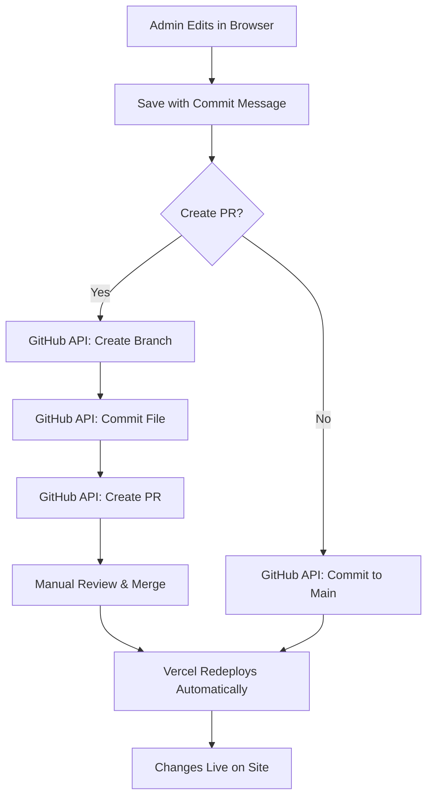

# Deployment Guide

This guide covers deploying The Horizon to Vercel and other platforms, with a focus on configuring the admin interface and GitHub integration.

## Prerequisites

- GitHub repository with your code
- GitHub Personal Access Token with appropriate scopes
- Strong admin password (minimum 16 characters recommended)

## Vercel Deployment

### 1. Initial Setup

1. **Push your code to GitHub** (if not already done)
   ```bash
   git push origin main
   ```

2. **Import project to Vercel**
   - Visit [vercel.com/new](https://vercel.com/new)
   - Select your GitHub repository
   - Click "Import"

### 2. Environment Variables

Configure the following environment variables in Vercel:

#### Required for Admin Interface

| Variable | Description | Example |
|----------|-------------|---------|
| `ADMIN_PASSWORD` | Password for admin access. Use a strong password with at least 16 characters. | `MySecureP@ssw0rd!2024` |
| `GITHUB_TOKEN` | Personal access token for GitHub API | `ghp_xxxxxxxxxxxxxxxxxxxxxxxxxxxx` |
| `GITHUB_OWNER` | Repository owner (username or org) | `AgentFoundryExamples` |
| `GITHUB_REPO` | Repository name | `the-horizon` |
| `GITHUB_BRANCH` | Target branch for commits | `main` |

#### Optional

| Variable | Description | Default |
|----------|-------------|---------|
| `NODE_ENV` | Environment mode | `production` |

### 3. Configure Environment Variables in Vercel

1. Go to your project in Vercel
2. Navigate to **Settings** → **Environment Variables**
3. Add each variable:
   - Click "Add" for each variable
   - Enter the name and value
   - Select environment(s): Production, Preview, Development
   - Click "Save"

### 4. Deploy

Click **Deploy** to trigger the first deployment. Vercel will:
- Build your application
- Deploy to a production URL
- Make it available at `your-project.vercel.app`

## GitHub Personal Access Token

The admin interface requires a GitHub Personal Access Token to commit changes back to your repository.

### Creating a Token

1. Go to [GitHub Settings → Developer settings → Personal access tokens → Tokens (classic)](https://github.com/settings/tokens/new)

2. Fill in the form:
   - **Note**: "The Horizon Admin Interface"
   - **Expiration**: Choose based on your security policy (90 days recommended)
   - **Scopes**: Select the following:
     - ✅ `repo` - Full control of private repositories
       - Includes: `repo:status`, `repo_deployment`, `public_repo`, `repo:invite`, `security_events`
     - ✅ `workflow` (optional) - If you want to trigger GitHub Actions

3. Click **Generate token**

4. **Copy the token immediately** - you won't be able to see it again!

5. Add it to your Vercel environment variables as `GITHUB_TOKEN`

### Token Security

⚠️ **Important Security Notes**:

- Never commit tokens to source code
- Store tokens only in environment variables
- Rotate tokens regularly (every 90 days recommended)
- Use the minimum required scopes
- Revoke tokens immediately if compromised

## Password Security

Your `ADMIN_PASSWORD` protects access to the content management interface.

### Generating a Strong Password

Use one of these methods:

**Option 1: OpenSSL** (Mac/Linux)
```bash
openssl rand -base64 32
```

**Option 2: Node.js**
```bash
node -e "console.log(require('crypto').randomBytes(32).toString('base64'))"
```

**Option 3: Password Manager**
- Use 1Password, LastPass, or similar
- Generate a password with at least 16 characters
- Include uppercase, lowercase, numbers, and symbols

### Password Requirements

- Minimum 16 characters (recommended: 32+)
- Mix of uppercase and lowercase letters
- Include numbers and special characters
- Don't use common words or patterns
- Don't reuse passwords from other services

### Security Features

The admin interface includes multiple layers of security protection:

**Timing-Safe Password Validation**
- Uses constant-time comparison to prevent timing attacks
- Password hashes are compared with `timingSafeEqual` to avoid leaking password length

**Signed Session Tokens**
- Session cookies use cryptographically signed random tokens
- Prevents session forgery by validating HMAC-SHA256 signatures
- Tokens are validated in middleware on every protected route

**Rate Limiting**
- Maximum 5 failed login attempts per IP address
- 15-minute lockout period after exceeding limit
- Automatic reset on successful login
- Helps prevent brute force attacks

**Sanitized Error Logging**
- No tokens or sensitive data exposed in error messages
- Generic error responses prevent information leakage
- Detailed errors logged server-side only

## How Admin Changes Work

Understanding the workflow helps troubleshoot issues:



### Commit Workflow

**Option 1: Pull Request (Recommended)**
1. Admin makes changes in the interface
2. Clicks "Create PR"
3. System creates a new branch (e.g., `admin-edit-1234567890`)
4. Commits changes to the new branch
5. Opens a Pull Request
6. Team reviews PR
7. PR is merged
8. Vercel automatically redeploys

**Option 2: Direct Commit**
1. Admin makes changes in the interface
2. Clicks "Commit to GitHub"
3. System commits directly to main branch
4. Vercel automatically redeploys

## Automatic Redeployment

Vercel watches your GitHub repository for changes:

- **Push to main**: Triggers production deployment
- **Push to other branch**: Triggers preview deployment
- **Pull Request**: Creates a preview deployment with unique URL

No manual redeployment needed - it's completely automatic!

## Verification Steps

After deployment, verify everything works:

### 1. Check the Main Site

1. Visit your production URL
2. Verify the universe loads
3. Navigate through galaxies and planets
4. Check that all content displays correctly

### 2. Test Admin Access

1. Navigate to `/admin`
2. Should redirect to `/admin/login`
3. Enter your `ADMIN_PASSWORD`
4. Should redirect to admin dashboard
5. Verify stats are displayed correctly

### 3. Test Admin Functionality

1. Click "Edit" on a galaxy
2. Make a small change (e.g., update description)
3. Save changes
4. Add a commit message
5. Choose "Create Pull Request"
6. Verify the PR is created on GitHub

### 4. Verify GitHub Integration

1. Go to your GitHub repository
2. Check for the new branch (e.g., `admin-edit-1234567890`)
3. Check for the new Pull Request
4. Review the changes in the PR
5. Merge the PR
6. Wait for Vercel to redeploy
7. Verify changes appear on the production site

## Troubleshooting

### Admin Login Fails

**Symptom**: "Invalid password" error even with correct password

**Solutions**:
- Verify `ADMIN_PASSWORD` is set in Vercel environment variables
- Check for extra spaces or newlines in the password
- Ensure password is not the default `CHANGE_ME_USE_STRONG_PASSWORD_MIN_16_CHARS`
- Redeploy after changing environment variables

### Too Many Login Attempts

**Symptom**: "Too many login attempts. Please try again in X minutes."

**Solutions**:
- This is rate limiting protection after 5 failed attempts
- Wait 15 minutes for the lockout to expire
- Verify you're using the correct password
- If locked out frequently, check for automation or bots
- Rate limiting resets on server restart (in development)

### Session Expired

**Symptom**: Redirected to login page while working in admin

**Solutions**:
- Sessions expire after 24 hours
- Log in again to create a new session
- Session cookies are signed and validated on each request
- Browser restart or cookie clearing will require re-login

### GitHub API Errors

**Symptom**: "Authentication failed" or "Permission denied"

**Solutions**:
- Verify `GITHUB_TOKEN` is valid and not expired
- Check token has `repo` scope
- Ensure token belongs to a user with write access to the repository
- Regenerate token if compromised

### "Content has been modified by another user"

**Symptom**: Save fails with concurrent edit warning

**Solutions**:
- This is expected behavior (optimistic locking)
- Refresh the page to load latest content
- Reapply your changes
- Use PR workflow to avoid conflicts

### Changes Don't Appear After Commit

**Symptom**: Changes committed successfully but not visible on site

**Solutions**:
- Check Vercel deployment logs
- Verify commit was made to correct branch
- Wait a few minutes for redeployment
- Clear browser cache
- Check if change was actually committed to GitHub

### Rate Limit Errors

**Symptom**: "GitHub API rate limit exceeded"

**Solutions**:
- Wait for rate limit to reset (usually 1 hour)
- Use authenticated token (higher rate limit)
- Reduce frequency of saves
- Consider upgrading GitHub account

## Alternative Deployment Platforms

While Vercel is recommended, The Horizon can be deployed to any platform supporting Next.js:

### Netlify

1. Connect GitHub repository
2. Set build command: `npm run build`
3. Set publish directory: `.next`
4. Add environment variables
5. Deploy

### AWS Amplify

1. Connect GitHub repository
2. Use Next.js build settings
3. Add environment variables
4. Deploy

### Self-Hosted

```bash
# Build the application
npm run build

# Start production server
npm start
```

Set environment variables using `.env.local` or system environment variables.

## Security Best Practices

1. **Use Strong Passwords**
   - Minimum 16 characters
   - Random generation recommended
   - Store in password manager

2. **Rotate Credentials Regularly**
   - Change admin password every 90 days
   - Regenerate GitHub token every 90 days
   - Update Vercel environment variables

3. **Limit Access**
   - Only share admin password with authorized users
   - Use PR workflow for review process
   - Monitor GitHub repository for unauthorized changes

4. **Monitor Activity**
   - Review GitHub commit history regularly
   - Check Vercel deployment logs
   - Set up GitHub notifications for repository changes

5. **Backup Data**
   - Git history serves as backup
   - Consider periodic exports of universe.json
   - Test restore process

## Maintenance

### Regular Tasks

- **Weekly**: Review recent commits and PRs
- **Monthly**: Check for dependency updates
- **Quarterly**: Rotate passwords and tokens
- **Annually**: Security audit

### Updating Dependencies

```bash
# Check for updates
npm outdated

# Update dependencies
npm update

# Update major versions (carefully)
npm install package@latest
```

## Support

For issues or questions:

- Check [GitHub Issues](https://github.com/AgentFoundryExamples/the-horizon/issues)
- Review [Next.js Documentation](https://nextjs.org/docs)
- Review [Vercel Documentation](https://vercel.com/docs)

## Additional Resources

- [Next.js Deployment Documentation](https://nextjs.org/docs/deployment)
- [Vercel Environment Variables](https://vercel.com/docs/concepts/projects/environment-variables)
- [GitHub Personal Access Tokens](https://docs.github.com/en/authentication/keeping-your-account-and-data-secure/creating-a-personal-access-token)
- [Universe Schema Documentation](./universe-schema.md)
