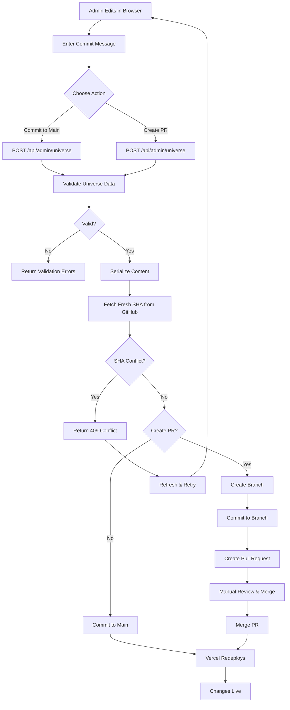

# Deployment Guide

This guide covers deploying The Horizon to Vercel and other platforms, with a focus on configuring the admin interface and GitHub integration.

## Prerequisites

- **Node.js**: Version 18.x or higher (20.x recommended)
- **npm**: Version 10.x or higher
- GitHub repository with your code
- GitHub Personal Access Token with appropriate scopes
- Strong admin password (minimum 16 characters recommended)

## Current Version Requirements

The Horizon v0.1.1 has been updated with security patches:
- **Next.js**: 14.2.33 (upgraded from 14.2.15)
- **React**: 18.3.1
- **TypeScript**: 5.6.3
- **Node.js**: 18.x or higher

See [roadmap.md](./roadmap.md) for detailed security update information.

## Vercel Deployment

### 1. Initial Setup

1. **Push your code to GitHub** (if not already done)
   ```bash
   git push origin main
   ```

2. **Import project to Vercel**
   - Visit [vercel.com/new](https://vercel.com/new)
   - Select your GitHub repository
   - Click "Import"

### 2. Environment Variables

Configure the following environment variables in Vercel:

#### Required for Admin Interface

| Variable | Description | Example |
|----------|-------------|---------|
| `ADMIN_PASSWORD` | Password for admin access. Use a strong password with at least 16 characters. | `MySecureP@ssw0rd!2024` |
| `SESSION_SECRET` | Secret for signing session tokens (independent of password). Generate with `openssl rand -base64 32` | `aB3dEf...` |
| `GITHUB_TOKEN` | Personal access token for GitHub API | `ghp_xxxxxxxxxxxxxxxxxxxxxxxxxxxx` |
| `GITHUB_OWNER` | Repository owner (username or org) | `AgentFoundryExamples` |
| `GITHUB_REPO` | Repository name | `the-horizon` |
| `GITHUB_BRANCH` | Target branch for commits | `main` |

#### Optional

| Variable | Description | Default |
|----------|-------------|---------|
| `NODE_ENV` | Environment mode | `production` |
| `ADMIN_VERBOSE_LOGGING` | Enable detailed workflow logging for admin operations (useful for debugging GitHub integration). Set to `true` to enable. | `false` (enabled in development) |

**Note on SESSION_SECRET**: If not provided, the system will fall back to using `ADMIN_PASSWORD` as the session secret (not recommended for production). For better security, always set a separate `SESSION_SECRET`.

**Note on ADMIN_VERBOSE_LOGGING**: When enabled, provides detailed step-by-step logging of the commit workflow including SHA fetch operations, validation steps, and GitHub API interactions. Recommended for troubleshooting GitHub integration issues. Automatically enabled in development mode.

#### Staging vs Production Environments

When using Vercel's environment-specific configuration, you can set different values for Production, Preview (staging), and Development:

**GitHub Token Strategy:**
- **Production**: Use a GitHub token with full `repo` access pointing to your production branch (usually `main`)
- **Preview/Staging**: Optionally use a separate token or the same token with appropriate branch targeting
- **Development**: Use a development-specific token or omit GitHub credentials to test local-only saves

**Benefits of Separate Tokens:**
- **Audit Trail**: Track which environment made which commits
- **Security**: Revoke staging tokens without affecting production
- **Testing**: Use a test repository for staging environments
- **Permissions**: Limit staging tokens to PR-only workflow (no direct commits)

**Configuration in Vercel:**
1. Navigate to **Settings** → **Environment Variables**
2. For each variable, check which environments should use it:
   - ✓ Production - Live site with production credentials
   - ✓ Preview - Staging/PR deployments (optional: use separate staging token)
   - ✓ Development - Local development (optional: omit or use dev token)
3. To use different tokens per environment:
   - Add `GITHUB_TOKEN` with production token, check only "Production"
   - Add `GITHUB_TOKEN` again with staging token, check only "Preview"
   - Optionally add `GITHUB_TOKEN` with dev token, check only "Development"

**Example Configuration:**
```
# Production environment
GITHUB_TOKEN=ghp_prod_token_XXXX  (Production only)
GITHUB_BRANCH=main

# Preview/Staging environment  
GITHUB_TOKEN=ghp_staging_token_XXXX  (Preview only)
GITHUB_BRANCH=staging

# Development environment
GITHUB_TOKEN=ghp_dev_token_XXXX  (Development only, or omit entirely)
GITHUB_BRANCH=dev
```

**Best Practices:**
- Use descriptive token names in GitHub (e.g., "Horizon Production", "Horizon Staging")
- Set expiration dates and rotate tokens regularly (90 days recommended)
- Document which token is used in which environment
- Test staging configuration before deploying to production

### 3. Configure Environment Variables in Vercel

1. Go to your project in Vercel
2. Navigate to **Settings** → **Environment Variables**
3. Add each variable:
   - Click "Add" for each variable
   - Enter the name and value
   - Select environment(s): Production, Preview, Development
   - Click "Save"

### 4. Deploy

Click **Deploy** to trigger the first deployment. Vercel will:
- Build your application
- Deploy to a production URL
- Make it available at `your-project.vercel.app`

## GitHub Personal Access Token

The admin interface requires a GitHub Personal Access Token to commit changes back to your repository.

### Creating a Token

GitHub now recommends using fine-grained personal access tokens for better security.

**Option 1: Fine-Grained Token (Recommended)**

1. Go to [GitHub Settings → Developer settings → Personal access tokens → Fine-grained tokens](https://github.com/settings/personal-access-tokens/new)

2. Fill in the form:
   - **Token name**: "The Horizon Admin Interface"
   - **Expiration**: Choose based on your security policy (90 days recommended)
   - **Repository access**: Select "Only select repositories" and choose your repository
   - **Permissions**: Under "Repository permissions", set:
     - ✅ `Contents` - Read and write access (for committing files)
     - ✅ `Pull requests` - Read and write access (for creating PRs)
     - ✅ `Metadata` - Read-only (automatically selected)

3. Click **Generate token**

4. **Copy the token immediately** - you won't be able to see it again!

5. Add it to your Vercel environment variables as `GITHUB_TOKEN`

**Option 2: Classic Token (Legacy)**

1. Go to [GitHub Settings → Developer settings → Personal access tokens → Tokens (classic)](https://github.com/settings/tokens/new)

2. Fill in the form:
   - **Note**: "The Horizon Admin Interface"
   - **Expiration**: Choose based on your security policy (90 days recommended)
   - **Scopes**: Select the following:
     - ✅ `repo` - Full control of private repositories
       - Includes: `repo:status`, `repo_deployment`, `public_repo`, `repo:invite`, `security_events`

3. Click **Generate token**

4. **Copy the token immediately** - you won't be able to see it again!

5. Add it to your Vercel environment variables as `GITHUB_TOKEN`

### Token Security

⚠️ **Important Security Notes**:

- Never commit tokens to source code
- Store tokens only in environment variables
- Rotate tokens regularly (every 90 days recommended)
- Use the minimum required scopes
- Revoke tokens immediately if compromised

## Password Security

Your `ADMIN_PASSWORD` protects access to the content management interface.

### Generating a Strong Password

Use one of these methods:

**Option 1: OpenSSL** (Mac/Linux)
```bash
openssl rand -base64 32
```

**Option 2: Node.js**
```bash
node -e "console.log(require('crypto').randomBytes(32).toString('base64'))"
```

**Option 3: Password Manager**
- Use 1Password, LastPass, or similar
- Generate a password with at least 16 characters
- Include uppercase, lowercase, numbers, and symbols

### Password Requirements

- Minimum 16 characters (recommended: 32+)
- Mix of uppercase and lowercase letters
- Include numbers and special characters
- Don't use common words or patterns
- Don't reuse passwords from other services

### Security Features

The admin interface includes multiple layers of security protection:

**Timing-Safe Password Validation**
- Uses constant-time comparison to prevent timing attacks
- Password hashes are compared with `timingSafeEqual` to avoid leaking password length
- Web Crypto API ensures Edge Runtime compatibility

**Signed Session Tokens**
- Session cookies use cryptographically signed random tokens with SHA-256 (Web Crypto API)
- Prevents session forgery by validating signatures on every request
- Tokens are validated in middleware on every protected route
- Uses dedicated SESSION_SECRET (or falls back to ADMIN_PASSWORD)
- Changing SESSION_SECRET invalidates all existing sessions
- Compatible with Edge Runtime for serverless deployments

**Rate Limiting**
- Maximum 5 failed login attempts per IP address
- 15-minute lockout period after exceeding limit
- Automatic reset on successful login
- Helps prevent brute force attacks
- **Limitations**: In-memory storage (resets on server restart, not suitable for multi-instance deployments)

**Sanitized Error Logging**
- No tokens or sensitive data exposed in error messages
- Generic error responses prevent information leakage
- Detailed errors logged server-side only

**Edge Runtime Support**
- All authentication functions use Web Crypto API
- Compatible with serverless Edge deployments on Vercel and other platforms
- No Node.js-specific crypto dependencies

## How Admin Changes Work

The admin interface commits changes directly to GitHub:

> **Note**: As of v0.2.0, the admin interface commits changes directly to GitHub without intermediate disk persistence. This ensures compatibility with Vercel and other serverless platforms that have read-only filesystems. Enhanced verbose logging is available via `ADMIN_VERBOSE_LOGGING=true` environment variable.



### Direct-to-GitHub Workflow

The admin interface commits changes directly to GitHub without intermediate disk persistence:

**Commit to Main Branch (POST /api/admin/universe)**
1. Admin makes changes in the browser
2. Clicks "✓ Save to GitHub"
3. Enters a commit message
4. System validates the universe data
5. Serializes the content
6. **Fetches fresh SHA from GitHub** to prevent stale file errors
7. Checks for conflicts with GitHub HEAD
8. Commits directly to main branch via GitHub API
9. Vercel automatically redeploys with new changes
10. **Changes go live immediately**

**Create Pull Request (POST /api/admin/universe)**
1. Admin makes changes in the browser
2. Clicks "🔀 Create Pull Request"
3. Enters a PR message
4. System validates the universe data
5. Serializes the content
6. **Fetches fresh SHA from GitHub**
7. Creates a new branch (e.g., `admin-edit-1234567890`)
8. Commits changes to the new branch
9. Creates a pull request for team review
10. After PR is merged, Vercel redeploys automatically

**Why This Approach?**
- **Vercel Compatible**: Works with read-only serverless filesystems
- **Simpler**: Direct commits without intermediate file writes
- **Reliable**: Fresh SHA fetched before each commit
- **Flexible**: Choose between direct commits or PR workflow
- **Fast**: Changes go live as soon as Vercel redeploys
- **Safe**: Optimistic locking prevents concurrent edit conflicts

**Conflict Resolution**
If you get a "Conflict detected" error:
1. Someone else committed to GitHub since you loaded the editor
2. Refresh the admin page to load the latest version
3. Re-apply your changes to the fresh content
4. Click "✓ Save to GitHub" or "🔀 Create Pull Request" to retry

The system automatically prevents stale SHA errors by fetching the latest file metadata from GitHub right before committing.

### Logging and Debugging

The admin commit workflow includes comprehensive logging for troubleshooting:

**Verbose Logging Mode**

Enable detailed workflow logging by setting `ADMIN_VERBOSE_LOGGING=true` environment variable. This provides:
- Step-by-step workflow execution logs with clear separators
- SHA fetch operations with hash previews for debugging
- Content validation with byte counts
- Detailed GitHub API interaction logs
- Optimistic lock verification details

Verbose logging is automatically enabled in development mode (`NODE_ENV=development`).

**Standard Server Logs** (visible in server console or deployment logs):
```
[GET /api/admin/universe] Request received - fetching universe data
[GET /api/admin/universe] Loaded from GitHub, hash: a1b2c3d4..., galaxies: 2
[POST /api/admin/universe] Request received - committing to GitHub
[POST /api/admin/universe] Payload parsed - galaxies: 2
[POST /api/admin/universe] Validating universe data...
[POST /api/admin/universe] Validation passed
[POST /api/admin/universe] Serialized, size: 5578 bytes
[POST /api/admin/universe] Pushing to GitHub...
[pushUniverseChanges] Starting commit workflow
[pushUniverseChanges] Fetching current SHA from GitHub...
[pushUniverseChanges] Direct commit to main branch...
[pushUniverseChanges] Commit successful to main
[POST /api/admin/universe] SUCCESS: GitHub push successful
```

**Verbose Logs with ADMIN_VERBOSE_LOGGING=true**:
```
[POST /api/admin/universe] ========================================
[POST /api/admin/universe] Request received - committing to GitHub
[POST /api/admin/universe] Workflow: Direct commit (no disk persistence)
[POST /api/admin/universe] Payload: { commitMessage: "Add new galaxy...", createPR: false, galaxies: 2 }
[POST /api/admin/universe] Step 1: Validating universe data...
[POST /api/admin/universe] Validation passed
[POST /api/admin/universe] Step 2: Serializing universe data...
[POST /api/admin/universe] Serialized, size: 5578 bytes
[POST /api/admin/universe] Step 3: Pushing to GitHub...
[POST /api/admin/universe] Note: GitHub layer will verify gitBaseHash matches current GitHub HEAD
[pushUniverseChanges] Starting commit workflow
[pushUniverseChanges] Content size: 5578 bytes
[pushUniverseChanges] Create PR: false
[pushUniverseChanges] Fetching current SHA from GitHub...
[pushUniverseChanges] Current GitHub SHA: abc12345...
[pushUniverseChanges] Content to commit hash: def67890...
[pushUniverseChanges] Verifying optimistic lock with gitBaseHash: abc12345...
[pushUniverseChanges] Current GitHub content hash: abc12345...
[pushUniverseChanges] Optimistic lock verified - GitHub matches baseline
[pushUniverseChanges] Content differs from GitHub HEAD - proceeding with commit
[pushUniverseChanges] Direct commit to main branch...
[pushUniverseChanges] Re-fetching SHA immediately before commit...
[pushUniverseChanges] Final SHA before commit: abc12345...
[pushUniverseChanges] Committing to main...
[pushUniverseChanges] Commit successful to main
[pushUniverseChanges] New content hash after commit: def67890...
[POST /api/admin/universe] SUCCESS: GitHub push successful
[POST /api/admin/universe] ========================================
```

**Log Filtering**: Use grep to filter logs by operation:
```bash
# View all admin operations
grep "\[.*admin.*\]" logs.txt

# View GitHub commit operations
grep "\[POST /api/admin/universe\]" logs.txt

# View GitHub API interactions
grep "\[pushUniverseChanges\]" logs.txt

# View all verbose workflow logs
grep "========================================" logs.txt
```

### Commit Workflow Options

**Option 1: Pull Request (Recommended)**
1. Admin makes changes in the interface
2. Clicks "💾 Save to Disk" to persist locally
3. Enters commit message and checks "Create Pull Request"
4. Clicks "🔀 Create PR"
5. System creates a new branch (e.g., `admin-edit-1234567890`)
6. Commits changes to the new branch
7. Opens a Pull Request
8. Team reviews PR
9. PR is merged
10. Vercel automatically redeploys

**Option 2: Direct Commit**
1. Admin makes changes in the interface
2. Clicks "💾 Save to Disk" to persist locally
3. Enters commit message (leave "Create PR" unchecked)
4. Clicks "✓ Commit to GitHub"
5. System commits directly to main branch
6. Vercel automatically redeploys

## Automatic Redeployment

Vercel watches your GitHub repository for changes:

- **Push to main**: Triggers production deployment
- **Push to other branch**: Triggers preview deployment
- **Pull Request**: Creates a preview deployment with unique URL

No manual redeployment needed - it's completely automatic!

## Verification Steps

After deployment, verify everything works:

### 1. Check the Main Site

1. Visit your production URL
2. Verify the universe loads
3. Navigate through galaxies and planets
4. Check that all content displays correctly

### 2. Test Admin Access

1. Navigate to `/admin`
2. Should redirect to `/admin/login`
3. Enter your `ADMIN_PASSWORD`
4. Should redirect to admin dashboard
5. Verify stats are displayed correctly

### 3. Test Admin Save Workflow

#### Step 1: Save to Disk
1. Click "Edit" on a galaxy
2. Make a small change (e.g., update description)
3. Click "Save Changes" in the editor
4. Click "💾 Save to Disk" in the main interface
5. Verify success message appears
6. **Verify locally**: Check that `public/universe/universe.json` has been updated
   ```bash
   # In development
   cat public/universe/universe.json | grep "your-change"
   ```

#### Step 2: Commit to GitHub
1. Enter a commit message (e.g., "Update galaxy description")
2. Check "Create Pull Request" (recommended)
3. Click "🔀 Create PR" (or "✓ Commit to GitHub" if not creating PR)
4. Verify success message with PR URL appears

### 4. Verify GitHub Integration

1. Go to your GitHub repository
2. Check for the new branch (e.g., `admin-edit-1234567890`)
3. Check for the new Pull Request
4. Review the changes in the PR - verify `public/universe/universe.json` was updated
5. Merge the PR
6. Wait for Vercel to redeploy (usually 1-3 minutes)
7. Verify changes appear on the production site

### 5. Monitor Logs

**In Development**:
Watch the server console for log messages:
```
[PATCH /api/admin/universe] Request received - saving to disk
[persistUniverseToFile] Success - file persisted
[POST /api/admin/universe] GitHub push successful
```

**In Production (Vercel)**:
1. Go to your Vercel project
2. Click on "Deployments"
3. Click on the most recent deployment
4. Click "View Function Logs"
5. Filter for `/api/admin/universe` to see save/commit operations

**Common Log Messages**:
- `Authentication failed`: Check ADMIN_PASSWORD
- `Validation failed`: Fix validation errors in form
- `No saved data found`: Must save to disk before committing
- `GitHub push failed`: Check GITHUB_TOKEN and permissions

## Troubleshooting

### Admin Save Workflow Issues

**Symptom**: "Failed to save changes" error

**Solutions**:
1. **Check server logs** for detailed error messages:
   - Development: Check terminal running `npm run dev`
   - Production: Check Vercel function logs
2. **Look for specific log messages**:
   - `[PATCH /api/admin/universe] Validation failed`: Fix validation errors displayed in UI
   - `[persistUniverseToFile] Error`: Check file permissions or disk space
   - `path traversal not allowed`: Don't modify UNIVERSE_DATA_PATH
3. **Verify file permissions**: Ensure server can write to `public/universe/` directory
4. **Check disk space**: Ensure adequate space for writing files
5. **Try again**: Temporary file system issues may resolve on retry

**Symptom**: "Conflict detected: file changed remotely" when committing

**Solutions**:
1. **This is expected behavior** when GitHub HEAD changed between your save and commit
2. **Resolution steps**:
   - Refresh the admin page to load the latest version from GitHub
   - Re-apply your changes to the fresh content
   - Click "💾 Save to Disk" to persist your changes locally
   - Click "Commit to GitHub" again to retry
3. **Prevention**: Use the PR workflow to isolate your changes during review
4. **Note**: The system always fetches fresh SHA from GitHub before committing to minimize conflicts

**Symptom**: "No saved data found" when trying to commit

**Solutions**:
1. **Must save to disk BEFORE committing** - this is required workflow order
2. **Steps**:
   - Make your changes in the editor
   - Click "💾 Save to Disk" and wait for success message
   - Then click "Commit to GitHub"
3. **Verify**: Check that `public/universe/universe.json` was updated after save

**Symptom**: Changes saved but not appearing after commit

**Solutions**:
1. **Verify two-step process**: Must save to disk BEFORE committing
2. **Check commit logs**:
   ```
   [POST /api/admin/universe] No saved data found
   ```
   This means you didn't save to disk first - click "💾 Save to Disk"
3. **Verify file was written**: Check `public/universe/universe.json` locally
4. **Check GitHub**: Verify commit or PR was created
5. **Wait for deployment**: Vercel takes 1-3 minutes to redeploy
6. **Check for SHA conflicts**: If you see "file has changed" errors, follow conflict resolution steps

**Symptom**: "Conflict detected" error when saving (not committing)

**Solutions**:
- Another admin modified the local file concurrently
- Click browser refresh to load latest version
- Reapply your changes
- Save again
- This is expected behavior (optimistic locking protects against data loss)

### Admin Login Fails

**Symptom**: "Invalid password" error even with correct password

**Solutions**:
- Verify `ADMIN_PASSWORD` is set in Vercel environment variables
- Check for extra spaces or newlines in the password
- Ensure password is not the default `CHANGE_ME_USE_STRONG_PASSWORD_MIN_16_CHARS`
- Redeploy after changing environment variables

### Too Many Login Attempts

**Symptom**: "Too many login attempts. Please try again in X minutes."

**Solutions**:
- This is rate limiting protection after 5 failed attempts
- Wait 15 minutes for the lockout to expire
- Verify you're using the correct password
- If locked out frequently, check for automation or bots
- Rate limiting resets on server restart (in development)

### Session Expired

**Symptom**: Redirected to login page while working in admin

**Solutions**:
- Sessions expire after 24 hours
- Log in again to create a new session
- Session cookies are signed and validated on each request
- Browser restart or cookie clearing will require re-login

### GitHub API Errors

**Symptom**: "Authentication failed" or "Permission denied"

**Solutions**:
- Verify `GITHUB_TOKEN` is valid and not expired
- Check token has appropriate permissions (`Contents: Read & write` for fine-grained tokens, or `repo` scope for classic tokens)
- Ensure token belongs to a user with write access to the repository
- Regenerate token if compromised

### "Content has been modified by another user"

**Symptom**: Save fails with concurrent edit warning

**Solutions**:
- This is expected behavior (optimistic locking)
- Refresh the page to load latest content
- Reapply your changes
- Use PR workflow to avoid conflicts

### Changes Don't Appear After Commit

**Symptom**: Changes committed successfully but not visible on site

**Solutions**:
- Check Vercel deployment logs
- Verify commit was made to correct branch
- Wait a few minutes for redeployment
- Clear browser cache
- Check if change was actually committed to GitHub

### Rate Limit Errors

**Symptom**: "GitHub API rate limit exceeded"

**Solutions**:
- Wait for rate limit to reset (usually 1 hour)
- Use authenticated token (higher rate limit)
- Reduce frequency of saves
- Consider upgrading GitHub account

## Alternative Deployment Platforms

While Vercel is recommended, The Horizon can be deployed to any platform supporting Next.js:

### Netlify

1. Connect GitHub repository
2. Set build command: `npm run build`
3. Set publish directory: `.next`
4. Add environment variables
5. Deploy

### AWS Amplify

1. Connect GitHub repository
2. Use Next.js build settings
3. Add environment variables
4. Deploy

### Self-Hosted

```bash
# Build the application
npm run build

# Start production server
npm start
```

Set environment variables using `.env.local` or system environment variables.

## Security Best Practices

1. **Use Strong Passwords**
   - Minimum 16 characters
   - Random generation recommended
   - Store in password manager

2. **Rotate Credentials Regularly**
   - Change admin password every 90 days
   - Regenerate GitHub token every 90 days
   - Update Vercel environment variables

3. **Limit Access**
   - Only share admin password with authorized users
   - Use PR workflow for review process
   - Monitor GitHub repository for unauthorized changes

4. **Monitor Activity**
   - Review GitHub commit history regularly
   - Check Vercel deployment logs
   - Set up GitHub notifications for repository changes

5. **Backup Data**
   - Git history serves as backup
   - Consider periodic exports of universe.json
   - Test restore process

## Maintenance

### Regular Tasks

- **Weekly**: Review recent commits and PRs
- **Monthly**: Check for dependency updates
- **Quarterly**: Rotate passwords and tokens
- **Annually**: Security audit

### Updating Dependencies

**Security First**: Always run `npm audit` after updating dependencies and before deploying.

```bash
# Check for security vulnerabilities
npm audit

# Check for available updates
npm outdated

# Update patch/minor versions automatically
npm update

# Update major versions (carefully, test thoroughly)
npm install package@latest

# After updates, verify everything works
npm test
npm run build
npm run lint
```

**Recent Security Updates (v0.1.1)**:
- Next.js upgraded from 14.2.15 → 14.2.33 (critical security fixes)
- eslint-config-next upgraded from 14.2.15 → 14.2.33
- Added npm overrides for glob vulnerability mitigation
- All tests passing, zero npm audit vulnerabilities

When updating dependencies:
1. Always check for breaking changes in package changelogs
2. Run full test suite after updates
3. Test admin interface functionality
4. Verify build succeeds without errors
5. Check for any new peer dependency warnings

## Support

For issues or questions:

- Check [GitHub Issues](https://github.com/AgentFoundryExamples/the-horizon/issues)
- Review [Next.js Documentation](https://nextjs.org/docs)
- Review [Vercel Documentation](https://vercel.com/docs)

## Additional Resources

- [Next.js Deployment Documentation](https://nextjs.org/docs/deployment)
- [Vercel Environment Variables](https://vercel.com/docs/concepts/projects/environment-variables)
- [GitHub Personal Access Tokens](https://docs.github.com/en/authentication/keeping-your-account-and-data-secure/creating-a-personal-access-token)
- [Universe Schema Documentation](./universe-schema.md)
