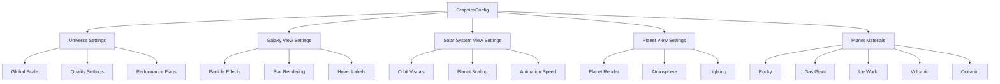
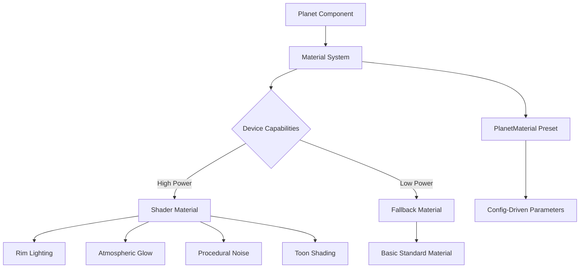

# Graphics Configuration System

## Overview

The Graphics Configuration System provides a centralized, structured way to configure all rendering settings across The Horizon application. It eliminates the need for hardcoded values in rendering components and enables designers and administrators to tune visual quality, performance, and aesthetics without code changes.

## Architecture



## Configuration Structure

### Top-Level Interface

```typescript
interface GraphicsConfig {
  version: string;                              // Config version for compatibility
  universe: UniverseConfig;                      // Global settings
  galaxyView: GalaxyViewConfig;                  // Galaxy-specific settings
  solarSystemView: SolarSystemViewConfig;        // Solar system settings
  planetView: PlanetViewConfig;                  // Planet detail settings
  planetMaterials: Record<string, PlanetMaterial>; // Named material presets
}
```

### Universe Configuration

Controls global rendering parameters that affect the entire scene.

| Field | Type | Range | Default | Description |
|-------|------|-------|---------|-------------|
| `globalScaleMultiplier` | number | 0.1-5.0 | 1.0 | Global scale for all 3D objects |
| `backgroundStarDensity` | number | 0-1 | 0.5 | Density of background star field |
| `lowPowerMode` | boolean | - | false | Enable mobile/low-power optimizations |
| `fallbackQuality` | number | 1-3 | 2 | Quality level when auto-detection fails (1=low, 2=medium, 3=high) |
| `antiAliasing` | boolean | - | true | Enable/disable anti-aliasing |
| `shadowQuality` | number | 0-2 | 1 | Shadow rendering quality (0=off, 1=low, 2=high) |

**Usage Example:**
```typescript
const config: UniverseConfig = {
  globalScaleMultiplier: 1.2,    // Slightly larger objects
  backgroundStarDensity: 0.7,    // More stars
  lowPowerMode: false,           // Full quality
  fallbackQuality: 2,            // Medium quality fallback
  antiAliasing: true,            // Smooth edges
  shadowQuality: 1               // Low shadows for performance
};
```

### Galaxy View Configuration

Controls rendering in the galaxy overview, where multiple galaxies are visible.

| Field | Type | Range | Default | Description |
|-------|------|-------|---------|-------------|
| `galaxyOpacity` | number | 0-1 | 0.7 | Transparency of galaxy particle clouds |
| `starBrightness` | number | 0.1-3.0 | 1.0 | Brightness multiplier for stars |
| `starDensity` | number | 0.1-2.0 | 1.0 | Number of visible stars (higher = more particles) |
| `rotationSpeed` | number | 0-5.0 | 1.0 | Galaxy rotation animation speed |
| `cameraZoom` | number | 0.5-2.0 | 1.0 | Default camera zoom level |
| `hoverLabels` | HoverLabelConfig | - | see below | Hover label configuration |

**Usage Example:**
```typescript
const config: GalaxyViewConfig = {
  galaxyOpacity: 0.8,           // More visible galaxies
  starBrightness: 1.5,          // Brighter stars
  starDensity: 1.2,             // 20% more stars
  rotationSpeed: 0.5,           // Slower rotation
  cameraZoom: 1.0,              // Default zoom
  hoverLabels: {
    enabled: true,
    fontSize: 16,
    backgroundOpacity: 0.9,
    visibilityDistance: 60,
    showDelay: 150
  }
};
```

### Solar System View Configuration

Controls rendering within a solar system, showing planets orbiting a star.

| Field | Type | Range | Default | Description |
|-------|------|-------|---------|-------------|
| `orbitStrokeWidth` | number | 0.5-5.0 | 1.5 | Width of orbit path lines |
| `planetScaleMultiplier` | number | 0.1-3.0 | 1.0 | Scale of planets relative to system |
| `orbitAnimationSpeed` | number | 0-10.0 | 1.0 | Speed of orbital motion |
| `starGlowIntensity` | number | 0-2.0 | 1.0 | Intensity of central star glow |
| `orbitalSpacing` | number | 0.5-3.0 | 1.0 | Distance between orbital planes |
| `cameraDistance` | number | 0.5-2.0 | 1.0 | Camera distance from system center |
| `hoverLabels` | HoverLabelConfig | - | see below | Hover label configuration |

**Usage Example:**
```typescript
const config: SolarSystemViewConfig = {
  orbitStrokeWidth: 2.0,        // Thicker orbit lines
  planetScaleMultiplier: 1.5,   // Larger planets
  orbitAnimationSpeed: 2.0,     // Faster orbits
  starGlowIntensity: 1.2,       // Brighter star
  orbitalSpacing: 1.0,          // Standard spacing
  cameraDistance: 1.3,          // Slightly farther camera
  hoverLabels: {
    enabled: true,
    fontSize: 14,
    backgroundOpacity: 0.85,
    visibilityDistance: 50,
    showDelay: 200
  }
};
```

### Planet View Configuration

Controls detailed planet rendering when viewing a single planet.

| Field | Type | Range | Default | Description |
|-------|------|-------|---------|-------------|
| `planetRenderScale` | number | 0.5-2.0 | 1.0 | Size of the 3D planet model |
| `rotationSpeed` | number | 0-5.0 | 1.0 | Planet rotation speed |
| `atmosphereGlow` | number | 0-2.0 | 1.0 | Atmospheric glow intensity |
| `cloudOpacity` | number | 0-1 | 0.6 | Cloud layer transparency (if applicable) |
| `lightingIntensity` | number | 0.1-3.0 | 1.0 | Overall lighting brightness |
| `rimLighting` | boolean | - | true | Enable rim lighting effect |
| `hoverLabels` | HoverLabelConfig | - | see below | Hover label configuration for moons |

**Usage Example:**
```typescript
const config: PlanetViewConfig = {
  planetRenderScale: 1.2,       // Larger planet
  rotationSpeed: 1.5,           // Faster spin
  atmosphereGlow: 1.3,          // Stronger glow
  cloudOpacity: 0.7,            // More visible clouds
  lightingIntensity: 1.1,       // Slightly brighter
  rimLighting: true,            // Edge highlight on
  hoverLabels: {
    enabled: true,
    fontSize: 12,
    backgroundOpacity: 0.8,
    visibilityDistance: 40,
    showDelay: 250
  }
};
```

### Hover Label Configuration

Shared configuration for interactive hover labels across all views.

| Field | Type | Range | Default | Description |
|-------|------|-------|---------|-------------|
| `enabled` | boolean | - | true | Enable/disable hover labels |
| `fontSize` | number | 10-24 | 14 | Label text size in pixels |
| `backgroundOpacity` | number | 0-1 | 0.85 | Label background transparency |
| `visibilityDistance` | number | 0-100 | 50 | Max distance for label visibility (world units) |
| `showDelay` | number | 0-1000 | 200 | Delay before showing label (milliseconds) |

## Planet Material Presets

The system includes five predefined material presets for different planet types.

### Available Presets

#### 1. Rocky Planet (`rocky`)
Terrestrial planets with solid surfaces, like Earth, Mars, or Mercury.

```typescript
{
  id: 'rocky',
  name: 'Rocky Planet',
  baseColor: '#8B7355',           // Brown rocky surface
  rimColor: '#FFD700',            // Gold rim light
  rimIntensity: 0.6,
  atmosphereColor: '#87CEEB',     // Sky blue atmosphere
  atmosphereIntensity: 0.4,
  roughness: 0.8,                 // Rough surface
  metallic: 0.1,                  // Slightly metallic
  proceduralNoise: true
}
```

**Best for:** Earth-like worlds, desert planets, barren moons

#### 2. Gas Giant (`gas-giant`)
Massive planets with thick atmospheres and swirling cloud bands.

```typescript
{
  id: 'gas-giant',
  name: 'Gas Giant',
  baseColor: '#D4A574',           // Tan/brown bands
  rimColor: '#FFA500',            // Orange rim
  rimIntensity: 0.8,
  atmosphereColor: '#FFE4B5',     // Cream atmosphere
  atmosphereIntensity: 0.7,
  roughness: 0.3,                 // Smooth gaseous surface
  metallic: 0.0,
  proceduralNoise: true
}
```

**Best for:** Jupiter-like planets, Saturn analogs

#### 3. Ice World (`ice-world`)
Frozen planets with glacial ice and snow-covered surfaces.

```typescript
{
  id: 'ice-world',
  name: 'Ice World',
  baseColor: '#C8E6F5',           // Pale blue ice
  rimColor: '#FFFFFF',            // White rim
  rimIntensity: 1.0,
  atmosphereColor: '#B0E0E6',     // Powder blue
  atmosphereIntensity: 0.5,
  roughness: 0.2,                 // Reflective ice
  metallic: 0.3,                  // Icy sheen
  proceduralNoise: true
}
```

**Best for:** Europa-like moons, frozen outer planets

#### 4. Volcanic Planet (`volcanic`)
Hellish worlds with molten lava and extreme temperatures.

```typescript
{
  id: 'volcanic',
  name: 'Volcanic Planet',
  baseColor: '#2B1810',           // Dark burnt surface
  rimColor: '#FF4500',            // Orange-red glow
  rimIntensity: 1.5,
  atmosphereColor: '#FF6347',     // Tomato red atmosphere
  atmosphereIntensity: 0.9,
  roughness: 0.9,                 // Very rough surface
  metallic: 0.0,
  proceduralNoise: true
}
```

**Best for:** Io-like moons, young terrestrial planets, tidally heated worlds

#### 5. Oceanic Planet (`oceanic`)
Water-covered worlds with deep oceans.

```typescript
{
  id: 'oceanic',
  name: 'Oceanic Planet',
  baseColor: '#1E90FF',           // Deep ocean blue
  rimColor: '#00CED1',            // Cyan rim
  rimIntensity: 0.7,
  atmosphereColor: '#87CEFA',     // Light sky blue
  atmosphereIntensity: 0.6,
  roughness: 0.1,                 // Very smooth water
  metallic: 0.0,
  proceduralNoise: true
}
```

**Best for:** Water worlds, ocean moons

### Creating Custom Materials

Extend existing presets to create custom variations:

```typescript
import { createCustomPlanetMaterial } from '@/lib/graphics/presets';

// Create a volcanic ice world
const volcanicIce = createCustomPlanetMaterial(
  'ice-world',                    // Base preset
  {
    baseColor: '#FFB6C1',         // Light pink
    rimColor: '#FF4500',          // Orange glow
    atmosphereIntensity: 0.8      // Thicker atmosphere
  },
  'volcanic-ice',                 // New ID
  'Volcanic Ice World'            // New name
);
```

## Usage in Components

### Reading Configuration

```typescript
import { DEFAULT_GRAPHICS_CONFIG } from '@/lib/graphics/presets';

// Access universe settings
const universeConfig = DEFAULT_GRAPHICS_CONFIG.universe;
const scale = universeConfig.globalScaleMultiplier;

// Access galaxy view settings
const galaxyConfig = DEFAULT_GRAPHICS_CONFIG.galaxyView;
const opacity = galaxyConfig.galaxyOpacity;

// Access planet material
const rockyMaterial = DEFAULT_GRAPHICS_CONFIG.planetMaterials['rocky'];
```

### Validating Configuration

```typescript
import { validateGraphicsConfig, sanitizeGraphicsConfig } from '@/lib/graphics/config';

// Validate a config object
const validation = validateGraphicsConfig(userProvidedConfig);
if (!validation.valid) {
  console.error('Config errors:', validation.errors);
  console.warn('Config warnings:', validation.warnings);
}

// Sanitize and apply defaults
const safeConfig = sanitizeGraphicsConfig(userProvidedConfig);
// safeConfig is now guaranteed to be valid with all defaults applied
```

### Serialization

```typescript
import { 
  serializeGraphicsConfig, 
  deserializeGraphicsConfig 
} from '@/lib/graphics/config';

// Save to JSON
const json = serializeGraphicsConfig(config);
localStorage.setItem('graphics-config', json);

// Load from JSON
const loaded = deserializeGraphicsConfig(json);
if (loaded.validation.valid) {
  console.log('Loaded config:', loaded.config);
} else {
  console.error('Invalid config:', loaded.validation.errors);
}
```

## Admin Editor Integration

The admin interface can consume the GraphicsConfig shape without touching shader code:

```typescript
import { DEFAULT_GRAPHICS_CONFIG } from '@/lib/graphics/presets';
import { validateGraphicsConfig } from '@/lib/graphics/config';

function GraphicsConfigEditor() {
  const [config, setConfig] = useState(DEFAULT_GRAPHICS_CONFIG);
  
  const handleSave = () => {
    const validation = validateGraphicsConfig(config);
    if (!validation.valid) {
      alert(`Invalid config: ${validation.errors.join(', ')}`);
      return;
    }
    
    // Save to backend
    saveGraphicsConfig(config);
  };
  
  return (
    <form>
      <label>
        Global Scale:
        <input 
          type="number" 
          min={0.1} 
          max={5.0} 
          step={0.1}
          value={config.universe.globalScaleMultiplier}
          onChange={(e) => setConfig({
            ...config,
            universe: {
              ...config.universe,
              globalScaleMultiplier: parseFloat(e.target.value)
            }
          })}
        />
      </label>
      {/* More fields... */}
    </form>
  );
}
```

## Validation and Error Handling

### Edge Cases

#### 1. Malformed Config File
```typescript
const result = deserializeGraphicsConfig('invalid json');
// result.validation.valid = false
// result.config = DEFAULT_GRAPHICS_CONFIG (safe fallback)
```

#### 2. Missing Fields
```typescript
const partial = { version: '1.0.0' };
const safe = sanitizeGraphicsConfig(partial);
// All missing fields filled with defaults
```

#### 3. Out-of-Range Values
```typescript
const config = {
  universe: { globalScaleMultiplier: 999 }  // Out of range [0.1, 5.0]
};
const validation = validateGraphicsConfig(config);
// validation.warnings includes range clamping message
// Value automatically clamped to 5.0
```

#### 4. Invalid Preset Names
```typescript
const material: PlanetMaterial = {
  id: 'custom',
  texturePreset: { name: 'nonexistent-preset' }
};
const validation = validatePlanetMaterial(material, presetIds, errors, warnings);
// validation.errors includes "preset name not recognized"
```

#### 5. Malicious Input Sanitization
All numeric inputs are validated and clamped. String inputs for colors are validated against hex format regex.

```typescript
// Invalid color
baseColor: 'rgb(255,0,0)'  // ERROR: Must be hex format
baseColor: '#FF0000'        // OK

// SQL injection attempt in texture path (would be handled by backend)
texturePreset: { 
  name: "rocky'; DROP TABLE planets; --"  
}
// Validation checks preset name against whitelist
```

## Environment Variables

Add to `.env.example` for graphics asset configuration:

```bash
# Graphics Asset Paths
# Base directory for planet texture assets
NEXT_PUBLIC_TEXTURES_PATH=/textures/planets

# CDN URL for texture assets (optional)
# If set, textures will be loaded from CDN instead of local paths
# NEXT_PUBLIC_TEXTURES_CDN=https://cdn.example.com/the-horizon/textures

# Graphics Quality Override
# Override auto-detected quality level (1=low, 2=medium, 3=high)
# Useful for testing different quality modes
# NEXT_PUBLIC_GRAPHICS_QUALITY=2

# Enable Low Power Mode
# Force enable mobile/low-power optimizations
# NEXT_PUBLIC_LOW_POWER_MODE=false

# Debug Graphics Config
# Enable detailed logging of graphics config loading and validation
# NEXT_PUBLIC_DEBUG_GRAPHICS=false
```

## Extension Guidelines

### Adding New Configuration Fields

1. **Update the interface** in `config.ts`:
```typescript
export interface PlanetViewConfig {
  // ... existing fields
  newField?: number;  // Always make optional for backwards compatibility
}
```

2. **Add validation** in the validate function:
```typescript
function validatePlanetViewConfig(config, errors, warnings) {
  return {
    // ... existing fields
    newField: validateNumber(config.newField, 1.0, 0, 5.0, 'planetView.newField', errors, warnings),
  };
}
```

3. **Update defaults** in `presets.ts`:
```typescript
planetView: {
  // ... existing fields
  newField: 1.0,
}
```

4. **Document** in this file with description, range, and usage example.

### Adding New Material Presets

1. **Define the preset** in `presets.ts`:
```typescript
export const NEW_PRESET: PlanetMaterial = {
  id: 'new-preset',
  name: 'New Preset',
  description: 'Description of the preset',
  baseColor: '#HEXVAL',
  // ... other fields
};
```

2. **Add to the registry**:
```typescript
export const PLANET_MATERIAL_PRESETS = {
  // ... existing presets
  'new-preset': NEW_PRESET,
};
```

3. **Document** the preset in this file with examples and best use cases.

### Versioning

When making breaking changes to the config structure:

1. Increment the version in `DEFAULT_GRAPHICS_CONFIG`
2. Implement migration logic in `deserializeGraphicsConfig`
3. Document the changes in a config migration guide

```typescript
if (parsed.version === '1.0.0') {
  // Migrate to 2.0.0
  parsed = migrateFrom1_0_0To2_0_0(parsed);
}
```

## Performance Considerations

### Low Power Mode

When `lowPowerMode` is enabled:
- Reduce `starDensity` by 50%
- Disable `shadowQuality` (set to 0)
- Reduce `atmosphereGlow` intensity
- Lower particle counts in galaxy views
- Disable expensive shader effects

### Quality Levels

Quality level affects:
- **Level 1 (Low):** Minimal particles, no shadows, low-res textures
- **Level 2 (Medium):** Moderate particles, basic shadows, standard textures
- **Level 3 (High):** Full particle counts, high-quality shadows, high-res textures

### Mobile Optimization

For mobile devices, automatically enable:
```typescript
{
  universe: {
    lowPowerMode: true,
    shadowQuality: 0,
    antiAliasing: false,
  },
  galaxyView: {
    starDensity: 0.5,
  }
}
```

## Testing

See `src/lib/graphics/__tests__/config.test.ts` for comprehensive test coverage including:
- Validation edge cases
- Range clamping
- Default fallbacks
- Preset validation
- Serialization/deserialization
- Error handling

## Future Enhancements

Potential additions for future releases:

1. **Post-processing effects:** Bloom, vignette, color grading
2. **Shader presets:** Toon shading, PBR, unlit
3. **LOD configuration:** Level-of-detail thresholds
4. **Animation curves:** Custom easing functions for animations
5. **Accessibility options:** Reduced motion, high contrast modes
6. **Per-object overrides:** Allow individual planets/galaxies to override global settings

## Support

For questions or issues with the graphics configuration system:
- Check validation errors and warnings first
- Verify environment variables are set correctly
- Review this documentation for proper field ranges
- Test with `DEFAULT_GRAPHICS_CONFIG` to isolate custom config issues

## Planet Material Pipeline

### Overview

The AAA Planet Material Pipeline provides pseudo-PBR (Physically Based Rendering) quality planet visuals with configurable materials, rim lighting, and atmospheric effects. The system is built on Three.js/React Three Fiber and degrades gracefully on low-power devices.

### Architecture



### Material System Components

#### 1. Device Capability Detection

The system automatically detects device capabilities to optimize rendering:

```typescript
import { detectDeviceCapabilities } from '@/lib/graphics/materials';

const capabilities = detectDeviceCapabilities();
// Returns:
// {
//   isLowPower: boolean,       // Mobile or low-power device
//   supportsWebGL: boolean,     // WebGL availability
//   maxTextureSize: number,     // Maximum texture resolution
//   supportsFloatTextures: boolean  // Float texture support
// }
```

**Detection Criteria:**
- Mobile device user agent check
- Hardware concurrency (CPU core count)
- Battery API status (if available)
- WebGL context availability

#### 2. Shader Materials

High-quality shader materials provide:

**Rim Lighting (Fresnel Effect)**
- Edge highlighting based on view angle
- Configurable color and intensity
- Simulates atmospheric scattering

**Atmospheric Glow**
- Separate glow shell around planet
- Additive blending for realistic atmosphere
- Configurable color and intensity

**Procedural Noise**
- Surface variation without textures
- Lightweight shader-based generation
- Adds visual interest at all scales

**Toon Shading**
- Optional cel-shading effect
- Quantizes lighting levels
- Configurable step count

#### 3. Fallback Materials

For low-power devices, the system uses simple `MeshStandardMaterial`:
- Basic diffuse color
- Roughness and metallic properties
- Optional emissive rim effect
- No custom shaders or expensive effects

### Usage in Components

#### PlanetSurface Component

The `PlanetSurface` component demonstrates full material integration:

```typescript
import {
  DEFAULT_GRAPHICS_CONFIG,
  getPlanetMaterialPreset,
  detectDeviceCapabilities,
  applyPlanetMaterial,
  mapThemeToMaterialPreset,
  clonePlanetMaterial,
} from '@/lib/graphics';

// Inside component
const capabilities = useMemo(() => detectDeviceCapabilities(), []);
const graphicsConfig = DEFAULT_GRAPHICS_CONFIG;
const planetViewConfig = graphicsConfig.planetView;

// Map planet theme to material preset
const materialPreset = useMemo(() => {
  const presetId = mapThemeToMaterialPreset(planet.theme);
  const preset = getPlanetMaterialPreset(presetId);
  return preset ? clonePlanetMaterial(preset) : null;
}, [planet.theme]);

// Apply material to mesh
useEffect(() => {
  if (meshRef.current && materialPreset) {
    const { material, atmosphereShell } = applyPlanetMaterial(
      meshRef.current,
      materialPreset,
      planetViewConfig,
      capabilities,
      graphicsConfig.universe.lowPowerMode
    );

    if (atmosphereShell) {
      meshRef.current.add(atmosphereShell);
    }
  }
}, [materialPreset, planetViewConfig, capabilities]);
```

#### Theme to Material Mapping

The system maintains backwards compatibility with existing planet themes:

| Legacy Theme | Material Preset | Description |
|-------------|----------------|-------------|
| `blue-green` | `oceanic` | Water-covered worlds |
| `earth-like` | `rocky` | Terrestrial planets |
| `red` | `volcanic` | Lava-covered worlds |
| `ice` | `ice-world` | Frozen planets |
| `gas` | `gas-giant` | Gas giants |

### Tuning Planet Materials

#### Adjusting Visual Parameters

All visual parameters are configurable via `PlanetViewConfig`:

```typescript
const config: PlanetViewConfig = {
  planetRenderScale: 1.2,       // Size multiplier
  rotationSpeed: 1.5,           // Animation speed
  atmosphereGlow: 1.3,          // Glow intensity
  cloudOpacity: 0.7,            // Cloud transparency
  lightingIntensity: 1.1,       // Overall brightness
  rimLighting: true,            // Enable rim effect
};
```

#### Creating Custom Material Presets

Extend existing presets or create entirely new ones:

```typescript
import { createCustomPlanetMaterial } from '@/lib/graphics/presets';

// Create a purple toxic world
const toxicWorld = createCustomPlanetMaterial(
  'volcanic',                   // Base preset
  {
    baseColor: '#4B0082',       // Indigo surface
    rimColor: '#8A2BE2',        // Blue-violet rim
    rimIntensity: 1.2,
    atmosphereColor: '#9370DB', // Medium purple
    atmosphereIntensity: 0.9,
    toonShading: true,          // Enable cel-shading
  },
  'toxic-world',                // New ID
  'Toxic World'                 // Display name
);
```

#### Material Cloning

**Critical:** Always clone materials when using the same preset for multiple planets to prevent reference mutation:

```typescript
import { clonePlanetMaterial } from '@/lib/graphics/materials';

const materialPreset = getPlanetMaterialPreset('rocky');
const clonedMaterial = clonePlanetMaterial(materialPreset);
// Now safe to modify without affecting other planets
```

### Fallback Behavior

#### Automatic Fallback Triggers

The system automatically switches to fallback mode when:

1. **Low-Power Device Detected**
   - Mobile devices
   - Low CPU core count (≤4 cores)
   - Battery saver mode active

2. **WebGL Unavailable**
   - Browser doesn't support WebGL
   - WebGL context creation fails

3. **Manual Override**
   - `universe.lowPowerMode` set to `true` in config

#### Fallback Material Characteristics

Fallback materials provide:
- ✅ Basic diffuse coloring
- ✅ Roughness/metallic properties
- ✅ Minimal emissive rim effect
- ❌ No custom shaders
- ❌ No atmosphere shells
- ❌ No procedural noise

#### Configuring Fallback Quality

Control fallback behavior via configuration:

```typescript
const config: UniverseConfig = {
  lowPowerMode: true,           // Force fallback mode
  fallbackQuality: 1,           // 1=low, 2=medium, 3=high
  shadowQuality: 0,             // Disable shadows
  antiAliasing: false,          // Disable AA
};
```

#### Testing Fallback Mode

To test fallback rendering without a mobile device:

```typescript
// Force low-power mode in config
const testConfig = {
  ...DEFAULT_GRAPHICS_CONFIG,
  universe: {
    ...DEFAULT_GRAPHICS_CONFIG.universe,
    lowPowerMode: true,
  },
};
```

### Animation Multipliers

Animation speeds are configurable and safely clamped:

```typescript
import { clampAnimationMultiplier } from '@/lib/graphics/materials';

// Rotation speed from config
const rotationSpeed = clampAnimationMultiplier(
  planetViewConfig.rotationSpeed,
  1.0  // Default value
);
// Clamped to [0, 10] to prevent physics glitches

// Apply to animation
useFrame(() => {
  if (meshRef.current) {
    meshRef.current.rotation.y += rotationSpeed * 0.001;
  }
});
```

### Edge Cases and Best Practices

#### Small Planets

For planets with very small render scales:
- Atmosphere shells automatically scale proportionally
- Shader detail remains consistent
- No visual artifacts at minimum sizes

**Recommendation:** Keep `planetRenderScale` ≥ 0.5 for optimal appearance

#### Multiple Planets with Same Preset

Always clone materials to prevent mutation:

```typescript
// ❌ BAD - shared reference
const material = getPlanetMaterialPreset('rocky');
planet1.material = material;
planet2.material = material;  // Both planets share same material!

// ✅ GOOD - cloned materials
const material1 = clonePlanetMaterial(getPlanetMaterialPreset('rocky'));
const material2 = clonePlanetMaterial(getPlanetMaterialPreset('rocky'));
planet1.material = material1;
planet2.material = material2;  // Independent materials
```

#### WebGL Extension Unavailability

If required WebGL extensions are missing:
- System automatically switches to fallback mode
- No errors thrown
- Graceful degradation

#### Safe Animation Ranges

Animation multipliers are automatically clamped:

| Parameter | Min | Max | Default | Notes |
|-----------|-----|-----|---------|-------|
| `rotationSpeed` | 0 | 10 | 1.0 | Values > 10 cause physics issues |
| `orbitAnimationSpeed` | 0 | 10 | 1.0 | Synced with rotation |
| `atmosphereGlow` | 0 | 2.0 | 1.0 | Higher values may cause overexposure |

### Performance Considerations

#### Shader Complexity

Custom shaders add ~2-4ms per frame per visible planet:
- **Target:** Stay under 16ms total (60 FPS)
- **Recommendation:** Limit to 3-5 planets with shader materials on screen
- **Fallback:** Triggers automatically if framerate drops

#### Texture Loading

Current implementation uses procedural noise instead of textures:
- ✅ No network requests
- ✅ Instant loading
- ✅ Scalable to any resolution
- ℹ️ Texture support planned for future enhancement

#### Atmosphere Shell Impact

Atmosphere shells add ~1ms per planet:
- Uses additive blending (GPU-accelerated)
- Transparent geometry (minimal fill-rate cost)
- Automatically disabled in low-power mode

### Debugging

#### Enable Debug Logging

Set environment variable to log material system activity:

```bash
NEXT_PUBLIC_DEBUG_GRAPHICS=true
```

This logs:
- Device capability detection results
- Material preset resolution
- Fallback mode triggers
- Shader compilation status

#### Visual Debugging

To visualize material boundaries and effects:

```typescript
// Temporarily disable atmosphere to see base material
const { material, atmosphereShell } = applyPlanetMaterial(
  meshRef.current,
  materialPreset,
  { ...planetViewConfig, atmosphereGlow: 0 },  // Disable atmosphere
  capabilities
);
```

### Migration from Legacy Materials

If you have components using hardcoded colors:

**Before:**
```typescript
<meshStandardMaterial color="#2E86AB" />
```

**After:**
```typescript
// Import material system
import { getPlanetMaterialPreset, applyPlanetMaterial } from '@/lib/graphics';

// In useEffect
const preset = getPlanetMaterialPreset('oceanic');
applyPlanetMaterial(meshRef.current, preset, config, capabilities);
```

### Future Enhancements

Planned improvements for the material pipeline:

1. **Texture Support**
   - Base color maps
   - Normal maps for surface detail
   - Specular maps for reflections
   - Configurable via `texturePreset`

2. **Cloud Layers**
   - Animated cloud systems
   - Configurable opacity and speed
   - Separate shader pass

3. **Advanced Lighting**
   - Multiple light sources
   - Shadow casting
   - Global illumination approximation

4. **LOD System**
   - Distance-based quality reduction
   - Automatic shader simplification
   - Texture mipmap control

### Troubleshooting

#### Issue: Materials appear flat/no rim lighting

**Solution:** Check that rim lighting is enabled in config:
```typescript
planetView: {
  rimLighting: true,
}
```

#### Issue: Atmosphere not visible

**Solutions:**
1. Increase atmosphere intensity:
   ```typescript
   material.atmosphereIntensity = 0.8;
   ```
2. Check `atmosphereGlow` in config:
   ```typescript
   planetView: {
     atmosphereGlow: 1.5,
   }
   ```
3. Verify not in low-power mode (disables atmosphere)

#### Issue: Performance degradation

**Solutions:**
1. Enable low-power mode:
   ```typescript
   universe: {
     lowPowerMode: true,
   }
   ```
2. Reduce visible planets
3. Disable shadows and atmosphere effects
4. Lower `fallbackQuality` setting

#### Issue: Multiple planets sharing colors

**Cause:** Material reference mutation

**Solution:** Always clone materials:
```typescript
const clonedMaterial = clonePlanetMaterial(preset);
```

### API Reference

#### Material System Functions

##### `detectDeviceCapabilities()`
Returns device rendering capabilities.

**Returns:** `DeviceCapabilities`

##### `applyPlanetMaterial(mesh, material, config, capabilities, lowPowerModeOverride?)`
Applies material to a mesh with appropriate fallback.

**Parameters:**
- `mesh: THREE.Mesh` - Target mesh
- `material: PlanetMaterial` - Material preset
- `config: PlanetViewConfig` - View configuration
- `capabilities: DeviceCapabilities` - Device info
- `lowPowerModeOverride?: boolean` - Force low-power mode

**Returns:** `{ material: THREE.Material; atmosphereShell: THREE.Mesh | null }`

##### `createPlanetShaderMaterial(options)`
Creates custom shader material.

**Parameters:**
- `options: PlanetShaderMaterialOptions`

**Returns:** `THREE.ShaderMaterial`

##### `createFallbackMaterial(material, config)`
Creates simple fallback material.

**Parameters:**
- `material: PlanetMaterial` - Material preset
- `config: PlanetViewConfig` - View configuration

**Returns:** `THREE.MeshStandardMaterial`

##### `createAtmosphereShell(material, planetRadius, config)`
Creates atmosphere glow shell.

**Parameters:**
- `material: PlanetMaterial` - Material preset
- `planetRadius: number` - Planet size
- `config: PlanetViewConfig` - View configuration

**Returns:** `THREE.Mesh | null`

##### `mapThemeToMaterialPreset(theme)`
Maps legacy theme string to material preset ID.

**Parameters:**
- `theme: string` - Legacy theme name

**Returns:** `string` - Preset ID

##### `clonePlanetMaterial(material)`
Deep clones material to prevent reference mutation.

**Parameters:**
- `material: PlanetMaterial` - Material to clone

**Returns:** `PlanetMaterial`

##### `clampAnimationMultiplier(value, defaultValue)`
Clamps animation speed to safe range [0, 10].

**Parameters:**
- `value: number | undefined` - Input value
- `defaultValue: number` - Fallback value

**Returns:** `number`
