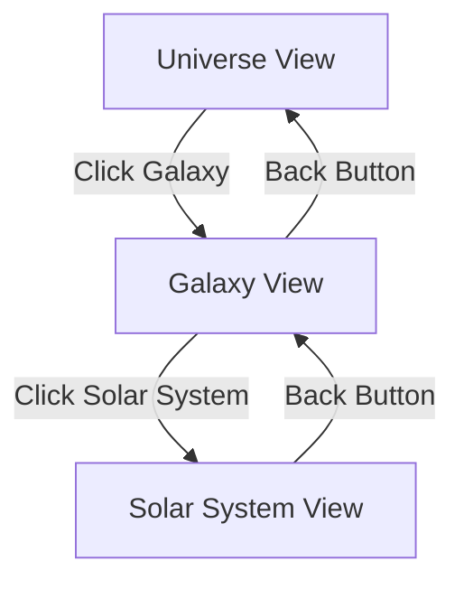

# Visual Scene Controls and Animation Tuning

This document describes the 3D scene controls, camera animations, and performance optimizations in The Horizon application.

## Scene Architecture

The application uses a multi-layer traversal system with three focus levels:



### Focus Levels

1. **Universe View**: Shows all galaxies as shader-based particle clouds arranged in a grid
2. **Galaxy View**: Shows a single galaxy's solar systems and free-floating stars with orbital mechanics
3. **Solar System View**: (Future) Detailed view of planets and moons

## Camera System

### Camera Animations

Camera transitions use spline-based paths with easing functions for smooth, cinematic movement:

- **Duration**: 1.5 seconds (1500ms) by default
- **Easing**: Cubic ease-in-out for natural acceleration/deceleration
- **Path**: Catmull-Rom spline with elevated midpoint for dramatic arc

#### Animation Configuration

Located in `src/lib/camera.ts`:

```typescript
export const DEFAULT_ANIMATION_CONFIG: AnimationConfig = {
  duration: 1500, // milliseconds
  easing: easeInOutCubic,
};
```

To adjust animation speed, modify the `duration` value. Lower values create faster transitions; higher values create slower, more dramatic movements.

#### Available Easing Functions

- `easeInOutCubic`: Smooth acceleration and deceleration (default)
- `easeInOutQuint`: Even smoother with more gradual transitions
- `lerp`: Linear interpolation (no easing)

### Camera Constraints

To prevent disorientation and maintain scene boundaries:

- **Minimum Distance**: 5 units from focus point
- **Maximum Distance**: 200 units from origin
- **Polar Angle**: Limited to 90° (prevents going below the "floor")
- **Controls**: Disabled during transitions to prevent conflicts

### Default Camera Positions

```typescript
universe: {
  position: new THREE.Vector3(0, 50, 100),
  lookAt: new THREE.Vector3(0, 0, 0),
}

galaxy: {
  position: new THREE.Vector3(0, 20, 40),
  lookAt: new THREE.Vector3(0, 0, 0),
}

solarSystem: {
  position: new THREE.Vector3(0, 10, 25),
  lookAt: new THREE.Vector3(0, 0, 0),
}
```

## Scene Controls

### Universe View Controls

- **Mouse Drag**: Orbit around the scene
- **Mouse Wheel**: Zoom in/out
- **Click Galaxy**: Focus and transition to galaxy detail view
- **Damping**: Smooth camera movement with dampingFactor of 0.05

### Navigation Controls

- **Back Button**: Returns to previous focus level with reversed animation
- **Breadcrumb**: Shows current navigation path
- **Transition Queue**: Prevents glitches by queuing rapid clicks

## Performance Optimizations

### Instancing

Solar system planets use instanced rendering for performance:

- Single draw call for multiple planets
- Efficient memory usage
- Scalable to hundreds of objects

### Particle Systems

Galaxy particle clouds use custom shaders:

- GPU-accelerated rendering
- 2,000+ particles per galaxy
- Additive blending for glow effect
- Depth write disabled for correct transparency

#### Particle Shader Features

**Vertex Shader**:
- Size attenuation based on distance
- Custom color per particle
- Efficient attribute passing

**Fragment Shader**:
- Circular particle shape with soft edges
- Alpha gradient for smooth falloff
- Discard for non-circular fragments

### Level of Detail (LOD)

Future enhancement: dynamically adjust particle count based on:
- Distance from camera
- Number of galaxies in view
- Frame rate performance

### Batching

Galaxy positions are pre-calculated and memoized:
- Prevents recalculation on every render
- Grid layout for predictable spacing
- Map-based lookup for O(1) access

## Animation Tuning Guide

### Adjusting Transition Speed

Edit `src/lib/camera.ts`:

```typescript
// Faster transitions (1 second)
duration: 1000

// Slower, more cinematic (2.5 seconds)
duration: 2500
```

### Changing Easing Curve

Edit the easing function in `DEFAULT_ANIMATION_CONFIG`:

```typescript
// Gentler easing
easing: easeInOutQuint

// Linear (no easing)
easing: (t) => t
```

### Modifying Camera Paths

To adjust the camera arc height, edit `createCameraPath` in `src/lib/camera.ts`:

```typescript
// Higher arc (more dramatic)
createCameraPath(start, end, 15)

// Lower arc (more direct)
createCameraPath(start, end, 5)
```

### Galaxy Rotation Speed

Edit the rotation multiplier in `UniverseScene.tsx`:

```typescript
// Slower rotation
meshRef.current.rotation.y = state.clock.getElapsedTime() * 0.02;

// Faster rotation
meshRef.current.rotation.y = state.clock.getElapsedTime() * 0.1;
```

## Orbital Mechanics

### Keplerian Orbits

Planets follow simplified Keplerian orbital mechanics:

- **Semi-major axis**: Increases with planet index (2 + index * 1.5)
- **Eccentricity**: Random 0-0.1 for slight elliptical orbits
- **Inclination**: Random ±0.2 radians for 3D variation
- **Orbit speed**: Approximates Kepler's third law (v ∝ 1/a²)

### Customizing Orbits

Edit `PlanetInstance` in `GalaxyView.tsx`:

```typescript
// Wider orbital spacing
const semiMajorAxis = 3 + index * 2.0;

// More circular orbits
const eccentricity = Math.random() * 0.05;

// Flatter orbital plane
const inclination = (Math.random() - 0.5) * 0.1;
```

## Shader Customization

### Galaxy Particle Colors

Edit the color variation in `UniverseScene.tsx`:

```typescript
// More color variation
mixedColor.lerp(new THREE.Color('#FFFFFF'), Math.random() * 0.5);

// Darker particles
mixedColor.lerp(new THREE.Color('#000000'), Math.random() * 0.2);
```

### Particle Size Distribution

```typescript
// Larger particles
sizes[i] = Math.random() * 4 + 2;

// More uniform size
sizes[i] = 2.5;
```

## Performance Considerations

### Frame Rate Targets

- **Desktop**: 60 FPS with 10+ galaxies
- **Mobile**: 30 FPS with 5+ galaxies
- **Low-end**: Graceful degradation with reduced particle counts

### Memory Management

- Geometries and materials are reused where possible
- Particle buffers are created once and updated in place
- Scene graph is kept shallow to minimize traversal cost

### Optimization Checklist

- [ ] Use instancing for repeated objects
- [ ] Disable depth write for transparent objects
- [ ] Use shader materials for effects
- [ ] Limit point light count
- [ ] Pre-calculate positions when possible
- [ ] Use object pooling for temporary objects
- [ ] Throttle expensive operations (raycasting, etc.)

## Troubleshooting

### Low Frame Rate

1. Reduce particle count per galaxy
2. Disable orbit damping
3. Reduce planet count or orbital complexity
4. Use simpler shaders

### Camera Jitter

1. Increase damping factor
2. Disable controls during transitions
3. Use smoother easing functions

### Transition Glitches

1. Check transition queue logic
2. Ensure `isTransitioning` flag is properly set
3. Verify camera animator completion callbacks

### Visual Artifacts

1. Adjust particle shader alpha blending
2. Check depth buffer settings
3. Verify material transparency flags
4. Ensure proper render order

## Future Enhancements

1. **Dynamic LOD**: Adjust quality based on performance metrics
2. **Fog Effects**: Distance-based atmospheric fog
3. **Bloom**: Post-processing for star glow
4. **Motion Trails**: Particle trails during camera movement
5. **Ambient Occlusion**: Enhanced depth perception
6. **VR Support**: Immersive exploration mode

## References

- [React Three Fiber Documentation](https://docs.pmnd.rs/react-three-fiber)
- [Three.js Fundamentals](https://threejs.org/manual/)
- [Keplerian Orbital Elements](https://en.wikipedia.org/wiki/Orbital_elements)
- [Easing Functions](https://easings.net/)
