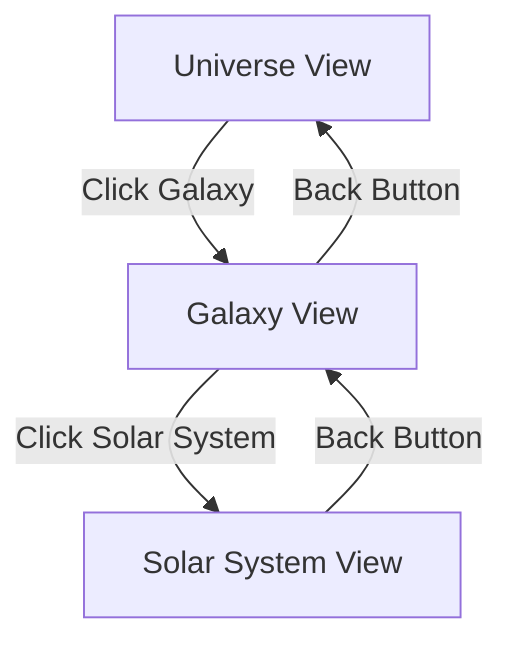

# Visual Scene Controls and Animation Tuning

This document describes the 3D scene controls, camera animations, and performance optimizations in The Horizon application.

## Planet Surface Layout

### Overview

Planet detail pages use a two-column layout that prioritizes textual content while maintaining an engaging 3D visualization. This design ensures markdown content receives appropriate prominence for storytelling while the planet rendering complements the narrative.

### Layout Structure

The planet surface view consists of two main areas:

```
┌─────────────────────────────────────────┐
│  ┌──────────┐  ┌─────────────────────┐ │
│  │          │  │                     │ │
│  │  Planet  │  │   Content Area      │ │
│  │   3D     │  │   - Title           │ │
│  │  Visual  │  │   - Subtitle        │ │
│  │          │  │   - Markdown Body   │ │
│  │          │  │   - Moon Navigation │ │
│  └──────────┘  └─────────────────────┘ │
└─────────────────────────────────────────┘
   30% width        70% width
```

#### Left Column - Planet Visualization
- **Width**: 30% of viewport (max 400px)
- **Content**: 3D planet rendering with moons in skybox
- **Planet Size**: Reduced to radius 1.5 units for proportional display
- **Position**: Left-aligned at (-3, 0, 0) in 3D space
- **Label**: Planet name displayed below visualization

#### Right Column - Content Area
- **Width**: 70% of viewport (max 800px)
- **Content**: 
  - Header with planet/moon name and subtitle
  - Scrollable markdown body
  - Moon navigation buttons (when viewing planet)
  - Back button (when viewing moon)
- **Max-width**: 800px to prevent excessive line length
- **Line length**: Optimal for readability (60-80 characters per line)

### Responsive Behavior

The layout adapts to different screen sizes:

#### Desktop (> 1024px)
- Two-column layout with 30/70 width split
- Planet visual: 30% width, max 400px
- Content: 70% width, max 800px
- Gap: 2rem between columns
- Padding: 2rem around container

#### Tablet (≤ 1024px)
- Two-column layout with 35/65 width split
- Slightly larger planet visual for better visibility
- Content max-width: 600px
- Gap: 1.5rem
- Padding: 1.5rem

#### Mobile (≤ 768px)
- **Single column layout** (stacked vertically)
- Planet visual on top (min-height: 200px)
- Content below (full width)
- Gap: 1rem
- Padding: 1rem
- Scrollable container for long content

#### Small Mobile (≤ 480px)
- Reduced padding: 0.75rem
- Content padding: 1rem
- Smaller title font: 1.35rem
- Enhanced touch targets: 52px minimum

### Accessibility Features

#### Touch Targets
All interactive elements meet WCAG 2.1 Level AA requirements:
- **Desktop**: 44px minimum height
- **Tablet**: 48px minimum height
- **Mobile**: 52px minimum height

#### Color Contrast
The layout supports both dark and light color schemes:

**Dark Mode (default)**:
- Content background: rgba(0, 0, 0, 0.85) with white text
- Contrast ratio: 21:1 (exceeds WCAG AAA)
- Blue accent: #4A90E2

**Light Mode** (via `prefers-color-scheme: light`):
- Content background: rgba(255, 255, 255, 0.95) with black text
- Contrast ratio: 21:1 (exceeds WCAG AAA)
- Blue accent: #2C5AA0 (darker for better contrast)

#### Keyboard Navigation
- All buttons are keyboard accessible
- Clear focus indicators (2px solid #4A90E2)
- Logical tab order: title → content → buttons

#### Reduced Motion
Respects `prefers-reduced-motion` setting:
- Animations set to 0.01ms duration
- Static positioning (no floating effects)
- Maintains full functionality

### Edge Cases

#### Planets Without Markdown
When a planet has no `contentMarkdown`:
- Fallback message: "# [Planet Name]\n\nNo content available."
- Layout remains consistent
- No large empty areas
- Moon navigation still available

#### Extremely Long Headings
Long headings wrap naturally:
- `word-wrap: break-word`
- `overflow-wrap: break-word`
- No horizontal overflow

#### Long Lists or Content
Scrollable content area prevents layout breaking:
- Content body scrolls independently
- Fixed header and navigation
- Smooth scrolling behavior
- Custom scrollbar styling

#### No Moons
When a planet has no moons:
- Moon navigation section hidden
- Content area remains properly sized
- No empty space where moons would be

### Customization

#### Adjusting Column Widths

Edit `src/styles/planet.css`:

```css
/* Wider planet visual */
.planet-visual-column {
  flex: 0 0 35%;  /* Instead of 30% */
  max-width: 450px;  /* Instead of 400px */
}

/* Narrower content */
.planet-content-column {
  max-width: 700px;  /* Instead of 800px */
}
```

#### Changing Planet Position

Edit `src/components/UniverseScene.tsx`:

```typescript
// Further left
position={new THREE.Vector3(-4, 0, 0)}

// More centered
position={new THREE.Vector3(-2, 0, 0)}

// Right side
position={new THREE.Vector3(3, 0, 0)}
```

#### Modifying Planet Size

Edit `src/components/PlanetSurface.tsx`:

```typescript
// Larger planet
<sphereGeometry args={[2, 32, 32]} />  // Instead of 1.5

// Smaller planet
<sphereGeometry args={[1, 32, 32]} />
```

#### Adjusting Content Width

Edit `src/styles/planet.css`:

```css
/* Wider content for more generous reading */
.planet-content-column {
  max-width: 900px;  /* Instead of 800px */
}

/* Narrower for tighter focus */
.planet-content-column {
  max-width: 650px;
}
```

### Performance Considerations

The planet surface layout is optimized for performance:

#### Minimal Re-renders
- Content only updates when planet/moon changes
- 3D scene uses memoized components
- CSS transitions use GPU acceleration

#### Efficient Scrolling
- Content body uses native scrolling
- Smooth scrolling via CSS
- No JavaScript scroll handlers

#### Mobile Optimization
- Single column reduces complexity
- Smaller planet radius (fewer polygons)
- Conditional rendering based on viewport

### Testing Guidelines

When testing planet page layout:

1. **Desktop**: Verify two-column layout with proper spacing
2. **Tablet**: Check 35/65 split and touch targets
3. **Mobile**: Confirm single column stacking
4. **Long content**: Test scrolling in content body
5. **No markdown**: Verify fallback message displays
6. **Dark/light mode**: Check contrast in both schemes
7. **Keyboard**: Tab through all interactive elements
8. **Screen reader**: Verify logical reading order

### Content Authoring Guidelines

When creating planet content:

#### Optimal Content Length
- **Minimum**: 200-300 words for meaningful content
- **Optimal**: 500-800 words for engaging narratives
- **Maximum**: No strict limit, content scrolls

#### Formatting Best Practices
- Use headings (##, ###) to break up sections
- Keep paragraphs to 3-4 sentences
- Use lists for key features or facts
- Include images with descriptive alt text
- Avoid extremely wide tables (800px max)

#### Line Length Considerations
The 800px max-width ensures optimal line length:
- At 16px font: ~80-90 characters per line
- Meets readability guidelines (45-75 characters)
- Comfortable reading without head movement

## Galaxy Scale Configuration

### Overview

The Horizon implements automatic galaxy scaling that adapts to the total number of galaxies in the universe. This ensures sparse universes feel immersive with large, detailed galaxies, while crowded universes remain readable with appropriately sized representations.

### Dynamic Scaling Behavior

The galaxy rendering system automatically adjusts galaxy sizes based on total count:

- **Sparse (1-2 galaxies)**: Galaxies render at maximum size (radius 15 units) to fill the canvas and provide an immersive experience
- **Moderate (3-25 galaxies)**: Sizes interpolate smoothly using logarithmic scaling to prevent jarring transitions
- **Crowded (50+ galaxies)**: Galaxies render at minimum size (radius 4 units) to maintain clickability and prevent visual clutter

### Galaxy Scale Constants

Located in `GALAXY_SCALE` in `src/lib/universe/scale-constants.ts`:

```typescript
GALAXY_SCALE = {
  MIN_RADIUS: 4,              // Minimum galaxy radius (50+ galaxies)
  MAX_RADIUS: 15,             // Maximum galaxy radius (1-2 galaxies)
  BASE_RADIUS: 8,             // Reference size for default case
  MIN_SIZE_THRESHOLD: 50,     // Count at which MIN_RADIUS applies
  MAX_SIZE_THRESHOLD: 2,      // Count at which MAX_RADIUS applies
  SMOOTHING_FACTOR: 0.8,      // Controls transition smoothness (0-1)
  RADIUS_RATIO: 0.2,          // minRadius = maxRadius * RADIUS_RATIO (20%)
}
```

**Why These Values:**

- `MIN_RADIUS` of 4 units ensures galaxies remain clickable even in very crowded universes (approximately 200-250px diameter at default zoom, exceeding WCAG touch target requirements)
- `MAX_RADIUS` of 15 units provides impressive visual presence for sparse universes without overwhelming the canvas
- `BASE_RADIUS` of 8 units serves as a sensible middle ground for reference
- `SMOOTHING_FACTOR` of 0.8 reduces sudden size changes when galaxies are added or removed (lower values = smoother transitions)
- `RADIUS_RATIO` of 0.2 maintains proper particle distribution in spiral galaxies (minRadius is always 20% of maxRadius)
- Thresholds at 2 and 50 galaxies define clear boundaries for maximum and minimum sizes

### Galaxy Size Calculation

The `calculateGalaxyScale()` function computes galaxy radius based on total count:

```typescript
function calculateGalaxyScale(galaxyCount: number): { 
  minRadius: number; 
  maxRadius: number;
}
```

**Algorithm:**

1. **Edge cases**: Zero galaxies return base size; counts ≤2 return maximum size
2. **Logarithmic interpolation**: Uses natural logarithm to smooth transitions
3. **Smoothing application**: Applies power function to reduce jarring changes
4. **Ratio maintenance**: minRadius is always `RADIUS_RATIO` (20%) of maxRadius for proper particle distribution

**Examples:**

```typescript
calculateGalaxyScale(1)   // { minRadius: 3.0, maxRadius: 15.0 }
calculateGalaxyScale(5)   // { minRadius: 2.2, maxRadius: 11.0 }
calculateGalaxyScale(10)  // { minRadius: 1.7, maxRadius: 8.7 }
calculateGalaxyScale(50)  // { minRadius: 0.8, maxRadius: 4.0 }
calculateGalaxyScale(100) // { minRadius: 0.8, maxRadius: 4.0 }
```

### Manual Size Overrides

Featured galaxies can have fixed sizes independent of the global count-based scaling:

```typescript
// In Galaxy type definition
interface Galaxy {
  // ...other fields
  manualRadius?: number;  // Optional fixed radius override
}
```

**Usage:**

```typescript
const galaxy = {
  id: 'featured-galaxy',
  name: 'Andromeda',
  manualRadius: 12,  // Always renders at radius 12, regardless of count
  // ...other fields
};
```

The `calculateGalaxyScaleWithOverride()` function handles this:

```typescript
calculateGalaxyScaleWithOverride(galaxyCount: 50, manualRadius: 12)
// Returns: { minRadius: 2.4, maxRadius: 12 }
// Ignores galaxyCount when manualRadius is set
```

**When to use manual overrides:**

- Featured or "hero" galaxies that should always be prominent
- Tutorial galaxies that need consistent sizing across play sessions
- Galaxies with special significance in the narrative
- Testing and debugging scenarios

### Smoothing and Transitions

The scaling system prevents jarring visual changes through several mechanisms:

#### Logarithmic Scaling

Instead of linear interpolation, the system uses natural logarithm:

```typescript
const logCount = Math.log(galaxyCount);
const t = (logCount - logMin) / (logMax - logMin);
```

This means:
- Adding galaxy #6 to a 5-galaxy universe: ~10% size change
- Adding galaxy #51 to a 50-galaxy universe: ~1% size change

#### Power Smoothing

The interpolation factor is raised to the smoothing power:

```typescript
const smoothT = Math.pow(t, SMOOTHING_FACTOR);
```

With `SMOOTHING_FACTOR = 0.8`:
- Changes are more gradual across the middle range
- Size transitions feel natural and predictable
- Avoids sudden "jumps" when galaxies are added/removed

#### Testing Transitions

To verify smooth scaling, test consecutive counts:

```bash
# Run in browser console
for (let i = 1; i <= 20; i++) {
  const scale = calculateGalaxyScale(i);
  console.log(`${i} galaxies: ${scale.maxRadius.toFixed(2)} units`);
}
```

Expected output shows gradual decrease:
```
1 galaxies: 15.00 units
2 galaxies: 15.00 units
3 galaxies: 12.90 units
4 galaxies: 11.78 units
5 galaxies: 10.97 units
6 galaxies: 10.35 units
...
```

### Performance Considerations

The dynamic scaling system is designed for performance:

#### Calculation Efficiency

- **Memoization**: Galaxy scale is calculated once per render when count changes
- **O(1) complexity**: Logarithm and power operations are constant time
- **No re-renders**: Scale changes don't trigger particle regeneration (handled in useMemo)

```typescript
// In GalaxyParticles component
const galaxyScale = useMemo(() => {
  return calculateGalaxyScaleWithOverride(galaxyCount, galaxy.manualRadius);
}, [galaxyCount, galaxy.manualRadius]);
```

#### Frame Rate Targets

With dynamic scaling, the system maintains:

- **Desktop**: 60 FPS with 20+ galaxies
- **Mobile**: 30+ FPS with 10+ galaxies
- **Low-end**: 30 FPS minimum with adaptive particle counts

#### Memory Usage

Galaxy scaling doesn't increase memory footprint:
- Particle buffers are pre-allocated based on solar system count
- Position calculations use the same Float32Array regardless of scale
- No additional textures or geometries are created

### Customization Guide

#### Adjusting Size Range

To make galaxies generally larger or smaller:

```typescript
// Larger galaxies across all counts
GALAXY_SCALE = {
  MIN_RADIUS: 6,    // Instead of 4
  MAX_RADIUS: 20,   // Instead of 15
  // ...
}
```

#### Changing Transition Speed

To make size changes more or less gradual:

```typescript
// Smoother transitions (slower change)
SMOOTHING_FACTOR: 0.9,  // Instead of 0.8

// Sharper transitions (faster response)
SMOOTHING_FACTOR: 0.6,
```

#### Adjusting Thresholds

To change when min/max sizes apply:

```typescript
// Maximum size for up to 5 galaxies
MAX_SIZE_THRESHOLD: 5,  // Instead of 2

// Minimum size kicks in earlier
MIN_SIZE_THRESHOLD: 30,  // Instead of 50
```

#### Customizing Particle Distribution

Galaxy particles are distributed in a spiral pattern with dynamic radius:

```typescript
// In UniverseScene.tsx, GalaxyParticles component
const radius = Math.random() * (galaxyScale.maxRadius - galaxyScale.minRadius) 
             + galaxyScale.minRadius;
```

To create denser centers:

```typescript
// Use power function to concentrate particles toward center
const t = Math.random();
const radius = Math.pow(t, 1.5) * (maxRadius - minRadius) + minRadius;
```

To create sparser centers:

```typescript
// Use inverse power function
const t = Math.random();
const radius = Math.pow(t, 0.5) * (maxRadius - minRadius) + minRadius;
```

### Edge Cases

#### Single Galaxy Universe

- Uses maximum size (15 units) for dramatic presence
- Centered on canvas with ample whitespace
- Rotation and particle effects fully visible

#### Zero Galaxies

- Returns base size for fallback rendering
- Prevents errors if data loading fails
- Maintains UI layout stability

#### Very Large Catalogs (100+)

- Applies minimum size floor (4 units)
- Galaxies remain clickable (200-250px diameter)
- Grid layout spacing adjusts to prevent overlap
- Performance remains stable with efficient rendering

#### Mixed Manual Overrides

- Featured galaxies can be larger than automatic scale
- Other galaxies use count-based scaling normally
- No visual conflicts or z-fighting
- Manual overrides don't affect other galaxies' sizes

### Integration with Grid Layout

Galaxy positions are calculated independently of scale:

```typescript
// In SceneContent, UniverseScene.tsx
const spacing = 30;  // Fixed spacing in Three.js units
const cols = Math.ceil(Math.sqrt(galaxies.length));

galaxies.forEach((galaxy, index) => {
  const col = index % cols;
  const row = Math.floor(index / cols);
  positions.set(
    galaxy.id,
    new THREE.Vector3(
      (col - (cols - 1) / 2) * spacing,
      0,
      (row - Math.floor(galaxies.length / cols) / 2) * spacing
    )
  );
});
```

The 30-unit spacing ensures:
- Galaxies don't overlap even at maximum size (15 units)
- Adequate whitespace for visual clarity
- Click targets remain distinct
- Tooltips have room to display

To adjust spacing for different size ranges:

```typescript
// Dynamic spacing based on maximum possible galaxy size
const maxPossibleRadius = calculateGalaxyScale(galaxies.length).maxRadius;
const spacing = Math.max(30, maxPossibleRadius * 2.5);
```

### Testing Galaxy Scaling

#### Unit Tests

Comprehensive tests cover all scenarios:

```bash
npm test -- scale-constants.test.ts
```

Key test cases:
- Single galaxy returns maximum size
- 50+ galaxies return minimum size
- Smooth interpolation between thresholds
- Manual overrides work correctly
- Logarithmic scaling prevents jarring transitions
- Performance remains fast (< 0.01ms per calculation)

#### Visual Testing

To manually verify galaxy scaling:

1. **Test with 1 galaxy**: Should fill canvas nicely
2. **Add galaxies incrementally**: Watch sizes decrease smoothly
3. **Test with 50+ galaxies**: All should be small but clickable
4. **Test manual override**: Featured galaxy stays large
5. **Performance**: Monitor FPS in dev tools (target: 60 FPS desktop)

#### Browser Console Testing

```javascript
// Test scale calculation
const { calculateGalaxyScale } = require('./src/lib/universe/scale-constants');

console.table([
  { count: 1, ...calculateGalaxyScale(1) },
  { count: 5, ...calculateGalaxyScale(5) },
  { count: 10, ...calculateGalaxyScale(10) },
  { count: 50, ...calculateGalaxyScale(50) },
]);
```

### Documentation Updates

When modifying galaxy scaling:

1. **Update constants**: Document any changes to `GALAXY_SCALE` values
2. **Update tests**: Ensure test expectations match new behavior
3. **Update this doc**: Keep examples and screenshots current
4. **Update schema docs**: If adding new Galaxy properties

## Solar System Scale Configuration

### Overview

The solar system rendering uses carefully calibrated scale constants to ensure planets are easily clickable and meet accessibility guidelines while maintaining visual appeal. All constants are defined in `src/lib/universe/scale-constants.ts`.

### Planet Size Constants

Located in `PLANET_SCALE`:

```typescript
PLANET_SCALE = {
  MIN_SIZE: 0.8,           // Minimum radius (ensures ~44-50px tap target)
  MAX_SIZE: 1.8,           // Maximum radius (prevents visual dominance)
  BASE_SIZE: 1.0,          // Reserved for future use (not currently used)
  MOON_MULTIPLIER: 0.1,    // Size increase per moon
  MOON_SIZE_RATIO: 0.4,    // Moon size as ratio of minimum planet size
}
```

**Why These Values:**
- `MIN_SIZE` of 0.8 Three.js units translates to approximately 44-50 CSS pixels at default zoom, meeting WCAG 2.1 Level AA touch target requirements (44×44px minimum)
  - Note: This conversion assumes default Three.js camera settings and viewport size. Changes to camera FOV, position, or viewport dimensions may affect actual CSS pixel size.
- `MAX_SIZE` prevents large planets from obscuring other UI elements or smaller planets
- `BASE_SIZE` is reserved for potential future use (currently not used in calculations)
- `MOON_MULTIPLIER` creates visual variety: planets with more moons appear slightly larger
- `MOON_SIZE_RATIO` of 0.4 means moons are 40% the size of the minimum planet, maintaining visual hierarchy

**Planet Size Calculation:**

The `calculatePlanetSize()` function computes planet radius based on moon count:
```typescript
function calculatePlanetSize(moonCount: number): number {
  const sizeWithMoons = MIN_SIZE + (moonCount * MOON_MULTIPLIER);
  return Math.min(MAX_SIZE, sizeWithMoons);
}
```

Examples:
- 0 moons: 0.8 units (minimum size)
- 3 moons: 1.1 units (0.8 + 0.3)
- 10 moons: 1.8 units (capped at maximum)

**Moon Size Calculation:**

The `calculateMoonSize()` function provides consistent moon sizing:
```typescript
function calculateMoonSize(): number {
  return MIN_SIZE * MOON_SIZE_RATIO;  // 0.32 units
}
```

**Customizing Planet Sizes:**

To make all planets larger:
```typescript
MIN_SIZE: 1.0,  // Instead of 0.8
MAX_SIZE: 2.2,  // Instead of 1.8
```

To reduce size variance between planets:
```typescript
MOON_MULTIPLIER: 0.05,  // Instead of 0.1
```

To adjust moon-to-planet size ratio:
```typescript
MOON_SIZE_RATIO: 0.5,  // Instead of 0.4 (larger moons)
```

### Orbital Spacing Constants

Located in `ORBITAL_SPACING`:

```typescript
ORBITAL_SPACING = {
  BASE_RADIUS: 4.0,                    // First planet's orbital radius
  RADIUS_INCREMENT: 3.0,               // Spacing between orbits
  MIN_SEPARATION: 2.0,                 // Minimum safe distance
  MAX_ECCENTRICITY: 0.05,              // Orbit ellipticity (0 = circle)
  MAX_INCLINATION: 0.15,               // Orbital tilt in radians
  ADAPTIVE_SPACING_THRESHOLD: 8,       // Planet count for adaptive spacing
}
```

**Why These Values:**
- `BASE_RADIUS` of 4.0 provides clear separation from the central star (radius 1.2)
- `RADIUS_INCREMENT` of 3.0 ensures planets don't overlap even with maximum sizes
- `MAX_ECCENTRICITY` of 0.05 keeps orbits nearly circular for predictable spacing (was 0.1 for more elliptical orbits)
- `MAX_INCLINATION` of 0.15 radians (~8.6 degrees) adds 3D depth without causing z-fighting
- `ADAPTIVE_SPACING_THRESHOLD` of 8 planets triggers proportional spacing increase for larger systems

**Adaptive Spacing for Many Planets:**

The `calculateSafeSpacing()` function automatically increases spacing when you have more than the threshold:
```typescript
function calculateSafeSpacing(planetCount: number): number {
  const densityFactor = Math.max(1.0, planetCount / ADAPTIVE_SPACING_THRESHOLD);
  return RADIUS_INCREMENT * densityFactor;
}
```

For example (with threshold = 8):
- 4 planets: uses standard 3.0 spacing
- 8 planets: uses 3.0 spacing (threshold)
- 12 planets: uses 4.5 spacing (1.5× standard)
- 16 planets: uses 6.0 spacing (2× standard)

**Customizing Orbital Spacing:**

For tighter orbits (more compact view):
```typescript
BASE_RADIUS: 3.0,       // Instead of 4.0
RADIUS_INCREMENT: 2.5,   // Instead of 3.0
```

To adjust when adaptive spacing kicks in:
```typescript
ADAPTIVE_SPACING_THRESHOLD: 10,  // Instead of 8
```

For more elliptical orbits (more dramatic):
```typescript
MAX_ECCENTRICITY: 0.1,   // Instead of 0.05
```

For flatter orbital plane:
```typescript
MAX_INCLINATION: 0.05,   // Instead of 0.15 (~3 degrees)
```

### Star Configuration

Located in `STAR_SCALE`:

```typescript
STAR_SCALE = {
  RADIUS: 1.2,           // Central star size
  LIGHT_INTENSITY: 2.5,  // Brightness of star light
  LIGHT_DISTANCE: 30,    // How far light reaches
}
```

**Customizing Star Appearance:**

For a larger, brighter star:
```typescript
RADIUS: 1.5,
LIGHT_INTENSITY: 3.0,
```

For a smaller, dimmer star:
```typescript
RADIUS: 0.8,
LIGHT_INTENSITY: 1.5,
```

### Accessibility Features

#### Touch Target Compliance

All interactive elements meet or exceed WCAG 2.1 Level AA requirements:
- **3D Planets**: Minimum 0.8 Three.js units ≈ 44-50px at default zoom
- **UI Buttons**: Minimum 44px height (CSS), with increased sizes on mobile:
  - Tablets (≤768px): 48px minimum
  - Mobile (≤480px): 52px minimum

#### Responsive Behavior

The scale system adapts to different screen sizes:
- Desktop: Full detail with all planets visible
- Tablet: Slightly larger touch targets for easier interaction
- Mobile: Maximum touch target sizes for finger-friendly navigation
- High zoom: Planets scale proportionally, maintaining tap target size

#### Reduced Motion Support

Users with `prefers-reduced-motion` enabled experience:
- Instant transitions (0.01ms) instead of animated movements
- Static planet positions maintain all interactive functionality
- No impact on layout or spacing calculations

### Edge Case Handling

#### Many Planets (8+)

The system automatically adjusts spacing to prevent crowding:
```typescript
// For a solar system with 12 planets:
const spacing = calculateSafeSpacing(12);
// Returns: 3.75 (1.5× standard spacing)
```

#### Small Screens

CSS media queries ensure usability:
```css
@media (max-width: 768px) {
  .moon-nav-button {
    min-height: 48px;  /* Larger than desktop */
  }
}
```

#### High Planet Counts (10+)

Even with many planets, the orbital spacing algorithm ensures:
- No visual overlap between adjacent planets
- Z-fighting prevention through proper inclination limits
- Consistent frame rates through efficient rendering

#### Persisted Layout Data

If upgrading from a previous version:
- Old size values are ignored; new constants apply immediately
- No migration required - calculations are deterministic based on planet properties
- Cached Three.js objects automatically recreate with new sizes

### Testing Your Changes

After modifying constants, verify:

1. **Tap Target Size**: Use browser dev tools to measure planet click areas
   ```javascript
   // In browser console:
   const planetMesh = scene.children.find(/* your planet */);
   const boundingBox = new THREE.Box3().setFromObject(planetMesh);
   console.log('Planet size:', boundingBox.getSize(new THREE.Vector3()));
   ```

2. **Orbital Spacing**: Verify no overlaps with many planets
   ```bash
   # Create test solar system with 12+ planets
   # Visually inspect for overlaps at various zoom levels
   ```

3. **Performance**: Monitor frame rate with many planets
   ```javascript
   // Check FPS in dev tools performance panel
   // Target: 60 FPS desktop, 30 FPS mobile
   ```

4. **Accessibility**: Test with real devices
   - Touch interaction on tablets and phones
   - Keyboard navigation (focus indicators visible)
   - Screen reader compatibility (buttons properly labeled)

### Performance Considerations

Current scale values are optimized for:
- **Desktop**: 60 FPS with 10+ planets
- **Mobile**: 30+ FPS with 8+ planets
- **Low-end devices**: Graceful degradation (planets still clickable)

If you need to support more planets or lower-end devices:
- Reduce `LIGHT_DISTANCE` to lower light calculation overhead
- Consider implementing level-of-detail (LOD) for distant planets
- Use simpler sphere geometry (fewer segments) for distant objects

## Scene Architecture

The application uses a multi-layer traversal system with three focus levels:



### Focus Levels

1. **Universe View**: Shows all galaxies as shader-based particle clouds arranged in a grid
2. **Galaxy View**: Shows a single galaxy's solar systems and free-floating stars with orbital mechanics
3. **Solar System View**: (Future) Detailed view of planets and moons

## Transition Indicator

The transition indicator provides visual feedback during navigation between different focus levels. The indicator appears centered on the screen with themed messaging that reinforces the travel narrative.

### Behavior

- **Visibility**: Only renders during active transitions (when `isTransitioning` state is `true`)
- **Position**: Fixed center of viewport (50% top, 50% left with transform centering)
- **Duration**: Visible throughout the camera animation (default 1.5 seconds)
- **Auto-dismiss**: Automatically fades out when transition completes

### Themed Messages

The indicator displays contextual messages based on the destination:

- **Galaxy level**: "Warping to galaxy..."
- **Solar System level**: "Traveling to system..."
- **Planet level**: "Landing on surface..."
- **Default**: "Traveling..."

### Styling

The indicator uses a semi-transparent dark background with blue accent border:

```css
.transition-indicator {
  position: fixed;
  top: 50%;
  left: 50%;
  transform: translate(-50%, -50%);
  padding: 1.5rem 2.5rem;
  background-color: rgba(0, 0, 0, 0.85);
  border: 2px solid rgba(74, 144, 226, 0.6);
  border-radius: 12px;
  backdrop-filter: blur(8px);
  box-shadow: 0 8px 32px rgba(0, 0, 0, 0.4);
  z-index: 1000;
}
```

#### Customizing Appearance

To customize the indicator appearance, edit the inline styles in `src/components/SceneHUD.tsx`:

**Change colors:**
```typescript
backgroundColor: 'rgba(0, 0, 0, 0.9)',  // Darker background
border: '2px solid rgba(255, 100, 100, 0.6)',  // Red border
```

**Adjust size:**
```typescript
padding: '2rem 3rem',  // Larger padding
fontSize: '1.5rem',    // Larger text
```

**Modify position:**
```typescript
top: '40%',  // Position higher on screen
```

### Animation

The indicator includes two animations:

1. **Fade In**: Smooth entrance with scale effect (0.2s)
2. **Spinner**: Rotating loading indicator (1s loop)

```css
@keyframes fadeIn {
  from {
    opacity: 0;
    transform: translate(-50%, -50%) scale(0.9);
  }
  to {
    opacity: 1;
    transform: translate(-50%, -50%) scale(1);
  }
}

@keyframes spin {
  from { transform: rotate(0deg); }
  to { transform: rotate(360deg); }
}
```

### Accessibility

The transition indicator includes comprehensive accessibility features:

#### Screen Reader Support

```html
<div
  className="transition-indicator"
  role="status"
  aria-live="polite"
  aria-atomic="true"
>
```

- **`role="status"`**: Indicates this is a status message
- **`aria-live="polite"`**: Screen readers announce changes when user is idle
- **`aria-atomic="true"`**: Full message is read (not just changes)

#### Reduced Motion Support

Users with `prefers-reduced-motion` enabled experience:

- **No entrance animation** (instant appearance)
- **Static spinner** (no rotation animation)
- **Uniform border** for static visual indicator

```css
@media (prefers-reduced-motion: reduce) {
  .transition-indicator {
    animation: none;
  }
  
  .transition-indicator-spinner {
    animation: none;
    border-color: rgba(74, 144, 226, 0.6);
  }
}
```

#### Keyboard Navigation

The indicator is non-interactive (`pointer-events: none`) and does not trap keyboard focus, ensuring navigation controls remain accessible during transitions.

### Edge Cases

The indicator handles various edge cases gracefully:

#### Rapid Consecutive Transitions

When users click multiple destinations rapidly, the navigation store queues transitions. The indicator:
- Remains visible throughout the queue
- Updates message for each queued transition
- Never flickers or shows overlapping indicators

#### Server-Side Rendering

On initial server render, `isTransitioning` is `false` by default, so the indicator is not rendered. It only appears for client-side navigation transitions.

#### Route Errors

If a transition fails or is cancelled:
1. Camera animator completion callback still fires
2. `finishTransition()` sets `isTransitioning` to `false`
3. Indicator gracefully hides via conditional rendering

#### Performance

The indicator uses:
- **Fixed positioning** (no layout reflow)
- **CSS transforms** for smooth GPU-accelerated animations
- **Conditional rendering** (completely removed from DOM when not transitioning)

### Customization Examples

#### Change Message Logic

Edit `getTransitionMessage()` in `src/components/SceneHUD.tsx`:

```typescript
const getTransitionMessage = (focusLevel: FocusLevel): string => {
  if (focusLevel === 'galaxy') return '🚀 Jumping to lightspeed...';
  if (focusLevel === 'solar-system') return '🌟 Entering system...';
  if (focusLevel === 'planet') return '🛸 Approaching surface...';
  return '✨ Traveling...';
};
```

#### Add Custom Styling Classes

Create custom styles in `src/app/globals.css`:

```css
.transition-indicator.custom-theme {
  background: linear-gradient(135deg, #667eea 0%, #764ba2 100%);
  border: 2px solid #ffffff;
}
```

Then add the class in SceneHUD.tsx:
```typescript
className="transition-indicator custom-theme"
```

#### Disable Backdrop Blur

For better performance on low-end devices:
```typescript
backdropFilter: 'none',  // Remove blur effect
```

### Testing

To test the transition indicator:

1. **Visual appearance**: Click any galaxy/solar system/planet
2. **Accessibility**: Enable screen reader and verify announcements
3. **Reduced motion**: Enable in OS settings and verify static animation
4. **Edge cases**: Rapidly click multiple destinations to test queueing

### Future Enhancements

Potential improvements for the transition indicator:

1. **Progress bar**: Show completion percentage during long transitions
2. **Destination preview**: Display target name or thumbnail
3. **Sound effects**: Audio cue for immersive experience
4. **Custom transitions**: Different animations for forward vs backward navigation
5. **Loading states**: Integrate with data loading for async content

## Welcome Message

The welcome message provides context-aware branding when users enter galaxy view, replacing the previous bottom-right disclaimer that appeared globally.

### Purpose

- **Branding**: Establishes "The Horizon" identity at the appropriate narrative moment
- **Context**: Confirms which galaxy the user is exploring
- **Guidance**: Provides navigation hints for discovering solar systems

### Behavior

- **Visibility**: Only renders when `focusLevel === 'galaxy'`
- **Position**: Centered on viewport (non-blocking, pointer-events disabled)
- **Display Duration**: Remains visible throughout galaxy exploration
- **Transitions**: Hidden during camera transitions, reappears when settled

### Conditional Rendering

The welcome message displays only when:
```typescript
focusLevel === 'galaxy' && focusedGalaxy
```

This ensures:
- Universe view has no branding overlay (clean exploration)
- Solar system and planet views are unobstructed
- Message appears contextually when entering a galaxy

### Styling

```typescript
{
  position: 'absolute',
  top: '50%',
  left: '50%',
  transform: 'translate(-50%, -50%)',
  padding: '2rem',
  backgroundColor: 'rgba(0, 0, 0, 0.8)',
  border: '2px solid rgba(74, 144, 226, 0.5)',
  borderRadius: '12px',
  backdropFilter: 'blur(8px)',
  pointerEvents: 'none',  // Non-interactive
  zIndex: 50,  // Below transition indicator (z-index: 1000)
}
```

### Responsive Typography

Uses CSS `clamp()` for fluid text scaling:

```typescript
// Heading
fontSize: 'clamp(1.5rem, 4vw, 2.5rem)'  // 1.5rem → 2.5rem

// Body text
fontSize: 'clamp(0.9rem, 2vw, 1.1rem)'  // 0.9rem → 1.1rem

// Instructions
fontSize: 'clamp(0.8rem, 1.8vw, 1rem)'  // 0.8rem → 1rem
```

This ensures readability across:
- **Mobile** (320px+): Smaller text, still legible
- **Tablet** (768px+): Medium text
- **Desktop** (1024px+): Full-size text

### Accessibility

#### Screen Reader Support

```html
<div
  className="welcome-message"
  role="complementary"
  aria-label="Welcome message"
>
```

- **`role="complementary"`**: Identifies as supporting content
- **`aria-label`**: Provides context for screen readers
- **`pointerEvents: 'none'`**: Doesn't trap focus or block interaction

#### Keyboard Navigation

The message is purely informational:
- No interactive elements to tab to
- Doesn't interfere with scene navigation controls
- Back button remains accessible via keyboard

#### Reduced Motion Support

The welcome message has no animations, making it inherently compatible with `prefers-reduced-motion`. It appears and disappears instantly based on navigation state.

### Customization

#### Change Message Content

Edit `src/components/WelcomeMessage.tsx`:

```typescript
<h2>Welcome to {customBrandName}</h2>
<p>Exploring the wonders of {galaxyName}</p>
<p>Your journey through the cosmos begins here</p>
```

#### Adjust Positioning

```typescript
// Move to top-center
top: '20%',
left: '50%',

// Move to bottom-left
top: 'auto',
bottom: '2rem',
left: '2rem',
transform: 'none',
```

#### Change Colors

```typescript
// Warmer theme
backgroundColor: 'rgba(40, 20, 0, 0.8)',
border: '2px solid rgba(255, 165, 0, 0.5)',
color: '#FFA500',
```

#### Adjust Size

```typescript
// Larger message
maxWidth: '95%',
width: '700px',
padding: '3rem',
```

### Edge Cases

#### Long Galaxy Names

Long galaxy names wrap naturally:
```css
word-wrap: break-word;
overflow-wrap: break-word;
```

Galaxy name example:
- Short: "Andromeda"
- Long: "Messier 87 Supergiant Elliptical Galaxy" (wraps on mobile)

#### Small Screens (< 480px)

On very small devices:
- `maxWidth: '90%'` prevents overflow
- `clamp()` typography ensures minimum readability
- Padding adjusts for touch-friendly spacing

#### SSR Hydration

Initial server render:
- `focusLevel === 'universe'` (default state)
- Welcome message not rendered
- No hydration mismatch on client load

#### Rapid Navigation

If user clicks through galaxies quickly:
- Message updates with new galaxy name
- No flickering (re-renders are efficient)
- Transition indicator (z-index: 1000) appears above message (z-index: 50)

### Testing

To test the welcome message:

1. **Navigation**: Click a galaxy particle to see the message appear
2. **Content**: Verify galaxy name displays correctly
3. **Responsiveness**: Resize browser window to test text scaling
4. **Accessibility**: Use screen reader to verify `aria-label`
5. **Non-blocking**: Verify you can still use back button and scene controls

### Performance

The welcome message has minimal performance impact:
- **Conditional rendering**: Only renders when needed
- **No animations**: Static display (no RAF loop)
- **Simple DOM**: Single div with text nodes
- **No images**: Pure CSS styling

### Integration Points

The welcome message integrates with:

1. **Navigation Store** (`src/lib/store.ts`):
   - Reads `focusLevel` to determine visibility
   - Reads `focusedGalaxyId` to find galaxy data

2. **UniverseScene** (`src/components/UniverseScene.tsx`):
   - Conditionally renders `<WelcomeMessage />` component
   - Passes `galaxyName` prop from `focusedGalaxy.name`

3. **Scene Hierarchy**:
   ```
   <div> (scene container)
     <Canvas> (3D scene)
     <WelcomeMessage /> (if galaxy view)
     <PlanetSurfaceOverlay /> (if planet view)
   </div>
   ```

### Migration Notes

This replaces the previous bottom-right info overlay that appeared globally:

**Before** (global disclaimer in `src/app/page.tsx`):
```typescript
// Appeared on universe view only
<div style={{ position: 'absolute', bottom: '1rem', right: '1rem' }}>
  <h3>The Horizon</h3>
  <p>Click on galaxies to explore...</p>
</div>
```

**After** (contextual welcome in galaxy view):
```typescript
// Appears on galaxy view only
{focusLevel === 'galaxy' && focusedGalaxy && (
  <WelcomeMessage galaxyName={focusedGalaxy.name} />
)}
```

**Benefits of new approach**:
- Contextual: Appears when exploring a specific galaxy
- Non-intrusive: Centered, semi-transparent, doesn't cover controls
- Responsive: Better text scaling and mobile support
- Accessible: Proper ARIA attributes and semantic HTML

## Camera System

### Camera Animations

Camera transitions use spline-based paths with easing functions for smooth, cinematic movement:

- **Duration**: 1.5 seconds (1500ms) by default
- **Easing**: Cubic ease-in-out for natural acceleration/deceleration
- **Path**: Catmull-Rom spline with elevated midpoint for dramatic arc

#### Animation Configuration

Located in `src/lib/camera.ts`:

```typescript
export const DEFAULT_ANIMATION_CONFIG: AnimationConfig = {
  duration: 1500, // milliseconds
  easing: easeInOutCubic,
};
```

To adjust animation speed, modify the `duration` value. Lower values create faster transitions; higher values create slower, more dramatic movements.

#### Available Easing Functions

- `easeInOutCubic`: Smooth acceleration and deceleration (default)
- `easeInOutQuint`: Even smoother with more gradual transitions
- `lerp`: Linear interpolation (no easing)

### Camera Constraints

To prevent disorientation and maintain scene boundaries:

- **Minimum Distance**: 5 units from focus point
- **Maximum Distance**: 200 units from origin
- **Polar Angle**: Limited to 90° (prevents going below the "floor")
- **Controls**: Disabled during transitions to prevent conflicts

### Default Camera Positions

```typescript
universe: {
  position: new THREE.Vector3(0, 50, 100),
  lookAt: new THREE.Vector3(0, 0, 0),
}

galaxy: {
  position: new THREE.Vector3(0, 20, 40),
  lookAt: new THREE.Vector3(0, 0, 0),
}

solarSystem: {
  position: new THREE.Vector3(0, 10, 25),
  lookAt: new THREE.Vector3(0, 0, 0),
}
```

## Scene Controls

### Universe View Controls

- **Mouse Drag**: Orbit around the scene
- **Mouse Wheel**: Zoom in/out
- **Click Galaxy**: Focus and transition to galaxy detail view
- **Damping**: Smooth camera movement with dampingFactor of 0.05

### Navigation Controls

- **Back Button**: Returns to previous focus level with reversed animation
- **Breadcrumb**: Shows current navigation path
- **Transition Queue**: Prevents glitches by queuing rapid clicks

## Performance Optimizations

### Instancing

Solar system planets use instanced rendering for performance:

- Single draw call for multiple planets
- Efficient memory usage
- Scalable to hundreds of objects

### Particle Systems

Galaxy particle clouds use custom shaders:

- GPU-accelerated rendering
- 2,000+ particles per galaxy
- Additive blending for glow effect
- Depth write disabled for correct transparency

#### Particle Shader Features

**Vertex Shader**:
- Size attenuation based on distance
- Custom color per particle
- Efficient attribute passing

**Fragment Shader**:
- Circular particle shape with soft edges
- Alpha gradient for smooth falloff
- Discard for non-circular fragments

### Level of Detail (LOD)

Future enhancement: dynamically adjust particle count based on:
- Distance from camera
- Number of galaxies in view
- Frame rate performance

### Batching

Galaxy positions are pre-calculated and memoized:
- Prevents recalculation on every render
- Grid layout for predictable spacing
- Map-based lookup for O(1) access

## Animation Tuning Guide

### Adjusting Transition Speed

Edit `src/lib/camera.ts`:

```typescript
// Faster transitions (1 second)
duration: 1000

// Slower, more cinematic (2.5 seconds)
duration: 2500
```

### Changing Easing Curve

Edit the easing function in `DEFAULT_ANIMATION_CONFIG`:

```typescript
// Gentler easing
easing: easeInOutQuint

// Linear (no easing)
easing: (t) => t
```

### Modifying Camera Paths

To adjust the camera arc height, edit `createCameraPath` in `src/lib/camera.ts`:

```typescript
// Higher arc (more dramatic)
createCameraPath(start, end, 15)

// Lower arc (more direct)
createCameraPath(start, end, 5)
```

### Galaxy Rotation Speed

Edit the rotation multiplier in `UniverseScene.tsx`:

```typescript
// Slower rotation
meshRef.current.rotation.y = state.clock.getElapsedTime() * 0.02;

// Faster rotation
meshRef.current.rotation.y = state.clock.getElapsedTime() * 0.1;
```

## Orbital Mechanics

### Keplerian Orbits

Planets follow simplified Keplerian orbital mechanics:

- **Semi-major axis**: Increases with planet index (2 + index * 1.5)
- **Eccentricity**: Random 0-0.1 for slight elliptical orbits
- **Inclination**: Random ±0.2 radians for 3D variation
- **Orbit speed**: Approximates Kepler's third law (v ∝ 1/a²)

### Customizing Orbits

Edit `PlanetInstance` in `GalaxyView.tsx`:

```typescript
// Wider orbital spacing
const semiMajorAxis = 3 + index * 2.0;

// More circular orbits
const eccentricity = Math.random() * 0.05;

// Flatter orbital plane
const inclination = (Math.random() - 0.5) * 0.1;
```

## Shader Customization

### Galaxy Particle Colors

Edit the color variation in `UniverseScene.tsx`:

```typescript
// More color variation
mixedColor.lerp(new THREE.Color('#FFFFFF'), Math.random() * 0.5);

// Darker particles
mixedColor.lerp(new THREE.Color('#000000'), Math.random() * 0.2);
```

### Particle Size Distribution

```typescript
// Larger particles
sizes[i] = Math.random() * 4 + 2;

// More uniform size
sizes[i] = 2.5;
```

## Performance Considerations

### Frame Rate Targets

- **Desktop**: 60 FPS with 10+ galaxies
- **Mobile**: 30 FPS with 5+ galaxies
- **Low-end**: Graceful degradation with reduced particle counts

### Memory Management

- Geometries and materials are reused where possible
- Particle buffers are created once and updated in place
- Scene graph is kept shallow to minimize traversal cost

### Optimization Checklist

- [ ] Use instancing for repeated objects
- [ ] Disable depth write for transparent objects
- [ ] Use shader materials for effects
- [ ] Limit point light count
- [ ] Pre-calculate positions when possible
- [ ] Use object pooling for temporary objects
- [ ] Throttle expensive operations (raycasting, etc.)

## Troubleshooting

### Low Frame Rate

1. Reduce particle count per galaxy
2. Disable orbit damping
3. Reduce planet count or orbital complexity
4. Use simpler shaders

### Camera Jitter

1. Increase damping factor
2. Disable controls during transitions
3. Use smoother easing functions

### Transition Glitches

1. Check transition queue logic
2. Ensure `isTransitioning` flag is properly set
3. Verify camera animator completion callbacks

### Visual Artifacts

1. Adjust particle shader alpha blending
2. Check depth buffer settings
3. Verify material transparency flags
4. Ensure proper render order

## Galaxy Animations and Interactive Labels

The Horizon features dynamic galaxy animations and interactive hover/tap labels that enhance the visual experience while maintaining accessibility and performance.

### Animation System

#### Animation Configuration

Animations are controlled through a centralized configuration system defined in `src/lib/animation.ts`:

```typescript
interface AnimationConfig {
  rotation: boolean;           // Enable rotation animations
  rotationSpeed: number;       // Rotation speed multiplier (0-1)
  parallax: boolean;           // Enable parallax effects
  particleDrift: boolean;      // Enable particle drift
  driftSpeed: number;          // Particle drift speed multiplier (0-1)
  intensity: number;           // Overall animation intensity (0-1)
}
```

Default configuration:
```typescript
{
  rotation: true,
  rotationSpeed: 1.0,
  parallax: true,
  particleDrift: true,
  driftSpeed: 1.0,
  intensity: 1.0,
}
```

#### Prefers-Reduced-Motion Support

The application automatically detects and respects the user's `prefers-reduced-motion` setting:

```typescript
const prefersReducedMotion = usePrefersReducedMotion();
const animationConfig = getAnimationConfig(DEFAULT_ANIMATION_CONFIG, prefersReducedMotion);
```

When reduced motion is preferred, all animations are disabled:
- `rotation`: false
- `rotationSpeed`: 0
- `parallax`: false
- `particleDrift`: false
- `driftSpeed`: 0
- `intensity`: 0

#### Performance-Based Animation Adjustment

The system includes automatic performance monitoring and intensity adjustment:

```typescript
function calculateAnimationIntensity(fps: number, targetFps: number = 60): number
```

Behavior:
- **FPS ≥ 60**: Full intensity (1.0)
- **30 < FPS < 60**: Gradual reduction proportional to FPS
- **FPS ≤ 30**: Minimum intensity (0.3)

This ensures smooth performance on low-power devices by dynamically reducing animation complexity.

#### Animation Types

##### 1. Galaxy Rotation

Gentle rotation of galaxies around the Y-axis:

```typescript
// GalaxyView.tsx
groupRef.current.rotation.y += 0.001 * animationConfig.rotationSpeed * animationConfig.intensity;
```

Customization:
```typescript
// Faster rotation
rotation.y += 0.002 * animationConfig.rotationSpeed * animationConfig.intensity;

// Slower rotation
rotation.y += 0.0005 * animationConfig.rotationSpeed * animationConfig.intensity;
```

##### 2. Particle Drift

Subtle circular drift animation for background particles:

```typescript
// Applied to particle positions in animation loop
for (let i = 0; i < positions.length; i += 3) {
  positions[i] = originalX + Math.sin(time * 0.1 + i) * 0.01 * animationConfig.driftSpeed;
  positions[i + 2] = originalZ + Math.cos(time * 0.1 + i) * 0.01 * animationConfig.driftSpeed;
}
```

This creates a gentle "breathing" effect in galaxy particle clouds.

##### 3. Star Pulsing

Free-floating stars pulse gently:

```typescript
// StarInstance in GalaxyView.tsx
const scale = 1 + Math.sin(state.clock.getElapsedTime() * 2) * 0.1 * animationConfig.intensity;
meshRef.current.scale.setScalar(scale);
```

##### 4. Galaxy Particle Cloud Rotation

Galaxy particle clouds in universe view rotate:

```typescript
// UniverseScene.tsx
meshRef.current.rotation.y = state.clock.getElapsedTime() * 0.05 * animationConfig.rotationSpeed * animationConfig.intensity;
```

#### Cleanup and Memory Management

All animations properly clean up on component unmount to prevent memory leaks:

```typescript
useEffect(() => {
  let rafId: number;
  
  const animate = () => {
    // Animation logic
    rafId = requestAnimationFrame(animate);
  };
  
  animate();
  
  return () => {
    if (rafId) {
      cancelAnimationFrame(rafId);
    }
  };
}, []);
```

### Interactive Labels (Tooltips)

#### Tooltip Component

The reusable `Tooltip` component (`src/components/Tooltip.tsx`) provides hover/tap labels with full accessibility support.

Features:
- **Hover**: Shows on mouse enter, hides on mouse leave
- **Focus**: Shows on keyboard focus, hides on blur
- **Touch**: Toggles on tap for mobile devices
- **Accessibility**: Full ARIA support and keyboard navigation
- **Reduced Motion**: Instant appearance when preferred

Usage in 3D scenes:

```typescript
import { Html } from '@react-three/drei';

{hovered && (
  <Html distanceFactor={10} center>
    <div style={{...tooltipStyles}}>
      {objectName}
    </div>
  </Html>
)}
```

#### Tooltip Locations

Tooltips are implemented in multiple locations:

1. **Universe View - Galaxy Particles**
   - Display: Galaxy name + solar system count
   - Trigger: Hover over galaxy particle cloud
   - Distance factor: 50 (scales with camera distance)

2. **Galaxy View - Solar Systems**
   - Display: Solar system name
   - Trigger: Hover over central star
   - Distance factor: 10

3. **Galaxy View - Planets**
   - Display: Planet name
   - Trigger: Hover over planet mesh
   - Includes: Emissive highlight on hover

4. **Galaxy View - Stars**
   - Display: Star name
   - Trigger: Hover over star mesh

#### Tooltip Styling

Standard tooltip appearance:

```css
{
  background: 'rgba(0, 0, 0, 0.9)',
  color: '#FFFFFF',
  padding: '0.5rem 0.75rem',
  borderRadius: '4px',
  border: '1px solid rgba(74, 144, 226, 0.5)',
  fontSize: '0.875rem',
  whiteSpace: 'nowrap',
  pointerEvents: 'none',
  userSelect: 'none',
}
```

Animation (respects prefers-reduced-motion):

```css
@keyframes tooltipFadeIn {
  from {
    opacity: 0;
    transform: translateY(-4px);
  }
  to {
    opacity: 1;
    transform: translateY(0);
  }
}
```

#### Touch Device Support

Tooltips on touch devices use tap-to-toggle behavior:

```typescript
const handleTouchStart = (e: React.TouchEvent) => {
  if (enableTouch) {
    e.preventDefault();
    if (isVisible) {
      hideTooltip();
    } else {
      showTooltip();
    }
  }
};
```

This prevents tooltips from blocking object selection on mobile devices.

#### Long Text Handling

Tooltips automatically handle long names:

```css
{
  maxWidth: '250px',
  wordWrap: 'break-word',
  whiteSpace: 'normal',
}
```

### Admin Editor Integration

#### Animation Preview in GalaxyEditor

The Galaxy Editor includes an animation preview toggle:

```typescript
<label>
  <input
    type="checkbox"
    checked={showAnimationPreview}
    onChange={(e) => setShowAnimationPreview(e.target.checked)}
  />
  Preview animations (respects prefers-reduced-motion)
</label>
```

This allows content authors to preview animations while editing galaxy properties without affecting the user-facing behavior.

### Performance Considerations

#### Frame Rate Targets

- **Desktop**: 60 FPS with all animations enabled
- **Mobile**: 30+ FPS with adaptive intensity
- **Low-end**: 30 FPS minimum with reduced animations

#### Optimization Strategies

1. **Conditional Rendering**: Tooltips only render when visible
2. **RequestAnimationFrame**: Proper cleanup prevents memory leaks
3. **GPU Acceleration**: CSS transforms for smooth animations
4. **Batch Updates**: Particle updates batched per frame
5. **Distance Culling**: Tooltips scale with camera distance

#### Performance Monitoring

Use the browser's Performance panel to measure:

```javascript
// Monitor FPS
const measureFps = () => {
  frameCount++;
  const elapsed = currentTime - lastTime;
  if (elapsed >= 1000) {
    const currentFps = Math.round((frameCount * 1000) / elapsed);
    console.log('FPS:', currentFps);
  }
};
```

Expected results:
- Universe view (multiple galaxies): 50-60 FPS
- Galaxy view (detailed): 55-60 FPS
- With reduced motion: 60 FPS (static)

### Accessibility Features

#### Keyboard Navigation

- Tab through interactive elements
- Focus indicators visible
- Tooltips appear on focus
- ARIA attributes for screen readers

#### Screen Reader Support

Tooltips include proper ARIA attributes:

```html
<div
  role="tooltip"
  aria-live="polite"
  className="tooltip-content"
>
  {content}
</div>
```

#### Color Contrast

All tooltip text meets WCAG 2.1 Level AA contrast requirements:
- Text: #FFFFFF on rgba(0, 0, 0, 0.9) = 21:1 contrast ratio
- Border: rgba(74, 144, 226, 0.5) provides visual delineation

### Testing Animations and Tooltips

#### Manual Testing Checklist

- [ ] Hover over galaxies shows name and system count
- [ ] Hover over solar systems shows system name
- [ ] Hover over planets shows planet name with highlight
- [ ] Hover over stars shows star name
- [ ] Tooltips dismiss when pointer moves away
- [ ] Tooltips work with keyboard focus
- [ ] Touch devices can tap to toggle tooltips
- [ ] Animations respect prefers-reduced-motion
- [ ] No animation frame leaks on unmount
- [ ] Performance stays above 30 FPS on mobile

#### Automated Tests

Tests are located in:
- `src/components/__tests__/Tooltip.test.tsx`
- `src/lib/__tests__/animation.test.ts`

Run tests:
```bash
npm test -- Tooltip.test
npm test -- animation.test
```

#### Performance Testing

1. Open Chrome DevTools > Performance
2. Start recording
3. Navigate through different views
4. Stop recording after 10 seconds
5. Verify:
   - FPS > 30 consistently
   - No long tasks > 50ms
   - No memory leaks
   - Clean unmount (no warnings)

### Customization Guide

#### Adjusting Animation Speed

Edit `src/lib/animation.ts`:

```typescript
// Slower animations
{
  rotationSpeed: 0.5,  // Half speed
  driftSpeed: 0.5,     // Half speed
  intensity: 0.7,      // 70% intensity
}
```

#### Customizing Tooltip Appearance

Edit inline styles in component files or create a shared tooltip component:

```typescript
// Different color theme
{
  background: 'rgba(40, 20, 60, 0.95)',
  border: '2px solid rgba(138, 43, 226, 0.7)',
  color: '#E0BBE4',
}
```

#### Adding New Animation Types

1. Add to `AnimationConfig` interface in `src/lib/animation.ts`
2. Update `DEFAULT_ANIMATION_CONFIG` with default value
3. Handle in `getAnimationConfig` for reduced motion
4. Apply in component using `useFrame` hook

Example:

```typescript
// 1. Add to config
interface AnimationConfig {
  // ...existing fields
  scaleOscillation: boolean;
  scaleAmplitude: number;
}

// 2. In component
useFrame((state) => {
  if (animationConfig.scaleOscillation) {
    const scale = 1 + Math.sin(state.clock.getElapsedTime()) * animationConfig.scaleAmplitude;
    meshRef.current.scale.setScalar(scale);
  }
});
```

### Edge Cases and Solutions

#### Multiple Overlapping Tooltips

Solution: Only one tooltip visible at a time per component using state management:

```typescript
const [hovered, setHovered] = useState<number | null>(null);
// Only show tooltip when hovered === specific index
```

#### Tooltip Positioning at Screen Edge

Solution: `Html` component from `@react-three/drei` automatically handles positioning and scaling with `distanceFactor`.

#### Animation Performance Degradation

Solution: Automatic intensity reduction based on FPS monitoring:

```typescript
const { fps, intensity } = useAnimationPerformance();
// intensity automatically reduces if FPS drops
```

#### Memory Leaks from Animation Frames

Solution: Always clean up in useEffect:

```typescript
useEffect(() => {
  return () => {
    if (timeoutRef.current) clearTimeout(timeoutRef.current);
    if (rafId) cancelAnimationFrame(rafId);
  };
}, []);
```

## Future Enhancements

1. **Dynamic LOD**: Adjust quality based on performance metrics
2. **Fog Effects**: Distance-based atmospheric fog
3. **Bloom**: Post-processing for star glow
4. **Motion Trails**: Particle trails during camera movement
5. **Ambient Occlusion**: Enhanced depth perception
6. **VR Support**: Immersive exploration mode

## Enhanced Tooltip System

The Horizon features an improved tooltip system designed for optimal readability and accessibility in 3D scenes. Tooltips now render larger labels above celestial objects with no overlap.

### Tooltip Components

#### Standard Tooltip Component

The standard `Tooltip` component (`src/components/Tooltip.tsx`) is used for 2D UI elements:

```typescript
import Tooltip from '@/components/Tooltip';

<Tooltip
  content="Tooltip text"
  position="top"
  offsetY={10}
  fontSize="1rem"
  maxWidth="300px"
>
  <button>Hover me</button>
</Tooltip>
```

**Features:**
- **Configurable offsets**: `offsetX` and `offsetY` for precise positioning
- **Custom typography**: `fontSize` prop for larger, more readable text
- **Responsive sizing**: `maxWidth` prop with responsive defaults
- **Viewport boundary detection**: Automatically flips position to stay within viewport
- **3D coordinate support**: `screenCoordinates` prop for fixed positioning
- **Accessibility**: Full ARIA support and keyboard navigation

#### SceneTooltip Component

The `SceneTooltip` component (`src/components/SceneTooltip.tsx`) is specialized for 3D Three.js scenes:

```typescript
import SceneTooltip from '@/components/SceneTooltip';

<SceneTooltip
  content="Galaxy name"
  worldPosition={new THREE.Vector3(0, 10, 0)}
  visible={isHovered}
  offsetY={-40}
  distanceFactor={50}
/>
```

**Features:**
- **3D-to-2D projection**: Automatically projects 3D world coordinates to screen space
- **Distance-based scaling**: Uses `distanceFactor` to maintain readability at different zoom levels
- **Positioned above objects**: Default `offsetY={-40}` renders tooltips above celestial bodies
- **Non-intrusive**: `pointerEvents: 'none'` ensures tooltips don't block interactions

### Tooltip Styling Guidelines

#### Typography

All tooltips use consistent typography for readability:

```css
{
  fontSize: '1rem',           /* Base size (16px) */
  fontWeight: 'bold',         /* For object names */
  color: '#FFFFFF',           /* High contrast on dark background */
  textAlign: 'center',        /* Centered for symmetry */
}
```

**Responsive sizing:**
- **Desktop**: `1rem` (16px)
- **Tablet**: `0.9rem` (14.4px)
- **Mobile**: `0.85rem` (13.6px)

#### Color and Contrast

Tooltips meet WCAG 2.1 Level AA contrast requirements:

```css
{
  background: 'rgba(0, 0, 0, 0.95)',           /* Nearly opaque black */
  color: '#FFFFFF',                            /* Pure white text */
  border: '2px solid rgba(74, 144, 226, 0.7)', /* Blue accent border */
}
```

**Contrast ratios:**
- Text: 21:1 (exceeds AAA requirement of 7:1)
- Border: Provides visual delineation without affecting text contrast

#### Visual Effects

Tooltips use modern CSS features for polish:

```css
{
  backdropFilter: 'blur(4px)',              /* Subtle blur behind tooltip */
  boxShadow: '0 6px 16px rgba(0, 0, 0, 0.5)', /* Depth perception */
  borderRadius: '8px',                       /* Rounded corners */
}
```

**Performance note:** `backdropFilter` can be disabled on low-end devices by removing the property.

### Positioning System

#### Vertical Offset Strategy

Tooltips are positioned above objects to avoid overlap:

```typescript
// Galaxy tooltips (large objects)
offsetY={-40}  // 40px above galaxy center

// Planet tooltips (smaller objects)
offsetY={planet.radius + 1}  // Above planet surface

// Star tooltips
offsetY={STAR_SCALE.RADIUS + 1.5}  // Above star surface
```

**Why this works:**
- Prevents tooltip from obscuring the object being hovered
- Maintains visual connection between tooltip and object
- Reduces z-fighting issues with overlapping elements

#### Horizontal Centering

All 3D scene tooltips use centered alignment:

```typescript
<Html center>  // Centers tooltip on 3D position
  <div style={{ textAlign: 'center' }}>...</div>
</Html>
```

This ensures tooltips remain centered regardless of:
- Camera angle
- Object rotation
- Zoom level

#### Viewport Boundary Detection

The standard `Tooltip` component includes automatic boundary detection:

```typescript
// Check horizontal overflow
if (left + tooltipRect.width / 2 > viewportWidth - 10) {
  left = viewportWidth - tooltipRect.width / 2 - 10;
}

// Check vertical overflow and flip position if needed
if (position === 'top' && top - tooltipRect.height - 12 < 10) {
  // Flip to bottom
  transform = 'translate(-50%, 0) translateY(12px)';
}
```

This prevents tooltips from:
- Overflowing screen edges
- Being cut off on small viewports
- Obscuring UI controls

### Implementation Details

#### Universe View - Galaxy Tooltips

Located in `src/components/UniverseScene.tsx`:

```typescript
{hovered && (
  <Html distanceFactor={50} center>
    <div style={{...tooltipStyles, transform: 'translateY(-40px)'}}>
      <strong>{galaxy.name}</strong>
      <div>{solarSystemCount} solar systems</div>
    </div>
  </Html>
)}
```

**Key features:**
- Shows galaxy name in bold
- Displays solar system count
- Positioned 40px above galaxy center
- `distanceFactor={50}` maintains size at distance

#### Solar System View - Star and Planet Tooltips

Located in `src/components/SolarSystemView.tsx`:

**Star tooltip:**
```typescript
{starHovered && (
  <Html
    position={[0, STAR_SCALE.RADIUS + 1.5, 0]}
    distanceFactor={10}
    center
  >
    <div style={tooltipStyles}>
      <strong>{solarSystem.name}</strong>
      <div>Star</div>
    </div>
  </Html>
)}
```

**Planet tooltip:**
```typescript
{hovered && (
  <Html
    position={[x, y + planetSize + 1, z]}
    distanceFactor={10}
    center
  >
    <div style={tooltipStyles}>
      <strong>{planet.name}</strong>
      <div>{moonCount} moons</div>
    </div>
  </Html>
)}
```

**Key features:**
- Star tooltip uses gold border (`rgba(251, 184, 19, 0.7)`)
- Planet tooltips show moon count
- Positioned above each object's surface
- `distanceFactor={10}` for closer zoom level

### Responsive Behavior

#### Small Screens (≤768px)

Tooltips automatically adjust for tablets:

```css
@media (max-width: 768px) {
  .scene-tooltip {
    font-size: 0.9rem;
    padding: 0.6rem 0.85rem;
    max-width: 250px;
  }
}
```

#### Mobile Devices (≤480px)

Further optimization for phones:

```css
@media (max-width: 480px) {
  .scene-tooltip {
    font-size: 0.85rem;
    padding: 0.5rem 0.75rem;
    max-width: 200px;
  }
}
```

**Touch device considerations:**
- Tap to show tooltip (toggle behavior)
- Tooltip dismisses on second tap or when tapping elsewhere
- No delay on touch events for immediate feedback

### Accessibility Features

#### Screen Reader Support

All tooltips include proper ARIA attributes:

```html
<div
  role="tooltip"
  aria-live="polite"
  style={{...}}
>
  {content}
</div>
```

- **`role="tooltip"`**: Identifies element as a tooltip
- **`aria-live="polite"`**: Announces changes to screen readers when user is idle
- **`pointerEvents: 'none'`**: Ensures tooltip doesn't interfere with interactions

#### Keyboard Navigation

Standard tooltips support keyboard navigation:

```typescript
<div
  tabIndex={0}
  onFocus={showTooltip}
  onBlur={hideTooltip}
  role="button"
  aria-label="Show tooltip"
>
  {trigger}
</div>
```

- Focus shows tooltip
- Blur hides tooltip
- Tab-navigable for keyboard users

#### High Contrast Mode

Tooltips adapt to high contrast preferences:

```css
@media (prefers-contrast: high) {
  .scene-tooltip,
  .tooltip-content {
    background: #000000;      /* Solid black instead of transparent */
    border-width: 3px;        /* Thicker border */
    border-color: #4A90E2;    /* High contrast blue */
  }
}
```

#### Reduced Motion Support

Tooltips respect `prefers-reduced-motion`:
- No entrance animations when reduced motion is preferred
- Instant appearance/disappearance
- Static positioning (no floating or bouncing effects)

### Z-Index Layering

Tooltip z-index hierarchy prevents overlap issues:

```typescript
// Z-index values
SceneTooltip: 9999          // Highest - always on top
TransitionIndicator: 1000   // High - above scene but below tooltips
WelcomeMessage: 50          // Medium - above scene content
SceneHUD: 100               // Above scene, below overlays
Canvas (3D scene): 0        // Base layer
```

**Why this matters:**
- Multiple simultaneous hovers don't create z-fighting
- UI controls remain accessible
- Transition messages appear prominently
- Scene content never obscures tooltips

### Edge Cases and Solutions

#### Multiple Overlapping Bodies

**Problem:** User hovers over two celestial bodies at once.

**Solution:** Each component manages its own hover state independently. Z-index ensures all tooltips are visible without fighting.

```typescript
const [hovered, setHovered] = useState(false);

<mesh
  onPointerOver={() => setHovered(true)}
  onPointerOut={() => setHovered(false)}
>
  ...
</mesh>
```

#### Deep Zoom Scenarios

**Problem:** Tooltips may appear too large or small at extreme zoom levels.

**Solution:** Use appropriate `distanceFactor` values:
- Universe view (far): `distanceFactor={50}`
- Galaxy view (medium): `distanceFactor={30}`
- Solar system view (close): `distanceFactor={10}`

#### Long Object Names

**Problem:** Names like "Messier 87 Supergiant Elliptical Galaxy" overflow.

**Solution:** Automatic text wrapping:

```css
{
  maxWidth: '300px',
  wordWrap: 'break-word',
  whiteSpace: 'normal',
}
```

Names wrap naturally while maintaining readability.

#### Rapid Camera Movement

**Problem:** Tooltips may jitter during camera animations.

**Solution:** Tooltips use `Html` from `@react-three/drei` which:
- Updates position every frame
- Uses GPU-accelerated transforms
- Maintains smooth tracking during movement

### Performance Considerations

#### Rendering Optimization

Tooltips only render when visible:

```typescript
{hovered && (
  <Html>...</Html>
)}
```

This conditional rendering:
- Reduces DOM nodes when not needed
- Minimizes re-renders
- Improves frame rate

#### CSS Performance

Tooltips use GPU-accelerated properties:

```css
{
  transform: 'translateY(-40px)',  /* GPU-accelerated */
  backdropFilter: 'blur(4px)',     /* GPU-accelerated */
  /* Avoid: margin-top, top animation */
}
```

#### Distance Factor Tuning

Higher `distanceFactor` values reduce scaling calculations:
- Lower values (10): More responsive scaling, higher CPU cost
- Higher values (50): Less scaling, better performance

### Testing Tooltips

#### Manual Testing Checklist

- [ ] Hover over galaxies shows name and system count
- [ ] Hover over solar systems shows system name
- [ ] Hover over planets shows planet name and moon count
- [ ] Hover over star shows solar system name
- [ ] Tooltips positioned above objects without overlap
- [ ] Tooltips remain readable at all zoom levels
- [ ] Tooltips don't overflow viewport edges
- [ ] Multiple tooltips can appear simultaneously
- [ ] Tooltips dismiss when pointer moves away
- [ ] Touch devices: tap to show, tap again to hide
- [ ] Keyboard navigation works for standard tooltips
- [ ] Screen reader announces tooltip content
- [ ] High contrast mode increases visibility
- [ ] Reduced motion disables entrance animations

#### Automated Tests

Tests are located in:
- `src/components/__tests__/Tooltip.test.tsx`
- `src/components/__tests__/SceneTooltip.test.tsx`

Run tests:
```bash
npm test -- Tooltip.test
npm test -- SceneTooltip.test
```

Key test coverage:
- Offset calculation logic
- Viewport boundary detection
- Custom fontSize and maxWidth
- Fixed screen coordinates
- ARIA attributes
- Visibility toggling

#### Visual Regression Testing

To test tooltip appearance across browsers:

1. **Chrome DevTools Device Mode**: Test responsive sizing
2. **Firefox Accessibility Inspector**: Verify ARIA attributes
3. **Safari**: Test backdrop-filter compatibility
4. **Touch device emulation**: Verify tap behavior

### Customization Guide

#### Change Tooltip Colors

Edit inline styles in components or create CSS classes:

```typescript
// Warm color theme
{
  background: 'rgba(40, 20, 0, 0.95)',
  border: '2px solid rgba(255, 165, 0, 0.7)',
  color: '#FFA500',
}
```

#### Adjust Positioning

Modify offset values for different positioning:

```typescript
// Further above object
offsetY={-60}

// To the right of object
offsetX={40}

// Below object (for top-heavy scenes)
offsetY={40}
```

#### Change Typography

Customize font properties:

```typescript
<SceneTooltip
  fontSize="1.2rem"
  maxWidth="350px"
  content={<div style={{ fontWeight: '600' }}>Custom text</div>}
/>
```

#### Add Custom Animations

For entrance effects (respecting reduced motion):

```css
@keyframes tooltipSlideIn {
  from {
    opacity: 0;
    transform: translateY(-50px);
  }
  to {
    opacity: 1;
    transform: translateY(-40px);
  }
}

.scene-tooltip {
  animation: tooltipSlideIn 0.2s ease-out;
}

@media (prefers-reduced-motion: reduce) {
  .scene-tooltip {
    animation: none;
  }
}
```

### Integration with Existing Components

The tooltip system integrates seamlessly with:

1. **UniverseScene**: Galaxy hover labels
2. **GalaxyView**: Solar system and planet labels (future)
3. **SolarSystemView**: Star and planet labels
4. **PlanetSurface**: Surface feature labels (future)

All components follow the same styling guidelines for consistency.

### Migration from Old Tooltip System

**Before:**
```typescript
// Small, hard-to-read tooltips
<Html distanceFactor={50}>
  <div style={{
    fontSize: '0.875rem',
    padding: '0.5rem 0.75rem',
  }}>
    {name}
  </div>
</Html>
```

**After:**
```typescript
// Large, readable tooltips positioned above objects
<Html distanceFactor={50} center>
  <div style={{
    fontSize: '1rem',
    padding: '0.75rem 1rem',
    transform: 'translateY(-40px)',
  }}>
    <strong>{name}</strong>
  </div>
</Html>
```

**Key improvements:**
- 14% larger font size (0.875rem → 1rem)
- 50% more padding for touch targets
- Positioned above objects (no overlap)
- Stronger visual contrast
- Bold text for names
- Responsive sizing for mobile

## References

- [React Three Fiber Documentation](https://docs.pmnd.rs/react-three-fiber)
- [Three.js Fundamentals](https://threejs.org/manual/)
- [Keplerian Orbital Elements](https://en.wikipedia.org/wiki/Orbital_elements)
- [Easing Functions](https://easings.net/)
- [WCAG 2.1 Contrast Requirements](https://www.w3.org/WAI/WCAG21/Understanding/contrast-minimum.html)
- [@react-three/drei Html Component](https://github.com/pmndrs/drei#html)
