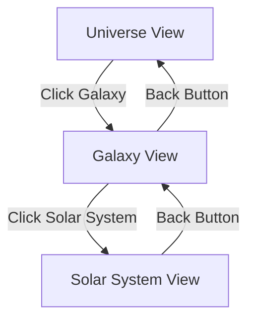

# Visual Scene Controls and Animation Tuning

This document describes the 3D scene controls, camera animations, and performance optimizations in The Horizon application.

## Solar System Scale Configuration

### Overview

The solar system rendering uses carefully calibrated scale constants to ensure planets are easily clickable and meet accessibility guidelines while maintaining visual appeal. All constants are defined in `src/lib/universe/scale-constants.ts`.

### Planet Size Constants

Located in `PLANET_SCALE`:

```typescript
PLANET_SCALE = {
  MIN_SIZE: 0.8,          // Minimum radius (ensures ~44-50px tap target)
  MAX_SIZE: 1.8,          // Maximum radius (prevents visual dominance)
  BASE_SIZE: 1.0,         // Base radius for calculations
  MOON_MULTIPLIER: 0.1,   // Size increase per moon
}
```

**Why These Values:**
- `MIN_SIZE` of 0.8 Three.js units translates to approximately 44-50 CSS pixels at default zoom, meeting WCAG 2.1 Level AA touch target requirements (44×44px minimum)
- `MAX_SIZE` prevents large planets from obscuring other UI elements or smaller planets
- `MOON_MULTIPLIER` creates visual variety: planets with more moons appear slightly larger

**Customizing Planet Sizes:**

To make all planets larger:
```typescript
MIN_SIZE: 1.0,  // Instead of 0.8
MAX_SIZE: 2.2,  // Instead of 1.8
```

To reduce size variance between planets:
```typescript
MOON_MULTIPLIER: 0.05,  // Instead of 0.1
```

### Orbital Spacing Constants

Located in `ORBITAL_SPACING`:

```typescript
ORBITAL_SPACING = {
  BASE_RADIUS: 4.0,        // First planet's orbital radius
  RADIUS_INCREMENT: 3.0,    // Spacing between orbits
  MIN_SEPARATION: 2.0,      // Minimum safe distance
  MAX_ECCENTRICITY: 0.05,   // Orbit ellipticity (0 = circle)
  MAX_INCLINATION: 0.15,    // Orbital tilt in radians
}
```

**Why These Values:**
- `BASE_RADIUS` of 4.0 provides clear separation from the central star (radius 1.2)
- `RADIUS_INCREMENT` of 3.0 ensures planets don't overlap even with maximum sizes
- `MAX_ECCENTRICITY` of 0.05 keeps orbits nearly circular for predictable spacing (was 0.1 for more elliptical orbits)
- `MAX_INCLINATION` of 0.15 radians (~8.6 degrees) adds 3D depth without causing z-fighting

**Adaptive Spacing for Many Planets:**

The `calculateSafeSpacing()` function automatically increases spacing when you have 8+ planets:
```typescript
function calculateSafeSpacing(planetCount: number): number {
  const densityFactor = Math.max(1.0, planetCount / 8);
  return RADIUS_INCREMENT * densityFactor;
}
```

For example:
- 4 planets: uses standard 3.0 spacing
- 8 planets: uses 3.0 spacing (threshold)
- 12 planets: uses 4.5 spacing (1.5× standard)
- 16 planets: uses 6.0 spacing (2× standard)

**Customizing Orbital Spacing:**

For tighter orbits (more compact view):
```typescript
BASE_RADIUS: 3.0,       // Instead of 4.0
RADIUS_INCREMENT: 2.5,   // Instead of 3.0
```

For more elliptical orbits (more dramatic):
```typescript
MAX_ECCENTRICITY: 0.1,   // Instead of 0.05
```

For flatter orbital plane:
```typescript
MAX_INCLINATION: 0.05,   // Instead of 0.15 (~3 degrees)
```

### Star Configuration

Located in `STAR_SCALE`:

```typescript
STAR_SCALE = {
  RADIUS: 1.2,           // Central star size
  LIGHT_INTENSITY: 2.5,  // Brightness of star light
  LIGHT_DISTANCE: 30,    // How far light reaches
}
```

**Customizing Star Appearance:**

For a larger, brighter star:
```typescript
RADIUS: 1.5,
LIGHT_INTENSITY: 3.0,
```

For a smaller, dimmer star:
```typescript
RADIUS: 0.8,
LIGHT_INTENSITY: 1.5,
```

### Accessibility Features

#### Touch Target Compliance

All interactive elements meet or exceed WCAG 2.1 Level AA requirements:
- **3D Planets**: Minimum 0.8 Three.js units ≈ 44-50px at default zoom
- **UI Buttons**: Minimum 44px height (CSS), with increased sizes on mobile:
  - Tablets (≤768px): 48px minimum
  - Mobile (≤480px): 52px minimum

#### Responsive Behavior

The scale system adapts to different screen sizes:
- Desktop: Full detail with all planets visible
- Tablet: Slightly larger touch targets for easier interaction
- Mobile: Maximum touch target sizes for finger-friendly navigation
- High zoom: Planets scale proportionally, maintaining tap target size

#### Reduced Motion Support

Users with `prefers-reduced-motion` enabled experience:
- Instant transitions (0.01ms) instead of animated movements
- Static planet positions maintain all interactive functionality
- No impact on layout or spacing calculations

### Edge Case Handling

#### Many Planets (8+)

The system automatically adjusts spacing to prevent crowding:
```typescript
// For a solar system with 12 planets:
const spacing = calculateSafeSpacing(12);
// Returns: 3.75 (1.5× standard spacing)
```

#### Small Screens

CSS media queries ensure usability:
```css
@media (max-width: 768px) {
  .moon-nav-button {
    min-height: 48px;  /* Larger than desktop */
  }
}
```

#### High Planet Counts (10+)

Even with many planets, the orbital spacing algorithm ensures:
- No visual overlap between adjacent planets
- Z-fighting prevention through proper inclination limits
- Consistent frame rates through efficient rendering

#### Persisted Layout Data

If upgrading from a previous version:
- Old size values are ignored; new constants apply immediately
- No migration required - calculations are deterministic based on planet properties
- Cached Three.js objects automatically recreate with new sizes

### Testing Your Changes

After modifying constants, verify:

1. **Tap Target Size**: Use browser dev tools to measure planet click areas
   ```javascript
   // In browser console:
   const planetMesh = scene.children.find(/* your planet */);
   const boundingBox = new THREE.Box3().setFromObject(planetMesh);
   console.log('Planet size:', boundingBox.getSize(new THREE.Vector3()));
   ```

2. **Orbital Spacing**: Verify no overlaps with many planets
   ```bash
   # Create test solar system with 12+ planets
   # Visually inspect for overlaps at various zoom levels
   ```

3. **Performance**: Monitor frame rate with many planets
   ```javascript
   // Check FPS in dev tools performance panel
   // Target: 60 FPS desktop, 30 FPS mobile
   ```

4. **Accessibility**: Test with real devices
   - Touch interaction on tablets and phones
   - Keyboard navigation (focus indicators visible)
   - Screen reader compatibility (buttons properly labeled)

### Performance Considerations

Current scale values are optimized for:
- **Desktop**: 60 FPS with 10+ planets
- **Mobile**: 30+ FPS with 8+ planets
- **Low-end devices**: Graceful degradation (planets still clickable)

If you need to support more planets or lower-end devices:
- Reduce `LIGHT_DISTANCE` to lower light calculation overhead
- Consider implementing level-of-detail (LOD) for distant planets
- Use simpler sphere geometry (fewer segments) for distant objects

## Scene Architecture

The application uses a multi-layer traversal system with three focus levels:



### Focus Levels

1. **Universe View**: Shows all galaxies as shader-based particle clouds arranged in a grid
2. **Galaxy View**: Shows a single galaxy's solar systems and free-floating stars with orbital mechanics
3. **Solar System View**: (Future) Detailed view of planets and moons

## Camera System

### Camera Animations

Camera transitions use spline-based paths with easing functions for smooth, cinematic movement:

- **Duration**: 1.5 seconds (1500ms) by default
- **Easing**: Cubic ease-in-out for natural acceleration/deceleration
- **Path**: Catmull-Rom spline with elevated midpoint for dramatic arc

#### Animation Configuration

Located in `src/lib/camera.ts`:

```typescript
export const DEFAULT_ANIMATION_CONFIG: AnimationConfig = {
  duration: 1500, // milliseconds
  easing: easeInOutCubic,
};
```

To adjust animation speed, modify the `duration` value. Lower values create faster transitions; higher values create slower, more dramatic movements.

#### Available Easing Functions

- `easeInOutCubic`: Smooth acceleration and deceleration (default)
- `easeInOutQuint`: Even smoother with more gradual transitions
- `lerp`: Linear interpolation (no easing)

### Camera Constraints

To prevent disorientation and maintain scene boundaries:

- **Minimum Distance**: 5 units from focus point
- **Maximum Distance**: 200 units from origin
- **Polar Angle**: Limited to 90° (prevents going below the "floor")
- **Controls**: Disabled during transitions to prevent conflicts

### Default Camera Positions

```typescript
universe: {
  position: new THREE.Vector3(0, 50, 100),
  lookAt: new THREE.Vector3(0, 0, 0),
}

galaxy: {
  position: new THREE.Vector3(0, 20, 40),
  lookAt: new THREE.Vector3(0, 0, 0),
}

solarSystem: {
  position: new THREE.Vector3(0, 10, 25),
  lookAt: new THREE.Vector3(0, 0, 0),
}
```

## Scene Controls

### Universe View Controls

- **Mouse Drag**: Orbit around the scene
- **Mouse Wheel**: Zoom in/out
- **Click Galaxy**: Focus and transition to galaxy detail view
- **Damping**: Smooth camera movement with dampingFactor of 0.05

### Navigation Controls

- **Back Button**: Returns to previous focus level with reversed animation
- **Breadcrumb**: Shows current navigation path
- **Transition Queue**: Prevents glitches by queuing rapid clicks

## Performance Optimizations

### Instancing

Solar system planets use instanced rendering for performance:

- Single draw call for multiple planets
- Efficient memory usage
- Scalable to hundreds of objects

### Particle Systems

Galaxy particle clouds use custom shaders:

- GPU-accelerated rendering
- 2,000+ particles per galaxy
- Additive blending for glow effect
- Depth write disabled for correct transparency

#### Particle Shader Features

**Vertex Shader**:
- Size attenuation based on distance
- Custom color per particle
- Efficient attribute passing

**Fragment Shader**:
- Circular particle shape with soft edges
- Alpha gradient for smooth falloff
- Discard for non-circular fragments

### Level of Detail (LOD)

Future enhancement: dynamically adjust particle count based on:
- Distance from camera
- Number of galaxies in view
- Frame rate performance

### Batching

Galaxy positions are pre-calculated and memoized:
- Prevents recalculation on every render
- Grid layout for predictable spacing
- Map-based lookup for O(1) access

## Animation Tuning Guide

### Adjusting Transition Speed

Edit `src/lib/camera.ts`:

```typescript
// Faster transitions (1 second)
duration: 1000

// Slower, more cinematic (2.5 seconds)
duration: 2500
```

### Changing Easing Curve

Edit the easing function in `DEFAULT_ANIMATION_CONFIG`:

```typescript
// Gentler easing
easing: easeInOutQuint

// Linear (no easing)
easing: (t) => t
```

### Modifying Camera Paths

To adjust the camera arc height, edit `createCameraPath` in `src/lib/camera.ts`:

```typescript
// Higher arc (more dramatic)
createCameraPath(start, end, 15)

// Lower arc (more direct)
createCameraPath(start, end, 5)
```

### Galaxy Rotation Speed

Edit the rotation multiplier in `UniverseScene.tsx`:

```typescript
// Slower rotation
meshRef.current.rotation.y = state.clock.getElapsedTime() * 0.02;

// Faster rotation
meshRef.current.rotation.y = state.clock.getElapsedTime() * 0.1;
```

## Orbital Mechanics

### Keplerian Orbits

Planets follow simplified Keplerian orbital mechanics:

- **Semi-major axis**: Increases with planet index (2 + index * 1.5)
- **Eccentricity**: Random 0-0.1 for slight elliptical orbits
- **Inclination**: Random ±0.2 radians for 3D variation
- **Orbit speed**: Approximates Kepler's third law (v ∝ 1/a²)

### Customizing Orbits

Edit `PlanetInstance` in `GalaxyView.tsx`:

```typescript
// Wider orbital spacing
const semiMajorAxis = 3 + index * 2.0;

// More circular orbits
const eccentricity = Math.random() * 0.05;

// Flatter orbital plane
const inclination = (Math.random() - 0.5) * 0.1;
```

## Shader Customization

### Galaxy Particle Colors

Edit the color variation in `UniverseScene.tsx`:

```typescript
// More color variation
mixedColor.lerp(new THREE.Color('#FFFFFF'), Math.random() * 0.5);

// Darker particles
mixedColor.lerp(new THREE.Color('#000000'), Math.random() * 0.2);
```

### Particle Size Distribution

```typescript
// Larger particles
sizes[i] = Math.random() * 4 + 2;

// More uniform size
sizes[i] = 2.5;
```

## Performance Considerations

### Frame Rate Targets

- **Desktop**: 60 FPS with 10+ galaxies
- **Mobile**: 30 FPS with 5+ galaxies
- **Low-end**: Graceful degradation with reduced particle counts

### Memory Management

- Geometries and materials are reused where possible
- Particle buffers are created once and updated in place
- Scene graph is kept shallow to minimize traversal cost

### Optimization Checklist

- [ ] Use instancing for repeated objects
- [ ] Disable depth write for transparent objects
- [ ] Use shader materials for effects
- [ ] Limit point light count
- [ ] Pre-calculate positions when possible
- [ ] Use object pooling for temporary objects
- [ ] Throttle expensive operations (raycasting, etc.)

## Troubleshooting

### Low Frame Rate

1. Reduce particle count per galaxy
2. Disable orbit damping
3. Reduce planet count or orbital complexity
4. Use simpler shaders

### Camera Jitter

1. Increase damping factor
2. Disable controls during transitions
3. Use smoother easing functions

### Transition Glitches

1. Check transition queue logic
2. Ensure `isTransitioning` flag is properly set
3. Verify camera animator completion callbacks

### Visual Artifacts

1. Adjust particle shader alpha blending
2. Check depth buffer settings
3. Verify material transparency flags
4. Ensure proper render order

## Future Enhancements

1. **Dynamic LOD**: Adjust quality based on performance metrics
2. **Fog Effects**: Distance-based atmospheric fog
3. **Bloom**: Post-processing for star glow
4. **Motion Trails**: Particle trails during camera movement
5. **Ambient Occlusion**: Enhanced depth perception
6. **VR Support**: Immersive exploration mode

## References

- [React Three Fiber Documentation](https://docs.pmnd.rs/react-three-fiber)
- [Three.js Fundamentals](https://threejs.org/manual/)
- [Keplerian Orbital Elements](https://en.wikipedia.org/wiki/Orbital_elements)
- [Easing Functions](https://easings.net/)
