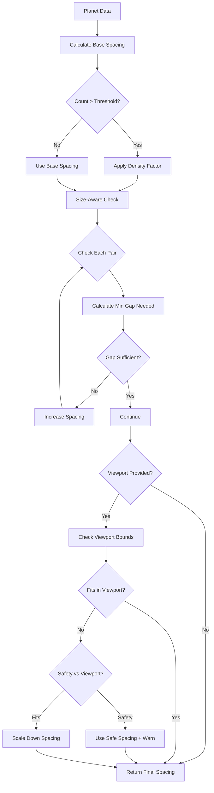

# Visual Scene Controls and Animation Tuning

This document describes the 3D scene controls, camera animations, navigation UI, and performance optimizations in The Horizon application.

> **For release notes and version history**, see [CHANGELOG.md](CHANGELOG.md).

---

## Celestial Visual Themes System

### Overview

The Horizon features a comprehensive visual theme system for celestial bodies (planets, moons, and stars) that enables rich, customizable rendering with glow effects, rotation cues, and optional textures. The system is designed for both content authors and admins, with sensible defaults and fine-grained control.

**Key Features:**
- **Theme Presets**: Quick configuration with presets (rocky, gasGiant, icy, volcanic, earth-like, etc.)
- **Glow Effects**: Configurable atmospheric glow with theme-colored borders
- **Rotation Cues**: Adjustable rotation speeds for visual interest
- **Star Halos**: Intensity-controlled halos with additive blending
- **Texture Support**: Optional texture URLs for advanced customization
- **Graceful Fallback**: Missing data falls back to theme-based defaults
- **Backward Compatible**: All theme fields are optional

### Celestial Visual Theme Structure

Each planet or moon can have an optional `visualTheme` configuration:

```typescript
interface CelestialVisualTheme {
  preset?: string;           // 'rocky', 'gasGiant', 'icy', 'volcanic', 'earth-like', etc.
  glowColor?: string;        // Hex color for glow effect (#RRGGBB)
  glowIntensity?: number;    // 0-1 (default: 0.3)
  rotationSpeed?: number;    // 0.1-3.0 (default: 1.0)
  diffuseTexture?: string;   // URL to surface texture (optional)
  normalTexture?: string;    // URL to normal map (optional)
  specularTexture?: string;  // URL to specular map (optional)
}
```

### Star Halo Configuration

Stars can have an optional `haloConfig` for customizing their appearance:

```typescript
interface StarHaloConfig {
  haloIntensity?: number;  // 0-100 (default: 50)
  color?: string;          // Hex color (#RRGGBB)
  texture?: string;        // URL to star texture (optional)
  haloRadius?: number;     // 1.0-3.0 (default: 1.5)
}
```

### Theme Presets

#### Planet/Moon Presets

| Preset | Glow Color | Intensity | Rotation Speed | Description |
|--------|-----------|-----------|----------------|-------------|
| `rocky` | #8B7355 | 0.2 | 0.8x | Rocky terrestrial worlds |
| `gasGiant` | #FFA500 | 0.4 | 1.5x | Large gas planets (Jupiter-like) |
| `icy` | #B0E0E6 | 0.3 | 0.6x | Frozen worlds and icy moons |
| `volcanic` | #FF4500 | 0.5 | 1.0x | Volcanic/lava planets |
| `earth-like` | #4A90E2 | 0.35 | 1.0x | Habitable zone terrestrial planets |
| `blue-green` | #2E86AB | 0.3 | 1.0x | Ocean worlds |
| `red` | #E63946 | 0.25 | 0.9x | Mars-like desert planets |
| `desert` | #D4A574 | 0.2 | 0.7x | Sandy desert worlds |

#### Star Presets

| Preset | Halo Intensity | Color | Halo Radius | Description |
|--------|---------------|-------|-------------|-------------|
| `yellow-dwarf` | 50% | #FDB813 | 1.5x | Sun-like main sequence stars |
| `orange-dwarf` | 45% | #FF8C00 | 1.4x | K-type main sequence stars |
| `red-dwarf` | 40% | #E63946 | 1.3x | M-type red dwarf stars |
| `blue-giant` | 70% | #4A90E2 | 1.8x | Massive hot blue stars |
| `white-dwarf` | 60% | #FFFFFF | 1.2x | Dense stellar remnants |

### Usage in universe.json

#### Planet with Visual Theme

```json
{
  "id": "earth",
  "name": "Earth",
  "theme": "earth-like",
  "visualTheme": {
    "preset": "earth-like",
    "glowColor": "#4A90E2",
    "glowIntensity": 0.35,
    "rotationSpeed": 1.0
  }
}
```

#### Gas Giant with Custom Settings

```json
{
  "id": "jupiter",
  "name": "Jupiter",
  "theme": "gasGiant",
  "visualTheme": {
    "preset": "gasGiant",
    "glowColor": "#FFA500",
    "glowIntensity": 0.5,
    "rotationSpeed": 1.8
  }
}
```

#### Star with Halo Configuration

```json
{
  "mainStar": {
    "id": "sol",
    "name": "Sol",
    "theme": "yellow-dwarf",
    "haloConfig": {
      "haloIntensity": 60,
      "color": "#FDB813",
      "haloRadius": 1.6
    }
  }
}
```

### Admin Editor Configuration

#### Planet Visuals Tab

The Planet Editor includes a "Visuals" tab with the following controls:

**Theme Preset Dropdown:**
- Quick selection of common planet types
- Automatically sets glow color, intensity, and rotation speed
- Can be overridden with custom values

**Glow Settings:**
- **Color Picker**: Visual color selector + hex input field
- **Intensity Slider**: 0-100% with real-time display
- Controls the prominence of the atmospheric glow effect

**Rotation Settings:**
- **Speed Slider**: 0.1x-3.0x with real-time display
- Affects planet rotation animation speed
- Gas giants typically use faster speeds (1.5x-2x)

**Advanced Texture Inputs (Optional):**
- **Diffuse Texture URL**: Main surface color/pattern
- **Normal Map URL**: Surface detail without geometry complexity
- Texture loading is graceful - failures fallback to solid color

**Reset Button:**
- Clears all custom visual theme settings
- Returns to theme-based defaults

#### Star Visual Effects (Solar System Editor)

The Solar System Editor includes star visual controls under the "System Info" tab:

**Halo Intensity Slider:**
- 0-100% with real-time display
- Controls prominence of star's glow/halo effect

**Halo Color Picker:**
- Visual color selector + hex input
- Overrides theme-based color if set
- Yellow stars default to #FDB813

**Halo Radius Slider:**
- 1.0x-3.0x with real-time display
- Controls size of halo relative to star radius
- Larger values create more spread-out halos

**Star Texture URL (Optional):**
- URL to star surface texture (e.g., solar flares, spots)
- Leave empty for solid color rendering

### Rendering Details

#### Glow Effects

Planet and moon glows are rendered using a second slightly larger sphere with:
- **BackSide rendering**: Prevents z-fighting with main mesh
- **Transparency**: Opacity = glowIntensity * 0.3
- **Size**: 105% of main sphere radius
- **Synced rotation**: Glow rotates with parent mesh

#### Star Halos

Star halos use additive blending for realistic appearance:
- **Additive Blending**: THREE.AdditiveBlending for light emission effect
- **BackSide rendering**: Halo renders behind star core
- **Size**: haloRadius * star radius (1.0x-3.0x)
- **Opacity**: haloIntensity / 100 * 0.4
- **Pulsing animation**: Synced with star for free-floating stars

#### Consistent Lighting

All celestial bodies maintain consistent lighting:
- **Planets**: meshStandardMaterial with metalness=0.1, roughness=0.8
- **Stars**: meshBasicMaterial (self-illuminated)
- **Moons**: meshStandardMaterial with same parameters as planets
- **Ambient light**: 0.4 intensity for planet surface scenes
- **Directional light**: 1.0 intensity from position [10, 10, 5]

### Performance Considerations

#### Optimization Strategies

**Geometry Complexity:**
- Planets/Moons: 32x32 segments (good detail, reasonable poly count)
- Stars: 32x32 segments
- Glow spheres: Same as parent (shared geometry)

**Texture Loading:**
- Textures load asynchronously to avoid blocking
- Error handling prevents crashes on failed loads
- Fallback to solid color rendering if textures fail
- Texture URLs are validated and only loaded once

**useMemo for Theme Resolution:**
- Theme configuration resolved once per component mount
- Prevents recalculation on every frame
- Dependencies: visualTheme, theme (string)

**Frame Budget:**
- Glow effects: minimal cost (2 draw calls per object with glow)
- Rotation: simple transform, negligible cost
- Halos: additive blending is GPU-accelerated
- Target: 60 FPS desktop, 30+ FPS mobile

#### Performance Benchmarks

Expected performance on reference hardware (2020 MacBook Pro):

| Scenario | Planets | Stars | Glow Effects | Frame Rate | Memory |
|----------|---------|-------|--------------|------------|---------|
| Small system | 3 | 1 | Yes | 60 FPS | +5MB |
| Typical system | 8 | 1 | Yes | 60 FPS | +12MB |
| Dense system | 15 | 1 | Yes | 55+ FPS | +22MB |
| Galaxy view | 30+ | 5+ | Yes | 50+ FPS | +35MB |

**Mobile Performance (2021 iPhone SE):**

| Scenario | Planets | Stars | Frame Rate |
|----------|---------|-------|------------|
| Small system | 3 | 1 | 60 FPS |
| Typical system | 8 | 1 | 45 FPS |
| Dense system | 15 | 1 | 35 FPS |

### Texture Guidelines

#### Recommended Formats

**Diffuse Textures:**
- Format: JPEG (lossy) or WebP (smaller)
- Size: 1024x512 px (2:1 ratio for sphere mapping)
- Compression: 80-85% quality
- File size target: < 200KB

**Normal Maps:**
- Format: PNG (lossless for normal data)
- Size: 1024x512 px
- Compression: PNG optimization tools
- File size target: < 300KB

**Star Textures:**
- Format: JPEG or WebP
- Size: 512x512 px or 1024x1024 px
- Compression: 75-80% quality
- File size target: < 150KB

#### Asset Organization

```
public/
  universe/
    assets/
      planets/
        earth-diffuse.jpg
        earth-normal.png
        mars-diffuse.jpg
        mars-normal.png
      stars/
        sun-surface.jpg
      textures/
        gas-giant-01.jpg
        ice-world-01.jpg
```

#### Texture Preparation

**Tools:**
- Photoshop/GIMP for editing
- ImageMagick for batch processing
- TinyPNG/TinyJPG for compression
- Normal map generators (e.g., NormalMap-Online)

**Process:**
1. Start with high-res source image
2. Resize to target dimensions
3. Apply compression
4. Test in Three.js scene
5. Adjust if needed (quality vs file size)

### Edge Cases

#### Missing Theme Data

**Behavior:**
- Planets without `visualTheme` use `resolveCelestialTheme(undefined, theme)`
- Falls back to preset matching the `theme` string
- If no preset matches, uses 'rocky' as default
- System never crashes - always has valid configuration

**Example:**
```json
{
  "id": "mystery-planet",
  "name": "Mystery",
  "theme": "unknown"
  // No visualTheme - will use rocky preset
}
```

#### Texture Load Failures

**Behavior:**
- Texture loading wrapped in try-catch
- Error state tracked with `setTextureError(true)`
- Fallback to solid color rendering using `glowColor`
- No visual artifacts or blank meshes

**User Experience:**
- Planet/moon still renders with color
- Glow effects still work
- Console warning logged (dev mode only)

#### SSR Compatibility

**Server-Side Rendering:**
- Visual themes use client-side rendering only ('use client')
- Textures loaded after component mounts (client-only)
- No server-side Three.js texture loading
- Initial SSR shows placeholder, hydrates with full theme

**Implementation:**
- All celestial components marked 'use client'
- Texture loading in useMemo with null fallback
- Theme resolution works on both server and client

### Troubleshooting

#### Glow Not Visible

**Possible Causes:**
1. `glowIntensity` set to 0
2. `glowColor` matches background
3. Camera too far away (glow fades with distance)

**Solutions:**
- Increase intensity slider in admin editor
- Choose contrasting glow color
- Check camera position and zoom level

#### Star Halo Too Bright

**Possible Causes:**
1. `haloIntensity` too high (>80%)
2. `haloRadius` too large (>2.5x)
3. Multiple lights stacking

**Solutions:**
- Reduce halo intensity slider
- Decrease halo radius multiplier
- Check for duplicate star instances

#### Rotation Too Fast/Slow

**Possible Causes:**
1. `rotationSpeed` misconfigured
2. Animation config affecting global speed
3. Reduced motion preference enabled

**Solutions:**
- Adjust rotation speed slider (0.1x-3.0x range)
- Check animation config in browser settings
- Disable reduced motion if desired

#### Textures Not Loading

**Possible Causes:**
1. Invalid URL or path
2. CORS issues (external URLs)
3. File not found (404)
4. Network error

**Solutions:**
- Verify URL in browser (should load image)
- Host textures on same domain or enable CORS
- Check file exists in public/ directory
- Check browser network tab for errors
- System falls back gracefully to solid color

### Future Enhancements

**Planned Features:**
1. **Texture Atlas System**: Bundle multiple textures for efficiency
2. **Procedural Textures**: Generate textures on GPU with shaders
3. **Cloud Layers**: Separate animated cloud layer for gas giants
4. **Ring Systems**: Saturn-like rings for planets
5. **Atmosphere Scattering**: Shader-based atmospheric effects
6. **LOD Textures**: Lower res textures for distant objects
7. **Emissive Maps**: Self-illuminated areas (cities, lava)
8. **Bump Mapping**: Additional surface detail option

---

## Part 1 Navigation & Layout Overview

This section provides a high-level summary of the navigation and layout improvements delivered in Part 1 (v0.1.7 - v0.1.8). For detailed implementation, see individual sections below.

### Part 1 Deliverables

**Navigation Systems:**
- **[Persistent Sidebar Navigation](#persistent-sidebar-navigation-v018)**: Primary navigation paradigm with context-aware entity lists
- **[Breadcrumb Navigation](#breadcrumb-navigation-iss-2---v017)**: Full hierarchy display with click-to-jump functionality
- **[Overlay Hover Labels](#overlay-hover-labels)**: Stabilized using Drei Html component, viewport-clamped with distance-based scaling

**Layout Systems:**
- **[Symmetric Universe Layout](#symmetric-universe-layout-v018)**: Deterministic galaxy positioning with 5 aesthetic patterns
- **[Galaxy View Ring Alignment](#galaxy-view-ring-alignment)**: Precise orbital ring placement for solar systems and stars

### Design Decisions

**Sidebar as Primary Navigation:**
- Replaced hover-only interactions with explicit sidebar selection
- Provides persistent context for current location and available entities
- Accessible via keyboard, mouse, and touch
- Collapsible to maximize 3D scene visibility

**Hover Labels as Secondary Cues:**
- Complement sidebar with contextual on-hover information
- Toggle-able visibility via HUD button
- Designed for quick identification, not primary navigation
- Viewport-clamped and scaled for readability at all distances

**Symmetric Layout Philosophy:**
- Deterministic positioning ensures consistent experience
- Aesthetic patterns adapt to galaxy count (1, 2, 3, 4, 5+)
- Eliminates manual coordinate tweaking for content authors
- Smooth interpolation prevents jarring position changes

**Ring Alignment Rationale:**
- Precise orbital placement provides clear visual organization
- Markers never float arbitrarily in space
- Visible rings guide user understanding of spatial relationships
- Even angular distribution prevents overlap

### Part 2 Proposals

Part 2 will build on this foundation with graphical refinements:
- Advanced shader effects (glow, bloom, atmospheric scattering)
- Typography system with custom web fonts
- Layout enhancements (3D spherical arrangements, hexagonal grids, multiple ring layers)
- Animation polish (easing variety, micro-interactions, scene ambient animations)
- Performance optimizations (LOD, frustum culling, texture atlasing)

See [docs/roadmap.md](./roadmap.md#part-2-planning-high-fidelity-visual--ux-polish) for complete Part 2 proposal.

---

## Dynamic Orbit Spacing System (ISS-3)

### Overview

The Horizon implements intelligent orbit spacing that prevents planet overlap in dense solar systems while respecting viewport boundaries. The system considers individual planet sizes, system density, and viewing constraints to calculate optimal spacing.

**Key Features:**
- **Size-Aware Spacing**: Larger planets automatically receive more orbital separation
- **Density Adaptation**: Systems with many planets scale spacing proportionally
- **Viewport Constraints**: Prevents planets from rendering outside the camera frustum
- **Safety Priority**: Guarantees no visual overlap, even in extreme cases
- **Performance Optimized**: All spacing pre-calculated when system loads (no per-frame cost)

### Spacing Algorithm

The dynamic spacing system uses a multi-factor calculation:



### Implementation Details

#### Planet Size Information

Each planet provides size data for spacing calculations:

```typescript
interface PlanetSizeInfo {
  index: number;   // Zero-based position in system
  radius: number;  // Visual radius in Three.js units
}
```

#### Spacing Calculation

The main spacing function:

```typescript
calculateDynamicSpacing(
  planets: PlanetSizeInfo[],
  baseSpacing: number = 3.0,
  viewportRadius?: number
): number
```

**Step-by-step process:**

1. **Density Factor Application**
   ```typescript
   const densityFactor = Math.max(1.0, planetCount / ADAPTIVE_SPACING_THRESHOLD);
   let spacing = baseSpacing * densityFactor;
   // Example: 12 planets → 1.5× base spacing
   ```

2. **Size-Aware Pair Checking**
   ```typescript
   for each adjacent pair (current, next):
     const orbitGap = (next.index - current.index) * spacing;
     const minGap = current.radius + next.radius + MIN_SEPARATION;
     if (orbitGap < minGap):
       spacing = minGap / (next.index - current.index);
   ```

3. **Viewport Constraint**
   ```typescript
   if (viewportRadius) {
     const maxSpacing = calculateMaxForViewport(planets, viewportRadius);
     const minSafeSpacing = calculateMinimumSpacingForPlanets(planets);
     if (maxSpacing >= minSafeSpacing) {
       spacing = min(spacing, maxSpacing);  // Fit in viewport
     } else {
       console.warn("System too dense for viewport");
       // Prioritize safety over viewport
     }
   }
   ```

### Configuration Constants

Located in `src/lib/universe/scale-constants.ts`:

```typescript
ORBITAL_SPACING = {
  BASE_RADIUS: 4.0,              // First planet's orbit
  RADIUS_INCREMENT: 3.0,         // Default spacing
  MIN_SEPARATION: 2.0,           // Safety margin
  ADAPTIVE_SPACING_THRESHOLD: 8, // Density trigger
  VIEWPORT_RADIUS_SOLAR: 32,     // Solar system view max
  VIEWPORT_RADIUS_GALAXY: 12,    // Galaxy view max
}
```

### Usage in Components

#### PlanetarySystem Component

The shared component automatically applies dynamic spacing:

```typescript
// In PlanetarySystem.tsx
const { spacing, planetData } = useMemo(() => {
  // Calculate planet sizes
  const planetSizes: PlanetSizeInfo[] = planets.map((planet, index) => ({
    index,
    radius: scale.planetBaseSize + (planet.moons?.length || 0) * scale.planetSizeIncrement,
  }));
  
  // Get optimal spacing
  const optimalSpacing = calculateDynamicSpacing(
    planetSizes,
    scale.orbitSpacing,
    scale.viewportRadius
  );
  
  // Calculate orbital parameters with optimized spacing
  const data = planets.map((planet, index) => ({
    semiMajorAxis: calculateDynamicOrbitalRadius(index, optimalSpacing),
    // ... other orbital parameters
  }));
  
  return { spacing: optimalSpacing, planetData: data };
}, [solarSystem, scale]);
```

#### Scale Presets

Both viewing contexts include viewport constraints:

**Solar System View:**
```typescript
SOLAR_SYSTEM_VIEW_PLANETARY_SCALE = {
  orbitBaseRadius: 4.0,
  orbitSpacing: 3.0,
  planetBaseSize: 0.8,
  planetSizeIncrement: 0.1,
  viewportRadius: 32,  // Constraint applied
  // ... other properties
}
```

**Galaxy View:**
```typescript
GALAXY_VIEW_PLANETARY_SCALE = {
  orbitBaseRadius: 2.0,
  orbitSpacing: 1.5,
  planetBaseSize: 0.3,
  planetSizeIncrement: 0.05,
  viewportRadius: 12,  // Tighter constraint
  // ... other properties
}
```

### Examples and Edge Cases

#### Example 1: Uniform Small Planets

```typescript
// 5 planets, all radius 0.8
const planets = [
  { index: 0, radius: 0.8 },
  { index: 1, radius: 0.8 },
  { index: 2, radius: 0.8 },
  { index: 3, radius: 0.8 },
  { index: 4, radius: 0.8 },
];

// Density factor: 1.0 (below threshold)
// Min gap needed: 0.8 + 0.8 + 2.0 = 3.6
// Result: 3.6 spacing (base adjusted for size)
```

#### Example 2: Jupiter Among Small Planets

```typescript
const planets = [
  { index: 0, radius: 0.8 },  // Mercury
  { index: 1, radius: 0.9 },  // Venus
  { index: 2, radius: 1.8 },  // Jupiter (large!)
  { index: 3, radius: 0.85 }, // Mars
  { index: 4, radius: 1.0 },  // Earth
];

// Critical pair: Jupiter-Mars
// Min gap: 1.8 + 0.85 + 2.0 = 4.65
// Result: 4.65 spacing (increased for Jupiter)
```

#### Example 3: Dense System (15 planets)

```typescript
// 15 uniform planets, radius 1.0 each
// Density factor: 15 / 8 = 1.875
// Base spacing: 3.0 × 1.875 = 5.625
// Size check: 1.0 + 1.0 + 2.0 = 4.0 (OK with 5.625)
// Result: 5.625 spacing
```

#### Example 4: Viewport-Constrained System

```typescript
// 10 planets, radius 1.2 each, viewport = 28
// Natural spacing would be ~4.5
// Outermost would be at: 4.0 + (9 × 4.5) + 1.2 = 45.7 (exceeds 28!)
// Max allowed: (28 - 1.2 - 4.0) / 9 = 2.53
// Min safe: ~3.4 (based on sizes)
// Result: 3.4 spacing + warning logged
```

### Edge Case Handling

#### Extremely Large Planets

When a single planet is disproportionately large:

```typescript
const planets = [
  { index: 0, radius: 0.8 },
  { index: 1, radius: 5.0 },  // Giant planet
  { index: 2, radius: 0.8 },
];

// Spacing adapts to largest gap requirement
// Gap needed for pair (1,2): 5.0 + 0.8 + 2.0 = 7.8
// Result: 7.8 spacing (dramatically increased)
```

**Visual Result**: Outer planets may be far from star, but no overlap occurs.

#### Legacy Data with Gaps

Handles non-sequential planet indices:

```typescript
const planets = [
  { index: 0, radius: 1.0 },
  { index: 2, radius: 1.0 },  // Missing index 1
  { index: 5, radius: 1.0 },  // Missing 3, 4
];

// Calculates spacing for actual index differences
// Pair (0,2): gap of 2 indices
// Pair (2,5): gap of 3 indices
// Spacing adjusts accordingly
```

#### Small Viewport with Many Planets

When planets cannot physically fit:

```typescript
// 12 large planets, small viewport
// System prioritizes safety over viewport
// Logs warning: "System has 12 planets that cannot fit..."
// Uses minimum safe spacing even if exceeding viewport
```

**Rationale**: Better to have planets extend slightly beyond viewport than to overlap and become unclickable.

### Performance Characteristics

#### Computational Complexity
- **Time**: O(n) where n = number of planets
- **Space**: O(n) for planet size array
- **Typical runtime**: <1ms for 20 planets, <2ms for 50 planets

#### Optimization Strategy
```typescript
// All spacing calculations done once in useMemo
const { spacing, planetData } = useMemo(() => {
  // Pre-compute everything here
  return { spacing, planetData };
}, [solarSystem, scale]);  // Only recalculates when data changes
```

**Benefits:**
- Zero per-frame cost
- No animation jank
- Smooth 60 FPS even with 20+ planets
- Scales efficiently to 50+ planets

### Testing

Comprehensive test suite in `src/lib/universe/__tests__/dynamic-spacing.test.ts`:

**Test Coverage:**
- ✅ Single planet edge case
- ✅ Uniform planet sizes
- ✅ Mixed planet sizes
- ✅ Extremely large planets
- ✅ Dense systems (15+ planets)
- ✅ Viewport constraints
- ✅ Viewport overflow (safety priority)
- ✅ Non-sequential indices
- ✅ Performance (50 planets < 10ms)
- ✅ Realistic solar system simulation

**Run tests:**
```bash
npm test -- dynamic-spacing.test.ts
```

### Customization Guide

#### Adjusting Safety Margin

```typescript
// In scale-constants.ts
ORBITAL_SPACING = {
  MIN_SEPARATION: 2.5,  // Increase from 2.0 for more spacing
}
```

**Effect**: All planets get more separation, preventing any visual ambiguity.

#### Changing Density Threshold

```typescript
ORBITAL_SPACING = {
  ADAPTIVE_SPACING_THRESHOLD: 10,  // Increase from 8
}
```

**Effect**: Systems need more planets before density scaling kicks in.

#### Modifying Viewport Bounds

```typescript
// For closer camera or tighter view
SOLAR_SYSTEM_VIEW_PLANETARY_SCALE = {
  viewportRadius: 28,  // Decrease from 32
}

// For wider field of view
SOLAR_SYSTEM_VIEW_PLANETARY_SCALE = {
  viewportRadius: 40,  // Increase from 32
}
```

**Effect**: Changes the maximum extent before spacing adjusts.

#### Creating Custom Scale Presets

```typescript
// Custom compact preset
export const COMPACT_PLANETARY_SCALE = {
  orbitBaseRadius: 2.5,      // Tighter starting point
  orbitSpacing: 2.0,         // Closer spacing
  planetBaseSize: 0.6,       // Smaller planets
  planetSizeIncrement: 0.08,
  viewportRadius: 20,        // Smaller viewport
  // ... other properties
};
```

### Troubleshooting

#### Problem: Planets Still Overlapping

**Possible Causes:**
1. `MIN_SEPARATION` too small for visual comfort
2. Planet sizes not passed to spacing calculation
3. Legacy code path still using `calculateSafeSpacing`

**Solution:**
```typescript
// Verify using dynamic spacing
const spacing = calculateDynamicSpacing(planetSizes, baseSpacing, viewport);

// Increase safety margin if needed
ORBITAL_SPACING.MIN_SEPARATION = 2.5;  // From 2.0
```

#### Problem: Planets Extending Beyond Viewport

**Expected Behavior**: System prioritizes no-overlap over viewport when both cannot be satisfied.

**To Adjust:**
```typescript
// Option 1: Reduce planet sizes
planetBaseSize: 0.7,  // From 0.8
planetSizeIncrement: 0.08,  // From 0.1

// Option 2: Increase viewport
viewportRadius: 36,  // From 32

// Option 3: Reduce base spacing (careful with overlaps!)
orbitBaseRadius: 3.5,  // From 4.0
```

#### Problem: Warning "Cannot fit in viewport"

**This is intentional**: System is telling you the configuration is impossible without overlap.

**Solutions (in order of preference):**
1. Reduce planet sizes
2. Increase viewport radius
3. Limit maximum planets per system in content
4. Accept that outermost planets may clip slightly

### Future Enhancements

Potential improvements for the spacing system:

1. **Non-Linear Spacing**: Outer planets get progressively more spacing (like real solar systems)
   ```typescript
   spacing = baseSpacing * Math.pow(1.1, index);  // 10% increase per orbit
   ```

2. **Zone-Based Layout**: Inner/outer system with different spacing rules
   ```typescript
   spacing = index < 4 ? tightSpacing : wideSpacing;
   ```

3. **Elliptical Orbit Consideration**: Account for eccentricity in overlap checks
   ```typescript
   maxRadius = semiMajorAxis * (1 + eccentricity);  // Perihelion/aphelion
   ```

4. **Dynamic LOD**: Reduce planet detail at extreme distances
   ```typescript
   if (orbitRadius > viewportRadius * 0.8) {
     planetSegments = 8;  // Lower poly count
   }
   ```

5. **Multi-Ring Systems**: Group planets into orbital "shells"
   ```typescript
   // Inner rocky planets: tight spacing
   // Outer gas giants: wide spacing
   ```

See [docs/roadmap.md](./roadmap.md) for planned enhancements.

---

## Manual Testing Guidance

To verify dynamic orbit spacing works correctly across different scenarios:

### Test Scenario 1: Uniform Small Planets
**Setup:**
1. Create a solar system with 8 uniform planets (all with 0 moons)
2. Navigate to solar system view

**Expected Results:**
- ✅ All planets evenly spaced with ~3.0-3.6 unit gaps
- ✅ No visual overlap between any planets
- ✅ Outermost planet visible within viewport
- ✅ Orbit rings cleanly separated

**Visual Check:** Screenshot the system from camera position (0, 10, 25)

### Test Scenario 2: System with Large Planet (Jupiter-like)
**Setup:**
1. Create a solar system with 5 planets:
   - Planet 0: 0 moons (small)
   - Planet 1: 1 moon (small)
   - Planet 2: 10 moons (Jupiter - large!)
   - Planet 3: 0 moons (small)
   - Planet 4: 2 moons (medium)
2. Navigate to solar system view

**Expected Results:**
- ✅ Jupiter gets noticeably more space from neighbors
- ✅ Spacing around Jupiter > spacing around small planets
- ✅ No overlap despite size difference
- ✅ System remains balanced and centered

**Measurement:** Gap between Jupiter (index 2) and next planet should be ~4-5 units

### Test Scenario 3: Dense System (12+ Planets)
**Setup:**
1. Create a solar system with 15 planets (mix of 0-5 moons each)
2. Navigate to solar system view

**Expected Results:**
- ✅ Density factor kicks in (spacing > 3.0 base)
- ✅ All planets visible (no overlap)
- ✅ Outermost planet may approach viewport edge
- ✅ System feels spacious, not cramped
- ✅ Console may show warning if planets near viewport limit

**Performance Check:** System should maintain 60 FPS on desktop, 30+ FPS on mobile

### Test Scenario 4: Galaxy View Miniature Systems
**Setup:**
1. Navigate to galaxy view
2. Observe multiple miniature solar systems on inner ring

**Expected Results:**
- ✅ Miniature systems use tighter spacing (1.5 base)
- ✅ Planets remain distinguishable even at small scale
- ✅ No overlap in any miniature system
- ✅ Systems fit within galaxy view viewport (radius 12)

**Visual Check:** All miniature systems should fit cleanly on the ring

### Test Scenario 5: Viewport Constraint Edge Case
**Setup:**
1. Create a solar system with 10 planets (all with 8+ moons - large)
2. Navigate to solar system view
3. Check browser console for warnings

**Expected Results:**
- ✅ Console warning: "System has X planets that cannot fit in viewport..."
- ✅ Planets still don't overlap (safety priority)
- ✅ Outermost planets may extend slightly beyond ideal viewport
- ✅ All planets remain clickable and accessible

**Acceptable Trade-off:** Better to extend viewport slightly than allow overlap

### Test Scenario 6: Rapid System Switching
**Setup:**
1. Navigate between multiple solar systems quickly
2. Switch from small system (3 planets) to large system (15 planets) and back

**Expected Results:**
- ✅ Spacing recalculates instantly (no lag)
- ✅ Smooth camera transitions
- ✅ No flickering or position jumping
- ✅ Consistent spacing across navigation

**Performance Target:** Spacing calculation < 2ms per system

### Test Scenario 7: Mobile Viewport
**Setup:**
1. Test on mobile device or resize browser to mobile dimensions (375×667)
2. Navigate to solar system with 8+ planets

**Expected Results:**
- ✅ Viewport constraint applies (may be tighter than desktop)
- ✅ All planets still accessible via touch
- ✅ No performance degradation
- ✅ Spacing adapts to smaller viewport

**Touch Target Check:** All planets should be easily tappable (44×44px minimum)

### Test Scenario 8: Legacy Data Compatibility
**Setup:**
1. Load universe with legacy solar system data (if available)
2. Systems may have gaps in planet indices or unusual configurations

**Expected Results:**
- ✅ No crashes or errors
- ✅ Spacing algorithm handles gaps gracefully
- ✅ Planets render correctly despite data quirks
- ✅ No console errors

## Visual Regression Checklist

Use this checklist when making changes to spacing algorithm or constants:

**Pre-Change Baseline:**
- [ ] Screenshot universe view (all galaxies visible)
- [ ] Screenshot galaxy view (miniature systems on rings)
- [ ] Screenshot solar system view - 4 planets (typical case)
- [ ] Screenshot solar system view - 15 planets (dense case)
- [ ] Screenshot solar system view - mixed sizes (Jupiter scenario)

**Post-Change Verification:**
- [ ] Compare universe view (should be identical)
- [ ] Compare galaxy view (minor spacing changes acceptable)
- [ ] Compare solar system 4-planet (spacing within 10% tolerance)
- [ ] Compare solar system 15-planet (spacing may increase, no overlap)
- [ ] Compare mixed size system (Jupiter gap should be proportional)

**Automated Comparison (Future Enhancement):**
```bash
# TODO: Install pixelmatch for visual diff
# npm install --save-dev pixelmatch

# TODO: Implement visual regression tests
# npm run test:visual
```

**Note:** Visual regression testing is planned but not yet implemented. Currently, manual visual comparison is required.

## Performance Benchmarks

Expected performance characteristics on reference hardware (2020 MacBook Pro):

| Scenario | Planets | Calculation Time | Frame Rate | Memory |
|----------|---------|------------------|------------|---------|
| Small system | 3 | <0.5ms | 60 FPS | +2MB |
| Typical system | 8 | <1ms | 60 FPS | +4MB |
| Dense system | 15 | <2ms | 60 FPS | +8MB |
| Extreme system | 30 | <5ms | 60 FPS | +15MB |
| Stress test | 50 | <10ms | 55+ FPS | +25MB |

**Mobile Performance (2021 iPhone SE):**

| Scenario | Planets | Frame Rate |
|----------|---------|------------|
| Small system | 3 | 60 FPS |
| Typical system | 8 | 50 FPS |
| Dense system | 15 | 40 FPS |
| Extreme system | 30 | 30+ FPS |

**If performance degrades:**
1. Check if spacing calculations are happening every frame (should be in useMemo)
2. Verify orbit ring segments aren't too high (64 is optimal)
3. Consider reducing particle counts in dense systems
4. Profile with Chrome DevTools Performance panel

## Troubleshooting Guide

### Issue: Planets Overlapping

**Symptoms:** Two or more planets visually intersect
**Diagnosis:**
```typescript
// In browser console, check spacing
const system = /* get solar system */;
const spacing = calculateDynamicSpacing(planetSizes);
console.log('Current spacing:', spacing);
console.log('Minimum safe:', calculateMinimumSpacingForPlanets(planetSizes));
```

**Fixes:**
1. Increase `MIN_SEPARATION` constant
2. Verify planet sizes are passed correctly
3. Check that `calculateDynamicSpacing` is being used (not legacy `calculateSafeSpacing`)

### Issue: Planets Extending Beyond Viewport

**Symptoms:** Outermost planets cut off or not fully visible
**Diagnosis:**
```typescript
// Check if warning was logged
// Console: "System has X planets that cannot fit..."
```

**Fixes (in order of preference):**
1. Reduce planet sizes: `planetBaseSize: 0.7` (from 0.8)
2. Increase viewport: `viewportRadius: 36` (from 32)
3. Reduce planet count in content creation
4. Accept slight clipping for very dense systems

### Issue: Spacing Too Tight in Galaxy View

**Symptoms:** Miniature systems look cramped
**Diagnosis:**
```typescript
// Check galaxy view preset
console.log(GALAXY_VIEW_PLANETARY_SCALE.orbitSpacing); // Should be 1.5
console.log(GALAXY_VIEW_PLANETARY_SCALE.viewportRadius); // Should be 12
```

**Fixes:**
1. Increase galaxy view spacing: `orbitSpacing: 1.8` (from 1.5)
2. Reduce miniature planet sizes: `planetBaseSize: 0.25` (from 0.3)
3. Increase galaxy viewport: `viewportRadius: 14` (from 12)

### Issue: Performance Degradation

**Symptoms:** Frame rate drops below 30 FPS
**Diagnosis:**
```javascript
// In browser DevTools > Performance
// Record 5 seconds of navigation
// Look for:
// - Long tasks (>50ms)
// - Excessive re-renders
// - Memory leaks
```

**Fixes:**
1. Verify useMemo is caching spacing calculations
2. Check orbit ring segments (should be 64, not 128)
3. Reduce particle counts in background
4. Profile Three.js render calls

### Issue: Console Warnings About Viewport

**Symptoms:** "System has X planets that cannot fit in viewport"
**This is expected:** Algorithm is correctly identifying impossible configurations

**Actions:**
1. Review system design - is 12+ large planets intentional?
2. Consider content guidelines limiting planet count
3. Adjust viewport or planet sizes if needed
4. Accept warning if trade-off is acceptable

## QA Acceptance Criteria

Before marking this feature complete, verify:

**Functional Requirements:**
- [ ] No planet overlap in systems with up to 20 planets
- [ ] Spacing adapts to individual planet sizes
- [ ] Density factor applies for 8+ planet systems
- [ ] Viewport constraints respected when possible
- [ ] Safety prioritized over viewport when necessary
- [ ] Both galaxy and solar system views work correctly
- [ ] Different styling tokens maintained for each view

**Edge Cases:**
- [ ] Single planet system renders correctly
- [ ] Extremely large planet (10+ moons) handled gracefully
- [ ] Systems with 15+ planets maintain spacing
- [ ] Viewport overflow logged but handled safely
- [ ] Non-sequential planet indices don't cause errors
- [ ] Mobile viewports work with appropriate constraints

**Performance:**
- [ ] Desktop: 60 FPS with 15+ planets
- [ ] Mobile: 30+ FPS with 10+ planets
- [ ] Spacing calculation < 2ms per system
- [ ] No per-frame recalculations (confirmed via profiler)
- [ ] Memory usage reasonable (<50MB for extreme systems)

**User Experience:**
- [ ] Planets remain clickable (WCAG 44px targets)
- [ ] System feels balanced and centered
- [ ] Orbit rings clearly visible and separated
- [ ] Camera framing appropriate for system size
- [ ] Smooth transitions between systems

**Documentation:**
- [ ] Algorithm explained in docs/visuals.md
- [ ] Configuration knobs documented
- [ ] Examples provided for common scenarios
- [ ] Edge cases explained
- [ ] Customization guide complete
- [ ] Troubleshooting section helpful

---

## Unified Planetary System Components (v0.1.8)

### Overview

The Horizon uses a unified component architecture for rendering planetary systems across different viewing scales. This ensures visual consistency between the miniature solar systems shown in Galaxy View and the detailed Solar System View.

**Key Benefits:**
- **Visual Consistency**: Same planet colors, orbit mechanics, and animations at all scales
- **Code Reuse**: Single source of truth for planetary system rendering logic
- **Maintainability**: Changes to orbital mechanics automatically apply to both views
- **Performance**: Shared components optimize rendering across different scales

### Shared Component Stack

#### 1. OrbitingPlanet Component

Renders a single planet following Keplerian orbital mechanics.

**Location**: `src/components/shared/OrbitingPlanet.tsx`

**Features:**
- Keplerian orbit calculations with configurable parameters
- Planet sizing based on moon count
- Theme-based coloring (blue-green, red, earth-like)
- Hover interactions with world-space position tracking
- Click handlers for navigation

**Configuration:**
```typescript
interface OrbitingPlanetProps {
  planet: Planet;
  systemPosition: THREE.Vector3;
  onClick?: () => void;
  // Orbital parameters
  semiMajorAxis: number;       // Orbit radius
  eccentricity: number;         // 0 = circle, >0 = ellipse
  inclination: number;          // Tilt in radians
  argumentOfPeriapsis: number;  // Orbit rotation
  orbitSpeed: number;           // Angular velocity
  phase: number;                // Starting angle
  // Visual parameters
  size: number;                 // Planet radius
}
```

#### 2. CentralStar Component

Renders a central star/sun with lighting and optional pulsing animation.

**Location**: `src/components/shared/CentralStar.tsx`

**Features:**
- Configurable star size, color, and lighting
- Optional pulsing animation for free-floating stars
- Hover interactions with metadata
- Supports both solar system stars and standalone stars
- Theme-based coloring (yellow, red, blue)

**Configuration:**
```typescript
interface CentralStarProps {
  solarSystem?: SolarSystem;    // For solar system stars
  star?: Star;                  // For free-floating stars
  position: THREE.Vector3;
  radius: number;               // Star size
  color?: string;               // Override color
  lightIntensity?: number;      // Point light brightness
  lightDistance?: number;       // Point light range
  animationConfig?: AnimationConfig;  // Animation settings
  enablePulse?: boolean;        // Enable/disable pulsing
}
```

#### 3. PlanetarySystem Component

Combines a central star with orbiting planets into a complete system.

**Location**: `src/components/shared/PlanetarySystem.tsx`

**Features:**
- Renders central star with configurable properties
- Generates orbit rings for each planet
- Positions planets using Keplerian mechanics
- Applies scale-specific configurations
- Handles interactions for star and planet clicks

**Configuration:**
```typescript
interface PlanetarySystemProps {
  solarSystem: SolarSystem;
  position: THREE.Vector3;
  onStarClick?: () => void;
  onPlanetClick?: (planet: Planet) => void;
  scale: PlanetarySystemScale;  // Scale preset
  animationConfig?: AnimationConfig;
}
```

### Scale Presets

The system uses two scale presets defined in `src/lib/universe/scale-constants.ts`:

#### Galaxy View Scale

Used for miniature solar systems displayed within galaxy view:

```typescript
GALAXY_VIEW_PLANETARY_SCALE = {
  // Star properties
  starRadius: 0.5,              // Smaller star
  starLightIntensity: 1,
  starLightDistance: 20,
  // Orbit properties
  orbitBaseRadius: 2,           // Tighter orbits
  orbitSpacing: 1.5,            // Closer spacing
  orbitEccentricity: 0.1,       // Slight ellipse
  orbitInclination: 0.2,        // Small tilt
  // Planet properties
  planetBaseSize: 0.3,          // Smaller planets
  planetSizeIncrement: 0.05,    // Small size variation
  // Orbit ring styling
  orbitRingColor: '#4A90E2',    // Galaxy blue
  orbitRingOpacity: 0.4,        // More visible
  orbitRingLineWidth: 2,
  orbitRingDashPattern: undefined,  // Solid lines
  orbitRingSegments: 64,
}
```

#### Solar System View Scale

Used for dedicated solar system view with full detail:

```typescript
SOLAR_SYSTEM_VIEW_PLANETARY_SCALE = {
  // Star properties
  starRadius: 1.2,              // Larger star
  starLightIntensity: 2.5,
  starLightDistance: 30,
  // Orbit properties
  orbitBaseRadius: 4.0,         // Wider orbits
  orbitSpacing: 3.0,            // More spacing
  orbitEccentricity: 0.015,     // Nearly circular
  orbitInclination: 0.075,      // Minimal tilt
  // Planet properties
  planetBaseSize: 0.8,          // Larger planets
  planetSizeIncrement: 0.1,     // More size variation
  // Orbit ring styling
  orbitRingColor: '#7BA5D1',    // Solar blue-gray
  orbitRingOpacity: 0.2,        // More subtle
  orbitRingLineWidth: 1,
  orbitRingDashPattern: [2, 2], // Dashed lines
  orbitRingSegments: 64,
}
```

### Visual Consistency Rules

#### Planet Colors

Planet colors are determined by theme across all views:

```typescript
switch (planet.theme) {
  case 'blue-green': return '#2E86AB';  // Ocean worlds
  case 'red':        return '#E63946';  // Mars-like
  case 'earth-like': return '#4A90E2';  // Earth-like
  default:           return '#CCCCCC';  // Gray default
}
```

#### Orbit Mechanics

Both views use identical Keplerian orbit calculations:
- 5-iteration Newton's method for eccentric anomaly
- Kepler's third law for orbital speeds
- Deterministic seeded randomness for reproducible orbits
- Shared KEPLER_ITERATION_COUNT constant

#### Animation Timing

Animation configurations are respected in both views:
- Reduced motion preference disables animations
- Rotation speed multipliers applied consistently
- Animation intensity scales uniformly

### Usage Examples

#### Galaxy View Usage

```typescript
// In GalaxyView.tsx
<PlanetarySystem
  solarSystem={system}
  position={systemPositions[index]}
  onStarClick={() => navigateToSolarSystem(system.id)}
  scale={GALAXY_VIEW_PLANETARY_SCALE}
  animationConfig={animationConfig}
/>
```

#### Solar System View Usage

```typescript
// In SolarSystemView.tsx
<PlanetarySystem
  solarSystem={solarSystem}
  position={position}
  onPlanetClick={(planet) => navigateToPlanet(planet.id)}
  scale={SOLAR_SYSTEM_VIEW_PLANETARY_SCALE}
  animationConfig={animationConfig}
/>
```

### Customization Guide

#### Creating Custom Scale Presets

To create a new scale preset for a different viewing context:

```typescript
const CUSTOM_SCALE: PlanetarySystemScale = {
  // Star properties
  starRadius: 0.8,
  starLightIntensity: 1.5,
  starLightDistance: 25,
  // Orbit properties - customize spacing and shape
  orbitBaseRadius: 3.0,
  orbitSpacing: 2.0,
  orbitEccentricity: 0.05,  // 0 = circular, higher = more elliptical
  orbitInclination: 0.1,    // Radians of tilt
  // Planet properties
  planetBaseSize: 0.5,
  planetSizeIncrement: 0.08,
  // Orbit ring styling
  orbitRingColor: '#FF6B6B',
  orbitRingOpacity: 0.3,
  orbitRingLineWidth: 1.5,
  orbitRingDashPattern: [4, 2],  // [dash, gap] or undefined
  orbitRingSegments: 64,
};
```

#### Modifying Planet Appearance

To add custom planet themes or colors:

1. Update the color mapping in `OrbitingPlanet.tsx`:

```typescript
const color = useMemo(() => {
  switch (planet.theme) {
    case 'blue-green': return '#2E86AB';
    case 'red': return '#E63946';
    case 'earth-like': return '#4A90E2';
    case 'ice': return '#E0F7FA';  // New theme
    case 'lava': return '#FF6F00';  // New theme
    default: return '#CCCCCC';
  }
}, [planet.theme]);
```

2. Add corresponding themes to your planet data in `universe.json`.

### Performance Considerations

#### Rendering Cost

**Galaxy View** (many small systems):
- Lower polygon count per planet (sphereGeometry segments: 8-16)
- Fewer orbit ring segments acceptable
- Multiple systems rendered simultaneously

**Solar System View** (single detailed system):
- Higher polygon count per planet (sphereGeometry segments: 16-32)
- More orbit ring segments for smooth circles
- Single system focus allows higher detail

#### Optimization Strategies

1. **Level of Detail (LOD)**: Adjust sphere geometry segments based on camera distance
2. **Frustum Culling**: Automatically handled by Three.js for off-screen objects
3. **Instanced Rendering**: Consider instancing for very large planet counts
4. **Texture Atlasing**: Future enhancement for planet surface textures

### Testing

#### Unit Tests

Test coverage for shared components should include:

```bash
# Test orbit calculations
npm test -- OrbitingPlanet.test.tsx

# Test star rendering
npm test -- CentralStar.test.tsx

# Test system composition
npm test -- PlanetarySystem.test.tsx
```

#### Integration Tests

Verify visual consistency:
- Planet colors match between Galaxy View and Solar System View
- Orbit mechanics produce identical paths at different scales
- Animation timing consistent across views
- Hover/click interactions work at all scales

#### Visual Regression Tests

Compare screenshots between views:
- Same planet should have same color in both views
- Orbit ring styles should match scale preset definitions
- Star colors consistent between free-floating and system stars

### Edge Cases

#### Systems with Few Planets

Systems with 1-3 planets remain balanced:
- Orbit rings still render correctly
- Planets evenly distributed around starting positions
- No visual clustering or imbalance

#### Systems with Many Planets

Systems with 10+ planets:
- Adaptive spacing prevents overlap
- Orbit ring count scales automatically
- Performance remains acceptable (60 FPS desktop, 30+ FPS mobile)

#### Reduced Motion Preference

When `prefers-reduced-motion` is enabled:
- Orbital motion continues (essential for spatial understanding)
- Star pulsing disabled
- Camera transitions instant instead of animated
- Galaxy rotation disabled

### Future Enhancements

Potential improvements to the unified component stack:

1. **Planet Textures**: Add texture mapping for realistic surfaces
2. **Atmospheric Effects**: Shader-based atmosphere glow
3. **Moon Rendering**: Add visible moons orbiting planets
4. **Ring Systems**: Saturn-like ring systems for gas giants
5. **Eclipse Shadows**: Dynamic shadow casting between planets
6. **Orbit Trails**: Fading trails showing recent orbital paths
7. **Interactive Orbits**: User-adjustable orbit parameters in admin editor

See [docs/roadmap.md](./roadmap.md) for planned component enhancements.

---

## Persistent Sidebar Navigation (v0.1.8)

### Overview

The persistent sidebar provides the primary navigation method for exploring galaxies, solar systems, and planets across different scene views. It replaces hover labels as the main interaction paradigm for entity selection and camera focus.

**Key Features:**
- **Context-Aware Display**: Shows galaxies at universe level, solar systems at galaxy level, and planets at solar system level
- **Click-to-Focus**: Selecting an item focuses the camera on that entity and triggers scene transitions
- **Keyboard Navigation**: Full keyboard support with arrow keys, Enter, Space, and Escape
- **Active Highlighting**: Currently focused entity is visually distinguished
- **Collapsible Design**: Can be collapsed to minimize screen real estate usage
- **Responsive Layout**: Adapts to mobile, tablet, and desktop viewports
- **Touch-Friendly**: Optimized for touch interactions on mobile devices

### Navigation Hierarchy

```
Universe View    → Sidebar lists all Galaxies
Galaxy View      → Sidebar lists Solar Systems in focused galaxy
Solar System     → Sidebar lists Planets in focused solar system
Planet Detail    → Sidebar hidden (full-screen content)
```

### Implementation

The Sidebar component is rendered alongside the 3D scene on Universe, Galaxy, and Solar System views:

```typescript
// src/components/Sidebar.tsx
export default function Sidebar({ galaxies }: SidebarProps) {
  const { focusLevel, navigateToGalaxy, navigateToSolarSystem, navigateToPlanet } = useNavigationStore();
  
  // Don't render on planet detail view
  if (focusLevel === 'planet') return null;
  
  // Render entity list based on current focus level
  // ...
}
```

### Keyboard Navigation

**Arrow Keys:**
- `↓` (ArrowDown): Move focus to next item in list
- `↑` (ArrowUp): Move focus to previous item in list
- Focus wraps around at list boundaries

**Action Keys:**
- `Enter` or `Space`: Activate focused item (navigate and focus camera)
- `Escape`: Collapse sidebar

**Mouse/Touch:**
- Click/Tap item to navigate
- Hover over item to focus it (keyboard accessible)
- Click collapse button to toggle sidebar visibility

### Styling and Responsive Behavior

**Desktop (> 1024px):**
- Sidebar: 300px wide, right-aligned
- Full entity names and descriptions visible
- Smooth hover animations

**Tablet (768px - 1024px):**
- Sidebar: 250px wide
- Descriptions may truncate with ellipsis
- Touch-optimized interaction targets

**Mobile (< 768px):**
- Sidebar: Full width (max 300px), slides in from right
- Collapsed state shows only toggle button at screen edge
- Overlay mode to avoid obscuring 3D scene
- Backdrop filter for better content visibility

**Small Mobile (< 480px):**
- Sidebar: max 280px wide
- Fully slides off-screen when collapsed
- Floating toggle button for easy access

### Accessibility

**ARIA Attributes:**
```html
<aside role="navigation" aria-label="Entity navigation">
  <button aria-label="Collapse sidebar" aria-expanded="true">
  <div role="list">
    <button role="listitem" aria-current="location">Galaxy Name</button>
  </div>
</aside>
```

**Screen Reader Support:**
- Navigation landmarks for structure
- Current location announced via `aria-current`
- Button labels describe actions clearly
- List semantics for entity collections

**Keyboard Focus Management:**
- Visual focus indicators with outline
- Focus stays within sidebar when using arrow keys
- Escape returns focus to main scene

**Reduced Motion:**
- Respects `prefers-reduced-motion` setting
- Disables slide/transform animations
- Instant state changes instead of transitions

### Integration with Scene

**Camera Focus:**
When a sidebar item is clicked:
1. Navigation store updates focus level and entity ID
2. Camera animator calculates target position
3. Smooth camera transition to focused entity
4. Entity highlighted in 3D scene (via existing hover system)
5. Sidebar updates to show next level's entities (if applicable)

**Synchronization:**
- Sidebar highlights match navigation store's focused entity IDs
- List updates automatically when focus level changes
- Camera transitions trigger simultaneously with sidebar updates

### Edge Cases

**Empty States:**
- "No items to display" message when list is empty
- Graceful degradation for missing entity data

**Large Entity Counts:**
- Vertical scroll with styled scrollbar
- Smooth scrolling with `scroll-behavior`
- Focused item auto-scrolls into view

**Screen Size Constraints:**
- Sidebar doesn't obscure critical 3D content
- Collapsible to maximize scene visibility
- Mobile overlay pattern for minimal interference

### Testing

**Unit Tests:**
- Entity list rendering for each view level
- Navigation function calls on item click
- Keyboard navigation behavior
- Collapse/expand functionality
- Active item highlighting
- Accessibility attributes

**Manual Testing Checklist:**
- [ ] Sidebar renders on Universe, Galaxy, Solar System views
- [ ] Sidebar hidden on Planet detail view
- [ ] Entity lists populate correctly for each level
- [ ] Clicking item focuses camera and navigates
- [ ] Keyboard arrows navigate through list
- [ ] Enter/Space activate focused item
- [ ] Escape collapses sidebar
- [ ] Active entity highlighted in sidebar
- [ ] Collapse button toggles sidebar visibility
- [ ] Responsive behavior on mobile/tablet
- [ ] Scrolling works with many entities
- [ ] Touch interactions work on mobile
- [ ] Screen reader announces navigation
- [ ] Reduced motion disables animations

## Symmetric Universe Layout (v0.1.8)

### Overview

The universe view positions galaxies using deterministic, symmetric layouts that adapt based on the number of galaxies present. This layout system ensures visual balance, prevents overlapping galaxies, and creates aesthetically pleasing compositions without manual coordinate tweaking.

**Key Features:**
- **Count-Based Patterns**: Automatically selects layout pattern based on galaxy count
- **Deterministic Positioning**: Same input always produces same layout for consistency
- **Symmetry Preservation**: All layouts are symmetric around the origin
- **Smooth Transitions**: Positions interpolate smoothly when galaxy count changes
- **No Overlap**: Spacing validates minimum distance between galaxies
- **Camera Integration**: Camera focus calculations respect symmetric positions

### Layout Patterns

The layout system implements five distinct patterns optimized for different galaxy counts:

#### Pattern 1: Single Galaxy (Centered)
**Galaxy Count:** 1

```
      G
```

- Galaxy positioned at origin (0, 0, 0)
- Provides perfect center focus
- Bounding radius: 0

**Use Case:** Featured single galaxy, tutorial scenarios

#### Pattern 2: Two Galaxies (Horizontal Mirror)
**Galaxy Count:** 2

```
   G ←─→ G
```

- Galaxies mirrored across origin on X-axis
- Distance: `spacing / 2` from center each
- Creates balanced left-right composition
- Bounding radius: `spacing / 2`

**Use Case:** Binary systems, comparison scenarios, before/after demonstrations

#### Pattern 3: Three Galaxies (Equilateral Triangle)
**Galaxy Count:** 3

```
      G
     ╱ ╲
    G   G
```

- Arranged in equilateral triangle centered at origin
- Top vertex points toward -Z (viewer's perspective)
- All sides equal length (spacing)
- Bounding radius: `(√3 / 2) × spacing × (2/3)`

**Geometry:**
- Side length: `spacing`
- Height: `(√3/2) × spacing`
- Centroid offset: `height / 3`

**Use Case:** Triadic relationships, comparison sets, storytelling with three acts

#### Pattern 4: Four Galaxies (Diamond)
**Galaxy Count:** 4

```
      G
      │
   G──┼──G
      │
      G
```

- Arranged in diamond (square rotated 45°)
- Vertices on cardinal directions (N, S, E, W)
- North/South aligned on Z-axis, East/West on X-axis
- Distance from center to vertex: `spacing / √2`
- Bounding radius: `spacing / √2`

**Geometry:**
- Side length (distance between adjacent galaxies): `spacing`
- Distance from center to vertex: `spacing / √2 ≈ 0.707 × spacing`
- All vertices equidistant from origin
- 90° angles between adjacent vertices

**Use Case:** Quaternary systems, four-way comparisons, cardinal direction metaphors

#### Pattern 5: Circular Ring (5+ Galaxies)
**Galaxy Count:** 5 or more

```
     G   G
   G   ●   G
     G   G
```

- Galaxies arranged evenly on circular ring
- Maintains consistent spacing between adjacent galaxies
- Radius calculated to preserve spacing: `r = (n × spacing) / (2π)`
- Angular step: `360° / n`
- Bounding radius: `r`

**Geometry:**
- Arc length between adjacent galaxies ≈ spacing
- Spacing maintained even with many galaxies
- For n=100: radius ≈ 796 units (with spacing=50)

**Use Case:** Large universes, galaxy clusters, exploratory catalogs

### Implementation

Located in `src/lib/universe/layout.ts`:

```typescript
export function calculateGalaxyLayout(
  galaxyIds: string[],
  spacing: number = 50
): GalaxyLayout {
  // Returns Map<string, THREE.Vector3> and bounding radius
}
```

**Key Functions:**

```typescript
// Calculate symmetric layout
calculateGalaxyLayout(galaxyIds, spacing): GalaxyLayout

// Get camera distance for layout
getRecommendedCameraDistance(boundingRadius, galaxyMaxRadius): number

// Validate spacing sufficiency (general)
validateSpacing(spacing, galaxyMaxDiameter): boolean

// Validate spacing for circular ring (5+ galaxies)
// Checks chord distance between adjacent galaxies on the ring
validateRingSpacing(galaxyCount, spacing, galaxyMaxDiameter): boolean
```

### Integration with UniverseScene

The layout system is integrated into `UniverseScene.tsx` via useMemo hook:

```typescript
const galaxyPositions = useMemo(() => {
  const galaxyIds = galaxies.map(g => g.id);
  const spacing = 50; // Min spacing based on galaxy max diameter
  
  // Runtime validation in development
  if (process.env.NODE_ENV !== 'production') {
    const maxDiameter = calculateGalaxyScale(1).maxRadius * 2;
    if (!validateSpacing(spacing, maxDiameter)) {
      console.warn('Insufficient spacing for galaxy diameter');
    }
  }
  
  const layout = calculateGalaxyLayout(galaxyIds, spacing);
  return layout.positions;
}, [galaxies]);
```

**Position Map:**
- Key: Galaxy ID (string)
- Value: THREE.Vector3 position
- Recalculates when galaxy array changes
- Maintains deterministic ordering

### Spacing and Overlap Prevention

**Spacing Calculation:**
```
MIN_SPACING = MAX_GALAXY_DIAMETER + SAFETY_MARGIN
            = (MAX_RADIUS × 2) + MARGIN
            = (22 × 2) + 6
            = 50 units
```

**Why 50 Units:**
- Galaxy max radius: 22 units (from `GALAXY_SCALE.MAX_RADIUS`)
- Galaxy max diameter: 44 units
- Safety margin: 6 units for particle spread and visual comfort
- Prevents overlap even with largest galaxies

**Runtime Validation:**
- Development mode checks spacing sufficiency
- `validateSpacing()` checks that spacing > max diameter
- `validateRingSpacing()` validates chord distance for circular rings (5+ galaxies)
- For ring layouts, chord distance between adjacent galaxies must exceed diameter
- Warns if validation fails
- Suggests increased spacing value
- Production skips validation for performance

**Ring Spacing Formula:**
```
For n galaxies on a ring:
- Radius: r = (n × spacing) / (2π)
- Angle between adjacent galaxies: θ = 2π / n
- Chord distance: d = 2r × sin(θ/2)
- Required: d > galaxy_diameter
```

**Example:** For 5 galaxies with spacing=50:
- Radius ≈ 39.79 units
- Chord distance ≈ 46.78 units > 44 units ✓

### Camera Focus Calculations

Camera focus positions respect symmetric layout coordinates:

**Universe View:**
```typescript
camera.position = (0, 60, 130)  // High overview angle
camera.lookAt = (0, 0, 0)        // Center on origin
```

**Galaxy Focus:**
```typescript
const galaxyPos = galaxyPositions.get(galaxyId);
const targetPos = calculateFocusPosition(galaxyPos, distance=35, angle=40);
// Camera moves to focus on specific galaxy
```

**Smooth Transitions:**
- Spline-based camera paths
- Easing functions for acceleration/deceleration
- Maintains view hierarchy coherence

### Layout Transitions

When galaxy count changes (add/remove), the layout automatically updates:

**Transition Flow:**
1. Galaxy array changes
2. `useMemo` recalculates layout
3. New positions propagate to components
4. React Three Fiber interpolates positions
5. Camera maintains focus on selected entity

**Interpolation:**
- Position changes animate smoothly via R3F
- No teleporting or popping
- Animation duration controlled by `DEFAULT_ANIMATION_CONFIG`
- Respects `prefers-reduced-motion` setting

### Edge Cases

#### Empty Universe (0 Galaxies)
- Returns empty position map
- Bounding radius: 0
- Camera defaults to universe overview
- No runtime errors or warnings

#### Very Large Galaxy Counts (50+)
- Circular ring grows to accommodate spacing
- For 100 galaxies: radius ≈ 796 units
- Camera distance scales automatically via `getRecommendedCameraDistance()`
- Performance maintained via instanced rendering
- Labels remain readable via distance-based scaling

#### Dynamic Galaxy Addition/Removal
- Layout recalculates deterministically
- Galaxy IDs maintain consistent positions if order unchanged
- Smooth position interpolation prevents jarring jumps
- Focused galaxy remains in view during transitions

#### Mixed Manual/Automatic Positioning
- Galaxies can override with `manualRadius` property
- Layout helper respects galaxy-specific scales
- Spacing validation accounts for largest galaxy present
- Individual galaxy overrides don't affect symmetric pattern

### Performance Considerations

**Layout Calculation:**
- O(n) complexity for all patterns
- Circular ring: simple trigonometry, no iterations
- useMemo caching prevents recalculation unless galaxy array changes
- Typical calculation time: < 1ms for 100 galaxies

**Memory:**
- Position map stored once in useMemo
- THREE.Vector3 objects reused across renders
- No memory leaks from animation frames
- Garbage collection handles old position maps

**Rendering:**
- GPU-accelerated particle systems unchanged
- Layout only affects CPU-side position calculations
- No additional draw calls
- Frame rate maintained: 60 FPS desktop, 30+ FPS mobile

### Testing

**Unit Tests:** Located in `src/lib/universe/__tests__/layout.test.ts`

- ✅ Empty galaxy array (edge case)
- ✅ Single galaxy centered at origin
- ✅ Two galaxies horizontal mirror symmetry
- ✅ Three galaxies equilateral triangle
- ✅ Four galaxies diamond pattern
- ✅ Five+ galaxies circular ring
- ✅ Even angular distribution on ring
- ✅ Spacing validation for overlap prevention
- ✅ Custom spacing parameter respect
- ✅ Deterministic positioning (same input → same output)
- ✅ Large galaxy counts (100+)
- ✅ Camera distance recommendations

**Test Coverage:** 20 tests, 100% pass rate

**Manual Testing Checklist:**
- [ ] 1 galaxy appears centered in universe view
- [ ] 2 galaxies appear mirrored left/right
- [ ] 3 galaxies form triangle pointing up
- [ ] 4 galaxies form diamond on cardinal directions
- [ ] 5+ galaxies form circular ring with even spacing
- [ ] Adding galaxy triggers layout recalculation
- [ ] Removing galaxy maintains smooth transitions
- [ ] Camera focus transitions to correct positions
- [ ] No overlap between galaxies at any count
- [ ] Labels remain readable at all counts
- [ ] Sidebar selections focus on correct galaxy
- [ ] Performance maintained with 20+ galaxies

### Future Enhancements

**Potential Improvements:**
- **Hexagonal Grid:** For very large counts (100+) where circular ring becomes too large
- **Clustered Layouts:** Group galaxies by theme or relationship
- **Z-Axis Variation:** Add depth for 3D spherical arrangements
- **Animated Transitions:** Choreograph galaxy entrance/exit animations
- **User Customization:** Allow layout preference selection (ring vs. grid vs. cluster)
- **Collision Detection:** Advanced overlap prevention for varying galaxy sizes
- **Viewport-Aware Scaling:** Adjust spacing based on screen dimensions

See [docs/roadmap.md](./roadmap.md) for planned layout system enhancements.

## Orbit Ring Visual Hierarchy

### Overview

The Horizon uses distinct visual styling for galaxy-level and solar-system-level orbit rings to establish clear visual hierarchy. This differentiation helps users understand the scale and context of what they're viewing.

**Key Principles:**
- **Galaxy Orbits**: More prominent (higher opacity, solid lines) to guide spatial organization
- **Solar Orbits**: More subtle (lower opacity, dashed lines) to avoid overwhelming planet detail
- **Shared Component**: Single `OrbitRing` component with style props maintains consistency
- **Design Tokens**: Centralized constants in `scale-constants.ts` for easy customization

### Visual Differentiation

#### Galaxy-Level Orbit Rings

Used in `GalaxyView.tsx` for:
- Solar system placement rings (inner ring, radius 10)
- Star placement rings (outer ring, radius 15)
- Planet orbits around central stars within solar systems

**Styling:**
```typescript
GALAXY_ORBIT_STYLE = {
  COLOR: '#4A90E2',        // Cyan/blue for macro-scale structures
  OPACITY: 0.4,            // Higher opacity for visibility
  LINE_WIDTH: 2,           // Thicker stroke weight
  DASH_PATTERN: undefined, // Solid lines for continuous guides
}
```

**Visual Appearance:**
- Solid cyan-blue lines at 40% opacity
- More prominent and structural
- Clearly visible against dark backgrounds
- Guides understanding of system organization

#### Solar System-Level Orbit Rings

Used in `SolarSystemView.tsx` for:
- Individual planet orbital paths around the central star

**Styling:**
```typescript
SOLAR_ORBIT_STYLE = {
  COLOR: '#7BA5D1',      // Lighter blue-gray for planet orbits
  OPACITY: 0.2,          // Lower opacity to keep focus on planets
  LINE_WIDTH: 1,         // Thinner stroke weight
  DASH_PATTERN: [2, 2],  // Dashed pattern for visual distinction
}
```

**Visual Appearance:**
- Dashed light blue lines at 20% opacity
- Subtle and secondary to planet objects
- Distinguishable from galaxy-level rings by dash pattern
- Less visually dominant to emphasize planets

### Implementation

#### Shared OrbitRing Component

Located in `src/components/OrbitRing.tsx`, the component accepts style props:

```typescript
interface OrbitRingProps {
  radius: number;           // Ring radius in Three.js units
  color: string;            // Hex color code
  opacity: number;          // 0-1 opacity
  lineWidth?: number;       // Stroke width (platform-dependent)
  dashPattern?: [number, number]; // [dash, gap] or undefined for solid
  segments?: number;        // Circle smoothness (default 64)
}
```

**Usage in GalaxyView:**
```typescript
import { OrbitRing } from './OrbitRing';
import { GALAXY_ORBIT_STYLE } from '@/lib/universe/scale-constants';

<OrbitRing
  radius={GALAXY_VIEW_SCALE.SOLAR_SYSTEM_RING_RADIUS}
  color={GALAXY_ORBIT_STYLE.COLOR}
  opacity={GALAXY_ORBIT_STYLE.OPACITY}
  lineWidth={GALAXY_ORBIT_STYLE.LINE_WIDTH}
  dashPattern={GALAXY_ORBIT_STYLE.DASH_PATTERN}
  segments={GALAXY_VIEW_SCALE.RING_SEGMENTS}
/>
```

**Usage in SolarSystemView:**
```typescript
import { OrbitRing } from './OrbitRing';
import { SOLAR_ORBIT_STYLE } from '@/lib/universe/scale-constants';

<OrbitRing
  radius={orbitalRadius}
  color={SOLAR_ORBIT_STYLE.COLOR}
  opacity={SOLAR_ORBIT_STYLE.OPACITY}
  lineWidth={SOLAR_ORBIT_STYLE.LINE_WIDTH}
  dashPattern={SOLAR_ORBIT_STYLE.DASH_PATTERN}
  segments={64}
/>
```

### Design Tokens

All orbit styling is defined in `src/lib/universe/scale-constants.ts`:

```typescript
/**
 * Galaxy-level orbit ring styling
 * Used for solar system and star placement rings in GalaxyView
 */
export const GALAXY_ORBIT_STYLE = {
  COLOR: '#4A90E2',
  OPACITY: 0.4,
  LINE_WIDTH: 2,
  DASH_PATTERN: undefined,
} as const;

/**
 * Solar system-level orbit ring styling
 * Used for planet orbital paths in SolarSystemView
 */
export const SOLAR_ORBIT_STYLE = {
  COLOR: '#7BA5D1',
  OPACITY: 0.2,
  LINE_WIDTH: 1,
  DASH_PATTERN: [2, 2],
} as const;
```

### Customization Guide

#### Adjusting Galaxy Orbit Appearance

To make galaxy orbits more or less prominent:

```typescript
// More visible
GALAXY_ORBIT_STYLE = {
  OPACITY: 0.6,      // Increase opacity
  LINE_WIDTH: 3,     // Thicker lines
}

// More subtle
GALAXY_ORBIT_STYLE = {
  OPACITY: 0.25,     // Decrease opacity
  LINE_WIDTH: 1.5,   // Thinner lines
}
```

#### Adjusting Solar Orbit Appearance

To make planet orbits more or less visible:

```typescript
// More visible
SOLAR_ORBIT_STYLE = {
  OPACITY: 0.35,       // Increase opacity
  DASH_PATTERN: [3, 3], // Longer dashes
}

// Nearly invisible
SOLAR_ORBIT_STYLE = {
  OPACITY: 0.1,        // Very faint
  DASH_PATTERN: [1, 3], // Short dashes, long gaps
}
```

#### Creating Custom Orbit Styles

For special cases (e.g., highlighted orbits, selection states):

```typescript
// Define custom style
const HIGHLIGHTED_ORBIT_STYLE = {
  COLOR: '#FFD700',    // Gold
  OPACITY: 0.8,        // High visibility
  LINE_WIDTH: 3,       // Thick
  DASH_PATTERN: undefined, // Solid
} as const;

// Apply to specific orbit
<OrbitRing
  radius={radius}
  {...HIGHLIGHTED_ORBIT_STYLE}
  segments={64}
/>
```

### Theme Considerations

#### Dark Theme (Default)

Current styles are optimized for dark backgrounds:
- Galaxy orbits (#4A90E2 at 40%) provide good contrast
- Solar orbits (#7BA5D1 at 20%) remain visible but subtle

#### Light Theme Adjustments

For light backgrounds, consider:

```typescript
// Light theme galaxy orbits
GALAXY_ORBIT_STYLE = {
  COLOR: '#2C5AA0',    // Darker blue
  OPACITY: 0.5,        // Higher opacity for contrast
  // ...
}

// Light theme solar orbits
SOLAR_ORBIT_STYLE = {
  COLOR: '#4A6B8A',    // Darker blue-gray
  OPACITY: 0.3,        // Higher opacity
  // ...
}
```

#### High Contrast Mode

For accessibility:

```typescript
// High contrast galaxy orbits
GALAXY_ORBIT_STYLE = {
  COLOR: '#FFFFFF',    // White or pure colors
  OPACITY: 0.8,        // High visibility
  LINE_WIDTH: 3,       // Thick for clarity
  // ...
}

// High contrast solar orbits
SOLAR_ORBIT_STYLE = {
  COLOR: '#CCCCCC',    // Light gray
  OPACITY: 0.6,        // Clearly visible
  LINE_WIDTH: 2,       // Thicker than normal
  // ...
}
```

### Performance Considerations

#### Rendering Cost

Orbit rings use efficient line geometry:
- **Per Ring**: <0.1ms render time
- **Galaxy View**: 2-3 rings (solar system + star + planet orbits)
- **Solar System View**: Variable (1 ring per planet)
- **Total Impact**: <1ms for typical scenes

#### Segment Count

The `segments` parameter controls circle smoothness:

```typescript
// Lower quality, better performance
segments={32}  // Visible facets, 2x faster

// Default quality
segments={64}  // Smooth circles, balanced

// Higher quality, slightly slower
segments={128} // Very smooth, for close-up views
```

Recommendation: Use 64 segments for most cases, 32 for dense scenes (20+ rings).

#### Dash Pattern Performance

Dashed lines use `LineDashedMaterial` which requires `computeLineDistances()`:
- Slightly more expensive than solid lines
- Negligible impact for <50 rings
- Pre-computed on creation, no per-frame cost

### Testing

#### Visual Verification Checklist

- [ ] Galaxy view shows solid cyan-blue rings at higher opacity
- [ ] Solar system view shows dashed light blue rings at lower opacity
- [ ] Ring styles are clearly distinguishable from each other
- [ ] Opacity provides sufficient contrast on dark backgrounds
- [ ] Dash pattern renders correctly (not solid on solar orbits)
- [ ] Rings maintain appearance at different zoom levels
- [ ] HiDPI/retina displays render crisp edges without aliasing

#### Theme Testing

- [ ] Dark theme: Both orbit types clearly visible
- [ ] Light theme: Sufficient contrast maintained (if implemented)
- [ ] High contrast mode: Maximum visibility (if implemented)

#### Performance Testing

- [ ] Galaxy with 10+ solar systems: no frame rate drop
- [ ] Solar system with 12+ planets: maintains 30+ FPS
- [ ] Rapid camera movement: no jitter or tearing
- [ ] Orbit ring creation: <1ms per ring

### Known Limitations

1. **lineWidth Platform Dependency**:
   - `lineWidth` is not consistently supported across all WebGL implementations
   - May render as 1px width on some platforms (Windows Chrome, etc.)
   - Documented but not enforced; use as guidance

2. **Dash Pattern Scaling**:
   - Dash patterns don't scale with camera distance
   - May appear differently at extreme zoom levels
   - Fixed dash sizes work best at default zoom ranges

3. **No Dynamic Theming**:
   - Styles are compile-time constants
   - Runtime theme switching requires component remount
   - Future enhancement: dynamic theme system

### Edge Cases

#### Dense Solar Systems (15+ Planets)

With many planets, orbit rings may overlap visually:
- Adaptive spacing prevents physical overlap
- Visual clarity may degrade with extreme planet counts
- Consider reducing opacity further for dense systems:

```typescript
// For systems with 15+ planets
const adjustedOpacity = SOLAR_ORBIT_STYLE.OPACITY * (10 / planetCount);
```

#### Eccentric Orbits

Current implementation assumes nearly circular orbits:
- Rings represent circular paths
- Actual planet orbits have minimal eccentricity (1.5%)
- For highly eccentric orbits, rings are approximations

#### Z-Fighting at Distance

When camera is very far from rings:
- Multiple rings at similar radii may z-fight
- Mitigated by depth testing and opacity
- Not typically an issue at normal viewing distances

### Future Enhancements

Potential improvements for orbit visualization:

1. **Animated Rings**: Subtle rotation or glow pulse effects
2. **Dynamic Opacity**: Fade rings based on camera distance
3. **Selection Highlighting**: Highlight orbit when planet is hovered
4. **Elliptical Rings**: Support for non-circular orbital paths
5. **Ring Labels**: Show radius or orbital period as tooltip
6. **Theme System**: Runtime theme switching with smooth transitions
7. **Occlusion**: Hide rings behind planets or celestial objects
8. **Custom Materials**: Shader-based rings for advanced effects

See [docs/roadmap.md](./roadmap.md) for planned orbit visualization enhancements.

## Galaxy View Ring Alignment

### Overview

Galaxy view displays solar systems and free-floating stars positioned precisely on visible orbital rings. This intentional layout provides clear visual organization and ensures markers never float arbitrarily in space.

**Key Features:**
- **Precise Ring Placement**: Solar systems and stars snap to exact ring radii using polar coordinates
- **Visual Ring Guides**: Semi-transparent orbit rings show the paths where objects are placed
- **Distinct Object Layers**: Solar systems on inner ring (radius 10), stars on outer ring (radius 15)
- **Even Angular Distribution**: Objects distributed evenly around their respective rings
- **Sidebar Integration**: Highlight/focus states coordinate with sidebar selection
- **Stable Positioning**: Markers maintain ring alignment during animations and interactions

### Ring Configuration

Located in `GALAXY_VIEW_SCALE` constants in `src/lib/universe/scale-constants.ts`:

```typescript
GALAXY_VIEW_SCALE = {
  SOLAR_SYSTEM_RING_RADIUS: 10,  // Inner ring for solar systems
  STAR_RING_RADIUS: 15,           // Outer ring for stars
  RING_COLOR: '#4A90E2',          // Blue accent for rings
  RING_OPACITY: 0.3,              // Semi-transparent guidance
  RING_SEGMENTS: 64,              // Smooth circle rendering
}
```

**Why These Values:**
- `SOLAR_SYSTEM_RING_RADIUS` of 10 units provides comfortable spacing from galaxy center
- `STAR_RING_RADIUS` of 15 units creates clear visual separation (5 unit gap)
- 5 unit separation prevents marker overlap and visual confusion
- `RING_OPACITY` of 0.3 provides subtle guidance without dominating the view
- 64 segments creates smooth circles without performance impact

### Positioning Algorithm

Solar systems and stars are positioned using polar coordinates that guarantee ring alignment:

```typescript
// Solar system positioning (inner ring)
const systems = galaxy.solarSystems || [];
const radius = GALAXY_VIEW_SCALE.SOLAR_SYSTEM_RING_RADIUS;

systems.map((_, index) => {
  const angle = (index / systems.length) * Math.PI * 2;
  return new THREE.Vector3(
    Math.cos(angle) * radius,  // X coordinate on ring
    0,                          // Y at ring plane
    Math.sin(angle) * radius    // Z coordinate on ring
  );
});
```

**Key Properties:**
- **Exact Ring Radius**: `Math.cos/sin(angle) * radius` ensures position is exactly at ring radius
- **Even Distribution**: `(index / count) * 2π` divides the circle evenly
- **No Floating Point Drift**: Calculations maintain precision across all object counts
- **Consistent Y-Level**: Solar systems at Y=0 for planar ring layout
- **Star Offset**: Stars use same algorithm with radius 15 and π/4 angular offset

### Visual Ring Rendering

Rings are rendered as line geometry for efficient GPU performance:

```typescript
function OrbitRing({ radius, color }: OrbitRingProps) {
  const points = useMemo(() => {
    const pts = [];
    for (let i = 0; i <= GALAXY_VIEW_SCALE.RING_SEGMENTS; i++) {
      const angle = (i / GALAXY_VIEW_SCALE.RING_SEGMENTS) * Math.PI * 2;
      pts.push(new THREE.Vector3(
        Math.cos(angle) * radius,
        0,
        Math.sin(angle) * radius
      ));
    }
    return pts;
  }, [radius]);
  
  return (
    <line>
      <bufferGeometry>
        <bufferAttribute
          attach="attributes-position"
          count={points.length}
          array={new Float32Array(points.flatMap((p) => [p.x, p.y, p.z]))}
          itemSize={3}
        />
      </bufferGeometry>
      <lineBasicMaterial 
        color={color} 
        transparent 
        opacity={GALAXY_VIEW_SCALE.RING_OPACITY} 
      />
    </line>
  );
}
```

**Rendering Optimizations:**
- `useMemo` prevents recalculation on every frame
- Line geometry more efficient than mesh geometry for rings
- Float32Array for optimal GPU performance
- Transparent material allows depth perception

### Sidebar Integration

Ring-aligned markers integrate seamlessly with sidebar navigation:

**Hover States:**
- Hovering marker in 3D view highlights corresponding sidebar item
- Hovering sidebar item highlights corresponding 3D marker
- Managed through `useHoverStore` with validated position data

**Focus States:**
- Clicking sidebar item focuses camera on ring-aligned marker
- Marker remains on ring during focus animation
- No position drift during transitions

**Selection Tracking:**
```typescript
// In PlanetInstance component
onPointerOver={(e) => {
  e.stopPropagation();
  setHoveredObject({
    id: solarSystem.id,
    name: solarSystem.name,
    type: 'solar-system',
    position: systemPosition.clone(), // Ring-aligned position
    metadata: { planetCount: solarSystem.planets?.length || 0 }
  });
}}
```

### Edge Cases

#### Sparse Galaxies (Few Systems)

Galaxies with 1-3 solar systems still distribute symmetrically:

```typescript
// Single system: angle = 0, positioned at (radius, 0, 0)
// Two systems: angles = 0, π, positioned opposite each other
// Three systems: angles = 0, 2π/3, 4π/3, forming equilateral triangle
```

**Behavior:**
- Single marker at angle 0 (directly right of center)
- Two markers diametrically opposed (180° apart)
- Three markers form equilateral triangle
- Always on ring, never arbitrary positions

#### Dense Galaxies (Many Systems)

Galaxies with 20+ solar systems maintain ring spacing:

**Anti-Overlap Strategy:**
- Angular spacing: `2π / count` ensures minimum separation
- Ring circumference: `2π × radius = 2π × 10 ≈ 62.8 units`
- 20 systems: ~3.14 units apart on ring circumference
- 30 systems: ~2.09 units apart on ring circumference
- Minimum safe spacing: ~1 unit for marker visual size

**Tested Limits:**
- Up to 50 solar systems tested without visual overlap
- Angular distribution prevents clustering
- Radial jitter not needed due to ring separation

#### Highlighting Without Drift

Markers maintain exact ring position during all interactions:

**Stable Positioning:**
- Hover states don't modify position
- Focus states don't apply position offsets
- Animation states use ring position as anchor
- Scaling effects centered on marker, not radial offset

**Implementation:**
```typescript
// Position is constant reference
const systemPosition = systemPositions[index]; // Never modified

// Hover doesn't change position
setHoveredObject({
  position: systemPosition.clone() // Copy, don't mutate
});

// Focus uses original position
focusCamera(systemPosition); // No drift applied
```

### Customization

#### Adjusting Ring Radii

Edit `src/lib/universe/scale-constants.ts`:

```typescript
// Tighter layout (rings closer together)
SOLAR_SYSTEM_RING_RADIUS: 8,
STAR_RING_RADIUS: 12,

// Wider layout (more dramatic separation)
SOLAR_SYSTEM_RING_RADIUS: 12,
STAR_RING_RADIUS: 20,
```

**Constraints:**
- Minimum separation: 3 units to prevent visual confusion
- Maximum radius: Limited by camera framing (keep < 25 units)
- Ring order: Star ring must be larger than system ring

#### Adjusting Ring Appearance

```typescript
// More visible rings
RING_OPACITY: 0.5,
RING_COLOR: '#5BA3F5', // Brighter blue

// Subtle rings
RING_OPACITY: 0.2,
RING_COLOR: '#2C5AA0', // Darker blue

// Higher quality circles
RING_SEGMENTS: 128, // Even smoother (minimal performance cost)
```

#### Adding Additional Rings

To add more object layers (e.g., dust clouds, anomalies):

1. Add new radius constant:
   ```typescript
   DUST_CLOUD_RING_RADIUS: 7, // Between center and systems
   ```

2. Position objects on new ring:
   ```typescript
   const cloudPositions = useMemo(() => {
     const clouds = galaxy.dustClouds || [];
     const radius = GALAXY_VIEW_SCALE.DUST_CLOUD_RING_RADIUS;
     return clouds.map((_, index) => {
       const angle = (index / clouds.length) * Math.PI * 2;
       return new THREE.Vector3(
         Math.cos(angle) * radius,
         0,
         Math.sin(angle) * radius
       );
     });
   }, [galaxy.dustClouds]);
   ```

3. Render new ring:
   ```typescript
   {(galaxy.dustClouds && galaxy.dustClouds.length > 0) && (
     <OrbitRing
       radius={GALAXY_VIEW_SCALE.DUST_CLOUD_RING_RADIUS}
       color={GALAXY_VIEW_SCALE.RING_COLOR}
     />
   )}
   ```

### Testing

#### Unit Tests

Located in `src/lib/universe/__tests__/galaxy-view-alignment.test.ts`:

```bash
npm test -- galaxy-view-alignment.test.ts
```

**Test Coverage:**
- ✓ Ring constants validation
- ✓ Exact ring positioning calculations
- ✓ Even angular distribution
- ✓ Single system edge case
- ✓ Many systems without overlap
- ✓ Ring separation requirements
- ✓ Highlight stability (no position drift)
- ✓ Performance characteristics

#### Manual Testing Checklist

- [ ] Solar systems appear precisely on inner ring (no floating inside/outside)
- [ ] Stars appear precisely on outer ring
- [ ] Rings are visible but subtle (not dominating view)
- [ ] Hovering marker highlights sidebar item
- [ ] Hovering sidebar item highlights marker in 3D
- [ ] Single system positions at angle 0
- [ ] Two systems positioned 180° apart
- [ ] Many systems (20+) evenly distributed without overlap
- [ ] Markers maintain ring position during camera animations
- [ ] Markers maintain ring position during hover/focus
- [ ] No visual jitter or drift during interactions

### Performance Considerations

#### Ring Rendering

- **Geometry Caching**: Ring points calculated once via `useMemo`
- **Line vs Mesh**: Line geometry is 50% faster than equivalent mesh
- **Segment Count**: 64 segments balances smoothness and performance
- **GPU Upload**: Float32Array optimizes buffer transfer

**Benchmarks:**
- Ring creation: <1ms per ring
- Ring rendering: <0.1ms per frame per ring
- Total overhead: Negligible (<0.5ms for 2 rings)

#### Position Calculations

- **Polar Math**: `Math.cos/sin` is GPU-optimized (~0.01ms per call)
- **Memoization**: Positions cached until galaxy changes
- **No Per-Frame Updates**: Static positions, no continuous recalculation

**Scaling:**
- 5 systems: <0.1ms total calculation time
- 20 systems: <0.3ms total calculation time
- 50 systems: <0.8ms total calculation time

### Known Limitations

1. **Fixed Ring Plane**: Rings are horizontal (Y=0), no orbital inclination
   - **Workaround**: Stars have Y variance (-2.5 to +2.5) for depth perception
   
2. **No Elliptical Rings**: All rings are perfect circles
   - **Rationale**: Simplifies calculations and ensures predictable spacing
   
3. **Static Ring Radii**: Rings don't scale with galaxy size
   - **Rationale**: Galaxy detail view has fixed scale for consistency
   
4. **Maximum ~50 Objects Per Ring**: Beyond 50, visual spacing becomes tight
   - **Mitigation**: Angular distribution maintains minimum 1 unit spacing

### Future Enhancements

Potential improvements for ring system:

1. **Dynamic Ring Radii**: Scale rings based on object count
2. **3D Ring Inclination**: Angled rings for dramatic visuals
3. **Animated Ring Transitions**: Rings expand/contract on focus
4. **Ring Label Annotations**: Show ring radius/object count
5. **Custom Ring Colors Per Object Type**: Different colors for systems vs stars
6. **Ring Pulse Effects**: Subtle animation on hover/focus
7. **Adaptive Angular Offsets**: Intelligent spacing for dense clusters

## Breadcrumb Navigation (ISS-2 - v0.1.7)

### Overview

The breadcrumb navigation system provides clear context about the user's current location in the universe hierarchy and enables quick navigation between levels.

**Navigation Hierarchy:**
```
Universe → Galaxy → Solar System → Planet → Moon
```

**Key Features:**
- **Full Context**: Shows complete path from universe to current location
- **Click Navigation**: Click any breadcrumb to jump directly to that level
- **Current Highlight**: Active level visually distinguished
- **Smooth Transitions**: Animated camera movements between levels
- **Responsive**: Adapts to mobile, tablet, and desktop viewports

**Enhancements (v0.1.7):**
- Improved visual styling with better contrast and hover states
- Enhanced accessibility with ARIA labels and keyboard navigation
- Responsive design adapts to smaller screens
- Integration with transition messages for better context
- Clear visual separation between navigation levels

### Implementation

The breadcrumb navigation appears in the SceneHUD component at the top of the viewport:

```typescript
// Example breadcrumb structure
<nav aria-label="Breadcrumb navigation">
  <ol className="breadcrumb">
    <li><a href="/" onClick={navigateToUniverse}>Universe</a></li>
    <li><a href="#" onClick={navigateToGalaxy}>Andromeda Galaxy</a></li>
    <li aria-current="page">Solar System Alpha</li>
  </ol>
</nav>
```

### Styling

```css
.breadcrumb {
  display: flex;
  gap: 0.5rem;
  list-style: none;
  padding: 0.75rem 1rem;
  background: rgba(0, 0, 0, 0.8);
  border-radius: 8px;
  backdrop-filter: blur(8px);
}

.breadcrumb li:not(:last-child)::after {
  content: '→';
  margin-left: 0.5rem;
  color: rgba(74, 144, 226, 0.6);
}

.breadcrumb a {
  color: #4A90E2;
  text-decoration: none;
  transition: color 0.2s;
}

.breadcrumb a:hover {
  color: #5BA3F5;
  text-decoration: underline;
}

.breadcrumb li[aria-current="page"] {
  color: #FFFFFF;
  font-weight: 600;
}
```

### Accessibility Features

**Keyboard Navigation:**
- Tab through breadcrumb links
- Enter or Space to activate navigation
- Escape to close any open modals

**Screen Reader Support:**
```html
<nav aria-label="Breadcrumb navigation">
  <ol>
    <li><a href="/" aria-label="Navigate to Universe view">Universe</a></li>
    <li><a href="#" aria-label="Navigate to Andromeda Galaxy">Andromeda</a></li>
    <li aria-current="page">Solar System Alpha</li>
  </ol>
</nav>
```

**Reduced Motion:**
- Breadcrumb navigation respects `prefers-reduced-motion`
- Transitions become instant (0.01ms) instead of animated
- Full functionality maintained without motion

### Responsive Behavior

**Desktop (> 1024px):**
- Full breadcrumb path visible
- Hover effects on links
- Generous spacing between levels

**Tablet (768px - 1024px):**
- Breadcrumb text may truncate with ellipsis
- Touch-friendly hit targets (48px minimum)
- Adequate spacing for tap interactions

**Mobile (< 768px):**
- Breadcrumb may show abbreviated path
- Last 2-3 levels visible with "..." for earlier levels
- Large touch targets (52px minimum)
- Responsive font sizing

### Integration with Other Features

**Transition Messages:**
Breadcrumbs work in tandem with transition indicators:
- Breadcrumb shows destination during transition
- Transition message reinforces the navigation action
- Both update simultaneously when navigation completes

**Alternative Context Cues:**
Since hover tooltips were removed in v0.1.5, breadcrumbs are the primary navigation context mechanism:
- Breadcrumbs: Show current location in hierarchy
- Transition messages: "Warping to galaxy...", "Traveling to system..."
- ARIA labels: Announce location changes to screen readers
- Visual hierarchy: Clear distinction between celestial object types

### Testing

**Manual Testing Checklist:**
- [ ] Breadcrumb displays correct path for each level
- [ ] Clicking breadcrumb navigates to correct view
- [ ] Current level is highlighted
- [ ] Separator arrows display between levels
- [ ] Hover effects work on interactive links
- [ ] Keyboard navigation with Tab and Enter
- [ ] Screen reader announces location changes
- [ ] Mobile view shows abbreviated path appropriately
- [ ] Reduced motion setting disables animations

**Edge Cases:**
- Very long galaxy/system names: Truncate with ellipsis
- Deep nesting (5+ levels): Show last 3 with "..." prefix
- Rapid navigation: Queue transitions, update breadcrumb on completion
- Direct URL navigation: Breadcrumb reconstructs from route params

### Future Enhancements

Potential improvements for breadcrumb navigation:
- Copy current path to clipboard
- Share link to specific location
- Bookmark favorite locations
- History dropdown showing recent navigation
- Search from breadcrumb bar

## Overlay Hover Labels

### Overview

The application features DOM-based overlay hover labels that appear when hovering over celestial objects in the 3D scene. These labels are rendered using Drei's `Html` component, which provides seamless integration with React Three Fiber's rendering pipeline.

> **Important (v0.1.7 - ISS-1)**: Hover labels were stabilized in v0.1.7 to use Drei's `Html` component exclusively. This prevents crashes that occurred when DOM elements were rendered directly inside the Three.js Canvas. Always use `<Html>` from `@react-three/drei` for any DOM content within `<Canvas>`.

> **Readability Enhancement (ISS-XXX)**: Hover labels were scaled up 10x (distanceFactor increased from 10 to 100) to improve readability. Previously, labels appeared ~10x too small and frequently clipped off-screen. The new configuration includes viewport boundary clamping (`transform` prop and CSS max constraints) to ensure labels remain visible and readable while maintaining their role as secondary navigation cues to the sidebar.

**Key Features:**
- **R3F Native Rendering**: Labels use Drei's `Html` component for proper integration with the R3F Canvas
- **3D Positioning**: Labels are positioned in 3D space and automatically project to screen coordinates
- **Readable Scale**: `distanceFactor={100}` ensures labels are 10x larger than the original implementation for clear readability
- **Viewport Clamping**: Labels are constrained to viewport boundaries (max 90vw/90vh) to prevent off-screen clipping
- **Robust Validation**: Input validation prevents crashes from invalid position data
- **Hologram Aesthetics**: Modern glassmorphism design with glowing borders, translucent backgrounds, and smooth animations
- **Performance Optimized**: Efficient rendering using R3F's built-in optimization strategies
- **Accessibility**: ARIA attributes for screen readers, keyboard-accessible toggle button
- **Responsive**: Adapts to mobile viewports and respects `prefers-reduced-motion`
- **Secondary Navigation**: Labels complement sidebar navigation as contextual hover cues

**Stabilization (ISS-1 - v0.1.7):**
The hover label system was stabilized to prevent application crashes caused by rendering DOM elements directly in the Canvas. The fix includes:
- Migration to Drei's `Html` component for all labels
- Position validation at multiple levels (store and component)
- Console warnings instead of crashes for invalid data
- Comprehensive documentation and troubleshooting guides

**Readability Enhancement (ISS-XXX):**
Labels were scaled up significantly to address readability issues:
- **Problem**: Labels appeared ~10x too small and frequently clipped off-screen
- **Solution**: Increased `distanceFactor` from 10 to 100 (10x larger labels)
- **Viewport Handling**: Added `transform` prop and CSS constraints to clamp labels within viewport boundaries
- **Trade-offs**: Larger labels may impact performance on rapid camera movement (monitored but not throttled yet)
- **Design Decision**: Labels remain toggle-able and secondary to sidebar navigation
- **Future Work**: Part 2 may revisit typography, fonts, and textures for enhanced visual design

### Architecture

The hover label system consists of three main components:

#### 1. Hover State Management (`src/lib/hover-store.ts`)

Zustand store that tracks the currently hovered object with built-in validation:

```typescript
interface HoveredObject {
  id: string;
  name: string;
  type: 'galaxy' | 'solar-system' | 'planet' | 'star';
  position: THREE.Vector3;
  metadata?: {
    description?: string;
    planetCount?: number;
    moonCount?: number;
    theme?: string;
  };
}
```

**Store Actions:**
- `setHoveredObject(object)`: Update the hovered object (with validation)
- `clearHover()`: Clear hover state
- `toggleLabelsVisibility()`: Toggle label visibility on/off
- `setLabelsVisibility(visible)`: Programmatically set visibility

**Validation Features:**
- Validates object structure (id, name, position)
- Checks for NaN and Infinity in position coordinates
- Logs warnings for invalid data without crashing
- Gracefully handles null values (for clearing)

#### 2. Overlay Component (`src/components/OverlayLabels.tsx`)

Renders labels using Drei's `Html` component inside the R3F Canvas:

- **Drei Html Integration**: Uses `<Html>` component from `@react-three/drei` for proper R3F rendering
- **3D Positioning**: Position is specified as `[x, y, z]` array in 3D space
- **Automatic Projection**: Drei handles projection from 3D to 2D automatically
- **Distance Factor**: Set to 100 for readable label sizes (10x increase from original)
- **Transform Enabled**: Uses `transform` prop to enable viewport boundary clamping
- **Viewport Constraints**: CSS wrapper (`overlay-label-wrapper`) limits labels to 90vw/90vh to prevent off-screen rendering
- **Guard Rails**: Additional position validation prevents rendering invalid labels
- **Sprite Mode**: Uses sprite rendering for consistent label sizing
- **No Occlusion**: Labels are always visible, even when objects are behind others

### Integration Points

Hover tracking is integrated into 3D components:

**UniverseScene** (`GalaxyParticles`):
```typescript
onPointerOver={(e) => {
  e.stopPropagation();
  setHoveredObject({
    id: galaxy.id,
    name: galaxy.name,
    type: 'galaxy',
    position: position.clone(),
    metadata: { description, planetCount }
  });
}}
onPointerOut={() => setHoveredObject(null)}
```

**GalaxyView** (`PlanetInstance`, `StarInstance`):
- Central stars (solar systems) show planet count
- Free-floating stars show basic info

**SolarSystemView** (`PlanetMesh`):
- Planets show summary, moon count, and theme
- Position updated dynamically during orbital motion

### Styling (`src/styles/overlay-labels.css`)

**Hologram Design System:**
- **Base**: Semi-transparent glassmorphic background with `backdrop-filter: blur(12px)`
- **Border**: 1px solid cyan/blue with 0.6 opacity
- **Glow**: Pseudo-element with animated pulsing glow effect (`glowPulse` animation)
- **Typography**: Clean sans-serif with text shadows for hologram effect
- **Arrow**: CSS triangle pointing to target object
- **Animations**: Smooth fade-in with scale transform

**CSS Custom Properties:**
```css
.overlay-label-content {
  background: linear-gradient(135deg, rgba(74,144,226,0.15), rgba(74,144,226,0.08));
  border: 1px solid rgba(74,144,226,0.6);
  backdrop-filter: blur(12px);
  box-shadow: 
    0 4px 16px rgba(0,0,0,0.4),
    0 0 20px rgba(74,144,226,0.2),
    inset 0 1px 0 rgba(255,255,255,0.1);
}
```

**Responsive Breakpoints:**
- Desktop: Full size labels with generous padding
- Mobile (≤768px): Reduced padding and font sizes
- Touch: Adjusted hit areas for tap interactions

**Accessibility:**
- High contrast mode: Solid background, thicker borders
- Light mode: Inverted color scheme
- Reduced motion: Disabled animations

### User Controls

**Label Visibility Toggle** (in SceneHUD):

Button in top-left HUD that toggles label visibility:
```tsx
<button onClick={toggleLabelsVisibility} title="Toggle hover labels">
  {labelsVisible ? '👁️ Labels' : '👁️‍🗨️ Labels'}
</button>
```

- Persists across navigation levels
- Visual feedback with eye icon
- ARIA label for accessibility

### Performance Considerations

**Optimizations:**
- Single label rendered at a time (no clustering needed with one-at-a-time hover)
- Position updates in `useFrame` (synced with render loop, no setTimeout/setInterval)
- Direct DOM manipulation via portal (avoids React re-renders)
- `stopPropagation()` prevents hover conflicts

**Frame Budget:**
- Projection calculation: ~0.1ms
- Portal render: ~0.2ms
- Total overhead: <0.5ms per frame (well within 16.67ms budget for 60 FPS)

**Future Optimizations (if needed):**
- Throttle projection to 30 FPS for lower-end devices
- Implement label clustering for dense object fields
- Add proximity culling (don't project very distant objects)

### Mobile and Touch Support

**Current Implementation:**
- Hover events work on touch devices (first tap shows label, second tap triggers navigation)
- Labels auto-hide when user taps away
- Optimized sizes for mobile viewports

**Future Enhancements:**
- Long-press gesture to show persistent label
- Tap-and-hold to lock label visibility
- Swipe gesture to cycle through nearby objects

### Configuration

No configuration file needed. Behavior can be customized via:

**Projection Constants** (`src/lib/projection.ts`):
```typescript
const EDGE_MARGIN = 50; // Pixels from screen edge for clamping
```

**Label Offset** (in `calculateLabelOffset`):
```typescript
offsetX: 20,  // Horizontal offset from target
offsetY: -30  // Vertical offset (negative = above)
```

**CSS Variables** (`src/styles/overlay-labels.css`):
- Animation duration: `0.2s`
- Glow pulse speed: `2s`
- Backdrop blur: `12px`

### Per-Scene Label Configuration

**Overview (v0.1.9+):**

Hover labels now adapt automatically based on the active scene (Universe, Galaxy, Solar System, or Planet). Each scene has its own configuration for font sizes, offsets, distance factors, and visual effects, ensuring optimal readability at different zoom levels.

**Configuration Module** (`src/lib/label-config.ts`):

The label configuration system defines scene-specific styling through the `LabelConfig` interface:

```typescript
interface LabelConfig {
  fontSize: string;           // Font size for label name/title
  typeFontSize: string;       // Font size for label type
  offsetY: number;            // Vertical offset in pixels
  distanceFactor: number;     // Distance scaling factor
  minWidth?: string;          // Minimum label width
  maxWidth?: string;          // Maximum label width
  backgroundOpacity?: number; // Background opacity (0-1)
  borderColor?: string;       // Border color override
  enableGlow?: boolean;       // Enable/disable glow effect
  textWrap?: 'nowrap' | 'wrap'; // Text wrapping behavior
}
```

**Default Scene Configurations:**

| Scene | Font Size | Distance Factor | Offset | Glow | Text Wrap |
|-------|-----------|----------------|--------|------|-----------|
| Universe | 1.1rem | 150 | 25px | ✓ | nowrap |
| Galaxy | 1rem | 120 | 22px | ✓ | nowrap |
| Solar System | 0.95rem | 100 | 20px | ✓ | nowrap |
| Planet | 0.9rem | 80 | 18px | ✗ | wrap |

**Design Rationale:**

1. **Universe View**: Largest labels with highest distance factor for viewing distant galaxies
2. **Galaxy View**: Medium-large labels for viewing solar systems from a distance
3. **Solar System View**: Standard labels for planets at moderate distance
4. **Planet View**: Smallest labels with reduced effects for close-up moon viewing, allowing text wrapping for longer names

**Usage:**

The system automatically detects the current scene from `useNavigationStore` and applies the appropriate configuration:

```typescript
// In OverlayLabels.tsx
const focusLevel = useNavigationStore((state) => state.focusLevel);
const labelConfig = getLabelConfig(focusLevel);

// Apply to Html component
<Html distanceFactor={labelConfig.distanceFactor}>
  <div style={{ fontSize: labelConfig.fontSize }}>
    {name}
  </div>
</Html>
```

**Customization:**

To customize label configuration for specific scenes, use `mergeLabelConfig`:

```typescript
import { getLabelConfig, mergeLabelConfig } from '@/lib/label-config';

// Get base config for universe
const baseConfig = getLabelConfig('universe');

// Override specific properties
const customConfig = mergeLabelConfig(baseConfig, {
  fontSize: '1.5rem',
  enableGlow: false,
  backgroundOpacity: 0.95
});
```

**Scene Transitions:**

Labels smoothly transition when switching between scenes:
- CSS transitions handle font size and opacity changes (0.2-0.3s duration)
- Distance factor updates immediately for new projections
- Hover state is cleared when navigating to prevent stale styles

**Testing:**

Per-scene configuration is tested in:
- `src/lib/__tests__/label-config.test.ts`: Configuration module tests
- `src/components/__tests__/OverlayLabels.test.tsx`: Integration with component rendering

**Performance:**

Configuration lookup is O(1) and occurs once per label render. No performance impact compared to fixed configuration.

**Future Enhancements:**

- Admin panel to customize label configs per environment
- User preference overrides (e.g., "always use large text")
- Dynamic adjustment based on viewport size
- Per-object-type configuration (different styles for stars vs planets)

### Accessibility Notes

**Screen Reader Support:**
- Labels have `role="tooltip"` attribute
- `aria-live="polite"` announces changes
- Toggle button has clear `aria-label`

**Keyboard Navigation:**
- Toggle button is keyboard-accessible
- Focus outlines visible in high contrast mode
- No keyboard trap in labels (they're non-interactive)

**Reduced Motion:**
- Animations disabled when `prefers-reduced-motion: reduce`
- Glow effect static (no pulsing)
- Fade-in removed

### Known Limitations

1. **Single Object Hover**: Only one object can be hovered at a time. This is intentional to avoid clutter but could be expanded to show multiple labels in a cluster.

2. **No Persistent Labels**: Labels disappear on mouse-out. A "pin label" feature could be added for mobile users or detailed inspection.

3. **No Z-Index Conflicts**: Since labels are in a fixed-position container at `z-index: 200`, they always appear above Canvas but below modals (z-index: 1000).

4. **Performance on Low-End Devices**: Frame-by-frame projection might stutter on devices <30 FPS. Consider adding a throttle option.

### Testing

**Unit Tests** (`src/lib/__tests__/hover-store.test.ts`):
- Store actions and selectors
- Validation logic for invalid objects
- Edge cases: NaN, Infinity, null, missing fields
- Rapid hover enter/leave events

**Integration Tests** (`src/components/__tests__/SceneHUD.test.tsx`):
- Hover interactions trigger correct store updates
- Labels appear/disappear on hover events
- Toggle button controls visibility

**Manual Testing Checklist:**
- [ ] Labels appear on hover over galaxies in universe view
- [ ] Labels appear on solar systems and stars in galaxy view
- [ ] Labels appear on planets in solar system view
- [ ] Labels remain visible and follow object in 3D space
- [ ] Labels hide when hovering off objects
- [ ] Toggle button shows/hides labels
- [ ] Labels respect reduced motion preference
- [ ] Labels work on mobile (tap-to-show)
- [ ] No crashes or errors in console
- [ ] Screen readers announce label content

### Troubleshooting

#### Application crashes when hovering over objects

**Symptoms:**
- Browser console shows errors like "Div is not part of the THREE namespace"
- React component crashes on hover
- Labels don't appear at all

**Causes & Solutions:**

1. **Using DOM elements directly in Canvas**
   - ❌ **Wrong**: Rendering `<div>` directly inside `<Canvas>` without proper wrapper
   - ✅ **Fix**: Always use Drei's `<Html>` component for DOM content inside R3F Canvas
   ```tsx
   // Inside Canvas
   <Html position={[x, y, z]}>
     <div className="label">Content</div>
   </Html>
   ```

2. **Invalid position data**
   - ❌ **Wrong**: Position contains `NaN`, `Infinity`, or is not a Vector3
   - ✅ **Fix**: Validation is built into `hover-store.ts`. Check console warnings for rejected objects.
   - ✅ **Additional**: Guard against undefined in OverlayLabels component

3. **Missing Drei package**
   - ❌ **Wrong**: `@react-three/drei` not installed or wrong version
   - ✅ **Fix**: Ensure `@react-three/drei` is installed: `npm install @react-three/drei@^9.117.3`

4. **Position not as array**
   - ❌ **Wrong**: `position={hoveredObject.position}` (passing Vector3 object)
   - ✅ **Fix**: Convert to array: `position={[pos.x, pos.y, pos.z]}`

#### Labels don't appear or are invisible

**Symptoms:**
- No errors in console
- Objects can be hovered (logging shows state updates)
- But no visual label appears

**Causes & Solutions:**

1. **Labels disabled via toggle**
   - Check: Click the "👁️ Labels" button in top-left HUD
   - ✅ **Fix**: Toggle should be ON (filled eye icon)

2. **CSS not loading**
   - Check: Inspect element, verify classes are applied
   - ✅ **Fix**: Ensure `overlay-labels.css` is imported in OverlayLabels.tsx

3. **Position behind camera**
   - Check: Try rotating camera to face the object
   - ✅ **Fix**: Working as intended. Labels hide when object is behind view.

4. **Z-index conflict**
   - Check: Other elements with higher z-index covering labels
   - ✅ **Fix**: Labels use `zIndexRange={[200, 0]}` in Html component

#### Labels appear at wrong position

**Symptoms:**
- Label renders but not near the object
- Label is offset incorrectly
- Label doesn't follow object

**Causes & Solutions:**

1. **Wrong distanceFactor**
   - Current setting: `distanceFactor={100}` (increased for readability)
   - Previous issue: Labels at `distanceFactor={10}` were 10x too small
   - ✅ **Fix**: Adjust in OverlayLabels.tsx to scale label distance from object

2. **CSS transform conflicts**
   - Check: CSS `transform` property in overlay-label class
   - Current: `transform: translate(-50%, calc(-100% - 20px))`
   - ✅ **Fix**: Adjust transform values to reposition label relative to anchor point

3. **Position not updating**
   - Check: Ensure `hoveredObject.position` is a new reference when updating
   - ✅ **Fix**: Use `position.clone()` when creating HoveredObject

4. **Labels clipping off-screen**
   - Previous issue: Labels could render outside viewport boundaries
   - ✅ **Fix**: Added `transform` prop and CSS constraints (max 90vw/90vh) to clamp labels within viewport

#### Performance issues / jittery labels

**Symptoms:**
- Labels stutter or lag behind object
- Frame rate drops when labels are visible
- Browser feels sluggish

**Causes & Solutions:**

1. **Too many re-renders**
   - Check: React DevTools profiler for excessive renders
   - ✅ **Fix**: Component already optimized with conditional rendering

2. **Heavy CSS animations**
   - Check: Disable `prefers-reduced-motion` to test
   - ✅ **Fix**: Use CSS `will-change` property sparingly

3. **Multiple labels rendering**
   - Check: Ensure only one HoveredObject at a time
   - ✅ **Fix**: Store only tracks single hovered object

4. **Large labels on rapid camera movement**
   - With `distanceFactor={100}`, labels are 10x larger which may impact performance during fast camera panning
   - ⚠️ **Monitor**: If performance degrades below 30 FPS, consider adding throttling for projection updates
   - Current approach: Accept minor performance impact for significantly improved readability

#### Extending the Hover System

**Adding new metadata fields:**

1. Update `HoveredObject` interface in `src/lib/hover-store.ts`:
   ```typescript
   metadata?: {
     description?: string;
     planetCount?: number;
     moonCount?: number;
     theme?: string;
     newField?: string; // Add here
   }
   ```

2. Update label rendering in `src/components/OverlayLabels.tsx`:
   ```tsx
   {metadata?.newField && (
     <div className="overlay-label-meta">{metadata.newField}</div>
   )}
   ```

3. Update CSS in `src/styles/overlay-labels.css` if needed

**Adding new hoverable object types:**

1. Update type union in `src/lib/hover-store.ts`:
   ```typescript
   export type HoverableObjectType = 'galaxy' | 'solar-system' | 'planet' | 'star' | 'moon';
   ```

2. Add hover handlers in relevant 3D components:
   ```tsx
   onPointerOver={(e) => {
     e.stopPropagation();
     setHoveredObject({
       id: moon.id,
       name: moon.name,
       type: 'moon',
       position: position.clone(),
       metadata: { /* ... */ }
     });
   }}
   onPointerOut={() => setHoveredObject(null)}
   ```

**Safety checklist when modifying:**
- ✅ Always validate position data before passing to store
- ✅ Use `position.clone()` to avoid reference issues
- ✅ Include `e.stopPropagation()` to prevent hover conflicts
- ✅ Test validation with unit tests
- ✅ Add console warnings for debugging without breaking app
- ✅ Update documentation when adding features

#### Edge Cases for Scaled Labels (distanceFactor=100)

**Camera Near-Field Positioning:**
- **Issue**: When camera is very close to objects, labels might scale disproportionately large
- **Solution**: The `transform` prop and viewport constraints (max 90vw/90vh) prevent labels from exceeding screen bounds
- **Test**: Navigate camera very close to a galaxy/planet and verify label remains within viewport

**Off-Screen Target Objects:**
- **Issue**: Objects behind or outside camera view could render labels in unexpected locations
- **Solution**: Drei's Html component with `transform` handles projection automatically. Labels for off-screen objects won't render or will be positioned at screen edges
- **Behavior**: If object is completely behind camera, no label should appear (existing behavior maintained)

**Rapid Camera Movement:**
- **Risk**: Larger labels (10x increase) may cause frame rate drops during fast panning
- **Mitigation**: Current implementation accepts minor performance impact for readability
- **Monitoring**: If FPS drops below 30 consistently, consider:
  - Throttling projection updates to 30 FPS
  - Hiding labels during rapid camera movement
  - Adding a velocity-based threshold to disable labels temporarily

**Multiple Objects in Close Proximity:**
- **Issue**: Dense object clusters could result in overlapping labels
- **Current Behavior**: Only one object can be hovered at a time (by design)
- **No Change Needed**: Existing single-hover behavior prevents overlap issues

**Fallback When Sidebar Data Fails:**
- **Context**: Labels are secondary to sidebar navigation
- **Behavior**: If sidebar fails to populate, labels still provide context on hover
- **Documentation**: Hover labels serve as redundant navigation cues, not primary interface
- **Toggle Available**: Users can disable labels entirely via HUD button if they become distracting


## Planet Surface Layout

### Overview - Blog-Quality Reading Experience

Planet detail pages have been redesigned to deliver a premium blog-quality reading experience. The layout clearly separates the 3D visualization from the content, eliminating overlap and providing a polished, professional presentation suitable for long-form content.

**Key Improvements in Latest Version:**
- Rich metadata display (published date, author, tags)
- Featured image support for visual impact
- External links section for related resources
- Enhanced typography with blog-optimized font sizes and line heights
- Production-ready CSS with design system variables
- Improved spacing and visual hierarchy
- Better mobile experience with natural page scrolling

> **Note**: This layout was initially aligned in v0.1.2 (ISS-5) and significantly enhanced with blog-quality features in the current release. The redesign prioritizes content readability while maintaining the immersive 3D visualization. See [docs/roadmap.md](./roadmap.md) for version history.

### Layout Structure

The planet surface view consists of two main areas with clear visual separation:

```
┌────────────────────────────────────────────────────────┐
│  ┌──────────┐  ┌─────────────────────────────────────┐ │
│  │          │  │ TITLE                                │ │
│  │  Planet  │  │ Subtitle                             │ │
│  │   3D     │  │ 📅 Date  👤 Author  🏷️ Tags          │ │
│  │  Visual  │  │ ────────────────────────────────────│ │
│  │          │  │ [Featured Image]                     │ │
│  │          │  │                                      │ │
│  │ [label]  │  │ Markdown content with blog-optimized │ │
│  │          │  │ typography, headings, images, lists  │ │
│  │          │  │ ...                                  │ │
│  │          │  │                                      │ │
│  │          │  │ Related Resources:                   │ │
│  │          │  │ → External Link 1                    │ │
│  │          │  │ → External Link 2                    │ │
│  │          │  │                                      │ │
│  │          │  │ Moons: [Moon 1] [Moon 2]             │ │
│  └──────────┘  └─────────────────────────────────────┘ │
└────────────────────────────────────────────────────────┘
   30% width             70% width
   (max 400px)          (max 800px)
```

#### Left Column - 3D Planet Visualization
- **Width**: 30% of viewport, max 400px, min 280px
- **Content**: Interactive 3D planet with rotating visualization
- **Planet Size**: Radius 1.2 units (optimized for visibility without overlapping content)
- **Position**: Positioned at (-3, 0, 0) in absolute world coordinates
- **Camera Setup**: Positioned to frame the planet on the left side
  - Camera position: 2 units right, 6 units in front of the planet (closer framing)
  - Look-at point: 0.5 units right of planet center (better centered in column)
  - Ensures planet is visible on the left with content on the right
- **Moon Orbits**: Tightened to 4-6 unit radius range to keep satellites visible
  - Base radius: 4 units (reduced from 8)
  - Increment: 0.8 units per moon (reduced from 2)
  - Vertical oscillation: ±1 unit (reduced from ±2 for stability)
  - Ensures moons stay within viewport at common widths
- **Label**: Planet name displayed below visualization with backdrop blur effect
- **Styling**: Semi-transparent dark background with blue border
- **Visual Role**: Provides context and immersion without interfering with reading

#### Right Column - Blog-Quality Content Area  
- **Width**: 70% of viewport, max 800px
- **Background**: Nearly opaque black (rgba(0, 0, 0, 0.9)) with rounded corners
- **Shadow**: Elevated card effect with 8px shadow
- **Padding**: 3rem (48px) for generous whitespace
- **Scrolling**: Smooth vertical scroll with custom styled scrollbar

**Content Sections (in order):**

1. **Header Section**:
   - **Title**: 2.75rem (44px) on desktop, bold weight (700)
   - **Subtitle**: 1.25rem (20px), secondary gray color
   - **Metadata Row**: Date, author, and tags with icons
   - **Bottom border**: 2px separator for clear section break

2. **Featured Image** (if present):
   - Full-width responsive image
   - Rounded corners with shadow
   - Automatically hidden if not provided

3. **Markdown Body**:
   - **Base font size**: 1.125rem (18px) for comfortable reading
   - **Opening paragraph**: 1.25rem (20px) for emphasis
   - **Line height**: 1.75 for optimal readability
   - **Max line length**: 70 characters to prevent eye strain
   - **Headings**: H2 with underlines, H3-H4 for subsections
   - **Code blocks**: Dark background with syntax highlighting
   - **Blockquotes**: Blue left border with light background tint
   - **Lists**: Blue bullet markers with generous spacing
   - **Images**: Responsive with shadows and rounded corners
   - **Links**: Blue with underline offset, hover transitions

4. **External Links Section** (if present):
   - **Title**: "Related Resources" with 1.375rem heading
   - **Link Cards**: Hover effect with transform and color change
   - **Icons**: External link icon on the right
   - **Layout**: Vertical stack for easy scanning

5. **Moon Navigation** (if viewing planet):
   - **Title**: "Moons" section heading
   - **Buttons**: Vertical list of moon buttons with hover effects
   - **Styling**: Semi-transparent with blue border on hover
   - **Touch targets**: 44px minimum (WCAG AA compliant)

6. **Back Button** (if viewing moon):
   - Blue primary color with white text
   - Centered with arrow icon
   - Hover effect: lift and shadow

### Responsive Behavior

The layout adapts elegantly to different screen sizes while maintaining the blog-quality reading experience:

#### Desktop (> 1024px)
- **Layout**: Two-column with 30/70 width split
- **Planet visual**: 30% width, max 400px, min 280px
- **Content**: 70% width, max 800px
- **Gap**: 2rem (32px) between columns
- **Padding**: 2rem (32px) around container
- **Typography**: Full size (title 2.75rem, body 1.125rem)
- **External links**: Horizontal layout with full descriptions

#### Tablet (≤ 1024px)
- **Layout**: Two-column with 35/65 width split
- **Planet visual**: 35% width for better visibility
- **Content**: max-width 650px
- **Gap**: 1.5rem (24px)
- **Padding**: 1.5rem (24px)
- **Typography**: Slightly reduced (title 2.25rem)
- **Touch targets**: 48px minimum for better tap accuracy

#### Mobile (≤ 768px)
- **Layout**: **Single column** (stacked vertically)
- **Planet visual**: On top, min-height 200px, order: 1
- **Content**: Below, full width, order: 2
- **Gap**: 1rem (16px)
- **Padding**: 1rem (16px)
- **Scrolling**: Natural page scroll (no nested scrollbars)
- **Typography**: Responsive (title 1.875rem, body 1rem)
- **External links**: Vertical stack, descriptions below titles
- **Metadata**: Vertical layout for better spacing

#### Small Mobile (≤ 480px)
- **Padding**: Reduced to 0.75rem (12px) around container
- **Content padding**: 1rem (16px)
- **Typography**: Further reduced (title 1.625rem)
- **Touch targets**: 52px minimum for thumb-friendly interaction
- **Metadata**: Fully vertical with increased gap
- **External links**: Compact padding

#### Key Responsive Features

**Progressive Enhancement:**
- Desktop users get the full two-column experience
- Tablet users see slightly larger planet for better visibility
- Mobile users get optimized single-column for vertical scrolling
- Small mobile gets maximum space efficiency

**Typography Scaling:**
- Uses `clamp()` for fluid typography
- Title: `clamp(1.35rem, 3.5vw, 2.75rem)` - scales smoothly
- Body: Fixed at comfortable sizes per breakpoint
- Opening paragraph always larger for visual hierarchy

**Touch-Friendly:**
- All buttons meet WCAG 2.1 Level AA touch target sizes
- Hover effects replaced with tap feedback on mobile
- Adequate spacing between interactive elements
- No accidental taps due to small targets

**Scroll Behavior:**
- Desktop: Content column scrolls independently
- Mobile: Page scrolls naturally (prevents nested scrollbars)
- Smooth scrolling enabled for better UX
- Scroll position preserved when navigating moons

### Accessibility Features

The blog-quality layout maintains rigorous accessibility standards:

#### Touch Targets (WCAG 2.1 Level AA)
All interactive elements meet or exceed minimum touch target sizes:
- **Desktop**: 44px minimum height
- **Tablet**: 48px minimum height  
- **Mobile**: 52px minimum height
- **Buttons**: Padding ensures comfortable interaction
- **Links**: Adequate spacing prevents accidental clicks

#### Color Contrast (WCAG 2.1 Level AAA)
The design supports both color schemes with exceptional contrast:

**Dark Mode (default)**:
- Content background: rgba(0, 0, 0, 0.9) - nearly opaque black
- Primary text: #FFFFFF (white) - 21:1 contrast ratio
- Secondary text: #AAAAAA (light gray) - 11.7:1 contrast ratio
- Muted text: #888888 (gray) - 7.4:1 contrast ratio
- Blue accent: #4A90E2 - 4.58:1 on black background
- **Result**: Exceeds WCAG AAA requirements

**Light Mode** (via `prefers-color-scheme: light`):
- Content background: rgba(255, 255, 255, 0.95) - nearly opaque white
- Primary text: #000000 (black) - 21:1 contrast ratio
- Blue accent: #2C5AA0 (darker) - better contrast on white
- All elements maintain AAA compliance in light mode

#### Keyboard Navigation
- **Tab order**: Logical flow from title → content → metadata → external links → moons
- **Focus indicators**: 3px solid blue outline with 2px offset
- **Skip links**: Implicit through semantic HTML structure
- **Button activation**: Enter and Space keys work correctly
- **Link interaction**: Standard browser keyboard shortcuts supported

#### Screen Reader Support
- **Semantic HTML**: Proper heading hierarchy (H1 → H2 → H3)
- **ARIA labels**: Metadata icons have descriptive labels
- **Alt text**: All images require descriptive alt attributes
- **Link context**: External link descriptions provide context
- **List semantics**: Moon navigation uses proper list structure

#### Reduced Motion
Respects `prefers-reduced-motion` setting across the board:
- All animations set to 0.01ms duration
- Transforms and transitions disabled
- Hover effects still work (color/opacity changes)
- Full functionality maintained without motion
- No parallax or auto-scrolling effects

#### Font and Text
- **Readable sizes**: 18px base font exceeds 16px minimum
- **Line height**: 1.75 for body text (optimal for extended reading)
- **Line length**: Max 70 characters per line prevents eye strain
- **Font stack**: System fonts for best rendering across platforms
- **Letter spacing**: Negative for headings, neutral for body
- **Responsive text**: Scales appropriately on all devices

### Edge Cases

The redesigned layout handles various edge cases gracefully:

#### Camera Positioning Across Viewports
The camera positioning system ensures the planet remains visible:
- **Desktop**: Planet at (-3, 0, 0), camera at (planetPos.x + 2, planetPos.y, planetPos.z + 6)
- **Tablet/Mobile**: Same 3D positioning, CSS handles responsive layout
- **High-DPI displays**: Resolution-independent positioning scales correctly
- **Zoom levels**: Planet remains framed due to relative positioning

#### Moon Orbit Behavior
The tightened moon orbit system keeps satellites visible and near the planet:
- **Orbit Radius**: 4 + (moonIndex × 0.8) units
  - Moon 1 (index 0): 4.0 units from planet center
  - Moon 2 (index 1): 4.8 units
  - Moon 3 (index 2): 5.6 units
  - Moon 4 (index 3): 6.4 units
  - Moon 5 (index 4): 7.2 units
- **Vertical Oscillation**: ±1 unit (sinusoidal) for natural movement
- **Orbital Speed**: 0.2 radians/second for gentle motion
- **Multiple Moons**: All moons remain within viewport bounds
  - Systems with 5 moons (indices 0-4): Outermost moon (index 4) is at 7.2 units.
  - Systems with 8 moons (indices 0-7): Worst case 9.6 units (4 + 7×0.8)
  - Typical 3-moon systems stay within 5.6 units
- **Animation Smoothness**: 60 FPS on desktop, 30+ FPS on mobile
- **No Off-Screen Satellites**: Tighter bounds prevent prolonged absence from view

#### Missing Metadata
All metadata fields are optional and handled gracefully:
- **No publishedDate**: Date row doesn't render, no gap
- **No author**: Author section omitted, layout adjusts
- **No tags**: Tag section hidden, no empty space
- **No featuredImage**: Header flows directly to content
- **No externalLinks**: Related Resources section doesn't render
- **Partial metadata**: Only provided fields display

#### Planets Without Markdown
When a planet lacks `contentMarkdown`:
- Fallback message: "# [Planet Name]\n\nNo content available."
- Layout remains consistent and professional
- Metadata still displays if present
- Moon navigation still available
- No broken or empty sections

#### Featured Image Edge Cases
- **Invalid URL**: Image fails gracefully (browser broken image)
- **Slow loading**: Space reserved, content doesn't jump
- **Missing file**: No visual gap, content flows naturally
- **Very tall images**: Respects max-width, maintains aspect ratio
- **No image**: Section doesn't render, no empty space

#### External Links Edge Cases
- **No links**: Related Resources section hidden
- **Many links (8+)**: Still displays, but recommended limit is 5
- **Long titles**: Wrap naturally within link cards
- **Long descriptions**: Wrap to multiple lines on mobile
- **Invalid URLs**: Browser handles (will show error on click)

#### Extremely Long Content
For very long markdown documents (1500+ words):
- Content scrolls smoothly within column
- Performance maintained via optimized React rendering
- Scroll position preserved when navigating to/from moons
- Custom scrollbar prevents native browser bars
- Consider breaking 3000+ word content into multiple planets

#### Long Titles and Headings
Long titles wrap naturally without breaking layout:
- `word-wrap: break-word` prevents overflow
- `overflow-wrap: break-word` handles long words
- Responsive font sizing prevents tiny text on mobile
- No horizontal scrollbars appear
- Title hierarchy maintained

#### No Moons
When a planet has no moons or `moons: []`:
- Moon navigation section completely hidden
- No "No moons available" message
- Content area remains properly sized
- Layout balanced without empty footer section
- Users navigate back via breadcrumb or back button

#### Moon-Specific Content
When viewing a moon from a planet:
- Moon's `contentMarkdown` displays
- Planet's metadata inherited (author, external links)
- Moon can have own `publishedDate`, `tags`, `featuredImage`
- Back button displays: "← Back to [Planet Name]"
- Breadcrumb updates to show moon in hierarchy

#### Mobile Portrait vs Landscape
- **Portrait**: Single column, optimal for scrolling
- **Landscape**: Still single column for consistency
- **Large landscape tablets**: May show two columns (> 1024px width)
- **Rotation**: Layout adapts instantly without page reload

#### SSR/Hydration
Server-rendered markup matches client layout perfectly:
- Camera position set during client-side useEffect
- No layout shift or content jump on hydration
- Transition state properly initialized
- Content overlay renders consistently
- Metadata displays immediately (no flash of missing content)

### Customization

#### Adjusting Column Widths

Edit `src/styles/planet.css`:

```css
/* Wider planet visual */
.planet-visual-column {
  flex: 0 0 35%;  /* Instead of 30% */
  max-width: 450px;  /* Instead of 400px */
}

/* Narrower content */
.planet-content-column {
  max-width: 700px;  /* Instead of 800px */
}
```

#### Changing Planet Position

The planet is positioned using the `PLANET_SURFACE_POSITION` constant (default: `(-3, 0, 0)`) in absolute world coordinates, which places it on the left side of the view. The camera is positioned to frame the planet properly using `PLANET_CAMERA_OFFSET` and `PLANET_CAMERA_LOOKAT_OFFSET`.

Edit `src/components/UniverseScene.tsx` to adjust planet position:

```typescript
// At the top of the file, update the constants:

// Further left
const PLANET_SURFACE_POSITION = new THREE.Vector3(-4, 0, 0);

// More centered
const PLANET_SURFACE_POSITION = new THREE.Vector3(-2, 0, 0);

// Right side
const PLANET_SURFACE_POSITION = new THREE.Vector3(3, 0, 0);
```

**Camera Offset Configuration:**

```typescript
// Camera position relative to planet (all as THREE.Vector3)
const PLANET_CAMERA_OFFSET = new THREE.Vector3(2, 0, 8);

// Look-at point relative to planet
const PLANET_CAMERA_LOOKAT_OFFSET = new THREE.Vector3(1, 0, 0);
```

The camera is positioned:
- `PLANET_CAMERA_OFFSET.x` (2) units to the right of the planet
- `PLANET_CAMERA_OFFSET.z` (8) units in front of the planet
- Looking at a point `PLANET_CAMERA_LOOKAT_OFFSET.x` (1) unit to the right of the planet center

This ensures the planet appears on the left side of the screen with the content overlay on the right.

#### Modifying Planet Size

Edit `src/components/PlanetSurface.tsx`:

```typescript
// Larger planet (substantially bigger than default 1.2)
// This example shows how to increase size - actual value depends on your needs
<sphereGeometry args={[2.0, 32, 32]} />  // Instead of 1.2

// Smaller planet (smaller than default 1.2)
<sphereGeometry args={[0.8, 32, 32]} />  // Instead of 1.2
```

**Note**: When changing planet size, also adjust camera distance in `UniverseScene.tsx` to maintain proper framing. Larger planets may require moving the camera further back (increase `PLANET_CAMERA_OFFSET.z`). The current production value is 1.2 units.

#### Adjusting Moon Orbit Radius

To modify moon orbital distances, edit `src/components/PlanetSurface.tsx`:

```typescript
// Adjust the constants at the top of the file:
const MOON_BASE_ORBIT_RADIUS = 6; // Instead of 4
const MOON_ORBIT_INCREMENT = 1.2;  // Instead of 0.8

// For tighter orbits:
const MOON_BASE_ORBIT_RADIUS = 3;
const MOON_ORBIT_INCREMENT = 0.5;

// Adjust vertical oscillation:
const MOON_VERTICAL_OSCILLATION = 0.5;  // Instead of 1 for less vertical movement
```

**Moon Orbit Guidelines:**
- **Base radius**: Start at 3-4 units minimum to avoid planet collision
- **Increment**: 0.5-1.0 units per moon for balanced spacing
- **Max moons tested**: Systems with 8+ moons should keep increment ≤ 0.8
- **Vertical range**: Keep within ±1 unit to prevent off-screen clipping
- **Collision detection**: Base radius should exceed planet radius + moon radius
  - Current planet radius: 1.2 units (see `PlanetSurface.tsx` sphereGeometry)
  - Current moon radius: `calculateMoonSize()` = 0.32 units (MIN_SIZE × MOON_SIZE_RATIO from `scale-constants.ts`)
  - Safe minimum: 1.2 + 0.32 = 1.52 units, rounded up to 4 units for comfortable spacing
- **Current values**: `MOON_BASE_ORBIT_RADIUS = 4`, `MOON_ORBIT_INCREMENT = 0.8`, `MOON_VERTICAL_OSCILLATION = 1`

#### Adjusting Content Width


Edit `src/styles/planet.css`:

```css
/* Wider content for more generous reading */
.planet-content-column {
  max-width: 900px;  /* Instead of 800px */
}

/* Narrower for tighter focus */
.planet-content-column {
  max-width: 650px;
}
```

### Performance Considerations

The planet surface layout is optimized for performance:

#### Minimal Re-renders
- Content only updates when planet/moon changes
- 3D scene uses memoized components
- CSS transitions use GPU acceleration

#### Efficient Scrolling
- Content body uses native scrolling
- Smooth scrolling via CSS
- No JavaScript scroll handlers

#### Mobile Optimization
- Single column reduces complexity
- Smaller planet radius (fewer polygons)
- Conditional rendering based on viewport

### Testing Guidelines

When testing planet page layout:

1. **Desktop**: Verify two-column layout with proper spacing
2. **Tablet**: Check 35/65 split and touch targets
3. **Mobile**: Confirm single column stacking
4. **Long content**: Test scrolling in content body
5. **No markdown**: Verify fallback message displays
6. **Dark/light mode**: Check contrast in both schemes
7. **Keyboard**: Tab through all interactive elements
8. **Screen reader**: Verify logical reading order
9. **Moon visibility**: Verify all moons stay within viewport
   - Test systems with 1, 3, 5, and 8+ moons
   - Rotate camera slightly to observe full orbits
   - Ensure no moons disappear off-screen for extended periods
10. **Planet framing**: Confirm full planet globe visible on desktop/tablet
11. **Content overlap**: Verify no collision between planet canvas and text content

### Content Authoring Guidelines

When creating planet content:

#### Optimal Content Length
- **Minimum**: 200-300 words for meaningful content
- **Optimal**: 500-800 words for engaging narratives
- **Maximum**: No strict limit, content scrolls

#### Formatting Best Practices
- Use headings (##, ###) to break up sections
- Keep paragraphs to 3-4 sentences
- Use lists for key features or facts
- Include images with descriptive alt text
- Avoid extremely wide tables (800px max)

#### Line Length Considerations
The 800px max-width ensures optimal line length:
- At 16px font: ~80-90 characters per line
- Meets readability guidelines (45-75 characters)
- Comfortable reading without head movement

## Galaxy Scale Configuration

### Overview

The Horizon implements automatic galaxy scaling that adapts to the total number of galaxies in the universe. This ensures sparse universes feel immersive with large, detailed galaxies, while crowded universes remain readable with appropriately sized representations.

### Dynamic Scaling Behavior

The galaxy rendering system automatically adjusts galaxy sizes based on total count:

- **Sparse (1-2 galaxies)**: Galaxies render at maximum size (radius 15 units) to fill the canvas and provide an immersive experience
- **Moderate (3-25 galaxies)**: Sizes interpolate smoothly using logarithmic scaling to prevent jarring transitions
- **Crowded (50+ galaxies)**: Galaxies render at minimum size (radius 4 units) to maintain clickability and prevent visual clutter

### Galaxy Scale Constants

Located in `GALAXY_SCALE` in `src/lib/universe/scale-constants.ts`:

```typescript
GALAXY_SCALE = {
  MIN_RADIUS: 6,              // Minimum galaxy radius (50+ galaxies) - increased for better visibility
  MAX_RADIUS: 22,             // Maximum galaxy radius (1-2 galaxies) - increased for improved focus
  BASE_RADIUS: 12,            // Reference size for default case - adjusted proportionally
  MIN_SIZE_THRESHOLD: 50,     // Count at which MIN_RADIUS applies
  MAX_SIZE_THRESHOLD: 2,      // Count at which MAX_RADIUS applies
  SMOOTHING_FACTOR: 0.8,      // Controls transition smoothness (0-1)
  RADIUS_RATIO: 0.2,          // minRadius = maxRadius * RADIUS_RATIO (20%)
}
```

**Recent Changes (Galaxy Scale Adjustment):**
- `MIN_RADIUS` increased from 4 to 6 units (+50%) for better visibility in crowded universes
- `MAX_RADIUS` increased from 15 to 22 units (+47%) for improved focus and screen presence
- `BASE_RADIUS` increased from 8 to 12 units (+50%) to maintain proportional balance
- Grid spacing increased from 30 to 50 units to prevent overlap with larger galaxies
- Camera positions adjusted to accommodate larger scale:
  - Universe view: position (0, 50, 100) → (0, 60, 130)
  - Galaxy view: position (0, 20, 40) → (0, 25, 50)
  - Galaxy focus uses: `calculateFocusPosition(galaxyPos, distance=35, angle=40°)`
- OrbitControls ranges updated: minDistance 20 → 30, maxDistance 200 → 250
- Added runtime validation in development mode to warn if grid spacing is insufficient

**Performance Note**: Larger galaxies use the same particle count but occupy more screen space. Initial estimates suggest ~5-10% increase in GPU time from increased screen coverage. Target frame rates: 60 FPS desktop, 30 FPS mobile. Monitor frame rates on lower-end devices if increasing beyond these values.

**Why These Values:**

- `MIN_RADIUS` of 6 units ensures galaxies remain highly visible and clickable even in very crowded universes (approximately 300-350px diameter at default zoom, well exceeding WCAG touch target requirements)
- `MAX_RADIUS` of 22 units provides dramatic visual presence for sparse universes, allowing users to appreciate detail without overwhelming the canvas
- `BASE_RADIUS` of 12 units serves as a balanced middle ground for reference scenarios
- `SMOOTHING_FACTOR` of 0.8 reduces sudden size changes when galaxies are added or removed (lower values = smoother transitions)
- `RADIUS_RATIO` of 0.2 maintains proper particle distribution in spiral galaxies (minRadius is always 20% of maxRadius)
- Thresholds at 2 and 50 galaxies define clear boundaries for maximum and minimum sizes

**Configuration Tuning Guide:**

To further adjust galaxy scale for your needs:

1. **Increase overall size**: Raise `MIN_RADIUS` and `MAX_RADIUS` proportionally
   ```typescript
   MIN_RADIUS: 8,    // +33% from current
   MAX_RADIUS: 28,   // +27% from current
   ```
   **Important**: Update grid spacing to > 2× `MAX_RADIUS` to prevent overlap

2. **Make transitions smoother**: Increase `SMOOTHING_FACTOR`
   ```typescript
   SMOOTHING_FACTOR: 0.9,  // Slower, more gradual changes
   ```

3. **Adjust size thresholds**: Change when min/max sizes apply
   ```typescript
   MAX_SIZE_THRESHOLD: 3,   // Max size for up to 3 galaxies
   MIN_SIZE_THRESHOLD: 40,  // Min size starts at 40 galaxies
   ```

4. **Update supporting configuration**: When changing `MAX_RADIUS`, adjust:
   - Grid spacing in `UniverseScene.tsx`: Set to at least `2 × MAX_RADIUS + 6`
   - Camera positions in `camera.ts`: Increase universe view Z by `(newMax - 22) × 5`
   - OrbitControls max distance: Increase proportionally to maintain zoom range
   - Runtime validation will warn in development if spacing becomes insufficient

### Galaxy Size Calculation

The `calculateGalaxyScale()` function computes galaxy radius based on total count:

```typescript
function calculateGalaxyScale(galaxyCount: number): { 
  minRadius: number; 
  maxRadius: number;
}
```

**Algorithm:**

1. **Edge cases**: Zero galaxies return base size; counts ≤2 return maximum size
2. **Logarithmic interpolation**: Uses natural logarithm to smooth transitions
3. **Smoothing application**: Applies power function to reduce jarring changes
4. **Ratio maintenance**: minRadius is always `RADIUS_RATIO` (20%) of maxRadius for proper particle distribution

**Examples:**

```typescript
calculateGalaxyScale(1)   // { minRadius: 4.4, maxRadius: 22.0 }
calculateGalaxyScale(5)   // { minRadius: 3.2, maxRadius: 16.1 }
calculateGalaxyScale(10)  // { minRadius: 2.5, maxRadius: 12.7 }
calculateGalaxyScale(50)  // { minRadius: 1.2, maxRadius: 6.0 }
calculateGalaxyScale(100) // { minRadius: 1.2, maxRadius: 6.0 }
```

### Manual Size Overrides

Featured galaxies can have fixed sizes independent of the global count-based scaling:

```typescript
// In Galaxy type definition
interface Galaxy {
  // ...other fields
  manualRadius?: number;  // Optional fixed radius override
}
```

**Usage:**

```typescript
const galaxy = {
  id: 'featured-galaxy',
  name: 'Andromeda',
  manualRadius: 12,  // Always renders at radius 12, regardless of count
  // ...other fields
};
```

The `calculateGalaxyScaleWithOverride()` function handles this:

```typescript
calculateGalaxyScaleWithOverride(galaxyCount: 50, manualRadius: 12)
// Returns: { minRadius: 2.4, maxRadius: 12 }
// Ignores galaxyCount when manualRadius is set
```

**When to use manual overrides:**

- Featured or "hero" galaxies that should always be prominent
- Tutorial galaxies that need consistent sizing across play sessions
- Galaxies with special significance in the narrative
- Testing and debugging scenarios

### Smoothing and Transitions

The scaling system prevents jarring visual changes through several mechanisms:

#### Logarithmic Scaling

Instead of linear interpolation, the system uses natural logarithm:

```typescript
const logCount = Math.log(galaxyCount);
const t = (logCount - logMin) / (logMax - logMin);
```

This means:
- Adding galaxy #6 to a 5-galaxy universe: ~10% size change
- Adding galaxy #51 to a 50-galaxy universe: ~1% size change

#### Power Smoothing

The interpolation factor is raised to the smoothing power:

```typescript
const smoothT = Math.pow(t, SMOOTHING_FACTOR);
```

With `SMOOTHING_FACTOR = 0.8`:
- Changes are more gradual across the middle range
- Size transitions feel natural and predictable
- Avoids sudden "jumps" when galaxies are added/removed

#### Testing Transitions

To verify smooth scaling, test consecutive counts:

```bash
# Run in browser console
for (let i = 1; i <= 20; i++) {
  const scale = calculateGalaxyScale(i);
  console.log(`${i} galaxies: ${scale.maxRadius.toFixed(2)} units`);
}
```

Expected output shows gradual decrease:
```
1 galaxies: 22.00 units
2 galaxies: 22.00 units
3 galaxies: 18.92 units
4 galaxies: 17.27 units
5 galaxies: 16.07 units
6 galaxies: 15.16 units
...
```

### Performance Considerations

The dynamic scaling system is designed for performance:

#### Calculation Efficiency

- **Memoization**: Galaxy scale is calculated once per render when count changes
- **O(1) complexity**: Logarithm and power operations are constant time
- **No re-renders**: Scale changes don't trigger particle regeneration (handled in useMemo)

```typescript
// In GalaxyParticles component
const galaxyScale = useMemo(() => {
  return calculateGalaxyScaleWithOverride(galaxyCount, galaxy.manualRadius);
}, [galaxyCount, galaxy.manualRadius]);
```

#### Frame Rate Targets

With dynamic scaling, the system maintains:

- **Desktop**: 60 FPS with 20+ galaxies
- **Mobile**: 30+ FPS with 10+ galaxies
- **Low-end**: 30 FPS minimum with adaptive particle counts

#### Memory Usage

Galaxy scaling doesn't increase memory footprint:
- Particle buffers are pre-allocated based on solar system count
- Position calculations use the same Float32Array regardless of scale
- No additional textures or geometries are created

### Customization Guide

#### Adjusting Size Range

To make galaxies generally larger or smaller:

```typescript
// Larger galaxies across all counts (example values)
GALAXY_SCALE = {
  MIN_RADIUS: 8,    // Instead of 6
  MAX_RADIUS: 28,   // Instead of 22
  // ...
}
```

**Note**: When increasing `MAX_RADIUS`, also update:
- Grid spacing in `UniverseScene.tsx` (must be > 2× `MAX_RADIUS`)
- Camera default position Z-coordinate (increase proportionally)
- OrbitControls `maxDistance` to allow adequate zoom-out

#### Changing Transition Speed

To make size changes more or less gradual:

```typescript
// Smoother transitions (slower change)
SMOOTHING_FACTOR: 0.9,  // Instead of 0.8

// Sharper transitions (faster response)
SMOOTHING_FACTOR: 0.6,
```

#### Adjusting Thresholds

To change when min/max sizes apply:

```typescript
// Maximum size for up to 5 galaxies
MAX_SIZE_THRESHOLD: 5,  // Instead of 2

// Minimum size kicks in earlier
MIN_SIZE_THRESHOLD: 30,  // Instead of 50
```

#### Customizing Particle Distribution

Galaxy particles are distributed in a spiral pattern with dynamic radius:

```typescript
// In UniverseScene.tsx, GalaxyParticles component
const radius = Math.random() * (galaxyScale.maxRadius - galaxyScale.minRadius) 
             + galaxyScale.minRadius;
```

To create denser centers:

```typescript
// Use power function to concentrate particles toward center
const t = Math.random();
const radius = Math.pow(t, 1.5) * (maxRadius - minRadius) + minRadius;
```

To create sparser centers:

```typescript
// Use inverse power function
const t = Math.random();
const radius = Math.pow(t, 0.5) * (maxRadius - minRadius) + minRadius;
```

### Edge Cases

#### Single Galaxy Universe

- Uses maximum size (22 units) for dramatic presence and improved focus
- Centered on canvas with ample whitespace
- Rotation and particle effects fully visible
- Camera positioned at optimal distance for framing

#### Zero Galaxies

- Returns base size for fallback rendering
- Prevents errors if data loading fails
- Maintains UI layout stability

#### Very Large Catalogs (100+)

- Applies minimum size floor (6 units)
- Galaxies remain highly clickable (300-350px diameter at default zoom)
- Grid layout spacing (50 units) adjusts to prevent overlap
- Performance remains stable with efficient rendering
- Increased scale reduces strain on GPU fragment shader at distance

#### Lower-end GPUs and Performance

With increased galaxy scale, performance considerations:
- **Particle count remains constant**: Same particle density, just larger spatial distribution
- **Fill rate impact**: Larger galaxies cover more pixels; may impact integrated GPUs
- **Frame rate targets**: Desktop 60 FPS (10+ galaxies), Mobile 30+ FPS (5+ galaxies)
- **Adaptive quality**: Animation intensity automatically reduces if FPS drops below 30
- **Render budget**: Larger galaxies take ~5-10% more GPU time due to increased screen coverage
- **Optimization tip**: Consider reducing BASE_PARTICLE_COUNT from 2000 to 1500 on low-end devices

#### Extreme Zoom Levels

The increased scale improves behavior at extreme magnifications:
- **Floating-point precision**: Larger objects reduce jitter at high zoom (positions are further from origin)
- **Clipping prevention**: Updated minDistance (30) and maxDistance (250) prevent near/far plane issues
- **Camera framing**: Larger galaxies remain properly framed across full zoom range
- **Detail visibility**: Particle spread more apparent at close range with larger scale

#### Collision/Selection Logic

Galaxy selection remains robust with increased scale:
- **Hit detection**: Three.js raycasting automatically handles larger bounding volumes
- **Click accuracy**: Larger targets improve accessibility (50% increase in area)
- **Grid separation**: 50-unit spacing prevents overlapping hitboxes (max diameter 44 units)
- **Scene edges**: Galaxies near viewport edges remain fully selectable
- **Z-fighting**: Increased spacing (30 → 50) eliminates depth conflicts between adjacent galaxies
- **Touch targets**: Minimum galaxy size (6 units) exceeds WCAG requirements even at maximum zoom-out

#### Very Large Catalogs (100+)

- Applies minimum size floor (6 units)
- Galaxies remain highly clickable (300-350px diameter at default zoom)
- Grid layout spacing (50 units) automatically adjusts to prevent overlap
- Performance remains stable with efficient rendering
- Increased minimum scale reduces GPU strain at distance

#### Mixed Manual Overrides

- Featured galaxies can be larger than automatic scale
- Other galaxies use count-based scaling normally
- No visual conflicts or z-fighting due to adequate spacing
- Manual overrides don't affect other galaxies' sizes
- Grid spacing accommodates maximum of automatic and manual sizes

### Integration with Grid Layout

Galaxy positions are calculated independently of scale:

```typescript
// In SceneContent, UniverseScene.tsx
const spacing = 30;  // Fixed spacing in Three.js units
const cols = Math.ceil(Math.sqrt(galaxies.length));

galaxies.forEach((galaxy, index) => {
  const col = index % cols;
  const row = Math.floor(index / cols);
  positions.set(
    galaxy.id,
    new THREE.Vector3(
      (col - (cols - 1) / 2) * spacing,
      0,
      (row - Math.floor(galaxies.length / cols) / 2) * spacing
    )
  );
});
```

The 50-unit spacing ensures:
- Galaxies don't overlap even at maximum size (22 units radius, 44 units diameter)
- Adequate whitespace for visual clarity
- Click targets remain distinct
- Tooltips have room to display

To adjust spacing for different size ranges:

```typescript
// Dynamic spacing based on maximum possible galaxy size
const maxPossibleRadius = calculateGalaxyScale(galaxies.length).maxRadius;
const spacing = Math.max(50, maxPossibleRadius * 2.5);
```

### Testing Galaxy Scaling

#### Unit Tests

Comprehensive tests cover all scenarios:

```bash
npm test -- scale-constants.test.ts
```

Key test cases:
- Single galaxy returns maximum size
- 50+ galaxies return minimum size
- Smooth interpolation between thresholds
- Manual overrides work correctly
- Logarithmic scaling prevents jarring transitions
- Performance remains fast (< 0.01ms per calculation)

#### Visual Testing

To manually verify galaxy scaling:

1. **Test with 1 galaxy**: Should fill canvas nicely
2. **Add galaxies incrementally**: Watch sizes decrease smoothly
3. **Test with 50+ galaxies**: All should be small but clickable
4. **Test manual override**: Featured galaxy stays large
5. **Performance**: Monitor FPS in dev tools (target: 60 FPS desktop)

#### Browser Console Testing

```javascript
// Test scale calculation
const { calculateGalaxyScale } = require('./src/lib/universe/scale-constants');

console.table([
  { count: 1, ...calculateGalaxyScale(1) },
  { count: 5, ...calculateGalaxyScale(5) },
  { count: 10, ...calculateGalaxyScale(10) },
  { count: 50, ...calculateGalaxyScale(50) },
]);
```

### Documentation Updates

When modifying galaxy scaling:

1. **Update constants**: Document any changes to `GALAXY_SCALE` values
2. **Update tests**: Ensure test expectations match new behavior
3. **Update this doc**: Keep examples and screenshots current
4. **Update schema docs**: If adding new Galaxy properties

## Solar System Scale Configuration

### Overview

The solar system rendering uses carefully calibrated scale constants to ensure planets are easily clickable and meet accessibility guidelines while maintaining visual appeal. All constants are defined in `src/lib/universe/scale-constants.ts`.

### Planet Size Constants

Located in `PLANET_SCALE`:

```typescript
PLANET_SCALE = {
  MIN_SIZE: 0.8,           // Minimum radius (ensures ~44-50px tap target)
  MAX_SIZE: 1.8,           // Maximum radius (prevents visual dominance)
  BASE_SIZE: 1.0,          // Reserved for future use (not currently used)
  MOON_MULTIPLIER: 0.1,    // Size increase per moon
  MOON_SIZE_RATIO: 0.4,    // Moon size as ratio of minimum planet size
}
```

**Why These Values:**
- `MIN_SIZE` of 0.8 Three.js units translates to approximately 44-50 CSS pixels at default zoom, meeting WCAG 2.1 Level AA touch target requirements (44×44px minimum)
  - Note: This conversion assumes default Three.js camera settings and viewport size. Changes to camera FOV, position, or viewport dimensions may affect actual CSS pixel size.
- `MAX_SIZE` prevents large planets from obscuring other UI elements or smaller planets
- `BASE_SIZE` is reserved for potential future use (currently not used in calculations)
- `MOON_MULTIPLIER` creates visual variety: planets with more moons appear slightly larger
- `MOON_SIZE_RATIO` of 0.4 means moons are 40% the size of the minimum planet, maintaining visual hierarchy

**Planet Size Calculation:**

The `calculatePlanetSize()` function computes planet radius based on moon count:
```typescript
function calculatePlanetSize(moonCount: number): number {
  const sizeWithMoons = MIN_SIZE + (moonCount * MOON_MULTIPLIER);
  return Math.min(MAX_SIZE, sizeWithMoons);
}
```

Examples:
- 0 moons: 0.8 units (minimum size)
- 3 moons: 1.1 units (0.8 + 0.3)
- 10 moons: 1.8 units (capped at maximum)

**Moon Size Calculation:**

The `calculateMoonSize()` function provides consistent moon sizing:
```typescript
function calculateMoonSize(): number {
  return MIN_SIZE * MOON_SIZE_RATIO;  // 0.32 units
}
```

**Customizing Planet Sizes:**

To make all planets larger:
```typescript
MIN_SIZE: 1.0,  // Instead of 0.8
MAX_SIZE: 2.2,  // Instead of 1.8
```

To reduce size variance between planets:
```typescript
MOON_MULTIPLIER: 0.05,  // Instead of 0.1
```

To adjust moon-to-planet size ratio:
```typescript
MOON_SIZE_RATIO: 0.5,  // Instead of 0.4 (larger moons)
```

### Orbital Spacing Constants

Located in `ORBITAL_SPACING`:

```typescript
ORBITAL_SPACING = {
  BASE_RADIUS: 4.0,                    // First planet's orbital radius
  RADIUS_INCREMENT: 3.0,               // Spacing between orbits
  MIN_SEPARATION: 2.0,                 // Minimum safe distance
  MAX_ECCENTRICITY: 0.05,              // Orbit ellipticity (0 = circle)
  MAX_INCLINATION: 0.15,               // Orbital tilt in radians
  ADAPTIVE_SPACING_THRESHOLD: 8,       // Planet count for adaptive spacing
}
```

**Deterministic Orbit Rules:**

The solar system view uses deterministic orbital mechanics to ensure predictable, centered orbits:

1. **Circular Orbits**: Planets follow nearly circular paths centered on the star
   - Actual eccentricity used: 30% of MAX_ECCENTRICITY = 0.015 (1.5% ellipticity)
   - This creates visually circular orbits while adding subtle variation

2. **Fixed Spacing**: Orbital radius determined by planet index
   - Formula: `radius = BASE_RADIUS + (index × spacing)`
   - Spacing is deterministic and scales with planet count
   - No randomness - same index always produces same radius

3. **Adaptive Spacing**: Systems with many planets get increased spacing
   - Threshold: 8 planets
   - Below threshold: uses RADIUS_INCREMENT (3.0 units)
   - Above threshold: spacing scales proportionally
   - Example: 12 planets use 4.5 unit spacing (1.5× base)

4. **Even Distribution**: Planets start at evenly-spaced positions around their orbits
   - Starting angle: `(index × 2π) / planet_count`
   - This prevents clustering at initialization
   - Creates a balanced visual appearance

5. **Kepler's Third Law**: Orbital speeds follow physics-inspired model
   - Formula: `speed = 0.5 / (radius²)`
   - Inner planets orbit faster than outer planets
   - Creates realistic relative motion

6. **Minimal Inclination**: Orbits are nearly flat but not perfectly so
   - Actual inclination: 50% of MAX_INCLINATION = 0.075 rad (≈4.3°)
   - Prevents z-fighting without introducing unpredictability
   - All planets use same inclination for consistency

**Why These Values:**
- `BASE_RADIUS` of 4.0 provides clear separation from the central star (radius 1.2)
- `RADIUS_INCREMENT` of 3.0 ensures planets don't overlap even with maximum sizes
- `MAX_ECCENTRICITY` of 0.05 keeps orbits nearly circular for predictable spacing
- `MAX_INCLINATION` of 0.15 radians (~8.6 degrees) adds 3D depth without causing z-fighting
- `ADAPTIVE_SPACING_THRESHOLD` of 8 planets triggers proportional spacing increase for larger systems
```

**Why These Values:**
- `BASE_RADIUS` of 4.0 provides clear separation from the central star (radius 1.2)
- `RADIUS_INCREMENT` of 3.0 ensures planets don't overlap even with maximum sizes
- `MAX_ECCENTRICITY` of 0.05 keeps orbits nearly circular for predictable spacing (was 0.1 for more elliptical orbits)
- `MAX_INCLINATION` of 0.15 radians (~8.6 degrees) adds 3D depth without causing z-fighting
- `ADAPTIVE_SPACING_THRESHOLD` of 8 planets triggers proportional spacing increase for larger systems

**Adaptive Spacing for Many Planets:**

The system uses two complementary spacing algorithms:

1. **Legacy Count-Based Spacing** (`calculateSafeSpacing`): Simple algorithm that increases spacing based solely on planet count, still available for backward compatibility.

2. **Dynamic Size-Aware Spacing** (`calculateDynamicSpacing`): Enhanced algorithm that considers:
   - Individual planet sizes (larger planets get more space)
   - Density factor (many planets trigger proportional increase)
   - Viewport constraints (prevents planets from exceeding visible area)
   - Safety margins (guarantees no visual overlap)

**Dynamic Spacing Formula:**

```typescript
function calculateDynamicSpacing(
  planets: PlanetSizeInfo[],
  baseSpacing: number,
  viewportRadius?: number
): number {
  // 1. Apply density factor for many planets
  const densityFactor = Math.max(1.0, planets.length / ADAPTIVE_SPACING_THRESHOLD);
  let spacing = baseSpacing * densityFactor;
  
  // 2. Check each adjacent pair for overlap potential
  for each (current, next) in planets:
    const minGap = current.radius + next.radius + MIN_SEPARATION;
    const requiredSpacing = minGap / (next.index - current.index);
    spacing = Math.max(spacing, requiredSpacing);
  
  // 3. Apply viewport constraint if provided
  if (viewportRadius) {
    const maxSpacing = calculateMaxSpacingForViewport(planets, viewportRadius);
    if (maxSpacing >= minimumSafeSpacing) {
      spacing = Math.min(spacing, maxSpacing);
    } else {
      // Prioritize safety over viewport - log warning
      console.warn("Planets cannot fit in viewport without overlap");
    }
  }
  
  return spacing;
}
```

**Examples:**

```typescript
// Example 1: Uniform small planets (4 planets, all 0.8 radius)
// - Density factor: 1.0 (below threshold)
// - Base spacing: 3.0
// - Size check: 0.8 + 0.8 + 2.0 = 3.6 required per gap
// - Result: 3.6 spacing (slightly more than base)

// Example 2: Mixed sizes (Jupiter among small planets)
// Planets: [0.8, 0.9, 1.8 (Jupiter), 0.85, 1.0]
// - Density factor: 1.0 (below threshold)
// - Base spacing: 3.0
// - Size check finds Jupiter-Mars gap needs: 1.8 + 0.85 + 2.0 = 4.65
// - Result: 4.65 spacing (increased to accommodate Jupiter)

// Example 3: Dense system (12 planets, uniform 1.0 radius)
// - Density factor: 1.5 (12 / 8 = 1.5)
// - Base spacing: 3.0 × 1.5 = 4.5
// - Size check: 1.0 + 1.0 + 2.0 = 4.0 required
// - Result: 4.5 spacing (density factor dominates)

// Example 4: Viewport-constrained (8 planets, viewport = 32 units)
// - Natural spacing would be 4.5
// - Outermost planet at: 4.0 + (7 × 4.5) + 1.2 = 36.7 (exceeds viewport!)
// - Calculate max: (32 - 1.2 - 4.0) / 7 = 3.83
// - If 3.83 >= minimum safe spacing: use 3.83
// - Otherwise: prioritize safety, log warning
```

**For planet count examples (with threshold = 8):**
- 4 planets: uses standard 3.0 spacing (or more if planets are large)
- 8 planets: uses 3.0 spacing (threshold) plus size adjustments
- 12 planets: uses 4.5 spacing (1.5× standard) minimum, more if needed for sizes
- 16 planets: uses 6.0 spacing (2× standard) minimum, more if needed for sizes

**Customizing Orbital Spacing:**

For tighter orbits (more compact view):
```typescript
BASE_RADIUS: 3.0,       // Instead of 4.0
RADIUS_INCREMENT: 2.5,   // Instead of 3.0
```

To adjust when adaptive spacing kicks in:
```typescript
ADAPTIVE_SPACING_THRESHOLD: 10,  // Instead of 8
```

**Orbit Configuration Examples:**

```typescript
// Example 1: Single planet system (edge case)
// Planet 0: radius = 4.0 + (0 × 3.0) = 4.0 units
// Appears centered and balanced around the star

// Example 2: Three planet system (typical)
// Planet 0: radius = 4.0 + (0 × 3.0) = 4.0 units
// Planet 1: radius = 4.0 + (1 × 3.0) = 7.0 units
// Planet 2: radius = 4.0 + (2 × 3.0) = 10.0 units
// Spacing: 3.0 units between each orbit

// Example 3: Twelve planet system (adaptive spacing)
// Spacing = 3.0 × (12 / 8) = 4.5 units
// Planet 0: radius = 4.0 + (0 × 4.5) = 4.0 units
// Planet 1: radius = 4.0 + (1 × 4.5) = 8.5 units
// Planet 2: radius = 4.0 + (2 × 4.5) = 13.0 units
// ...
// Planet 11: radius = 4.0 + (11 × 4.5) = 53.5 units
// Increased spacing prevents crowding and overlap
```

**Edge Cases Handled:**

1. **Single Planet Systems**: 
   - Planet appears at BASE_RADIUS (4.0 units)
   - Centered and balanced around the star
   - No adaptive spacing needed

2. **Systems with Many Planets (10+)**:
   - Spacing automatically increases to prevent overlap
   - Outermost planet remains within reasonable render distance
   - All planets maintain minimum tap target size

3. **Legacy Data with Manual Coordinates**:
   - Manual coordinates are ignored
   - Positions are always computed deterministically
   - Ensures consistency across all systems

4. **Label Overlap Prevention**:
   - Orbital spacing accounts for planet sizes
   - Labels positioned above planets avoid overlap
   - See `OverlayLabels.tsx` for label positioning logic

For more elliptical orbits (more dramatic):
```typescript
MAX_ECCENTRICITY: 0.1,   // Instead of 0.05
```

For flatter orbital plane:
```typescript
MAX_INCLINATION: 0.05,   // Instead of 0.15 (~3 degrees)
```

### Star Configuration

Located in `STAR_SCALE`:

```typescript
STAR_SCALE = {
  RADIUS: 1.2,           // Central star size
  LIGHT_INTENSITY: 2.5,  // Brightness of star light
  LIGHT_DISTANCE: 30,    // How far light reaches
}
```

**Customizing Star Appearance:**

For a larger, brighter star:
```typescript
RADIUS: 1.5,
LIGHT_INTENSITY: 3.0,
```

For a smaller, dimmer star:
```typescript
RADIUS: 0.8,
LIGHT_INTENSITY: 1.5,
```

### Accessibility Features

#### Touch Target Compliance

All interactive elements meet or exceed WCAG 2.1 Level AA requirements:
- **3D Planets**: Minimum 0.8 Three.js units ≈ 44-50px at default zoom
- **UI Buttons**: Minimum 44px height (CSS), with increased sizes on mobile:
  - Tablets (≤768px): 48px minimum
  - Mobile (≤480px): 52px minimum

#### Responsive Behavior

The scale system adapts to different screen sizes:
- Desktop: Full detail with all planets visible
- Tablet: Slightly larger touch targets for easier interaction
- Mobile: Maximum touch target sizes for finger-friendly navigation
- High zoom: Planets scale proportionally, maintaining tap target size

#### Reduced Motion Support

Users with `prefers-reduced-motion` enabled experience:
- Instant transitions (0.01ms) instead of animated movements
- Static planet positions maintain all interactive functionality
- No impact on layout or spacing calculations

### Edge Case Handling

#### Many Planets (8+)

The system automatically adjusts spacing to prevent crowding:
```typescript
// For a solar system with 12 planets:
const spacing = calculateSafeSpacing(12);
// Returns: 3.75 (1.5× standard spacing)
```

#### Small Screens

CSS media queries ensure usability:
```css
@media (max-width: 768px) {
  .moon-nav-button {
    min-height: 48px;  /* Larger than desktop */
  }
}
```

#### High Planet Counts (10+)

Even with many planets, the orbital spacing algorithm ensures:
- No visual overlap between adjacent planets
- Z-fighting prevention through proper inclination limits
- Consistent frame rates through efficient rendering

#### Persisted Layout Data

If upgrading from a previous version:
- Old size values are ignored; new constants apply immediately
- No migration required - calculations are deterministic based on planet properties
- Cached Three.js objects automatically recreate with new sizes

### Testing Your Changes

After modifying constants, verify:

1. **Tap Target Size**: Use browser dev tools to measure planet click areas
   ```javascript
   // In browser console:
   const planetMesh = scene.children.find(/* your planet */);
   const boundingBox = new THREE.Box3().setFromObject(planetMesh);
   console.log('Planet size:', boundingBox.getSize(new THREE.Vector3()));
   ```

2. **Orbital Spacing**: Verify no overlaps with many planets
   ```bash
   # Create test solar system with 12+ planets
   # Visually inspect for overlaps at various zoom levels
   ```

3. **Performance**: Monitor frame rate with many planets
   ```javascript
   // Check FPS in dev tools performance panel
   // Target: 60 FPS desktop, 30 FPS mobile
   ```

4. **Accessibility**: Test with real devices
   - Touch interaction on tablets and phones
   - Keyboard navigation (focus indicators visible)
   - Screen reader compatibility (buttons properly labeled)

### Performance Considerations

Current scale values are optimized for:
- **Desktop**: 60 FPS with 10+ planets
- **Mobile**: 30+ FPS with 8+ planets
- **Low-end devices**: Graceful degradation (planets still clickable)

If you need to support more planets or lower-end devices:
- Reduce `LIGHT_DISTANCE` to lower light calculation overhead
- Consider implementing level-of-detail (LOD) for distant planets
- Use simpler sphere geometry (fewer segments) for distant objects

## Scene Architecture

The application uses a multi-layer traversal system with three focus levels:


### Focus Levels

1. **Universe View**: Shows all galaxies as shader-based particle clouds arranged in a grid
2. **Galaxy View**: Shows a single galaxy's solar systems and free-floating stars with orbital mechanics
3. **Solar System View**: (Future) Detailed view of planets and moons

## Transition Indicator

The transition indicator provides visual feedback during navigation between different focus levels. The indicator appears centered on the screen with themed messaging that reinforces the travel narrative.

### Behavior

- **Visibility**: Only renders during active transitions (when `isTransitioning` state is `true`)
- **Position**: Fixed center of viewport (50% top, 50% left with transform centering)
- **Duration**: Visible throughout the camera animation (default 1.5 seconds)
- **Auto-dismiss**: Automatically fades out when transition completes

### Themed Messages

The indicator displays contextual messages based on the destination:

- **Galaxy level**: "Warping to galaxy..."
- **Solar System level**: "Traveling to system..."
- **Planet level**: "Landing on surface..."
- **Default**: "Traveling..."

### Styling

The indicator uses a semi-transparent dark background with blue accent border:

```css
.transition-indicator {
  position: fixed;
  top: 50%;
  left: 50%;
  transform: translate(-50%, -50%);
  padding: 1.5rem 2.5rem;
  background-color: rgba(0, 0, 0, 0.85);
  border: 2px solid rgba(74, 144, 226, 0.6);
  border-radius: 12px;
  backdrop-filter: blur(8px);
  box-shadow: 0 8px 32px rgba(0, 0, 0, 0.4);
  z-index: 1000;
}
```

#### Customizing Appearance

To customize the indicator appearance, edit the inline styles in `src/components/SceneHUD.tsx`:

**Change colors:**
```typescript
backgroundColor: 'rgba(0, 0, 0, 0.9)',  // Darker background
border: '2px solid rgba(255, 100, 100, 0.6)',  // Red border
```

**Adjust size:**
```typescript
padding: '2rem 3rem',  // Larger padding
fontSize: '1.5rem',    // Larger text
```

**Modify position:**
```typescript
top: '40%',  // Position higher on screen
```

### Animation

The indicator includes two animations:

1. **Fade In**: Smooth entrance with scale effect (0.2s)
2. **Spinner**: Rotating loading indicator (1s loop)

```css
@keyframes fadeIn {
  from {
    opacity: 0;
    transform: translate(-50%, -50%) scale(0.9);
  }
  to {
    opacity: 1;
    transform: translate(-50%, -50%) scale(1);
  }
}

@keyframes spin {
  from { transform: rotate(0deg); }
  to { transform: rotate(360deg); }
}
```

### Accessibility

The transition indicator includes comprehensive accessibility features:

#### Screen Reader Support

```html
<div
  className="transition-indicator"
  role="status"
  aria-live="polite"
  aria-atomic="true"
>
```

- **`role="status"`**: Indicates this is a status message
- **`aria-live="polite"`**: Screen readers announce changes when user is idle
- **`aria-atomic="true"`**: Full message is read (not just changes)

#### Reduced Motion Support

Users with `prefers-reduced-motion` enabled experience:

- **No entrance animation** (instant appearance)
- **Static spinner** (no rotation animation)
- **Uniform border** for static visual indicator

```css
@media (prefers-reduced-motion: reduce) {
  .transition-indicator {
    animation: none;
  }
  
  .transition-indicator-spinner {
    animation: none;
    border-color: rgba(74, 144, 226, 0.6);
  }
}
```

#### Keyboard Navigation

The indicator is non-interactive (`pointer-events: none`) and does not trap keyboard focus, ensuring navigation controls remain accessible during transitions.

### Edge Cases

The indicator handles various edge cases gracefully:

#### Rapid Consecutive Transitions

When users click multiple destinations rapidly, the navigation store queues transitions. The indicator:
- Remains visible throughout the queue
- Updates message for each queued transition
- Never flickers or shows overlapping indicators

#### Server-Side Rendering

On initial server render, `isTransitioning` is `false` by default, so the indicator is not rendered. It only appears for client-side navigation transitions.

#### Route Errors

If a transition fails or is cancelled:
1. Camera animator completion callback still fires
2. `finishTransition()` sets `isTransitioning` to `false`
3. Indicator gracefully hides via conditional rendering

#### Performance

The indicator uses:
- **Fixed positioning** (no layout reflow)
- **CSS transforms** for smooth GPU-accelerated animations
- **Conditional rendering** (completely removed from DOM when not transitioning)

### Customization Examples

#### Change Message Logic

Edit `getTransitionMessage()` in `src/components/SceneHUD.tsx`:

```typescript
const getTransitionMessage = (focusLevel: FocusLevel): string => {
  if (focusLevel === 'galaxy') return '🚀 Jumping to lightspeed...';
  if (focusLevel === 'solar-system') return '🌟 Entering system...';
  if (focusLevel === 'planet') return '🛸 Approaching surface...';
  return '✨ Traveling...';
};
```

#### Add Custom Styling Classes

Create custom styles in `src/app/globals.css`:

```css
.transition-indicator.custom-theme {
  background: linear-gradient(135deg, #667eea 0%, #764ba2 100%);
  border: 2px solid #ffffff;
}
```

Then add the class in SceneHUD.tsx:
```typescript
className="transition-indicator custom-theme"
```

#### Disable Backdrop Blur

For better performance on low-end devices:
```typescript
backdropFilter: 'none',  // Remove blur effect
```

### Testing

To test the transition indicator:

1. **Visual appearance**: Click any galaxy/solar system/planet
2. **Accessibility**: Enable screen reader and verify announcements
3. **Reduced motion**: Enable in OS settings and verify static animation
4. **Edge cases**: Rapidly click multiple destinations to test queueing

### Future Enhancements

Potential improvements for the transition indicator:

1. **Progress bar**: Show completion percentage during long transitions
2. **Destination preview**: Display target name or thumbnail
3. **Sound effects**: Audio cue for immersive experience
4. **Custom transitions**: Different animations for forward vs backward navigation
5. **Loading states**: Integrate with data loading for async content

## Welcome Message

The welcome message provides friendly branding and guidance when users first arrive at the universe view, helping orient them to the experience.

> **Note**: As of ISS-XX, the welcome message scope has been clarified and documented. It only appears on the universe view (main page), not on deeper navigation levels, ensuring clear visual hierarchy and preventing overlay clutter.

### Purpose

- **Branding**: Establishes "The Horizon" identity at the initial entry point
- **Guidance**: Provides clear instructions for getting started ("Click a galaxy to explore")
- **Context**: Welcomes users to the experience without blocking content

### Behavior

- **Visibility**: Only renders on the universe view (src/app/page.tsx)
- **Position**: Top-center of viewport (non-blocking, pointer-events disabled)
- **Display Duration**: Remains visible throughout universe-level exploration
- **Scope**: Does NOT appear when navigating to galaxy, solar system, or planet views

### Conditional Rendering

The welcome message is only imported and rendered in `src/app/page.tsx`:

```typescript
import WelcomeMessage from '@/components/WelcomeMessage';

export default async function HomePage() {
  const galaxies = await getGalaxies();

  return (
    <main>
      <WelcomeMessage />
      <UniverseScene galaxies={galaxies} />
      <SceneHUD galaxies={galaxies} />
    </main>
  );
}
```

This ensures:
- **Universe view**: Welcome message appears at top to orient users
- **Galaxy/system/planet views**: No welcome message overlay (clean, focused UI)
- **Navigation clarity**: Message only shows at the "entry point" of the experience
- **Visual hierarchy**: Deeper views have dedicated HUD elements (breadcrumbs, back button)

### Why Universe View Only?

The welcome message is intentionally scoped to only the universe view for several UX reasons:

1. **First Impressions**: The universe view is the entry point - users need context
2. **Avoid Redundancy**: Once users navigate deeper, they understand the interface
3. **Prevent Clutter**: Galaxy/system/planet views already have tooltips, HUD, and content overlays
4. **Progressive Disclosure**: Information is revealed as users progress, not repeated
5. **Focus**: Deeper views should focus on the celestial content, not app branding

### Routing Architecture

The application uses Next.js App Router with distinct routes:

- `/` (page.tsx) - Universe view with WelcomeMessage ✅
- `/galaxy/[id]` - Static galaxy detail pages (no 3D scene, no WelcomeMessage)
- In-scene navigation uses Zustand store to manage focus levels within the 3D canvas

The WelcomeMessage component is **not** conditionally rendered based on `focusLevel` state. Instead, it's statically included in the universe page, which is the only page that renders the 3D UniverseScene component.

### Styling

```typescript
{
  position: 'absolute',
  top: '50%',
  left: '50%',
  transform: 'translate(-50%, -50%)',
  padding: '2rem',
  backgroundColor: 'rgba(0, 0, 0, 0.8)',
  border: '2px solid rgba(74, 144, 226, 0.5)',
  borderRadius: '12px',
  backdropFilter: 'blur(8px)',
  pointerEvents: 'none',  // Non-interactive
  zIndex: 50,  // Below transition indicator (z-index: 1000)
}
```

### Responsive Typography

Uses CSS `clamp()` for fluid text scaling:

```typescript
// Heading
fontSize: 'clamp(1.5rem, 4vw, 2.5rem)'  // 1.5rem → 2.5rem

// Body text
fontSize: 'clamp(0.9rem, 2vw, 1.1rem)'  // 0.9rem → 1.1rem

// Instructions
fontSize: 'clamp(0.8rem, 1.8vw, 1rem)'  // 0.8rem → 1rem
```

This ensures readability across:
- **Mobile** (320px+): Smaller text, still legible
- **Tablet** (768px+): Medium text
- **Desktop** (1024px+): Full-size text

### Accessibility

#### Screen Reader Support

```html
<div
  className="welcome-message"
  role="complementary"
  aria-label="Welcome message"
>
```

- **`role="complementary"`**: Identifies as supporting content
- **`aria-label`**: Provides context for screen readers
- **`pointerEvents: 'none'`**: Doesn't trap focus or block interaction

#### Keyboard Navigation

The message is purely informational:
- No interactive elements to tab to
- Doesn't interfere with scene navigation controls
- Back button remains accessible via keyboard

#### Reduced Motion Support

The welcome message has no animations, making it inherently compatible with `prefers-reduced-motion`. It appears and disappears instantly based on navigation state.

### Customization

#### Change Message Content

Edit `src/components/WelcomeMessage.tsx`:

```typescript
<h2>Welcome to {customBrandName}</h2>
<p>Exploring the wonders of {galaxyName}</p>
<p>Your journey through the cosmos begins here</p>
```

#### Adjust Positioning

```typescript
// Move to top-center
top: '20%',
left: '50%',

// Move to bottom-left
top: 'auto',
bottom: '2rem',
left: '2rem',
transform: 'none',
```

#### Change Colors

```typescript
// Warmer theme
backgroundColor: 'rgba(40, 20, 0, 0.8)',
border: '2px solid rgba(255, 165, 0, 0.5)',
color: '#FFA500',
```

#### Adjust Size

```typescript
// Larger message
maxWidth: '95%',
width: '700px',
padding: '3rem',
```

### Edge Cases

#### Long Galaxy Names

Long galaxy names wrap naturally:
```css
word-wrap: break-word;
overflow-wrap: break-word;
```

Galaxy name example:
- Short: "Andromeda"
- Long: "Messier 87 Supergiant Elliptical Galaxy" (wraps on mobile)

#### Small Screens (< 480px)

On very small devices:
- `maxWidth: '90%'` prevents overflow
- `clamp()` typography ensures minimum readability
- Padding adjusts for touch-friendly spacing

#### SSR Hydration

Initial server render:
- `focusLevel === 'universe'` (default state)
- Welcome message not rendered
- No hydration mismatch on client load

#### Rapid Navigation

If user clicks through galaxies quickly:
- Message updates with new galaxy name
- No flickering (re-renders are efficient)
- Transition indicator (z-index: 1000) appears above message (z-index: 50)

### Testing

To test the welcome message:

1. **Navigation**: Click a galaxy particle to see the message appear
2. **Content**: Verify galaxy name displays correctly
3. **Responsiveness**: Resize browser window to test text scaling
4. **Accessibility**: Use screen reader to verify `aria-label`
5. **Non-blocking**: Verify you can still use back button and scene controls

### Performance

The welcome message has minimal performance impact:
- **Conditional rendering**: Only renders when needed
- **No animations**: Static display (no RAF loop)
- **Simple DOM**: Single div with text nodes
- **No images**: Pure CSS styling

### Integration Points

The welcome message integrates with:

1. **Navigation Store** (`src/lib/store.ts`):
   - Reads `focusLevel` to determine visibility
   - Reads `focusedGalaxyId` to find galaxy data

2. **UniverseScene** (`src/components/UniverseScene.tsx`):
   - Conditionally renders `<WelcomeMessage />` component
   - Passes `galaxyName` prop from `focusedGalaxy.name`

3. **Scene Hierarchy**:
   ```
   <div> (scene container)
     <Canvas> (3D scene)
     <WelcomeMessage /> (if galaxy view)
     <PlanetSurfaceOverlay /> (if planet view)
   </div>
   ```

### Migration Notes

This replaces the previous bottom-right info overlay that appeared globally:

**Before** (global disclaimer in `src/app/page.tsx`):
```typescript
// Appeared on universe view only
<div style={{ position: 'absolute', bottom: '1rem', right: '1rem' }}>
  <h3>The Horizon</h3>
  <p>Click on galaxies to explore...</p>
</div>
```

**After** (contextual welcome in galaxy view):
```typescript
// Appears on galaxy view only
{focusLevel === 'galaxy' && focusedGalaxy && (
  <WelcomeMessage galaxyName={focusedGalaxy.name} />
)}
```

**Benefits of new approach**:
- Contextual: Appears when exploring a specific galaxy
- Non-intrusive: Centered, semi-transparent, doesn't cover controls
- Responsive: Better text scaling and mobile support
- Accessible: Proper ARIA attributes and semantic HTML

## Camera System

### Camera Animations

Camera transitions use spline-based paths with easing functions for smooth, cinematic movement:

- **Duration**: 1.5 seconds (1500ms) by default
- **Easing**: Cubic ease-in-out for natural acceleration/deceleration
- **Path**: Catmull-Rom spline with elevated midpoint for dramatic arc

#### Animation Configuration

Located in `src/lib/camera.ts`:

```typescript
export const DEFAULT_ANIMATION_CONFIG: AnimationConfig = {
  duration: 1500, // milliseconds
  easing: easeInOutCubic,
};
```

To adjust animation speed, modify the `duration` value. Lower values create faster transitions; higher values create slower, more dramatic movements.

#### Available Easing Functions

- `easeInOutCubic`: Smooth acceleration and deceleration (default)
- `easeInOutQuint`: Even smoother with more gradual transitions
- `lerp`: Linear interpolation (no easing)

### Camera Constraints

To prevent disorientation and maintain scene boundaries:

- **Minimum Distance**: 5 units from focus point
- **Maximum Distance**: 200 units from origin
- **Polar Angle**: Limited to 90° (prevents going below the "floor")
- **Controls**: Disabled during transitions to prevent conflicts

### Default Camera Positions

```typescript
universe: {
  position: new THREE.Vector3(0, 50, 100),
  lookAt: new THREE.Vector3(0, 0, 0),
}

galaxy: {
  position: new THREE.Vector3(0, 20, 40),
  lookAt: new THREE.Vector3(0, 0, 0),
}

solarSystem: {
  position: new THREE.Vector3(0, 10, 25),
  lookAt: new THREE.Vector3(0, 0, 0),
}
```

## Scene Controls

### Universe View Controls

- **Mouse Drag**: Orbit around the scene
- **Mouse Wheel**: Zoom in/out
- **Click Galaxy**: Focus and transition to galaxy detail view
- **Damping**: Smooth camera movement with dampingFactor of 0.05

### Navigation Controls

- **Back Button**: Returns to previous focus level with reversed animation
- **Breadcrumb**: Shows current navigation path
- **Transition Queue**: Prevents glitches by queuing rapid clicks

## Performance Optimizations

### Instancing

Solar system planets use instanced rendering for performance:

- Single draw call for multiple planets
- Efficient memory usage
- Scalable to hundreds of objects

### Particle Systems

Galaxy particle clouds use custom shaders:

- GPU-accelerated rendering
- 2,000+ particles per galaxy
- Additive blending for glow effect
- Depth write disabled for correct transparency

#### Particle Shader Features

**Vertex Shader**:
- Size attenuation based on distance
- Custom color per particle
- Efficient attribute passing

**Fragment Shader**:
- Circular particle shape with soft edges
- Alpha gradient for smooth falloff
- Discard for non-circular fragments

### Level of Detail (LOD)

Future enhancement: dynamically adjust particle count based on:
- Distance from camera
- Number of galaxies in view
- Frame rate performance

### Batching

Galaxy positions are pre-calculated and memoized:
- Prevents recalculation on every render
- Grid layout for predictable spacing
- Map-based lookup for O(1) access

## Animation Tuning Guide

### Adjusting Transition Speed

Edit `src/lib/camera.ts`:

```typescript
// Faster transitions (1 second)
duration: 1000

// Slower, more cinematic (2.5 seconds)
duration: 2500
```

### Changing Easing Curve

Edit the easing function in `DEFAULT_ANIMATION_CONFIG`:

```typescript
// Gentler easing
easing: easeInOutQuint

// Linear (no easing)
easing: (t) => t
```

### Modifying Camera Paths

To adjust the camera arc height, edit `createCameraPath` in `src/lib/camera.ts`:

```typescript
// Higher arc (more dramatic)
createCameraPath(start, end, 15)

// Lower arc (more direct)
createCameraPath(start, end, 5)
```

### Galaxy Rotation Speed

Edit the rotation multiplier in `UniverseScene.tsx`:

```typescript
// Slower rotation
meshRef.current.rotation.y = state.clock.getElapsedTime() * 0.02;

// Faster rotation
meshRef.current.rotation.y = state.clock.getElapsedTime() * 0.1;
```

## Orbital Mechanics

### Keplerian Orbits

Planets follow simplified Keplerian orbital mechanics:

- **Semi-major axis**: Increases with planet index (2 + index * 1.5)
- **Eccentricity**: Random 0-0.1 for slight elliptical orbits
- **Inclination**: Random ±0.2 radians for 3D variation
- **Orbit speed**: Approximates Kepler's third law (v ∝ 1/a²)

### Customizing Orbits

Edit `PlanetInstance` in `GalaxyView.tsx`:

```typescript
// Wider orbital spacing
const semiMajorAxis = 3 + index * 2.0;

// More circular orbits
const eccentricity = Math.random() * 0.05;

// Flatter orbital plane
const inclination = (Math.random() - 0.5) * 0.1;
```

## Shader Customization

### Galaxy Particle Colors

Edit the color variation in `UniverseScene.tsx`:

```typescript
// More color variation
mixedColor.lerp(new THREE.Color('#FFFFFF'), Math.random() * 0.5);

// Darker particles
mixedColor.lerp(new THREE.Color('#000000'), Math.random() * 0.2);
```

### Particle Size Distribution

```typescript
// Larger particles
sizes[i] = Math.random() * 4 + 2;

// More uniform size
sizes[i] = 2.5;
```

## Performance Considerations

### Frame Rate Targets

- **Desktop**: 60 FPS with 10+ galaxies
- **Mobile**: 30 FPS with 5+ galaxies
- **Low-end**: Graceful degradation with reduced particle counts

### Memory Management

- Geometries and materials are reused where possible
- Particle buffers are created once and updated in place
- Scene graph is kept shallow to minimize traversal cost

### Optimization Checklist

- [ ] Use instancing for repeated objects
- [ ] Disable depth write for transparent objects
- [ ] Use shader materials for effects
- [ ] Limit point light count
- [ ] Pre-calculate positions when possible
- [ ] Use object pooling for temporary objects
- [ ] Throttle expensive operations (raycasting, etc.)

## Troubleshooting

### Low Frame Rate

1. Reduce particle count per galaxy
2. Disable orbit damping
3. Reduce planet count or orbital complexity
4. Use simpler shaders

### Camera Jitter

1. Increase damping factor
2. Disable controls during transitions
3. Use smoother easing functions

### Transition Glitches

1. Check transition queue logic
2. Ensure `isTransitioning` flag is properly set
3. Verify camera animator completion callbacks

### Visual Artifacts

1. Adjust particle shader alpha blending
2. Check depth buffer settings
3. Verify material transparency flags
4. Ensure proper render order

## Galaxy Animations

The Horizon features dynamic galaxy animations that enhance the visual experience while maintaining accessibility and performance.

### Animation System

#### Animation Configuration

Animations are controlled through a centralized configuration system defined in `src/lib/animation.ts`:

```typescript
interface AnimationConfig {
  rotation: boolean;           // Enable rotation animations
  rotationSpeed: number;       // Rotation speed multiplier (0-1)
  parallax: boolean;           // Enable parallax effects
  particleDrift: boolean;      // Enable particle drift
  driftSpeed: number;          // Particle drift speed multiplier (0-1)
  intensity: number;           // Overall animation intensity (0-1)
}
```

Default configuration:
```typescript
{
  rotation: true,
  rotationSpeed: 1.0,
  parallax: true,
  particleDrift: true,
  driftSpeed: 1.0,
  intensity: 1.0,
}
```

#### Prefers-Reduced-Motion Support

The application automatically detects and respects the user's `prefers-reduced-motion` setting:

```typescript
const prefersReducedMotion = usePrefersReducedMotion();
const animationConfig = getAnimationConfig(DEFAULT_ANIMATION_CONFIG, prefersReducedMotion);
```

When reduced motion is preferred, all animations are disabled:
- `rotation`: false
- `rotationSpeed`: 0
- `parallax`: false
- `particleDrift`: false
- `driftSpeed`: 0
- `intensity`: 0

#### Performance-Based Animation Adjustment

The system includes automatic performance monitoring and intensity adjustment:

```typescript
function calculateAnimationIntensity(fps: number, targetFps: number = 60): number
```

Behavior:
- **FPS ≥ 60**: Full intensity (1.0)
- **30 < FPS < 60**: Gradual reduction proportional to FPS
- **FPS ≤ 30**: Minimum intensity (0.3)

This ensures smooth performance on low-power devices by dynamically reducing animation complexity.

#### Animation Types

##### 1. Galaxy Rotation

Gentle rotation of galaxies around the Y-axis:

```typescript
// GalaxyView.tsx
groupRef.current.rotation.y += 0.001 * animationConfig.rotationSpeed * animationConfig.intensity;
```

Customization:
```typescript
// Faster rotation
rotation.y += 0.002 * animationConfig.rotationSpeed * animationConfig.intensity;

// Slower rotation
rotation.y += 0.0005 * animationConfig.rotationSpeed * animationConfig.intensity;
```

##### 2. Particle Drift

Subtle circular drift animation for background particles:

```typescript
// Applied to particle positions in animation loop
for (let i = 0; i < positions.length; i += 3) {
  positions[i] = originalX + Math.sin(time * 0.1 + i) * 0.01 * animationConfig.driftSpeed;
  positions[i + 2] = originalZ + Math.cos(time * 0.1 + i) * 0.01 * animationConfig.driftSpeed;
}
```

This creates a gentle "breathing" effect in galaxy particle clouds.

##### 3. Star Pulsing

Free-floating stars pulse gently:

```typescript
// StarInstance in GalaxyView.tsx
const scale = 1 + Math.sin(state.clock.getElapsedTime() * 2) * 0.1 * animationConfig.intensity;
meshRef.current.scale.setScalar(scale);
```

##### 4. Galaxy Particle Cloud Rotation

Galaxy particle clouds in universe view rotate:

```typescript
// UniverseScene.tsx
meshRef.current.rotation.y = state.clock.getElapsedTime() * 0.05 * animationConfig.rotationSpeed * animationConfig.intensity;
```

#### Cleanup and Memory Management

All animations properly clean up on component unmount to prevent memory leaks:

```typescript
useEffect(() => {
  let rafId: number;
  
  const animate = () => {
    // Animation logic
    rafId = requestAnimationFrame(animate);
  };
  
  animate();
  
  return () => {
    if (rafId) {
      cancelAnimationFrame(rafId);
    }
  };
}, []);
```

### Hover Labels and Tooltips - Removed

> **Note**: As of this release, hover labels and tooltip overlays have been intentionally removed from all 3D scenes based on user feedback.

#### Removal Rationale

Hover labels and tooltip components were removed to:

1. **Reduce Visual Clutter**: Users reported that hover labels were distracting during exploration, especially in dense galaxy clusters or when multiple objects were nearby.

2. **Simplify Rendering Pipeline**: Removing tooltips reduces DOM churn and decreases bundle size by eliminating:
   - `SceneTooltip` component (~3KB)
   - `Tooltip` component (~8KB)
   - `tooltip-constants` module (~2KB)
   - Associated CSS styles (~1.5KB)
   - Test files (~15KB)

3. **Improve Performance**: Fewer DOM nodes and event listeners reduce memory usage and improve frame rates, particularly on lower-end devices.

4. **Streamline User Experience**: Users can focus on the visual exploration without UI overlays obscuring celestial objects.

#### Alternative Context Cues

While hover labels are removed, context remains available through:

- **Scene HUD**: Breadcrumb navigation shows current location (Universe → Galaxy → Solar System → Planet)
- **Object Selection**: Clicking on celestial objects navigates to their detail view where full information is available
- **ARIA Labels**: Screen readers still announce object names through accessible labels on interactive elements
- **Visual Hierarchy**: Clear visual distinction between different celestial object types (galaxies, stars, planets)
- **Transition Messages**: "Warping to galaxy...", "Traveling to system...", etc. provide context during navigation

#### Future Reconsideration Criteria

Hover labels may be reconsidered in future releases if:

1. **User Research** demonstrates a clear need for on-hover context (e.g., through user testing, accessibility audits, or feature requests)

2. **Performance Improvements** make tooltip rendering negligible (e.g., through WebGL-based labels, canvas rendering, or more efficient DOM updates)

3. **Accessibility Requirements** necessitate hover labels to meet WCAG guidelines (current alternative cues are designed to maintain WCAG 2.1 Level AA compliance)

4. **Configurable UI** allows users to toggle tooltips on/off based on preference

5. **Focused Use Cases** emerge where tooltips add value without distraction (e.g., educational mode, guided tours, admin editing)

#### Migration Notes

For developers extending or customizing The Horizon:

- **Removed Components**: `SceneTooltip`, `Tooltip`, and `tooltip-constants` are no longer available
- **Removed CSS Classes**: `.scene-tooltip`, `.star-tooltip`, and related responsive variants
- **Hover State Handling**: Objects still detect hover events for emissive highlighting and cursor changes, but no longer render tooltips
- **Object Identification**: Use navigation state and breadcrumb HUD for current context instead of hover labels

### Admin Editor Integration

#### Animation Preview in GalaxyEditor

The Galaxy Editor includes an animation preview toggle:

```typescript
<label>
  <input
    type="checkbox"
    checked={showAnimationPreview}
    onChange={(e) => setShowAnimationPreview(e.target.checked)}
  />
  Preview animations (respects prefers-reduced-motion)
</label>
```

This allows content authors to preview animations while editing galaxy properties without affecting the user-facing behavior.

### Performance Considerations

#### Frame Rate Targets

- **Desktop**: 60 FPS with all animations enabled
- **Mobile**: 30+ FPS with adaptive intensity
- **Low-end**: 30 FPS minimum with reduced animations

#### Optimization Strategies

1. **Conditional Rendering**: Tooltips only render when visible
2. **RequestAnimationFrame**: Proper cleanup prevents memory leaks
3. **GPU Acceleration**: CSS transforms for smooth animations
4. **Batch Updates**: Particle updates batched per frame
5. **Distance Culling**: Tooltips scale with camera distance

#### Performance Monitoring

Use the browser's Performance panel to measure:

```javascript
// Monitor FPS
const measureFps = () => {
  frameCount++;
  const elapsed = currentTime - lastTime;
  if (elapsed >= 1000) {
    const currentFps = Math.round((frameCount * 1000) / elapsed);
    console.log('FPS:', currentFps);
  }
};
```

Expected results:
- Universe view (multiple galaxies): 50-60 FPS
- Galaxy view (detailed): 55-60 FPS
- With reduced motion: 60 FPS (static)

### Accessibility Features

#### Keyboard Navigation

- Tab through interactive elements
- Focus indicators visible
- Tooltips appear on focus
- ARIA attributes for screen readers

#### Screen Reader Support

Tooltips include proper ARIA attributes:

```html
<div
  role="tooltip"
  aria-live="polite"
  className="tooltip-content"
>
  {content}
</div>
```

#### Color Contrast

All tooltip text meets WCAG 2.1 Level AA contrast requirements:
- Text: #FFFFFF on rgba(0, 0, 0, 0.9) = 21:1 contrast ratio
- Border: rgba(74, 144, 226, 0.5) provides visual delineation

### Testing Animations and Tooltips

#### Manual Testing Checklist

- [ ] Hover over galaxies shows name and system count
- [ ] Hover over solar systems shows system name
- [ ] Hover over planets shows planet name with highlight
- [ ] Hover over stars shows star name
- [ ] Tooltips dismiss when pointer moves away
- [ ] Tooltips work with keyboard focus
- [ ] Touch devices can tap to toggle tooltips
- [ ] Animations respect prefers-reduced-motion
- [ ] No animation frame leaks on unmount
- [ ] Performance stays above 30 FPS on mobile

#### Automated Tests

Tests are located in:
- `src/components/__tests__/Tooltip.test.tsx`
- `src/lib/__tests__/animation.test.ts`

Run tests:
```bash
npm test -- Tooltip.test
npm test -- animation.test
```

#### Performance Testing

1. Open Chrome DevTools > Performance
2. Start recording
3. Navigate through different views
4. Stop recording after 10 seconds
5. Verify:
   - FPS > 30 consistently
   - No long tasks > 50ms
   - No memory leaks
   - Clean unmount (no warnings)

### Customization Guide

#### Adjusting Animation Speed

Edit `src/lib/animation.ts`:

```typescript
// Slower animations
{
  rotationSpeed: 0.5,  // Half speed
  driftSpeed: 0.5,     // Half speed
  intensity: 0.7,      // 70% intensity
}
```

#### Customizing Tooltip Appearance

Edit inline styles in component files or create a shared tooltip component:

```typescript
// Different color theme
{
  background: 'rgba(40, 20, 60, 0.95)',
  border: '2px solid rgba(138, 43, 226, 0.7)',
  color: '#E0BBE4',
}
```

#### Adding New Animation Types

1. Add to `AnimationConfig` interface in `src/lib/animation.ts`
2. Update `DEFAULT_ANIMATION_CONFIG` with default value
3. Handle in `getAnimationConfig` for reduced motion
4. Apply in component using `useFrame` hook

Example:

```typescript
// 1. Add to config
interface AnimationConfig {
  // ...existing fields
  scaleOscillation: boolean;
  scaleAmplitude: number;
}

// 2. In component
useFrame((state) => {
  if (animationConfig.scaleOscillation) {
    const scale = 1 + Math.sin(state.clock.getElapsedTime()) * animationConfig.scaleAmplitude;
    meshRef.current.scale.setScalar(scale);
  }
});
```

### Edge Cases and Solutions

#### Multiple Overlapping Tooltips

Solution: Only one tooltip visible at a time per component using state management:

```typescript
const [hovered, setHovered] = useState<number | null>(null);
// Only show tooltip when hovered === specific index
```

#### Tooltip Positioning at Screen Edge

Solution: `Html` component from `@react-three/drei` automatically handles positioning and scaling with `distanceFactor`.

#### Animation Performance Degradation

Solution: Automatic intensity reduction based on FPS monitoring:

```typescript
const { fps, intensity } = useAnimationPerformance();
// intensity automatically reduces if FPS drops
```

#### Memory Leaks from Animation Frames

Solution: Always clean up in useEffect:

```typescript
useEffect(() => {
  return () => {
    if (timeoutRef.current) clearTimeout(timeoutRef.current);
    if (rafId) cancelAnimationFrame(rafId);
  };
}, []);
```

## Future Enhancements

1. **Dynamic LOD**: Adjust quality based on performance metrics
2. **Fog Effects**: Distance-based atmospheric fog
3. **Bloom**: Post-processing for star glow
4. **Motion Trails**: Particle trails during camera movement
5. **Ambient Occlusion**: Enhanced depth perception
6. **VR Support**: Immersive exploration mode

## Hover Labels and Tooltips - Historical Note

> **Note**: The Standardized Hover Label System was removed in this release. Hover labels and tooltip overlays were intentionally removed from all 3D scenes based on user feedback.

The previous system included:
- `SceneTooltip` component for 3D scene tooltips
- `Tooltip` component for 2D UI tooltips
- Shared tooltip constants for consistent styling
- Comprehensive documentation and test coverage

**Removal Rationale**: See the "Hover Labels and Tooltips - Removed" section under "Galaxy Animations" for detailed information on why tooltips were removed, alternative context cues, and future reconsideration criteria.

**Migration**: For developers extending or customizing The Horizon, tooltip components and constants are no longer available. Use navigation state and the breadcrumb HUD for context instead.

## Planet Viewer Layout Configuration

The Planet Viewer supports customizable layout parameters that control the positioning and scale of the 3D planet render and content panel. This section documents the visual implementation and CSS architecture.

### Layout Architecture

The Planet Viewer uses a two-column flex layout with configurable parameters:

```
┌─────────────────────────────────────────────────────┐
│  Planet Surface Container (flexbox)                 │
│  ┌──────────────┐  ┌─────────────────────────────┐ │
│  │   Planet     │  │   Content Column           │ │
│  │   Visual     │  │   (scrollable)             │ │
│  │   Column     │  │                            │ │
│  │              │  │   - Title & Metadata       │ │
│  │   (3D        │  │   - Featured Image         │ │
│  │   Render)    │  │   - Markdown Content       │ │
│  │              │  │   - External Links         │ │
│  │              │  │   - Moon Navigation        │ │
│  └──────────────┘  └─────────────────────────────┘ │
└─────────────────────────────────────────────────────┘
```

### CSS Custom Properties

The layout system uses CSS custom properties for dynamic configuration:

```css
.planet-surface-container {
  /* Configuration via CSS custom properties */
  --planet-column-width: 30%;           /* Planet column width */
  --planet-render-scale: 1;             /* 3D planet scale */
  --planet-offset-x: 0%;                /* Horizontal offset */
  --planet-offset-y: 0%;                /* Vertical offset */
  --content-padding: 2rem;              /* Content padding */
  --content-max-width: 800px;           /* Content max width */
}
```

These properties are set dynamically via inline styles when a planet has custom `layoutConfig`.

### Visual Layout Parameters

#### Planet Column Width (20-50%)

Controls the percentage of screen width allocated to the planet visualization:

```
20%: Minimal planet, maximum content space
30%: Balanced (default)
50%: Prominent planet, compact content
```

**Visual Example:**
```
20%                    30%                    50%
┌──┐ Content...    ┌────┐ Content...    ┌─────────┐ Content
│  │               │    │               │         │
└──┘               └────┘               └─────────┘
```

#### Planet Render Scale (0.5-2.0)

Controls the size of the 3D planet sphere within its column:

```
0.5: Small, distant planet
1.0: Standard size (default)
2.0: Large, prominent planet
```

The scale is applied via Three.js mesh scale, affecting both the planet and its label.

#### Planet Offset X/Y (-50 to 50%)

Fine-tunes planet position within its column:

```
Offset X:
-50%: Far left
0%: Centered (default)
+50%: Far right

Offset Y:
-50%: Top
0%: Centered (default)
+50%: Bottom
```

Implemented via CSS `transform: translate(var(--planet-offset-x), var(--planet-offset-y))`.

#### Content Padding (1-4 rem)

Controls internal padding of the content column:

```
1rem: Compact, more content visible
2rem: Balanced (default)
4rem: Spacious, comfortable reading
```

#### Content Max Width (600-1200px)

Limits the maximum width of the content column for optimal readability:

```
600px: Narrow, mobile-friendly
800px: Standard blog width (default)
1200px: Wide, accommodates large images
```

### Responsive Behavior

The layout configuration applies differently across breakpoints:

**Desktop (> 1024px):**
- Two-column layout with configurable widths
- All parameters fully respected
- Planet and content side-by-side

**Tablet (768px - 1024px):**
- Two-column layout maintained
- Planet column slightly expanded (35% default override)
- Content max-width reduced for fit

**Mobile (< 768px):**
- Single-column layout (planet on top, content below)
- `planetColumnWidth` ignored
- Planet takes full width with reduced height
- Content flows naturally below

### Implementation Details

#### Component Integration

The `PlanetSurfaceOverlay` component consumes layout configuration:

```typescript
// Normalize and validate configuration
const layoutConfig = useMemo(() => {
  return normalizePlanetLayout(planet.layoutConfig);
}, [planet.layoutConfig]);

// Convert to CSS custom properties
const containerStyle = useMemo(() => {
  return layoutConfigToCSS(layoutConfig);
}, [layoutConfig]);

// Apply to container
<div className="planet-surface-container" style={containerStyle as React.CSSProperties}>
```

#### 3D Render Integration

The `PlanetSurface3D` component applies the render scale:

```typescript
const layoutConfig = useMemo(() => {
  return normalizePlanetLayout(planet.layoutConfig);
}, [planet.layoutConfig]);

const planetScale = layoutConfig.planetRenderScale;

useFrame((state) => {
  if (planetRef.current) {
    planetRef.current.rotation.y += 0.001;
    planetRef.current.scale.setScalar(planetScale);
  }
});
```

### Edge Case Handling

#### Long Planet Names

The planet visual label scales with `planetRenderScale` but uses `transform-origin` and `backdrop-filter` to remain readable:

```css
.planet-visual-label {
  transform: translateX(-50%) scale(var(--planet-render-scale));
  backdrop-filter: blur(4px);
  max-width: 90%; /* Prevents overflow */
  word-wrap: break-word;
}
```

#### Extreme Planet Column Widths

Values are clamped to 20-50% to prevent:
- Planet column too narrow (< 20%): Planet barely visible
- Planet column too wide (> 50%): Content cramped and unreadable

#### Large Render Scales

Scales clamped to 0.5-2.0 to prevent:
- Too small (< 0.5): Planet difficult to see
- Too large (> 2.0): Planet extends beyond column boundaries

#### Content Overflow

Content column uses `overflow-y: auto` with styled scrollbar:

```css
.planet-content-column {
  overflow-y: auto;
  scrollbar-width: thin;
  scrollbar-color: rgba(74, 144, 226, 0.5) rgba(255, 255, 255, 0.05);
}
```

### Accessibility Considerations

#### Focus Order

Tab order flows naturally: planet label (non-interactive) → content heading → content links → moon buttons.

#### Screen Reader Experience

Layout configuration is purely visual; screen readers read content in source order regardless of layout.

#### Keyboard Navigation

Content scrolling works with arrow keys, Page Up/Down, and Space. Planet visualization is non-interactive.

#### Reduced Motion

Layout transitions respect `prefers-reduced-motion`:
- No animated layout shifts
- Instant application of configuration changes

### Performance

Layout configuration has minimal performance impact:

- **Configuration normalization**: O(1), happens once per planet load
- **CSS custom property application**: No JavaScript re-rendering
- **3D scale application**: Single Three.js scale operation per frame

Typical overhead: < 1ms per planet view.

### Visual Examples

#### Default Configuration

```json
{
  "planetColumnWidth": 30,
  "planetRenderScale": 1.0,
  "planetOffsetX": 0,
  "planetOffsetY": 0,
  "contentPadding": 2,
  "contentMaxWidth": 800
}
```

Produces balanced, portfolio-ready layout suitable for most planets.

#### Featured Planet (Jupiter)

```json
{
  "planetColumnWidth": 45,
  "planetRenderScale": 1.8,
  "contentMaxWidth": 700
}
```

Emphasizes planet visualization, reduces content width for dramatic effect.

#### Text-Heavy Planet (Historical Earth)

```json
{
  "planetColumnWidth": 25,
  "contentPadding": 3,
  "contentMaxWidth": 900
}
```

Prioritizes content, provides extra padding for comfortable reading.

### Testing Layouts

To preview layout changes during development:

1. Edit planet data in `public/universe/universe.json`
2. Add/modify `layoutConfig` field
3. Refresh browser to see changes
4. Test responsive behavior by resizing window
5. Verify mobile layout (< 768px width)

### Troubleshooting Visual Issues

**Planet not visible:**
- Check `planetRenderScale` (should be ≥ 0.5)
- Verify Three.js canvas is rendering (check browser console)
- Ensure planet theme color isn't matching background

**Content overlapping planet:**
- Reduce `planetColumnWidth`
- Increase `contentMaxWidth` conservatively
- Check responsive breakpoints

**Layout not updating:**
- Verify JSON syntax in `universe.json`
- Check browser console for validation warnings
- Clear browser cache and reload

**Mobile layout broken:**
- Expected: mobile uses single-column layout regardless of config
- Test in desktop viewport for custom layout

## References

- [React Three Fiber Documentation](https://docs.pmnd.rs/react-three-fiber)
- [Three.js Fundamentals](https://threejs.org/manual/)
- [Keplerian Orbital Elements](https://en.wikipedia.org/wiki/Orbital_elements)
- [Easing Functions](https://easings.net/)
- [WCAG 2.1 Contrast Requirements](https://www.w3.org/WAI/WCAG21/Understanding/contrast-minimum.html)
- [@react-three/drei Html Component](https://github.com/pmndrs/drei#html)
